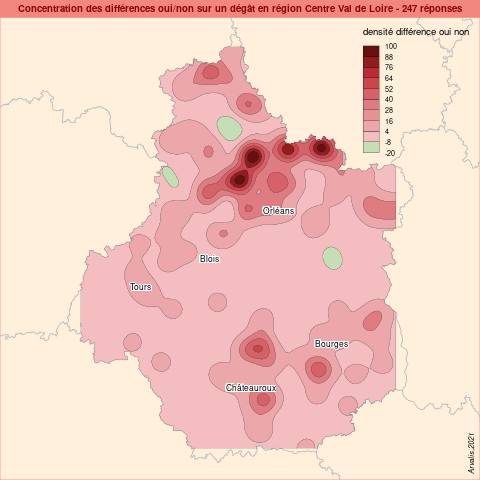

```{r setup, include=FALSE}
knitr::opts_chunk$set(echo = TRUE)
knitr::opts_chunk$set(cache = TRUE)
# Passer la valeur suivante à TRUE pour reproduire les extractions.
knitr::opts_chunk$set(eval = FALSE)
knitr::opts_chunk$set(warning = FALSE)
```


# Objet

Nous avons fait une enquête agriculteurs afin d’avoir une idée de l’impact des dégâts de gel du mois d’Avril.

Les réponses sont toutes rattachées à un code postal.

La carte doit permettre d’identifier les zones les plus touchées à l’échelle de la région Centre Val de Loire.

5 espèces différentes - Nature des dégats / Etendue / Nature des symptômes

Codes couleur : 

    - Dégâts Oui/ non avec 2 couleur (rouge/vert par exemple)
    
    - Etendu des dégâts (3 couleurs pour les 3 proposition, par exemple 
        
          * Généralisés en rouge / 
          
          * Localisés en orange / 
          
          * Ponctuels en jaune)
          
    
    - Nature des symptôme (3 couleurs pour les 3 proposition, par exemple 
    
          * Destruction totale en rouge / 
          
          * Destruction maitre brin en orange / 
          
          * sur feuilles en jaune)

# Librairies

```{r}
library("sf")
library("mapsf") # descendant de cartography
library("cartography")
```


# Données

## pb recup fond selon l'ordi


```{r}
# définition du chemin data
if (Sys.getenv("PWD") == "/home/tachasa") { chemin <- "../../00_DATA/"
} else  {
  chemin <- paste0 (Sys.getenv("OneDrive"),"\\beaCarto\\data sauve\\")
  }
# fond
region <-  st_read(paste0(chemin,"ign.gpkg"), "region", quiet = TRUE)
dpt <- st_read(paste0(chemin, "ign.gpkg"), "dpt", quiet = TRUE)
commune <- st_read(paste0(chemin, "ign.gpkg"), "commune", quiet = TRUE)
# sélection centre val de loire
regionS <- region [4,]
dptS <- dpt [dpt$INSEE_REG == 24,]
communeS <- commune [commune$INSEE_REG == 24,]
plot(communeS$POPULATION)
# pour affichage des grosses communes
labelCommuneS <- communeS [communeS$POPULATION > 40000,]
```

## Donnée métier

```{r}
data <- read.csv(file="../data/04_degat.csv", na.strings = "NA", stringsAsFactors = TRUE,)
# les codes postaux ont été légèrement modifiés dans le fichier d'origine : rajout ou suppression de zéro, suppression d'une ligne sans cp
# verif des levels
for (i in 2:23) {
  print (paste0("TITRE : ",names(data [i])))
  print(levels(data [,i]))
  }
```


# Jointure

La donnée semble propre

Jointure par le code postal

https://www.data.gouv.fr/fr/datasets/base-officielle-des-codes-postaux/

point de vigilance : code INSEE et code postal. Plusieurs code postal pour un seul code INSEE.

On choisit arbitrairement la correspondance code postal avec le premier code INSEE disponible

```{r}
# récupération et filtrage sur les colonnes nécessaires du fichier
equiv <- read.csv2("../data/laposte_hexasmal.csv")
str(equiv)
equiv <- equiv [, c("Code_commune_INSEE", "Code_postal")]
# on cherche les indices des lignes dupliquées.
doublons <- which(duplicated(equiv$Code_postal))
# on récupère au moins un exemplaire de chaque Code postal
equivSimplif <- equiv [-doublons,]
# vérif : une seule donnée
table(equivSimplif$Code_postal)
jointureData <- merge(data, equivSimplif, all.x, by.x = "cp", by.y = "Code_postal")
# 257 sur 261, 4 cp de la data ne sont pas dans equivSimplif. A priori erreurs de saisie 
diff <- setdiff(data$ID,jointureData$ID)
data$cp [data$ID %in% diff]
```


```{r}
communeS$INSEE_COM <- as.integer(communeS$INSEE_COM)
jointureCommuneS <- merge(communeS, jointureData, by.x = "INSEE_COM", by.y = "Code_commune_INSEE")
# 245 sur 261, aie !
diff <- setdiff(data$cp, jointureCommuneS$cp)
equivSimplif [equivSimplif$Code_postal == 31300,]
```

TODO à explorer la dispartion des 15 données


# Cartographie

## Carte par commune

### Différence

Il y a plusieurs réponses par communes, on décide de mesurer la différence entre les nons et les ouis par code postal.

```{r}
data <- jointureCommuneS [, c("INSEE_COM","degat")]
table(data$degat)
# 49 noms pour 187 oui
data$num <- ifelse(data$degat == "Oui", 1, -1)
agg <- aggregate(data$num, by = list(data$INSEE_COM), sum)
names(agg) <- c("INSEE_COM", "reponse")
jointure <- merge(agg, communeS, by.x = "INSEE_COM", by.y = "INSEE_COM")
jointuresf <- st_as_sf(jointure)
mf_theme("brutal")
mf_shadow(regionS)
mf_map(region, add = TRUE)
mf_shadow(regionS, add = TRUE)
mf_map(jointuresf, var= "reponse", leg_title = "diff. oui non", type = "choro", add = TRUE)
mf_label(labelCommuneS, "NOM_COM", halo = TRUE)
mf_layout("difference nb oui et nb non pour les dégats par commune", credits = "Arvalis, 2021")
```


### Autre solution : pct oui / réponse totale par commune

```{r}
data$oui <- ifelse (data$degat == "Oui", 1,0)
data$non  <- ifelse(data$degat == "Non", 1,0)
aggOui <- aggregate(data$oui, by = list(data$INSEE_COM), sum)
aggNon <- aggregate(data$non, by = list(data$INSEE_COM), sum)
aggTot <- merge(aggOui, aggNon, all = TRUE, by = "Group.1")
aggTot
names(aggTot) <- c("INSEE_COM", "oui", "non")
plot(aggTot$oui,aggTot$non)
aggTot$pct <- (aggTot$oui / (aggTot$oui + aggTot$non))*100
plot(sort(aggTot$pct))
aggTotsf <- st_as_sf(merge(aggTot, communeS, by = "INSEE_COM"))

mf_theme("brutal")
mf_shadow(regionS)
mf_map(region, add = TRUE)
mf_shadow(regionS, add = TRUE)
mf_map(aggTotsf, "pct", leg_title = "% oui / totalité réponses", nbreaks = 5, breaks = c(0,20,60,80,100), type = "choro", leg_val_rnd = 0, add = TRUE)
mf_label(labelCommuneS, "NOM_COM", halo = TRUE)
mf_layout("Rapport oui sur la totalité des réponses pour les dégats par commune", credits = "Arvalis, 2021")
```


## Carte lissée

Même si la donnée est peu nombreuse, elle est bien répartie sur le territoire.
Une carte lissée permettra de souligner les zones où les réponses oui ont été les plus 
importantes.

### Avec la différence

```{r}
library(potential)
centr <- st_centroid(jointuresf)
plot_inter(fun = "e", span = 75000, beta = 2, limit = 250000)
# create a regular grid
y <- create_grid(x = centr, res = 2000)
# compute potentials
pot <- mcpotential(
  x = centr, y = y,
  var = "reponse",
  fun = "e", span = 7500,
  beta = 2, limit = 30000, 
  ncl = 2
)
# Define potential according to the maximum value
y$pot <- pot / max(pot) * 100
# create equipotential areas
equipot <- equipotential(y, var = "pot", mask = regionS)
equipot
plot(equipot$geometry)
# map potentials
png("../img/potentielDiff.png")
par(mar = c(0, 0, 1.2, 0))
mypal <- carto.pal(pal1 = "green.pal", n1 = 1, pal2 = "wine.pal", n2 = 9)
ghostLayer(regionS$geom, bg = "lightblue2")
plot(region$geom, col = "antiquewhite1", border = "grey", add = TRUE)
choroLayer(equipot, var = "center", 
           breaks = seq(-20, 100,length.out = 11), 
           col = mypal,
           border = "#121725", 
           lwd = .2, 
           legend.pos = "topright", 
           legend.title.txt = "densité différence oui non",
           legend.horiz = FALSE,
           add = TRUE)
labelLayer(labelCommuneS,txt = "NOM_COM", halo = TRUE, add = TRUE)
layoutLayer(title = "Concentration des différences oui/non sur un dégât en région Centre Val de Loire - 247 réponses", 
            theme = "red.pal",
            sources = "Arvalis,2021",
            horiz = FALSE, 
            postitle = "center", 
            scale = FALSE)
dev.off()
```



## Carte des oui / non dégats pour les 5 cultures


```{r}
jointureCommuneS
numCol <- grep( "degat", names(jointureCommuneS))
data <- jointureCommuneS [, c(1, numCol), drop = TRUE]

i <- 3
for (i in 1:8){
  # filtre sur lignes vides
  dataCult <-  data [data [,i] != "", c(1,i)]
  # nb observation
  nb <- nrow(dataCult)
  table(dataCult [,2])
  dataCult$oui <- ifelse(dataCult [,2] == "Oui",1,0)
  dataCult$non <- ifelse(dataCult [,2] == "Non", -1, 0)
  aggdata <-  aggregate (dataCult$INSEE_COM, by = list (dataCult$oui, dataCult$non), sum)
}
aggdata
```


