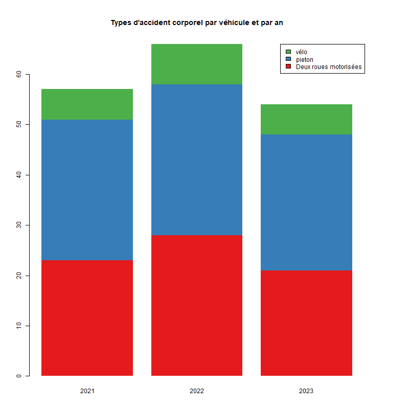

```{r setup, include=FALSE}
knitr::opts_chunk$set(echo = TRUE)
knitr::opts_chunk$set(cache = TRUE)
# Passer la valeur suivante à TRUE pour reproduire les extractions.
knitr::opts_chunk$set(eval = FALSE)
knitr::opts_chunk$set(warning = FALSE)
```


# Objet

Superposer carte accidentologie, 2021-22-23, accident corporel (qu'est ce qu'un accident non corporel ?)

Les données sont fournies par le dpt 
AIT-MOUHOUB Djamal (Chargé d'études territorialisées et de l'expertise routière Plaine Commune) - DRIEAT IF/UD93/SESR/PSR <djamal.ait-mouhoub@developpement-durable.gouv.fr>

Les fichiers fournis distinguent vélo ou EDPm, piéton ou EDPsm / 2 RM / autre

Contrairement aux données opendata, il ne s'agit pas du nb d'accidents, un accident pouvant
impliquer plusieurs véhicules.

Ici chaque accident corporel implique un seul véhicule.


# Données


```{r}
library(sf)
library(mapsf)
library(sp) # pour lire le kml
library(xml2)
library(rvest)
library(mapview)
library(leaflet)
library(htmltools)
library(dplyr)
rep <- "/03_SIG/03_03_Data/08_VOIRIE/accidentologie/"
chemin <-  paste0(Sys.getenv('HOME'), rep)
chemin <- paste0("D:", rep)
```

concaténation des années


```{r}
cle <- c("Tous", "Pieton", "2RM", "Velo")
cle <- cle [4]
compiler <- function (cle){
  fic <- list.files(chemin, cle)
  print(fic)
  fin <- NULL
  #f <- fic [1]
  for (f in fic) {
    tmp <- st_read(paste0(chemin, f))
    an <- gsub( "[^0-9]", "",f )
    tmp <- st_read(paste0(chemin, f))
    tmp$an <- an
    print(an)
    fin <- rbind(fin, tmp)
  }
  print(table(fin$an))
  st_write(fin [, c("an")],"../data/accidentologie.gpkg", cle, delete_layer = T)
  return(fin)
}
res <- lapply(cle, compiler)
res
```

# Pb données kml

seulement 2 attributs,

```{r}
fin$Name
test <- read_xml(paste0(chemin, f))
html_node(test, "Id acciden")
html_attr(test, "Id acciden")
rvest::html_tag(test)
noeuds <- xml_children(test)
noeuds [2]
xml_find_all(test, "Id")
xml_nodeset(test)
test <- xml_text(test)
lister <- as_list(kids, ns = "Id acciden")
lister$kml ["Id acciden"]
xml_attr(kids, "SimpleData", ns = character(), default = NA_character_)
kids <- xml_children(test)
```

# Affichage doublons


```{r}
st_layers("../data/accidentologie.gpkg")
data <- st_read("../data/accidentologie.gpkg", "Tous")
table(duplicated(data$geom))
data <- st_transform(data, 2154)
```

Pas de doublons sur les 3 ans

```{r}
matDistance <- st_distance(data)
library(units)
matDistance <- drop_units(matDistance)
matDistance [matDistance < 5]
```


# export leaflet


```{r}
mapview(data)


data$an <- as.factor(data$an)
levels(data$an)
data.df <- split.data.frame(data,levels(data$an))
names(data.df)
```

Les chiffres


```{r}
knitr::kable(table(data$an), col.names = c("Année", "Nb"))
```


Les graphiques
```{r}
data$an <- as.integer(data$an)
tab <- table(data$an)

names(tab)
barplot(tab, names.arg = names(tab), main = "Nb d'accident corporel par an",
        border = NA, col = c("green", "blue", "red"))
```


carte la plus simple

```{r}
pal <- colorFactor(c("green", "blue", "red"), domain = c("2021","2022", "2023"))
leaflet(data) %>% addTiles() %>% 
  addCircleMarkers(color = ~pal(an), radius = 4) %>% 
  addLegend(pal, ~an, position="topright", title = "Année accident corporel")
```

Avec les types de véhicules


```{r}
velo <- st_read("../data/accidentologie.gpkg", "velo")
pieton <- st_read("../data/accidentologie.gpkg", "pieton")
DRM <- st_read("../data/accidentologie.gpkg", "2RM")
pal <- colorFactor(c("green", "blue", "red"), domain = c("vélo", "pieton", "Deux roues motorisées"))
leaflet() %>% addTiles() %>% 
  addCircles(data= velo,group = "Type véhicule", color = "green", radius = 2, fillOpacity = 1) %>% 
  addCircles(data = pieton, group = "Type véhicule", radius = 2, fillOpacity = 1) %>% 
  addCircles(data = DRM, group = "Type véhicule", color = "red",  radius = 2, fillOpacity = 1) %>% 
  addCircleMarkers(data=data.df [[1]], group = "2021", radius = 10, color = "green") %>% 
  addCircleMarkers(data=data.df [[2]], group = "2022", radius = 10) %>%
  addCircleMarkers(data=data.df [[3]], group = "2023", radius = 10, color = "red") %>%
  addLegend("topright", pal, values = c("vélo", "pieton", "Deux roues motorisées"),
            title = "Type de véhicule") %>%
  addLayersControl(
  overlayGroups = c ("2021", "2022", "2023"),
    options = layersControlOptions(collapsed = FALSE, autoZIndex=TRUE)
  ) 
```


Les graphiques

```{r}
velo$type <- "velo"
pieton$type <- "pieton"
DRM$type <- "DRM"
DRM$an <- substring(DRM$an, 2,6)
data <- rbind(velo, pieton, DRM)
library(RColorBrewer)
pal <- brewer.pal(3, "Set1")
tab <- table(data$type, data$an)
png("../img/accidentologie.png")
par(mar =  c(4, 4, 6, 6))
barplot(tab, col = pal, border = NA, main = "Types d'accident corporelle par véhicule et par an")
legend("topright", legend =  c("vélo", "pieton", "Deux roues motorisées"), fill = pal)
dev.off()
```



