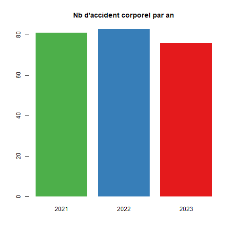
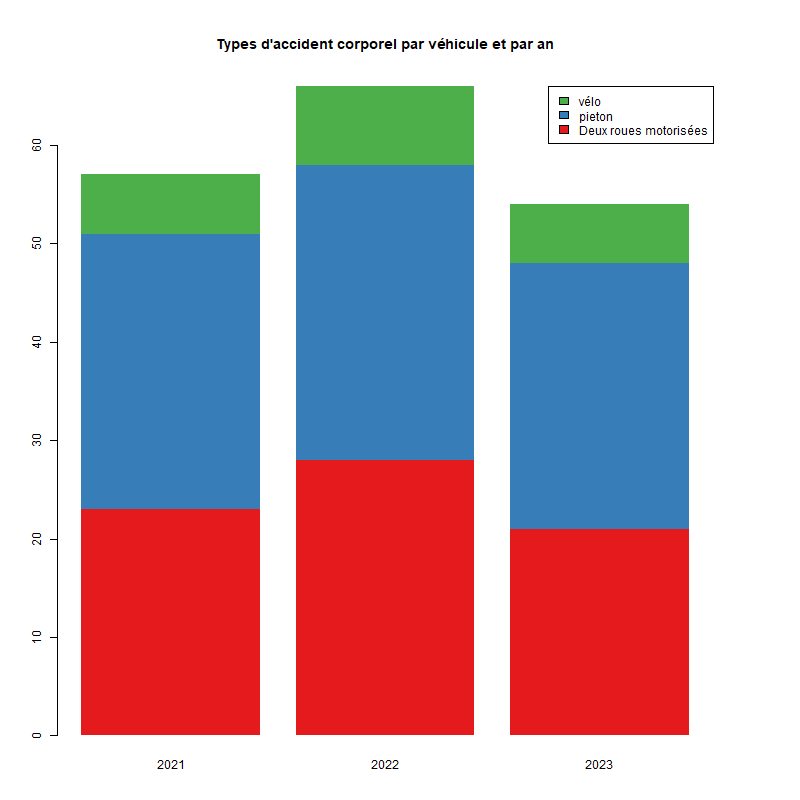

```{r setup, include=FALSE}
knitr::opts_chunk$set(echo = FALSE)
knitr::opts_chunk$set(cache = FALSE)
# Passer la valeur suivante à TRUE pour reproduire les extractions.
knitr::opts_chunk$set(eval = TRUE)
knitr::opts_chunk$set(warning = FALSE)
```


# Objet

Superposer carte accidentologie, 2021-22-23, accident corporel (uniquement).

Ces données sont fournies par le département, AIT-MOUHOUB Djamal (Chargé d'études territorialisées et de l'expertise routière Plaine Commune) - DRIEAT IF/UD93/SESR/PSR <djamal.ait-mouhoub@developpement-durable.gouv.fr>

Les fichiers fournis distinguent vélo ou EDPm, piéton ou EDPsm / 2 RM / autre

Contrairement aux données opendata, il ne s'agit pas du nb d'accidents, un accident pouvant
impliquer plusieurs véhicules.

Ici chaque accident corporel implique un seul véhicule ainsi que le montre les cartes ci-dessous.


```{r}
library(sf)
library(mapsf)
#library(mapview)
library(leaflet)
#library(htmltools)
library(dplyr)
rep <- "/03_SIG/03_03_Data/08_VOIRIE/accidentologie/"
chemin <-  paste0(Sys.getenv('HOME'), rep)
chemin <- paste0("D:", rep)
```


```{r}
data <- st_read("../data/accidentologie.gpkg", "tous", quiet= T)
library(RColorBrewer)
palette <- rev(brewer.pal(3, "Set1"))
```


# Propositions de cartes

## Accidents corporels par année


```{r, eval=FALSE}
mapview(data)

```


```{r}
an <- as.factor(data$an)
data.df <- split.data.frame(data,levels(an))
pal <- colorFactor(palette, domain = c("2021","2022", "2023"))
leaflet(data) %>% addTiles() %>% 
  addCircleMarkers(color = ~pal(an), radius = 4) %>% 
  addLegend(pal, ~an, position="topright", title = "Année accident corporel")
```


```{r}
knitr::kable(table(data$an), col.names = c("Année", "Nb"))
```


```{r}
png("../img/accidentologie1.png")
data$an <- as.integer(data$an)
tab <- table(data$an)
barplot(tab, names.arg = names(tab), main = "Nb d'accident corporel par an",
        border = NA, col = palette)
dev.off()
```



## Type de véhicules concernés


```{r}
velo <- st_read("../data/accidentologie.gpkg", "velo", quiet=T)
pieton <- st_read("../data/accidentologie.gpkg", "pieton", quiet = T)
DRM <- st_read("../data/accidentologie.gpkg", "2RM", quiet = T)

```


```{r, eval=FALSE}
velo$type <- "velo"
pieton$type <- "pieton"
DRM$type <- "DRM"
DRM$an <- substring(DRM$an, 2,6)
data <- rbind(velo, pieton, DRM)

tab <- table(data$type, data$an)
png("../img/accidentologie.png", height = 800, width = 800)
par(mar =  c(4, 4, 6, 6))
barplot(tab, col = rev(palette), border = NA, main = "Types d'accident corporel par véhicule et par an")
legend("topright", legend =  c("vélo", "pieton", "Deux roues motorisées"), fill = palette)
dev.off()
```




```{r}
pal <- colorFactor(rev(palette), domain = c("Deux roues motorisées", "pieton", "vélo" ))
leaflet(options = leafletOptions(zoomControl = FALSE,
                                 minZoom = 3, maxZoom = 21)) %>% addTiles() %>% 
  addCircles(data= velo,group = "Type véhicule", color = palette [1], radius = 2, fillOpacity = 1) %>% 
  addCircles(data = pieton, group = "Type véhicule", color = palette [2],radius = 2, fillOpacity = 1) %>% 
  addCircles(data = DRM, group = "Type véhicule", color = palette [3],  radius = 2, fillOpacity = 1) %>% 
  addCircleMarkers(data=data.df [[1]], group = "2021", radius = 10, color = palette [1], fill = FALSE) %>% 
  addCircleMarkers(data=data.df [[2]], group = "2022", radius = 10, color = palette [2],fill = FALSE) %>%
  addCircleMarkers(data=data.df [[3]], group = "2023", radius = 10, color = palette [3],fill = FALSE) %>%
  addLegend("topright", pal, values = c("Deux roues motorisées", "pieton", "vélo"),
            title = "Type de véhicule") %>% 
  addLayersControl(  overlayGroups = c ("2021", "2022", "2023"),
    options = layersControlOptions(collapsed = FALSE)
  )
```


