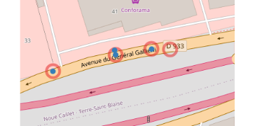

```{r setup, include=FALSE}
knitr::opts_chunk$set(echo = FALSE)
knitr::opts_chunk$set(cache = FALSE)
# Passer la valeur suivante à TRUE pour reproduire les extractions.
knitr::opts_chunk$set(eval = TRUE)
knitr::opts_chunk$set(warning = FALSE)
library(flexdashboard)
#library(shiny)
#library(jsonlite)
#library(maptools)
#library(ggplot2)
#library(tidyr)
library(dplyr)
#library(purrr)
library(leaflet)
#library(plotly)
library(sf)
library(mapsf)
library(mapview)
#library(htmltools)
rep <- "/03_SIG/03_03_Data/08_VOIRIE/accidentologie/"
chemin <-  paste0(Sys.getenv('HOME'), rep)
chemin <- paste0("D:", rep)
# chargement données
tous <- st_read("../data/accidentologie.gpkg", "tous", quiet= T)
velo <- st_read("../data/accidentologie.gpkg", "velo", quiet=T)
pieton <- st_read("../data/accidentologie.gpkg", "pieton", quiet = T)
DRM <- st_read("../data/accidentologie.gpkg", "2RM", quiet = T)
# couleurs rouge / bleu / vert
library(RColorBrewer)
paletteType <- rev(brewer.pal(3, "Set1"))
paletteAn <- rev(brewer.pal (3, "Reds"))
# concaténation
velo$type <- "velo"
pieton$type <- "pieton"
DRM$type <- "DRM"
DRM$an <- substring(DRM$an, 2,6)
type <- rbind(velo, pieton, DRM)
# verif doublon
table(duplicated(type$geom))
doublons <- type [duplicated(type$geom),]
typeSansDoublon <- type [!duplicated(type$geom),]
# ne montre que la 2e occurence
xy <- (st_coordinates(type))
tab <- table(paste0(xy [,1], xy [,2]))
# 10 doublons sur 177 valeurs = 25 % données
#(20/177) * 100
valeur <- names(tab) [tab>1]
ind <- which (paste0(xy [,1], xy [,2]) %in% valeur)
# la totalité des valeurs en double
doublons2 <- type [ind,]
doublons2$texte <- paste0(doublons2$type, "_", doublons2$an)
#mapview(st_jitter(doublons2), zcol="type" )
# solution simple, on enlève les duplicated / st_jitter / on remet
type <- rbind(typeSansDoublon, st_jitter(doublons))
#mapview(type, zcol = "type")
# éclatement des fichiers
an <- as.factor(tous$an)
tous.list <- split.data.frame(tous,an)
#tous.list
vehicule <- as.factor(type$type)
type.list <- split.data.frame(type, vehicule)
#type.list
```


Column {data-width=700}
-----------------------------------------------------------------------

### Accidents corporels par année (les cercles) et type d'accidentés (les points)


```{r}
pal <- colorFactor(rev(paletteType), domain = c("Deux roues motorisées", "pieton", "vélo" ))
leaflet(options = leafletOptions(zoomControl = TRUE,
                                 minZoom = 13, maxZoom = 18)) %>%  
  addProviderTiles(providers$CartoDB.Positron) %>% 
  addCircleMarkers(data=tous.list$'2021', group = "2021",  opacity = 1,radius = 12, color = paletteAn [3], fill = FALSE) %>% 
  addCircleMarkers(data=tous.list$'2022', group = "2022", opacity = 1,radius = 12, color = paletteAn [2],fill = FALSE) %>%
  addCircleMarkers(data=tous.list$'2023', group = "2023", opacity = 1,radius = 12, color = paletteAn [1],fill = FALSE) %>%
  addCircles(data= type.list$DRM ,group = "Type", color = paletteType [3], radius = 2, fillOpacity = 1) %>% 
  addCircles(data = type.list$pieton, group = "Type", color = paletteType [2],radius = 2, fillOpacity = 1) %>% 
  addCircles(data = type.list$velo, group = "Type", color = paletteType [1],  radius = 2, fillOpacity = 1) %>% 
  addLegend("topright", pal, values = c("Deux roues motorisées", "pieton", "vélo"),
            title = "Type d'accidentés") %>% 
  addLayersControl(  overlayGroups = c ("2021", "2022", "2023"),
    options = layersControlOptions(collapsed = FALSE)
  )
```


Column {data-width=300 .tabset}
-----------------------------------------------------------------------


### Avertissement

#### Légende

Les fichiers fournis distinguent vélo ou EDPm, piéton ou EDPsm / 2 RM uniquement.  (2RM = 2 roues motorisées / EDP = Engin de Déplacement Personnel avec ou sans moteur (m))

Il n'y a pas de qualification pour un autre type de véhicule.

#### Plusieurs véhicules pour un accident

Attention, un accident peut impliquer plusieurs véhicules, c'est d'ailleurs le cas pour 10 % des données de véhicule (20 sur 177). Les points symbolisant les véhicules en doublon sont donc légèrement décalés afin de rester visibles.

Exemple : Accident entre deux piétons devant Conforama.

```{r}
ex <- type [c(89,172,32,109), ]
exAcc <- tous [c(32,220,35,64),]
#leaflet(options = leafletOptions(minZoom = 10, maxZoom = 18, zoomControl=FALSE)) %>% addTiles( ) %>% 
 #   addCircleMarkers(data=exAcc, group = "annee", radius = 12, color = palette [3], fill = FALSE) %>%
  #addCircles(data= ex,group = "Type véhicule", stroke= FALSE,color = palette [2], radius = 2, fillOpacity = 1, opacity = 1) 
```

#### Source

AIT-MOUHOUB Djamal, (Chargé d'études territorialisées et de l'expertise routière Plaine Commune) - DRIEAT <djamal.ait-mouhoub@developpement-durable.gouv.fr>


### Année

```{r}
tous$an <- as.integer (tous$an)
tab <- table(tous$an)
barplot(tab, names.arg = names(tab), 
        main = paste0("Nb d'accident corporel par an (total : ", sum(tab), ")"),
        border = NA, col = rev(paletteAn))
```


```{r}
knitr::kable(tab, col.names = c("Année", "Nb"))
```


### Type


```{r}
tab <- table(type$type, type$an)
barplot(tab, col = rev(paletteType), border = NA, 
        main = paste0("Type d'accidenté par accident corporel et par an (total : ", sum(tab), ")"))
```


#### Rappel

Il peut y avoir plusieurs véhicules par accident corporel, et il y a des accidents corporels dont le véhicule n'est pas précisé.


```{r}
knitr::kable(tab)
```


