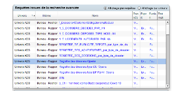

```{r setup, include=FALSE}
knitr::opts_chunk$set(echo = TRUE)
knitr::opts_chunk$set(cache = TRUE)
# Passer la valeur suivante à TRUE pour reproduire les extractions.
knitr::opts_chunk$set(eval = FALSE)
knitr::opts_chunk$set(warning = FALSE)
```


# Objet

reprise de données ADS d' Operis pour maj RIL.

on reprend avec l'outil operisrequest SVE 1247 / si on veut juste les parcelles

plus détaillé le registre





# Environnement


## Librairies


```{r}
library(sf)
library(mapsf)
library(rpostgis)
library(RPostgreSQL)
```


## Chemins


```{r}
chemin <- "C:/Users/bmaranget/Documents/03_SIG/03_03_Data/06_URBA/"
chemin2 <- "C:/Users/bmaranget/Documents/03_SIG/03_03_Data/03_SOCLE/"
```

```{r}
conn <- RPostgreSQL::dbConnect(
  drv      = "PostgreSQL", 
  host     = "localhost",
  dbname   = "bondy", 
  user     = "postgres", 
  password = "postgres"
)
pgPostGIS(conn)
```


```{r}
# à la fin
RPostgreSQL::dbDisconnect(conn)
```


```{r}
cadastre <- dbReadDataFrame(conn, c("cadastre","geo_parcelle"))
pgListGeom(conn)
pgGetGeom(conn, c("cadastre", "parcelle_info"), geom ="geom", gid = "geo_parcelle")
cadastre <- st_read(conn, query = "SELECT * FROM cadastre.parcelle_info")
rue <- st_read(conn, query = "SELECT * FROM base.rue")
quartier <- st_read(conn, query = "SELECT * FROM public.quartier")
```


# Données

## 2 extractions : sve et adss

fileEncoding à retenir "cp1252"

```{r}
ads <- read.csv("../data/exportADS.csv", fileEncoding = "cp1252")
# 743 à partir de 2022
# 3797 en 2026
str(ads)
ads$annee <- substring(ads$Date.de.dépôt,7,10)
table(ads$annee)
sve <- read.csv2("../data/sve2026.csv", fileEncoding = "cp1252")
sve <- sve [sve$Code.insee.de.la.commune.principale == 93010,]
#1231 puis en 2026 3779
```

## Indicateurs

```{r}
table(sve$Année.de.dépôt)
# filtre à partir de 2021
sve <- sve [sve$Année.de.dépôt > 2020,]
tab <- table(sve$Dossier.issu.de.la.SVE.., sve$Année.de.dépôt)
```

Quasiment les mêmes chiffres à retenir les demat égaux aux papiers en 2023, double en 2024, triple en 2025


```{r}
barplot(tab, col = c("wheat", "cadetblue1"), border = NA, legend.text = c("papier","dématérialisé") ,args.legend = list(x = "topleft"), main = "Rapport ADS papier / demat pour PC / DP principalement")
table(sve$Numéro...Type.de.dossier, sve$Année.de.dépôt, sve$Dossier.issu.de.la.SVE..)
agg <- aggregate(sve [, "Dossier.issu.de.la.SVE.."], by = list(sve$Numéro...Type.de.dossier, sve$Année.de.dépôt), sum)
barplot(agg$x, names.arg = paste0(agg$Group.1, agg$Group.2), horiz = F, las=2, beside = T)
# 1231
```

# Données cartos : cadastre, rue, quartier

```{r}
mf_map(quartier, col = "cornsilk")
mf_map(rue, add = T, col = "red")
mf_map(cadastre, add = T, col = NA, border = "wheat", lwd = 0.001 )
mf_layout("Quartier, rue et cadastre","Mars 2026")
```


# Les parcelles : lien donnée, carto

pl parcelles possibles, par exemple :

```{r}
names(ads)
# ex fusion 
ads [727,8]
```
## Méthode sur toutes les parcelles


On expérimente sur toutes les parcelles mais seules les parcelles avec gros projets habitat seront
cartographiées.

Pb du code dans le cadastre, nécessité d'avoir un code2 sans les zéros


```{r}
# attention à l'espace égalemetn
cadastre$code <- gsub("^ ","", cadastre$code)
cadastre$section <- substring(cadastre$code,1,2)
cadastre$section <- gsub("0", "", cadastre$section)
tail(cadastre$section)
cadastre$parcelle <- substring(cadastre$code, 3,10)
cadastre$parcelle <- as.integer(cadastre$parcelle)
cadastre$parcelle
cadastre$code2 <- paste0(cadastre$section, cadastre$parcelle)
cadastre$code2
ads$Parcelles <- gsub(" ","", ads$Parcelles.concernées)
```


Eclatement et recup de la première parcelle et du nb de parcelles
Constitution d'une table sequence / parcelle où la parcelle est indexée à la lg de l'ads

```{r}
listeDep <- strsplit( ads$Parcelles, ",")
# nb de parcelles par lg
nb <- sapply(listeDep, length)
nb
# nb de parcelles total
sum(nb)
# 743 liens pour 951 parcelles
# 3797 ads et 5459 parcelles concernées
hist(nb, main = "ads avec moins de 2 parcelles" )
table(nb)
liste <- unlist(listeDep)
# on construit une sequence de 1 à nb parcelles total avec répétition des items selon l'ads
seq <- rep(seq(1:length(nb)), times = nb)
head(nb,10)
head(seq,10)
head(listeDep)
# on observe bien la correspondance entre l'index de ligne
rep(seq(1:length(nb)), times = 2)
df <- data.frame(liste, seq)
head(df,15)
```

Attention, les ads sans parcelle seront les lg manquantes de la sequence (0)

Après une jointure, on fusionne les parcelles avec le même numéro de seq

```{r}
joint <- merge(cadastre [, "code2"], df, by.x="code2", by.y = "liste")
head(joint)
# 5093 parcelles, on reconstruit les ads
agg <- aggregate(joint [, c("code2")], by = list(joint$seq), length)
names(agg) [1:2] <- c("seq", "nb")
agg2 <- agg [agg$nb > 1,]
# 81 fusions
# 597 ads
mf_map(agg2, type = "choro", pal = "Greens", var = "nb")
agg3 <- agg [agg$nb > 2,]
# 40 fusions de plus de 3 parcelles
# 334 ads de plus de 3 parcelles
mf_label(agg3, var = "seq", overlap = FALSE, halo = T)
# 656 seq / 743...
# quelles sont les parcelles qui n'ont pas trouvé jointure ?
pb <- setdiff(df$liste,joint$code2)
# 71 sur 951, rmq on travaille sur 2022-2025, ça fait bcp quand même
# 255 sur 5459
setdiff(df$seq,agg$seq)
# verif
cadastre$code2 [grep("^AO[0-9]", cadastre$code)]
```


## Cas du zero parcelle

On cherche à récupérer la parcelle à partir de l'adresse

Géocodage des adresses puis intersection

```{r}
adresse <- ads [ads$nb == 0, c("Terrain...Adresse")]
# verif nb==0 signifie bien pas d'adresse
ads$Parcelles.concernées [ads$nb ==0]
# on nettoie l'adresse (on enlève ville et cp)
adresse <- paste0(adresse [adresse!=""], ", 93140, Bondy")
# Fonction de géocodage d'une adresse
geocode <- function(adresse) {
  url <- paste0("https://api-adresse.data.gouv.fr/search/?q=", URLencode(adresse))
  res <- GET(url)
  contenu <- fromJSON(content(res, as = "text", encoding = "UTF-8"))
  contenu <- contenu$features
  coords <- contenu$geometry
  return(data.frame(adresse = adresse, lon = coords[1], lat = coords[2]))
    }
resultat <- lapply(adresse, geocode)
resultat
# 26 résultats pour 26
point <- unlist(lapply(resultat, "[[",3))
adresse <- unlist(lapply(resultat, "[[",1))
adresse
pairs <- seq(1,73, by = 2)
impairs <- seq(2,74, by = 2)
X <- point [pairs]
Y <- point [impairs]
point <- data.frame(X,Y)
point <- st_as_sf(point, coords = c("X", "Y"), crs = 4326)
point$adresse <- adresse
point <- st_transform(point, 2154)
mf_map(cadastre, col = "antiquewhite", border = NA)
mf_map(point, add = T, col = "red")
mf_layout("37 points de géocodage pour 36 adresses", "BAN")
inter <- st_intersection(point, cadastre)
inter <- inter [,c("adresse", "adresse.1", "code2")]
knitr::kable(inter)
```


Jointure


```{r}
point$adresse <- gsub(", 93140, Bondy", "", point$adresse)
joint <- merge(ads, point, by.x="Terrain...Adresse", by.y ="adresse")
joint [, c("code2", "Parcelles.concernées", "Terrain...Adresse")]

```


On va fusionner toutes les multi parcelles et faire la liaison sur le code

```{r}
cadastreSelFus <- st_union( cadastre [cadastre$code2 %in% fusion,])
mf_map(cadastreSelFus)
mf_label( cadastre [cadastre$code2 %in% fusion,] , "code2")
mf_map(cadastre, col = NA, border = "black", add = T)
cadastre [160,]
mf_label(rue, "NOM_1_G")
```


## Jointure attributaire

ads$code2 et cadastre$code2

```{r}
data <- merge(cadastre, ads, by = "code2")
(length(ads$code2) - length(data$code2))/length((ads$code2))
st_write(data,"../data/ads.gpkg", "fevrier2023", delete_layer = T)
```

26 % total non repris...


## Les gros projets


Peut-être plus rapide de se focaliser uniquement sur les projets d'habitations

```{r}
table(ads$Logements.créés, useNA = "always")
petitProjet <- ads [ads$Logements.créés < 4 & !is.na(ads$Logements.créés),]
grosProjet <- ads [ads$Logements.créés > 3 & !is.na(ads$Logements.créés),]
# attention aux NA
table(grosProjet$Logements.créés, useNA = "always")
# 30 projets
table(grosProjet$Parcelles.concernées, useNA = "always")
table(grosProjet$Terrain...Adresse, useNA = "always")
```

30 gros projets tous avec parcelle, et adresse

liste des parcelles avec séquence

```{r}
grosProjet <- petitProjet
liste <- strsplit( grosProjet$Parcelles, ",")
nb <- sapply(liste, length)
nb
sum(nb)
# 30 liens pour 85 parcelles
# 75------------204------
liste <- unlist(liste)
# on construit une sequence de 1 à 30 avec répétition des items selon le nb (total = 85)
seq <- rep(seq(1:length(nb)), times = nb)
seq
df <- data.frame(liste, seq)
head(df,15)
```

```{r}
joint <- merge(cadastre [, "code2"], df, by.x="code2", by.y = "liste")
head(joint)
agg <- aggregate(joint [, c("code2")], by = list(joint$seq), length)
names(agg) [1:2] <- c("seq", "nb")
table(agg$nb)
# 28 items
mf_map(agg, type="choro", var="nb", pal = "Terrain 2", border = "wheat1")
mf_label(agg, var = "seq", overlap = FALSE, halo = T)
# quelles sont les parcelles qui n'ont pas trouvé jointure ?
pb <- setdiff(df$liste,joint$code2)
# 6 sur 85, c'est négligeable 20/
setdiff(df$seq,agg$seq)
# verif
cadastre$code2 [grep("^B[0-9]", cadastre$code)]
```


```{r}
agg
grosProjet$seq <- seq(1:length(nb))
joint <- merge(agg, grosProjet, by="seq")
joint [9,]
mf_map(joint[9,])
mf_map(cadastre, add = T, col = NA)
mf_label(cadastre, "code2")
mf_label(rue, "nom")
mf_layout(joint$Demandeur [9], "Mars 2026")
```


```{r}
st_write(joint [, c("seq", "annee", "Parcelles.concernées", "Terrain...Adresse", "Logements.créés", "Décision...Avis.de.l.autorité.compétente", "Description.du.projet.de.construction")], "../data/ads2026.gpkg", "petits_projets" , delete_layer = T)
```


```{r}
data <- st_read("../data/ads2026.gpkg", "grands_projets")
library(mapview)
mapview(data, zcol = "annee")
```


# Carto


```{r}
length(quartier$nom)
i <-  1
# quartiers
for (i in 1:length(quartier$nom)) {
  png(paste0("../img/ADS2026_", quartier$nom [i], ".png"), res = 100)
  mf_init(quartier [i, ])
  mf_map(cadastre,col = "antiquewhite1",border = NA,add = T)
    mf_map(
      data,
      type = "typo",
      var = "annee",
      border = NA,
      add = T
    )
    #mf_label(rue [rue$importance < 3,], "nom")
    mf_label(
      data,
      var = "Logements.créés",
      overlap = F,
      halo = T,
      cex = 0.5
    )
    mf_layout("ADS Operis pointage", credits = "Mairie de Bondy / DGST")
    dev.off()
}

```


cas du multiprojet

```{r}
multi <- names(table(data$Parcelles.concernées)> 1)
doublon <- data [duplicated(data$Parcelles.concernées),]
doublon$Description.du.projet.de.construction
```


TODO ?
