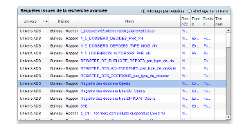

```{r setup, include=FALSE}
knitr::opts_chunk$set(echo = TRUE)
knitr::opts_chunk$set(cache = TRUE)
# Passer la valeur suivante à TRUE pour reproduire les extractions.
knitr::opts_chunk$set(eval = FALSE)
knitr::opts_chunk$set(warning = FALSE)
```


# Objet

reprise de données ADS d' Operis pour maj RIL.

on reprend avec l'outil operisrequest SVE 1247 / si on veut juste les parcelles

plus détaillé le registre





# Environnement


## Librairies


```{r}
library(sf)
library(mapsf)
```


## Chemins


```{r}
chemin <- "C:/Users/bmaranget/Documents/03_SIG/03_03_Data/06_URBA/"
chemin2 <- "C:/Users/bmaranget/Documents/03_SIG/03_03_Data/03_SOCLE/"
```


# Données

## 2 extractions : sve et adss

fileEncoding à retenir "cp1252"

```{r}
ads <- read.csv("../data/adsExport2025Avril.csv", fileEncoding = "cp1252")
# 743 à partir de 2022
str(ads)
ads$annee <- substring(ads$Date.de.dépôt,7,10)
table(ads$annee)
sve <- read.csv("../data/sve.csv", fileEncoding = "cp1252")
sve <- sve [sve$Code.insee.de.la.commune.principale == 93010,]
```

## Indicateurs

```{r}
table(sve$Année.de.dépôt)
# filtre à partir de 2021
sve <- sve [sve$Année.de.dépôt > 2020,]
tab <- table(sve$Dossier.issu.de.la.SVE.., sve$Année.de.dépôt)
```

Quasiment les mêmes chiffres à retenir les demat égaux aux papiers en 2023, double en 2024, triple en 2025


```{r}
barplot(tab, col = c("wheat", "cadetblue1"), border = NA, legend.text = c("papier","dématérialisé") ,args.legend = list(x = "topleft"), main = "Rapport ADS papier / demat pour PC / DP principalement")
table(sve$Numéro...Type.de.dossier, sve$Année.de.dépôt, sve$Dossier.issu.de.la.SVE..)
agg <- aggregate(sve [, "Dossier.issu.de.la.SVE.."], by = list(sve$Numéro...Type.de.dossier, sve$Année.de.dépôt), sum)
barplot(agg$x, names.arg = paste0(agg$Group.1, agg$Group.2), horiz = F, las=2, beside = T)
# 1231
```

# Données cartos : cadastre, rue, quartier

```{r}
st_layers("../data/gros/cadastre.gpkg")
cadastre <- st_read("../data/gros/cadastre.gpkg", "parcelle_info")
str(cadastre)
st_layers(paste0(chemin2, "rue2023.gpkg"))
rue <- st_read(paste0(chemin2, "rue2023.gpkg"), "rue2023")
st_layers("../data/limitesSocle.gpkg")
zone <- st_read("../data/limitesSocle.gpkg", "quartier2")
mf_map(zone)
```


# Les parcelles : lien donnée, carto

pl parcelles possibles, par exemple :

```{r}
names(ads)
# ex fusion 
ads [727,8]
# attention à l'espace égalemetn
cadastre$code <- gsub("^ ","", cadastre$code)
cadastre$section <- substring(cadastre$code,1,2)
cadastre$section <- gsub("0", "", cadastre$section)
tail(cadastre$section)
cadastre$parcelle <- substring(cadastre$code, 3,10)
cadastre$parcelle <- as.integer(cadastre$parcelle)
cadastre$parcelle
cadastre$code2 <- paste0(cadastre$section, cadastre$parcelle)
cadastre$code2
ads$Parcelles <- gsub(" ","", ads$Parcelles.concernées)
```


Eclatement et recup de la première parcelle et du nb de parcelles
Constitution d'une table sequence / parcelle

```{r}
liste <- strsplit( ads$Parcelles, ",")
nb <- sapply(liste, length)
nb
sum(nb)
# 743 liens pour 951 parcelles
liste <- unlist(liste)
# on construit une sequence de 1 à 743 avec répétition des items selon le nb
seq <- rep(seq(1:743), times = nb)
seq
df <- data.frame(liste, seq)
head(df,15)
```

Attention, les ads sans parcelle seront les lg manquantes de la sequence (0)

Après une jointure, on fusionne les parcelles avec le même numéro de seq

```{r}
joint <- merge(cadastre [, "code2"], df, by.x="code2", by.y = "liste")
head(joint)
agg <- aggregate(joint [, c("code2")], by = list(joint$seq), length)
names(agg) [1:2] <- c("seq", "nb")
agg2 <- agg [agg$nb > 1,]
# 81 fusions
mf_map(agg2, type = "choro", pal = "Greens", var = "nb")
agg3 <- agg [agg$nb > 2,]
# 40 fusions de plus de 3 parcelles
mf_label(agg3, var = "seq", overlap = FALSE, halo = T)
# 656 seq / 743...
# quelles sont les parcelles qui n'ont pas trouvé jointure ?
pb <- setdiff(df$liste,joint$code2)
# 71 sur 951, rmq on travaille sur 2022-2025, ça fait bcp quand même
setdiff(df$seq,agg$seq)
# verif
cadastre$code2 [grep("^AO[0-9]", cadastre$code)]
```


## Cas du zero parcelle

On cherche à récupérer la parcelle à partir de l'adresse

Géocodage des adresses puis intersection

```{r}
adresse <- ads [ads$nb == 0, c("Terrain...Adresse")]
# verif nb==0 signifie bien pas d'adresse
ads$Parcelles.concernées [ads$nb ==0]
# on nettoie l'adresse (on enlève ville et cp)
adresse <- paste0(adresse [adresse!=""], ", 93140, Bondy")
# Fonction de géocodage d'une adresse
geocode <- function(adresse) {
  url <- paste0("https://api-adresse.data.gouv.fr/search/?q=", URLencode(adresse))
  res <- GET(url)
  contenu <- fromJSON(content(res, as = "text", encoding = "UTF-8"))
  contenu <- contenu$features
  coords <- contenu$geometry
  return(data.frame(adresse = adresse, lon = coords[1], lat = coords[2]))
    }
resultat <- lapply(adresse, geocode)
resultat
# 26 résultats pour 26
point <- unlist(lapply(resultat, "[[",3))
adresse <- unlist(lapply(resultat, "[[",1))
adresse
pairs <- seq(1,73, by = 2)
impairs <- seq(2,74, by = 2)
X <- point [pairs]
Y <- point [impairs]
point <- data.frame(X,Y)
point <- st_as_sf(point, coords = c("X", "Y"), crs = 4326)
point$adresse <- adresse
point <- st_transform(point, 2154)
mf_map(cadastre, col = "antiquewhite", border = NA)
mf_map(point, add = T, col = "red")
mf_layout("37 points de géocodage pour 36 adresses", "BAN")
inter <- st_intersection(point, cadastre)
inter <- inter [,c("adresse", "adresse.1", "code2")]
knitr::kable(inter)
```


Jointure


```{r}
point$adresse <- gsub(", 93140, Bondy", "", point$adresse)
joint <- merge(ads, point, by.x="Terrain...Adresse", by.y ="adresse")
joint [, c("code2", "Parcelles.concernées", "Terrain...Adresse")]

```


On va fusionner toutes les multi parcelles et faire la liaison sur le code

```{r}
cadastreSelFus <- st_union( cadastre [cadastre$code2 %in% fusion,])
mf_map(cadastreSelFus)
mf_label( cadastre [cadastre$code2 %in% fusion,] , "code2")
mf_map(cadastre, col = NA, border = "black", add = T)
cadastre [160,]
mf_label(rue, "NOM_1_G")
```


## Jointure attributaire

ads$code2 et cadastre$code2

```{r}
data <- merge(cadastre, ads, by = "code2")
(length(ads$code2) - length(data$code2))/length((ads$code2))
st_write(data,"../data/ads.gpkg", "fevrier2023", delete_layer = T)
```

26 % total non repris...


## Les gros projets


Peut-être plus rapide de se focaliser uniquement sur les projets d'habitations

```{r}
table(ads$Logements.créés, useNA = "always")
grosProjet <- ads [ads$Logements.créés > 3 & !is.na(ads$Logements.créés),]
# attention aux NA
table(grosProjet$Logements.créés, useNA = "always")
# 30 projets
table(grosProjet$Parcelles.concernées, useNA = "always")
table(grosProjet$Terrain...Adresse, useNA = "always")
```

30 gros projets tous avec parcelle, et adresse

liste des parcelles avec séquence

```{r}
liste <- strsplit( grosProjet$Parcelles, ",")
nb <- sapply(liste, length)
nb
sum(nb)
# 30 liens pour 85 parcelles
liste <- unlist(liste)
# on construit une sequence de 1 à 30 avec répétition des items selon le nb (total = 85)
seq <- rep(seq(1:30), times = nb)
seq
df <- data.frame(liste, seq)
head(df,15)
```

```{r}
joint <- merge(cadastre [, "code2"], df, by.x="code2", by.y = "liste")
head(joint)
agg <- aggregate(joint [, c("code2")], by = list(joint$seq), length)
names(agg) [1:2] <- c("seq", "nb")
table(agg$nb)
# 28 items
mf_map(agg, type="choro", var="nb", pal = "Terrain 2", border = "wheat1")
mf_label(agg, var = "seq", overlap = FALSE, halo = T)
# quelles sont les parcelles qui n'ont pas trouvé jointure ?
pb <- setdiff(df$liste,joint$code2)
# 6 sur 85, c'est négligeable
setdiff(df$seq,agg$seq)
# verif
cadastre$code2 [grep("^B[0-9]", cadastre$code)]
```


```{r}
agg
grosProjet$seq <- seq(1:30)
joint <- merge(agg, grosProjet, by="seq")
```


```{r}
st_write(joint [, c("seq", "annee", "Parcelles.concernées", "Terrain...Adresse", "Logements.créés", "Décision...Avis.de.l.autorité.compétente", "Description.du.projet.de.construction")], "../data/ads2025.gpkg", "grands_projets" , delete_layer = T)
```


```{r}
data <- st_read("../data/ads2025.gpkg", "grands_projets")
library(mapview)
mapview(data, zcol = "annee")
```


# Carto


```{r}
length(zone$nom)
i <-  1
# quartiers
for (i in 1:length(zone$nom)) {
  png(paste0("../img/", zone$nom [i], ".png"), res = 100)
  mf_init(zone [i, ])
  mf_map(cadastre,col = "antiquewhite1",border = NA,add = T)
    mf_map(
      data,
      type = "typo",
      var = "annee",
      border = NA,
      add = T
    )
    mf_label(
      data,
      var = "Logements.créés",
      overlap = F,
      halo = T,
      cex = 0.5
    )
    mf_layout("ADS Operis pointage", credits = "Mairie de Bondy / DGST")
    dev.off()
}

```

