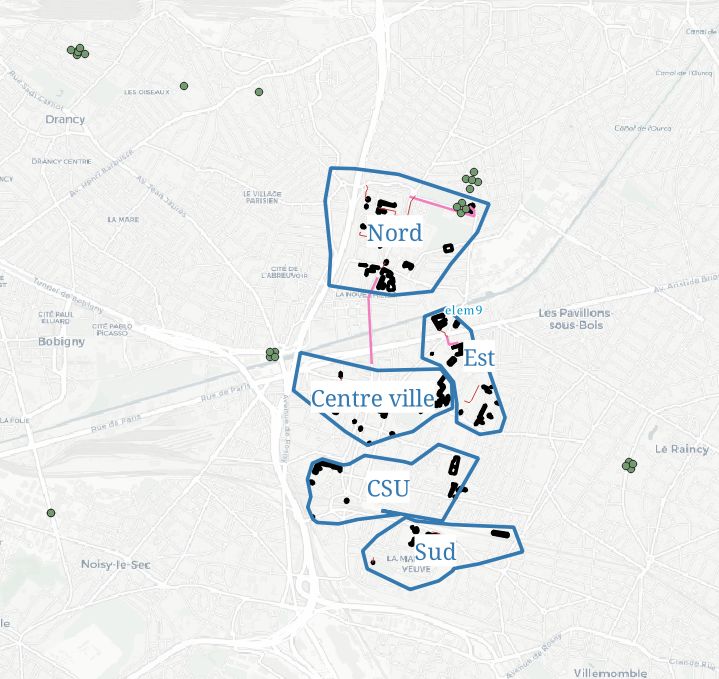

```{r setup, include=FALSE}
knitr::opts_chunk$set(echo = TRUE)
knitr::opts_chunk$set(cache = TRUE)
# Passer la valeur suivante à TRUE pour reproduire les extractions.
knitr::opts_chunk$set(eval = FALSE)
knitr::opts_chunk$set(warning = FALSE)
```


# Objet

Récupérer les données autocad et la donnée liée à la fibre.
à savoir :
- 

les projections sont lambert II

mais également traiter des geosjon avec les pb de "consistent type"


# Librairies, chemins, données

```{r}
library(sf)
library(mapsf)
library(units)
```


```{r}
cheminCAD <-  paste0( "D://03_SIG/03_01_Archive/02_AUTOCAD/")
cheminCAD <- "S:/VOIRIE PLANS/01_VOIRIE/"
cheminCAD <-  paste0(Sys.getenv("HOME"), "/03_SIG/03_01_Archive/02_AUTOCAD/")
chemin <- "C:/Users/bmaranget/02_cartos/script/"
chemin <- c("C:/users/tachasa/02_carto/script/")
getwd()
bondy <- st_read("../data/limitesSocle.gpkg", "bondy")
rue <- st_read("../data/rueOSM.geojson", query = "SELECT name FROM rueOSM")
```

```{r}
getwd()
setwd(chemin)
#rmq le geojson rue OSM ne comprend que les rues MLK-blanqui
rue <- st_read("../data/rue2023.geojson", query = "SELECT name FROM rue2023")
# le query permet de sélectionner uniquement la colonne name
```

On a fait une première extraction et on a sélectionné les champs intéressants

```{r}

st_layers(paste0(cheminCAD, "sand.gpkg"))
data <- st_read(paste0(cheminCAD, "sand.gpkg"))

couchesCAD <- read.csv("../data/couchesCAD.csv", fileEncoding = "UTF-8")
sel <- couchesCAD [couchesCAD$Sel == "O",]
# sel représente toutes les couches intéressantes
```

[1] "0-RÃ\u0083©seaux DÃ\u0083©posÃ\u0083©s" "CF-TOPO-AUTRE-RES"                     [3] "CF-TOPO-EDF"                               "CF-TOPO-GDF"                            
[5] "CF-TOPO-PTT"                               "CF-TOPO-TELECOM"                       [7] "EJL_Recol_Chambre"                         "ELECTR_S"                               
[9] "EP"                                     


```{r}
couchesCAD <- read.csv("../data/couchesCAD.csv")
```


```{r}
setwd(cheminCAD)

```


# Exploration différents formats


## DWG direct


```{r}
test <- st_read("../data/Tracés Leon Blum Bondy.dwg")
```

ACAD1015 pb des formats autocad qui évoluent.

obligation d'avoir le .dxf

## DXF

quand la conversion est impossible dans R
ogr2ogr -dim XYZM -progress --config OGR_GEOMETRY_ACCEPT_UNCLOSED_RING NO test.gpkg _CF-Verdun.dxf


Les premières lg servent à récupérer les fichiers originaux.
Inutiles de les rejouer.
on repart des fichiers transformés.

```{r}
fic <-list.files(".", pattern = ".dxf")
fic <- fic[c(4,5,8,15,16)]
fic
```


Utilisation pour 1 fichier

```{r}
i <- 19
fic[i]
# import .dxf
gdal_utils(util = "vectortranslate",
        source = fic [i],
          destination = paste0(i,".dxf"),
          options = c("-dim", "XY", "-skipfailures"))
# analyse des couhes
tmp <-st_read(paste0(i, ".dxf"))
  table(tmp$Layer)
  tmpCouche <- tmp [,1, drop = T]
couches <- c("ALTIUS-RES-PTT-RESEAU", "VILLEBONDY-TELECO_E", "VILLEBONDY-TELECO_S" )  
tmp <- tmp [tmp$Layer %in% couches,1] 
plot(tmp)
mf_map(tmp)

```


On analyse la couche ALTIUS, le CRS est lambert 93 (2154), les couches généralistes

  _CADASTRE-BATIMENT_ID     _CADASTRE-LIEUDIT_ID_TEXTE 
                         13583                             32 
    _CADASTRE-NUMVOIE_ID_TEXTE           _CADASTRE-SECTION_ID 
                          7284                             56 
    _CADASTRE-SECTION_ID_TEXTE             _CADASTRE-TLINE_ID 
                            55                           4267 
      _CADASTRE-TLINE_ID_TEXTE          _CADASTRE-TRONFLUV_ID 
                            44                              4 
   _CADASTRE-TRONFLUV_ID_TEXTE       _CADASTRE-VOIEP_ID_TEXTE 
                            12                             69 
 _CADASTRE-ZONCOMMUNI_ID_TEXTE Altius-FON-CADASTRE-DIGITALISE 
                          1443                          10125 
       Altius-FON-CADASTRE-TXT     Altius-FON-COMMUNE-LIM-TXT 
                          6773                           1461 
        Altius-HAB-FLECHE-NORD       Altius-HAB-TITRE-PLANCHE 
                             7                              5 

Demande d'info envoyée aux dessinateurs.

```{r}
ficDest <- c("elie", "verdun", "benhamou", "lebas", "gare")
tabDest <- paste0(ficDest, "tab")
fin <- NULL
ficFin <- NULL
i <- 19
for (i in 1:5){
#gdal_utils(util = "vectortranslate",
 #          source = fic [i],
  #         destination = paste0(i,".dxf"),
   #        options = c("-dim", "XY", "-skipfailures"))
  tmp <-st_read(paste0(i, ".dxf"))
  table(tmp$Layer)
  tmp <- tmp [tmp$Layer %in% sel$fin,1]
  tmpCouche <- tmp [,1, drop = T]
  # pb consistent type des geometry collection
  #tmp <- tmp [st_geometry_type (tmp$geometry) != "POINT",]
  #tmp <- tmp [st_geometry_type (tmp$geometry) != "LINESTRING",]
  #tmp <- st_cast(tmp, "LINESTRING")
  #ficFin <- rbind(tmp, ficFin)
  assign(tabDest [i], table(tmp$Layer, st_geometry_type(tmp$geometry)))
  fin <- c(tmpCouche, fin)
  assign(ficDest [i], tmp)
}
tab <- rbind(elietab, verduntab, benhamoutab, lebastab, garetab)
tab <- tab [, c("POINT", "LINESTRING", "POLYGON")]
nom <- unique(rownames(tab))
aggregate (tab [1,], by = list(nom), sum)
class(tab)
eclat <- split(tab, nom)
tab
eclat
lapply(eclat, sum)
write.csv(tab, "tab.csv", fileEncoding = "UTF-8")
getwd()
```


```{r}
tab <- table(fin)
setwd("C:/Users/tachasa/02_cartos/")
getwd()
write.csv(tab,"data/couchesCAD.csv", fileEncoding = "UTF-8")
# on rajoute une colonne sel
couchesCAD <- read.csv("data/couchesCAD.csv")
str(couchesCAD)
sel <- couchesCAD [couchesCAD$Sel == "O",]
# sel représente toutes les couches intéressantes

st_layers(fic)
fic <- st_zm(fic)
st_zm(fic)
st_crs(fic) <- 27561
fic <- st_transform (fic, 2154)
```

extraction des données fibre uniquement

```{r}
fic <- fic [fic$Layer %in% c("CF-TOPO-TELECOM", "OBJET_TELECOM"),]
mf_map(fic)
```


## geoJSON

A l'étape carto, un msg d'erreur renvoie "consistent type".
cela signifie que la geometry collection de geosjon pose pb.
une solution consiste à isoler les points puisqu'ils ne peuvent pas être castés en lg (étape obligatoire pour avoir une géométrie affichable)

```{r}
rue <- ficFin
mf_map(rue)
table(st_geometry_type(rue$geometry))
rueLG <- rue [st_geometry_type (rue$geometry) != "POINT",]
rueLG <- st_cast(rueLG, "LINESTRING")
table(st_geometry_type(rueLG))
rueLG <- st_transform(rueLG, 2154)
mf_map(rueLG)
setwd(chemin)
st_write (rueLG, "../data/bbox.gpkg", "test", delete_layer = T)

```

## Projection

TODO systématiser ?
en attendant on regarde les bbox, 2 types de projections

https://www.sigterritoires.fr/index.php/comment-trouver-le-systemes-de-coordonnees-dune-couche-dans-arcgis-10-x/

http://geofree.fr/gf/projguess.asp


```{r}
st_bbox(elie)
st_bbox(verdun)
st_bbox(benhamou)
st_bbox(lebas)
st_bbox(gare)
st_bbox(ficFin)
st_crs(benhamou) <- 2154
st_crs(elie) <- 2154
st_crs(verdun) <- 2154
st_crs(lebas) <- 27561
lebas2154 <- st_transform(lebas, 2154)
st_crs(gare) <- 27561
gare2154 <- st_transform(gare, 2154)
```


### Carto


```{r}
mf_init(bondy)
mf_map(bondy, col = "wheat", add = T)
mf_map(rueLG, add = T)
mf_label(rueLG, var = "name", halo = T, overlap = F)
mf_map(fic, add = T)

mf_map(bondy)
mf_map(lebas2154, add = T)
mf_map(gare2154, add = T)
st_crs(verdun) <- 2154
st_crs(benhamou) <- 2154
st_crs(elie)  <- 2154
mf_map(verdun, add = T)
mf_map(elie, add = T)
mf_map(benhamou, add = T)
mf_map(benhamou)
fic
bondy
```


# sauvegarde

```{r}
getwd()
setwd(chemin)

tot <- rbind(verdun, benhamou, elie, verdun, lebas2154, gare2154)
st_write(tot, "../data/dxf.gpkg", "dxf", delete_layer = T)
```


# calcul projection personnalisée


L'idée est de faire simple ou plutôt de repartir des maths de base. homothetie
on a 3 points et les coordonnées xy pour chacun de ces points
il s'agit de trouver le centre de l'homothetie puis le coeff afin de pouvoir projeter
tous les autres points.

https://www.alloprof.qc.ca/fr/eleves/bv/mathematiques/l-homothetie-m1270

https://www.mathweb.fr/euclide/equation-de-droite-connaissant-les-coordonnees-de-deux-points-en-python/

étapes :
charger les x y récupérés avec qgis et https://app.dogeo.fr/Projection/#/point-to-coords


## premier calcul

essai d'une transformation linéaire (translation)tr

```{r}
tmp [st_geometry_type (tmp$geometry) == "POINT",]
table(st_geometry_type(tmp$geometry))
mf_map(st_centroid(tmp), col ="red", add = T)
# conversion
# on a repéré au centre de la piscine une différence de 643 590 et de 8 674 746
pt <- st_centroid(tmp)
pt
pt <- pt$geometry + c(643590,6874746)
st_crs(pt) <- 2154
mf_map(pt, col = "green", add = T)

mf_map(pt, col = "green")
mf_map(rueLG, add = T)
st_write(pt, "../data/test.gpkg", "pt", delete_layer = T)
```

cela ne fonctionne pas


Il faut calculer une homothetie, car il y a réduction des points.

## calcul k (le rapport d'homothetie)

```{r}
coords <- read.csv("../data/coords.csv", dec = "," ,fileEncoding = "UTF-8")
inconnu <- coords[c(1,3,5),]
lambert <- coords[c(2,4,6),]
```

calcul coeff directeur (la pente) et origine

```{r}
a <- (lambert$y - inconnu$y) / (lambert$x - inconnu$x)
b <- inconnu$y - (a * inconnu$x)
```

tiens, les a sont quasiment identiques...

calcul du centre d'homothetien c'est les croisement des trois droites
(sauf que si elles ont des coeff directeurs semblables, l'intersection est lointaine ?)

pt d'intersection x y est le centre d'homothetie

```{r}
x <- (b[2]- b [1])/ (a[2]- a [1])
y <- a[1]*x + b [1]
pt <- st_point(c(x, y))

```

rapport d'homothetie

distance centre - sommet image / distance centre sommet initial

pour mémoire distance abscisses image - initial au carré + distance ordonnée image - initial(distance euclidienne)

```{r}
d_centre_image <- sqrt ((x - lambert$x)^2 + ( y - lambert$y)^2)
d_centre_initial <- sqrt ((x - inconnu$x)^2 + ( y - inconnu$y)^2)
k <- d_centre_image / d_centre_initial

# fonction pour distance
st_coordinates(pta)
distance <- function(ptA, ptB){
  xA <- st_coordinates(pt$)
  d <- sqrt ((x - lambert$x)^2 + ( y - lambert$y)^2)
}

```


## application aux points du fichier


```{r}
tmp
pt
dist_O_pt <- 
mf_map(ptDest)
st_crs(ptDest) <- 2154
ptDest
```


```{r}

```

