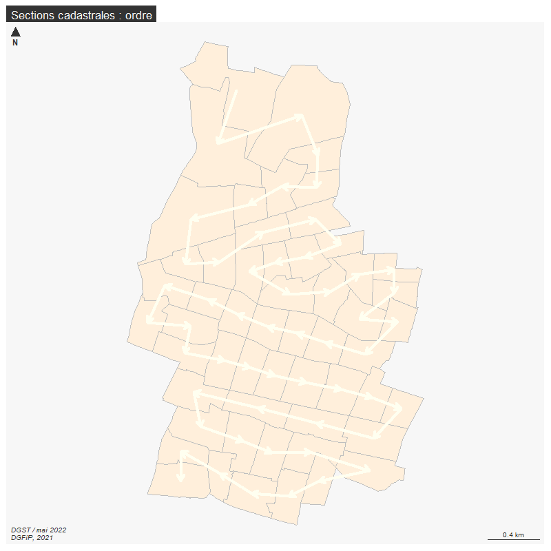
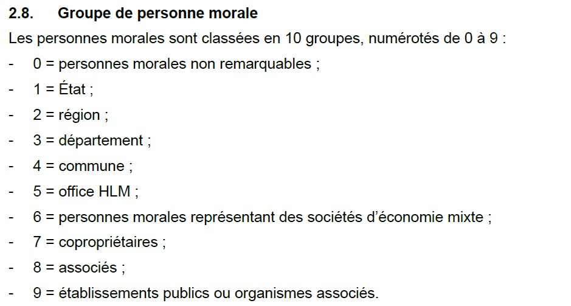
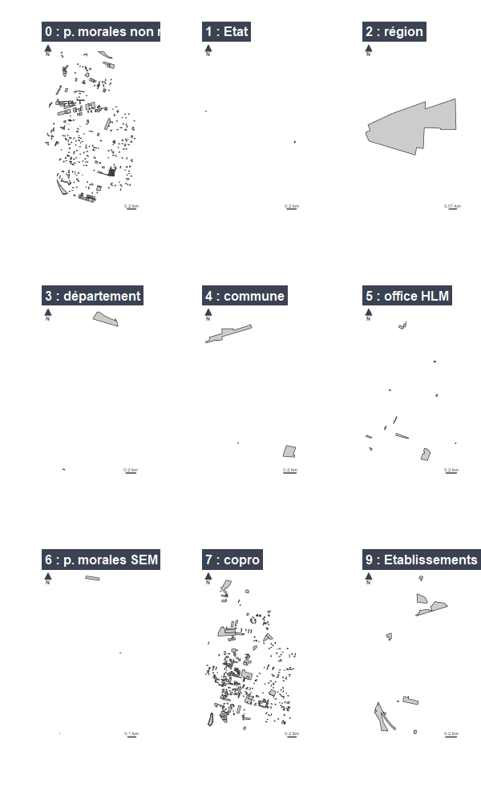

```{r setup, include=FALSE}
knitr::opts_chunk$set(echo = TRUE)
knitr::opts_chunk$set(cache = TRUE)
# Passer la valeur suivante à TRUE pour reproduire les extractions.
knitr::opts_chunk$set(eval = FALSE)
knitr::opts_chunk$set(warning = FALSE)
```


# Objet

Thématique cadastrale public / privé

Dans une la réunion du 14/04/2022, Laurent Soulié (Bobigny) a proposé une thématique intéressante
sur la notion  public / privé autour du cadastre.

Etats, CT, bailleurs, Etablissement publics et instituionnales, autres (copro, personne morale non remarquable, personne physique et absence de donnée ou mutation en cours)


```{r}
library(sf)
library(mapsf)
```


# Chemin data


```{r, eval = T}
chemin <- "C:/Users/bmaranget/Documents/03_SIG/03_03_Data/"
```


# Nommage sections

objectif : faire une carte de flux.
étape 1 : matrice de flux

```{r}
section <- st_read(paste0(chemin,"03_SOCLE/cadastre.sqlite"), "geo_section")
section$dest <- c(section$tex [-1],"")
st_write (section, "../data/cadastre.gpkg", "section", delete_layer = T)
pts <- st_centroid(section)
st_coordinates(pts) [,"X"]
section
png("../img/section.png", width = 800, height = 800, res = 100)
mf_map(section, col = "antiquewhite1", border = "grey", lwd = 0.5)
arrows (st_coordinates(pts) [-55,"X"], st_coordinates(pts) [-55,"Y"], st_coordinates(pts) [-1, "X"], st_coordinates (pts) [-1,"Y"],  col = "ivory", lwd = 4, length = 0.10 )
mf_label(section, var = "section3", halo = T, bg = "white", cex = 1)
mf_layout("Sections cadastrales : ordre", "DGST / mai 2022\nDGFiP, 2021")
dev.off()
```




# Propriétaire : parcelle_info

La variable *propriétaire* contient toutes les informations intéressantes

```{r, eval = F}
cadastre <- st_read(paste0(chemin,"03_SOCLE/cadastre.sqlite"), "parcelle_info")
chaine <- strsplit(cadastre$proprietaire, " - ")
# récupération du 2e terme
cadastre$nom <- sapply(chaine, "[",2)
cadastre$nom [is.na(cadastre$proprietaire)] <- "inconnu"
# aggregation des parcelles (permet de gérer le pb des parcelles mitoyennes)
agg <- aggregate(cadastre [, ("nom")], by = list(cadastre$nom), length)
# on passe de 7028 à 5476
names(agg)[1:2] <- c("nom", "nb_parcelles")
agg$nom <- gsub("^\\s+|\\s+$", "", agg$nom)
st_write(agg, "../data/cadastre.gpkg", "agg", delete_layer = T)
```

Le cadastre  :  7028 parcelles pour 5476 propriétaires.


# Personnes morales : propriétaire

Il existe un fichier proprietaire dans la base sqlite, qui permet d'avoir les catégories
utilisées dans Arcopole *personnes morales*

```{r}
proprio <- st_read(paste0(chemin,"03_SOCLE/cadastre.sqlite"), "proprietaire")
# 20 164 proprio pour 7000 parcelles... c'est 15 M  de trop
head(proprio)
# Le champs personne morale est ccogrm
table(proprio$ccogrm, useNA = "always")
# Beaucoup de propriétaires non catégorisés.
# Le nom du proprio est ddenom
proprio <- proprio [, c("ddenom", "ccogrm")]
names(proprio) <-c("nom", "categorie")
length(proprio$categorie[is.na(proprio$nom)])
# les propriétaires sans nom ne sont pas catégorisés : il y en 18 653
proprio <- proprio [!is.na(proprio$nom),]
table(is.na(proprio$nom))
# tous les proprio ont un nom.
head(proprio$nom [is.na(proprio$categorie)])
proprio <- unique(proprio)
proprio$nom <- gsub("^\\s+|\\s+$", "", proprio$nom)
# expression régulière tous les débuts et tous les fin
# + une ou pl répétitions (quantificateur)
# \ échappement
# \s espace
table(proprio$categorie, useNA = "always")
proprio$nom
proprio [proprio$categorie == 9,]
# 19307 proprios répertoriés
jointure <- merge(agg, proprio, by = "nom", all.x = T)
st_write(jointure, "../data/cadastre.gpkg", "pmorale", delete_layer = T)
```

5477 en jointure seulement.


https://www.collectivites-locales.gouv.fr/sites/default/files/migration/ffs_2020_proprietaires.pdf




```{r}
cat <- c("p. morales non remarquables", "Etat", "région", "département", "commune"
         , "office HLM", "p. morales SEM", "copro", "associés", "Etablissements publics ou organismes associés")
```


https://georezo.net/wiki/main/cadastre/pci_majic/pci_majic_modal/atlas_des_proprietes_publiques

Atlas des propriétés publiques sur le wiki georezo


Cartographie des différentes personnes morales


```{r}
summary(jointure)
jointure <- st_cast(jointure, "POLYGON")
table(jointure$categorie)
i <- 0
mf_export(jointure, filename = "../img/pmorale.png", theme = "brutal")
par (mfrow = c(3,3))
for (i in 0:9){
  if (i!=8){
    j <- i+1
    mf_map(jointure [jointure$categorie == i,])
    mf_layout(paste0(i," : ",cat[j]), credits = "")
    }
  }
dev.off()
```




# Sous catégorie

On repart de la couche comprenant les personnes morales.

Pour mémoire, le fichier est une agrégation de parcelles par nom de propriétaires (cas des inconnus).

On s'inspire du code DGFiP et de la catégorisation de Bobigny

La méthode est selon le cas :

- recherche d'un motif dans la chaîne de caractère pour recodage

- l'export du fichier pour chaque catégorie et du nommage des sous catégories, on recode en utilisant le fichier modifié.

On va donc rajouter un categ1 et categ2


## Recherche motif

### Autres

La catégorie autres peut permettre de discerner copro, individus, et absence de données.
Mais on peut aussi isoler les SCI (au sein des personnes morales non remarquables), et les commerces.


```{r}
# on reprend le fichier p. morale
data <- st_read("../data/cadastre.gpkg", "pmorale")
#initialisation nécessaire pour effectuer les remplacements
data$categ1 <- NA
data$categ2 <- NA
# M MME
ind1 <- grep("M |MME ", data$nom)
data$categ2 [ind1] <- "Personne physique (M / MME)"
ind2 <- grep("COPRO", data$nom)
data$categ2  [ind2] <- "Copropriété"
# Il semble intéressant d'éclater la catégorie *personne morale non remarquable* en retirant les SCI
ind3 <- grep("SCI|SOCIETE CIVILE IMMOBILIERE|SOCIETE CIVILE IMMOBILIERE|STE CIVILE IMMOBILIERE|S C I ", data$nom)
data$categ2 [ind3] <-  "SCI"
data$categ2 [data$nom == "inconnu"]  <- "Absence de données ou mutation en cours"
data$categ1 [data$nom == "inconnu"] <- "AUTRES"
data$categ1 [c(ind1,ind2, ind3)] <- "AUTRES"
```


## Tables d'équivalence

### Equipements commerciaux


TODO

```{r}
data$nom [ data$categorie == 0 && is.na(data$categ1)]

```

Sur le commerce, fichier du service commerce, des ERP, fichier des enseignes, permettent 
de constituer un thesauraus.

Pour toutes les observations restantes en 1, on les met en *personnne morale non remarquable*. Il s'agit notamment des équipements commerciaux.


```{r}
data$categ2 <- ifelse (data$categorie == 1 & is.na(data$categ2), "Personne morale non remarquable", data$categ2 )
table(is.na(data$nom))
# Aucun nom en NA
data [ (data$categorie == 1 & is.na(data$categ1)) , ]
data [ (data$categorie == 1) , ]
```


Vérification

```{r}
table(data$categ2,data$categ1, useNA = "always")
```


## CT


```{r}

```


```{r}
data <- st_read("../data/cadastre.gpkg","pmorale")
data$aire <- st_area(data)/10000
hist(data$aire)
library(units)
data$aire <- drop_units(data$aire)
```


```{r}
# initalisation cadastre$categorie
cadastre$categorie <- NA
# éclatement chaine proprio
arcochaine <- strsplit(cadastre$proprietaire, " - ")
# type de propriété. proprio / copro, 2 amphithéote
cadastre$type <- sapply(chaine, "[",3)
cadastre [grep("Preneur",cadastre$type), ]
cadastre$categorie [grep("Emph", cadastre$type)] <- "CT"
# Extraction du 2e terme - nom proprio
```

## Bailleurs sociaux


Le nom des bailleurs n'est pas orthographié à l'identique entre l'inventaire et le
cadastre.

```{r}
bailleurs <- read.csv("../data/bailleurs.csv")
# liste issue de l'inventaire social, on cherche une correspondance à 5 caractères
indBailleurs <- function(bailleur){grep(substr(bailleur,1,5), data$nom)}
ind <- unlist(sapply(bailleurs, indBailleurs))
write.csv(data$nom [ind], "../data/tableCorrespondance.csv", fileEncoding = "UTF-8")
```


Utilisation de la table de correspondance établie

```{r}
table <- read.csv("../data/tableCorrespondanceRep.csv", fileEncoding = "UTF-8")
jointure <- merge (data, table, by = "nom", all.x = T)
jointure$nom <- jointure$categorie  [!is.na(jointure$categorie)]
```


## Etablissements publics et institutionnels


```{r}
liste <- c("SNCF", "RATP")
ind <- unlist(sapply(liste, indBailleurs))
data$categ1 [ind] <- "Etablissements publics et institutionnels"
```


