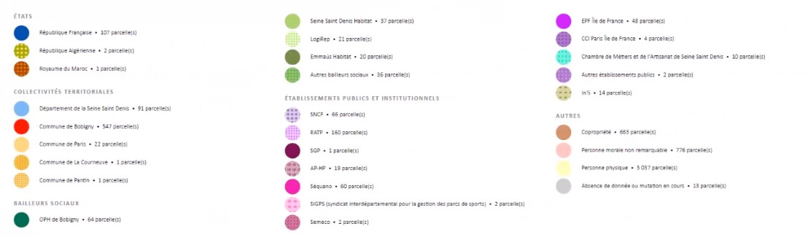
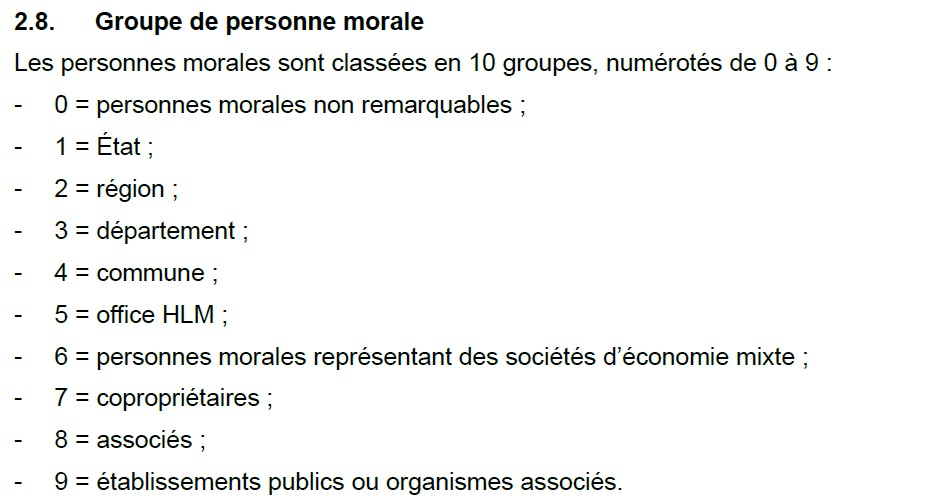
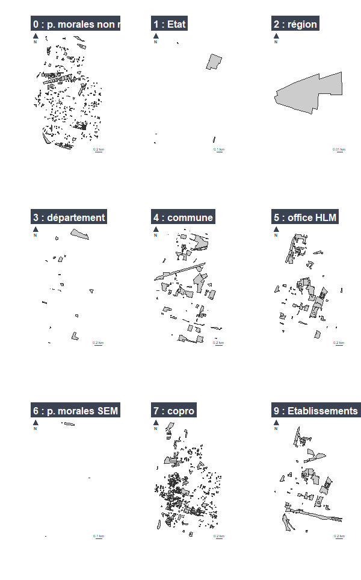
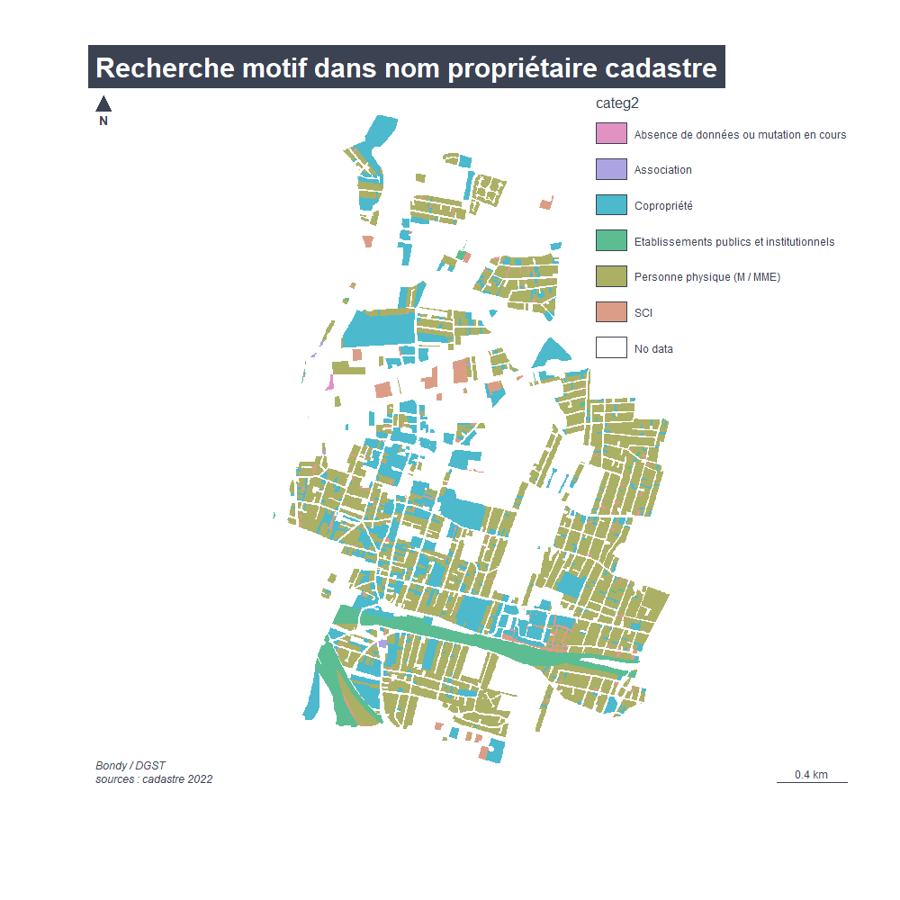
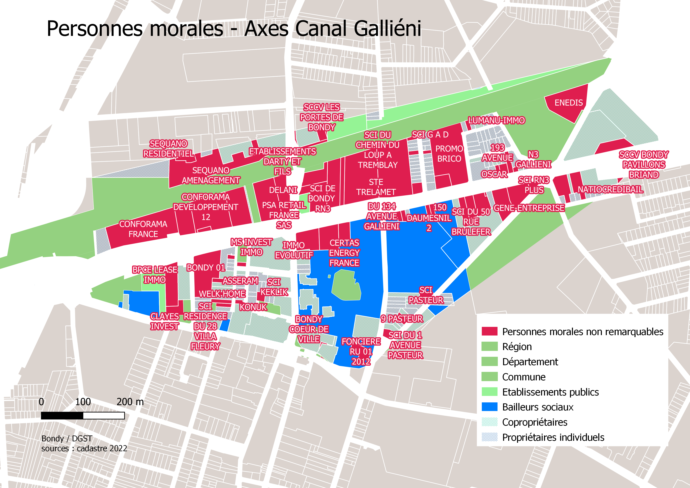

```{r setup, include=FALSE}
knitr::opts_chunk$set(echo = TRUE)
knitr::opts_chunk$set(cache = TRUE)
# Passer la valeur suivante à TRUE pour reproduire les extractions.
knitr::opts_chunk$set(eval = TRUE)
knitr::opts_chunk$set(warning = FALSE)
```


# Objet

Au niveau des agents de la voirie de Bondy, un besoin est exprimé. Il faut distinguer, du premier coup d'oeil, le domaine public et privé. La précédente application cadastrale leur apportait cet élément.

Dans une la réunion des géomaticiens du 14/04/2022, Laurent Soulié (Bobigny) a proposé une thématique intéressante sur la notion  public / privé autour du cadastre.




Par ailleurs, dans le cadastre, il y a le champs classant la personne morale.

https://www.collectivites-locales.gouv.fr/sites/default/files/migration/ffs_2020_proprietaires.pdf




```{r}
cat <- c("p. morales non remarquables", 
         "Etat", "région", "département", "commune"
         , "office HLM", "p. morales SEM", 
         "copro", "associés", "Etablissements publics ou organismes associés")

```


J'ai donc essayé de répondre au besoin exprimé en voirie à partir de ces 2 éléments.

Ce support est une présentation de la méthode et des outils que j'ai utilisés pour la réunion des géomaticiens du 22 septembre.


# Paramétrages


## Librairies

```{r}
library(sf) # géométrie spatiale
library(mapsf) # cartographie
```


## Chemin data

... Utilisation d'un google drive...

```{r, eval = T}
chemin <- "G:/Mon Drive/05_DATA"
```

# Données

Le cadastre millesime 2022, repris sous le plugin Qgis et enregistré en base sqlite.


# Jointure fichier parcelle_info et propriétaire

Il s'agit de récupérer la notion de personne morale (proprietaire) et le dessin des parcelles (parcelle_info).

Un travail est d'abord effectué sur la variable propriété de parcelle_info

## Parcelle_info : variable propriété

```{r, eval = F}
# lecture du fichier
cadastre <- st_read(paste0(chemin,"/01_SOCLE/cadastre/cadastre2022.sqlite"), "parcelle_info")
# enregistrement pour présentation
st_write(cadastre, "../data/cadastre.gpkg", "parcelle_info", delete_layer = T)
```


```{r}
# lecture
cadastre <- st_read("../data/cadastre.gpkg", "parcelle_info", quiet = T)
# première ligne
cadastre$proprietaire [1]
```

La variable *propriétaire* contient des informations intéressantes, on essaie d'abord d'exploiter le type de propriété, mais c'est surtout le nom qui nous 
intéresse.


### Le type de propriété : une information utile ?


```{r}
# éclatement chaine proprio
chaine <- strsplit(cadastre$proprietaire, " - ")
# exemple
chaine [[3]]
# Seul le 1er terme du 2e élément nous intéresse
chaine2 <- sapply(chaine, "[",3)
chaine3 <- strsplit(chaine2, "\\|")
cadastre$type <- sapply (chaine3, "[",1)
table(cadastre$type)
```


Nous verrons par la suite s'il faut retenir ces modalités.

### Le nom du propriétaire, essentiel


On isole le nom du propriétaire dans la variable *nom*.


```{r}
cadastre <- st_read("../data/cadastre.gpkg", "parcelle_info")
# on éclate la chaîne
chaine <- strsplit(cadastre$proprietaire, " - ")
# récupération du 2e terme
cadastre$nom <- sapply(chaine, "[",2)
cadastre [is.na(cadastre$proprietaire),]
# Il y a 4 parcelles sans proprio
cadastre$nom [is.na(cadastre$proprietaire)] <- "inconnu"
# suppression des espaces avant et après les noms
cadastre$nom <- gsub("^\\s+|\\s+$", "", cadastre$nom)
# aggregation des parcelles (permet de gérer le pb des parcelles mitoyennes)
agg <- aggregate(cadastre [, ("nom")], by = list(cadastre$nom), length)
# on passe de 7028 à 5476
names(agg)[1:2] <- c("nom", "nb_parcelles")
# sauvegarde du fichier agrégé
st_write(agg, "../data/cadastre.gpkg", "agg", delete_layer = T)
```


## Personnes morales : propriétaire

Il existe un fichier proprietaire dans la base sqlite, elle contient la personne morale.

```{r, eval = FALSE}
proprio <- st_read(paste0(chemin,"/01_SOCLE/cadastre/cadastre2022.sqlite"), "proprietaire")
st_write(proprio, "../data/cadastre.gpkg", "proprio", delete_layer = T)
```


```{r}
proprio <- st_read("../data/cadastre.gpkg", "proprio")
# on observe le fichier
str(proprio)
# Le champs personne morale est ccogrm
table(proprio$ccogrm, useNA = "always")
# Beaucoup de propriétaires non catégorisés.
# Le nom du proprio est ddenom, on garde également le siren pour correspondance autre (le siret aurait été mieux ?)
proprio <- proprio [, c("ddenom", "ccogrm", "dsiren")]
names(proprio) <-c("nom", "categorie", "dsiren")
length(proprio$categorie[is.na(proprio$nom)])
# les propriétaires sans nom ne sont pas catégorisés : il y en 18 653 / 20 333 en 2022
proprio <- proprio [!is.na(proprio$nom),]
table(is.na(proprio$nom))
# tous les proprio ont un nom.
head(proprio$nom [is.na(proprio$categorie)])
proprio <- unique(proprio)
proprio$nom <- gsub("^\\s+|\\s+$", "", proprio$nom)
# expression régulière tous les débuts et tous les fin
# + une ou pl répétitions (quantificateur)
# \ échappement
# \s espace
table(proprio$categorie, useNA = "always")
# 19307 / 19468 proprios répertoriés
jointure <- merge(agg, proprio, by = "nom", all.x = T)
st_write(jointure, "../data/cadastre.gpkg", "pmorale", delete_layer = T)
```

1008 en jointure seulement, on force all.x pour avoir toutes les parcelles du cadastre.

TODO pourquoi seulement 1008 ? Il y avait 20 M propriétaries...


### Une cartographie de l'importance respective des catégories de personnes morales

```{r}
data <- st_read("../data/cadastre.gpkg", "pmorale", quiet = T)
# on force en polygone (cela éclate les parcelles non adjacentes)
data <- st_cast(data, "POLYGON")
table(data$categorie)
# la categ 8 n'existe pas.
i <- 0
mf_export(data, filename = "../img/pmorale.png", theme = "brutal")
par (mfrow = c(3,3))
for (i in 0:9){
  if (i!=8){
    j <- i+1
    mf_map(data [data$categorie == i,])
    mf_layout(paste0(i," : ",cat[j]), credits = "")
    }
  }
dev.off()
```




# Quelles sont les différentes catégories voulues ?

On repart de la couche comprenant les personnes morales.

Pour mémoire, le fichier est une agrégation de parcelles par nom de propriétaires (cas des biens sans maitre).

On s'inspire du code DGFiP et de la catégorisation de Bobigny

La méthode pour catégoriser est selon le cas :

- recherche d'un *motif* dans la chaîne de caractère (cas des SCI par exemple)

- Utilisation de *table d'équivalence* exportée, puis modifiée sous tableur et enfin ré-intégrée. (cas des bailleurs sociaux)


## Recherche motif

### Copro / individus / biens sans maître

En recherchant un motif, on peu identifier : copro, individus, et absence de données.

Mais on peut également isoler les SCI (au sein des personnes morales non remarquables).

Du coup, il y aura beaucoup de modalités dans la variable categ2.

Pour agréger, de façon intuitive on distinguera public / privé et autres (variable categ1).


```{r}
# on reprend le fichier p. morale
data <- st_read("../data/cadastre.gpkg", "pmorale")
#initialisation nécessaire pour effectuer les remplacements
data$categ1 <- NA
data$categ2 <- NA
# M MME
ind1 <- grep("M |MME ", data$nom)
data$categ2 [ind1] <- "Personne physique (M / MME)"
ind2 <- grep("COPRO|PROPRI", data$nom)
data$categ2  [ind2] <- "Copropriété"
# Il semble intéressant d'éclater la catégorie *personne morale non remarquable* en retirant les SCI
ind3 <- grep("SCI|SOCIETE CIVILE IMMOBILIERE|SOCIETE CIVILE IMMOBILIERE|STE CIVILE IMMOBILIERE|S C I ", data$nom)
data$categ2 [ind3] <-  "SCI"
data$categ2 [data$nom == "inconnu"]  <- "Absence de données ou mutation en cours"
data$categ1 [data$nom == "inconnu"] <- "AUTRES"
data$categ1 [c(ind1,ind2, ind3)] <- "PRIVES"
```


```{r}
st_write(data,"../data/cadastre.gpkg","pmorale", delete_layer=T)
```


#### Etablissements publics et institutionnels


```{r}
data <- st_read("../data/cadastre.gpkg", "pmorale", quiet = T)
EPI <- c("SNCF", "RATP", "EAUX")
chercher <- function(str) {grep(str, data$nom)}
ind <- unlist(sapply(EPI, chercher))
data$categ2 [ind] <- "Etablissements publics et institutionnels"
data$categ1 [ind] <- "Public"
```


### Cartographie rapide

```{r}
png("../img/motif.png", width = 1000, height = 1000, res = 120)
mf_map(data, type = "typo", var = "categ2", border = NA)
mf_layout(title = "Recherche motif dans nom propriétaire cadastre", credits = "Bondy / DGST\nsources : cadastre 2022")
dev.off()
```




## Tables d'équivalence

### Bailleurs sociaux


#### Constitution de la table d'équivalence

Le nom des bailleurs n'est pas orthographié à l'identique entre l'inventaire et le cadastre.

```{r, eval=FALSE}
bailleurs <- read.csv("../data/bailleurs.csv")
# liste issue de l'inventaire social, on cherche une correspondance à 5 caractères
indBailleurs <- function(bailleur){grep(substr(bailleur,1,5), data$nom)}
ind <- unlist(sapply(bailleurs, indBailleurs))
write.csv(data$nom [ind], "../data/tableCorrespondance.csv", fileEncoding = "UTF-8")
```

On extrait les noms et on leur attribue un type.


Utilisation de la table de correspondance établie

```{r}
listeBailleurs <- read.csv("../data/tableCorrespondanceRep.csv", fileEncoding = "UTF-8")
listeBailleurs$nom <- gsub("^\\s+|\\s+$", "", listeBailleurs$nom)
listeBailleurs$motif
listeMotif <- listeBailleurs [(listeBailleurs$motif)!="",]
listeMotif
listeMotif <- listeMotif [-5,]
# Exemple avec ADEF
grep('ADEF', data$nom)
data$nom [17]
grep('ADOMA', data$nom)
data$nom [grep('ADOMA', data$nom)]
data <- st_read("../data/cadastre.gpkg","pmorale", quiet = T)
# boucle sur le motif pour recoder le cadastre
i <- 1
for (i in (1:8)) {
  print(listeMotif$motif [i] )
  ind <- grep(listeMotif$motif [i], data$nom)  
  print(data$nom [ind])
  data$nom [ind] <- listeMotif$nom [i]
}
```

Problème sur l'OPH départemental, il existe mais on arrive pas à le trouver...


## Jointure

```{r}
jointure <- merge (data, listeBailleurs, by = "nom", all.x = T)
```


### Equipements commerciaux


Il faudrait exploiter plusieurs sources pour établir une liste des commerces :

- fichier des enseignes

- liste des ERP

- liste du service commerce


# Comparaison *categorie* et *categ1*


Recoupage des informations avec la donnée cadastrale

```{r}
knitr::kable(table(data$categorie, data$categ1, useNA = "always"))
```

2 bailleurs hors catégorie 5

On a récupéré tous les propriétaires particuliers qui n'étaient pas des personnes morales.

Il y seulement 4 propriétaires inclassables...

```{r}
data [is.na(data$categ1)&is.na(data$categorie),]
```


# Exemple d'utilisation actuelle




# Autres pistes


## Personnes morales en opendata

Ajout septembre 2022, voir aussi le fichier des personnes morales en opendata ?
https://www.data.gouv.fr/fr/datasets/fichiers-des-locaux-et-des-parcelles-des-personnes-morales/


## Le travail du CEREMA

Explorer également la documentation autour des fichiers fonciers du cerema

la dernière journée d'info était en juin 2022, dommage... A surveiller !

## Une démarche détaillée autour des fichiers fonciers

https://georezo.net/wiki/main/cadastre/pci_majic/pci_majic_modal/atlas_des_proprietes_publiques

Atlas des propriétés publiques sur le wiki georezo


Cartographie des différentes personnes morales
