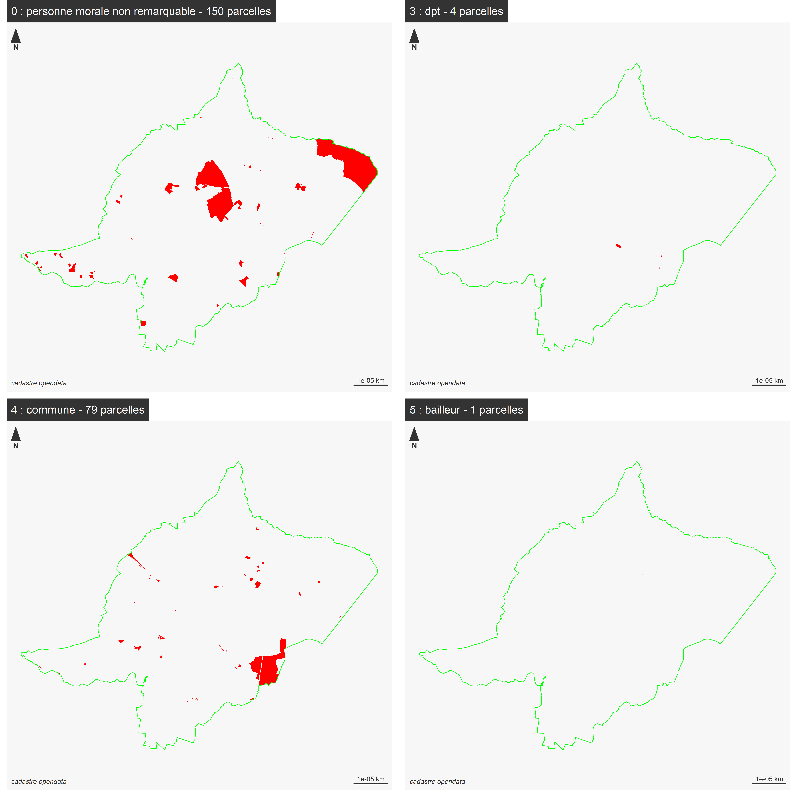

```{r setup, include=FALSE}
knitr::opts_chunk$set(echo = TRUE)
knitr::opts_chunk$set(cache = TRUE)
# Passer la valeur suivante à TRUE pour reproduire les extractions.
knitr::opts_chunk$set(eval = TRUE)
knitr::opts_chunk$set(warning = FALSE)
```


# Objet


Récupérer la parcelle de Bondy sur Roussines (36174)


# Librairies

```{r}
library(sf) # géométrie spatiale
library(mapsf) # cartographie
```


# Données

Le cadastre millesime 2024 directement en téléchargement

+ fichiers parcelles morales

https://www.data.gouv.fr/fr/datasets/fichiers-des-locaux-et-des-parcelles-des-personnes-morales/


# Jointure cadastre et txt

```{r, eval = F}
cadastre <- st_read("../data/cadastre-36174-parcelles.json")
data <- read.csv2("../data/PM_19_NB_360.txt", fileEncoding = "latin1")
head(data)
data <- data [data$Nom.Commune..Champ.géographique. == "ROUSSINES",]
str(data)
data$cle <- paste0(data$Section..Références.cadastrales., data$N..plan..Références.cadastrales.)
data$cle
cadastre$cle <- paste0(cadastre$section, cadastre$numero)
joint <- merge(cadastre, data, by = "cle")
mf_map(joint)
st_write(cadastre,"../data/roussines.gpkg", "cadastre")
st_write(joint,"../data/roussines.gpkg", "pmorale")
st_write (commune, "../data/roussines.gpkg", "commune")
getwd()
```


# Une cartographie de l'importance respective des catégories de personnes morales

```{r}
data <- st_read("../data/roussines.gpkg", "pmorale", quiet = T)
commune <- st_read("../data/roussines.gpkg", "commune", quiet = T)
# on force en polygone (cela éclate les parcelles non adjacentes)
data <- st_cast(data, "POLYGON")
str(data$Groupe.personne..Propriétaire.s..parcelle.)
tab  <- table(data$Groupe.personne..Propriétaire.s..parcelle.)
code <- as.vector(names(tab))
codeLib <- c("personne morale non remarquable", "dpt", "commune", "bailleur")
```


```{r}
mf_export(data, filename = "../img/pmoraleRoussines.png", width = 6000, height = 6000, res = 600)
par (mfrow = c(2,2))
ind <- 0
for (c in code){
    ind <- ind + 1
    selData <- data [data$Groupe.personne..Propriétaire.s..parcelle. == c,]
    #mf_init (data)
    nb <- length(selData$cle)
       # mf_inset_on(fig = c(0, 0.25, 0, 0.25))
      #mf_map(x = commune, col = "antiquewhite", border = NA)
      #mf_map(selData, col ="red", border=NA,add =T)
    #mf_inset_off()
    mf_init(commune)
    mf_map(selData, col = "red", border=NA, add = T)
    mf_map(commune, border = "green", col = NA, add = T)

    mf_layout(paste0(c," : ", codeLib [ind], " - ", nb, " parcelles"), 
              credits = "cadastre opendata")
    }
dev.off()
```




