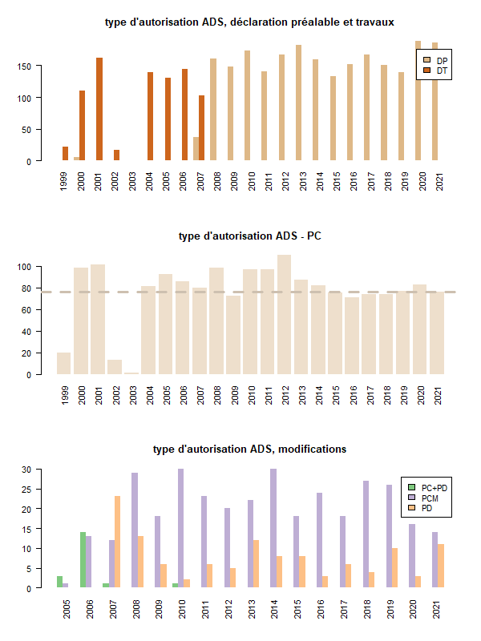

```{r setup, include=FALSE}
knitr::opts_chunk$set(echo = TRUE)
knitr::opts_chunk$set(cache = TRUE)
# Passer la valeur suivante à TRUE pour reproduire les extractions.
knitr::opts_chunk$set(eval = FALSE)
knitr::opts_chunk$set(warning = FALSE)
```


# Objet

Cartographie données ADS à la parcelle


# Données

On reprend la version opendata du cadastre (juillet 2021) et le registre 2021 ADS


```{r, eval = T}
# pb lettre clé usb
usb <- "G:"
chemin1 <- "C:/Users/bmaranget/Documents"
chemin2 <- "G:"
chemin <- "Home/tachasa/00_DATA/"
```


```{r, eval = T}
library(sf)
geo <- st_read(paste0(chemin,"03_SOCLE/cadastre-93010-parcelles.json"))
plot(head(geo$geometry))
geo$loc <- paste0(geo$section,geo$numero)
registre <- read.csv("../data/ads1b.csv", encoding="UTF-8")
# 26 colonnes uniquement et 5358 dossiers
noms <- names(registre)[1:26]
registre <- registre [c(1:5358), noms]
```


## Premières analyses


```{r, eval = T}
library(RColorBrewer)
tab <- table(registre$Type.d.autorisation, registre$année.du.dépôt)
knitr::kable(tab [,seq (0,25, by = 5)])
tab <- tab [c(3,4,9,11:13), c(3:25)]
tabAVT <- tab [c(1,2),]
tab
# 3 graphiques
png("../img/nbADS.png", width = 600, height = 800, res = 100)
par(mfrow = c(3,1))
barplot(tabAVT, beside = T, main = "type d'autorisation ADS, déclaration préalable et travaux", 
        col = c("burlywood", "chocolate3"), border = NA, 
        legend = T, horiz = F, las=2, bg = "antiquewhite")
barplot(tab [3,], beside = T, main = "type d'autorisation ADS - PC", 
        col = "antiquewhite2", border = NA, 
        legend = F, horiz = F, las=2, bg = "antiquewhite" )
abline(h = mean(tab [3,]), col = "antiquewhite3", lwd = 3, lty=2)
barplot(tab [c(4:6), c(7:23)], beside = T, main = "type d'autorisation ADS, modifications", 
        col = brewer.pal(n = 3, name = "Accent"), border = NA, 
        legend = T, horiz = F, las=2, bg = "antiquewhite" )
agg <- aggregate(registre$Type.d.autorisation,list(registre$année.du.dépôt, registre$Type.d.autorisation), length)
names(agg) <-  c("année", "type", "nb")
dev.off()
```



## Traitement des données


### Sur l'ensemble du registre, jointure


#### Sections

```{r}
registre$section.cadastrale
```


#### Parcelles

```{r}

```


#### Jointure

```{r}

```


### Sur 2021


### Sections 


```{r}
registre2021 <- registre [registre$année.du.dépôt == "2021",]
registre2021$section.cadastrale <-  substring(registre2021$section.cadastrale,1,2)
registre2021 <- registre2021 [registre2021$section.cadastrale !="",]
```

2 nuls


On procède pareil pour les parcelles

### Parcelles

```{r}
registre2021$n..parcelle
# Uniformisation des séparateurs
registre2021$n..parcelle <- gsub(";|-| |/", ",", registre2021$n..parcelle)
liste <- strsplit(registre2021$n..parcelle,",")
# récupération uniquement des premiers éléments
vec <- NULL
for (i in 1:length(liste)) {
  tmp <- liste [[i]][1]
  vec <- c(vec,tmp)
}
registre2021$n..parcelle <- vec
registre2021$loc <- paste0(registre2021$section.cadastrale,registre2021$n..parcelle)
```


32 NA / 10 gros permis


### Mois

On va cartographier les mois

```{r}
registre2021$date.de.la.demande <- as.numeric(registre2021$date.de.la.demande)
registre2021$date.de.la.demande <-as.Date(registre2021$date.de.la.demande, origin = "1900-01-01")
registre2021$mois <- as.numeric(format(registre2021$date.de.la.demande, "%m"))
registre2021$mois
```
## Jointure

```{r}
dataF <- merge(geo, registre2021, by="loc" )
# 277 sur 286
dataF <- st_as_sf(dataF)
plot(dataF$geometry)
dataF <- st_transform(dataF, 2154)
st_crs(dataF)
dataF$mois
```

## Etiquettes


dataLabel pour étiquettes

la surface pour filtrer les labels

```{r}
ind <- which(registre2021$surface > 10000)
registre2021$promoteur [ind]
dataLabel <- dataF [dataF$surface > 10000&!is.na(dataF$surface),]
plot(dataLabel$geometry)
# on supprime un doublon nom
grep("SNCF", dataLabel$promoteur)
dataLabel <- dataLabel [-3,]
```


# Cartographie


```{r}
library(mapsf)
bondy <- st_read(paste0(chemin,"/03_SIG/03_data/limites.gpkg"), "bondy", quiet=F)
rue <-  st_read( paste0(chemin, "/03_SIG/03_Data/03_SOCLE/bondy.gpkg"), "ruePrincipale", quiet = TRUE)

mf_export(x = bondy, filename = paste0(chemin,"/03_SIG/05_Carte/ads.png"), 
          expandBB = c(0,0,0,0.3),
          width = 1000, res = 250)
  #mf_init(bondy, theme = "candy")
  mf_shadow(bondy, add = TRUE)
  mf_map(bondy, add = TRUE)
  mf_map(
    rue,
    type = "base",
    col = "white",
    lwd = 2,
    add = TRUE
  )
  mf_map(
    dataF,
    type = "choro",
    border = NA,
    var = "mois",
    leg_pos = "n",
    add = TRUE
  )

  mf_label(dataLabel, var = "promoteur", overlap = F, halo = T, cex = 0.5)
  
 # start the inset
mf_inset_on( fig = c(0.75, .95, 0.84, .99))
# draw the histogram
bks <- mf_get_breaks(x = dataF$mois, nbreaks = 5, breaks = "quantile") 
pal <- hcl.colors(n = 5, palette = "Dark Mint", rev = TRUE)
mf_theme("candy")
fg <-mf_theme()$fg
par(mar = c(0,0,0.8,0))
hist(dataF$mois, breaks = bks, col = pal, border = fg, axes = F, labels = "", 
     xlab="mois", ylab = "", main ="")
axis(side = 1, at = bks, las = 2, tick = FALSE, line = -.9, 
  cex.axis = .7, col.axis = fg)
title("Nb ADS par mois", cex.main = .5, col.main = fg, 
      font.main = 1, adj = 0)
# close the inset
mf_inset_off()
   mf_layout(title = paste0("ADS en 2021 : ", length(dataF$mois)),
            credits = paste0("OSM / sources internes\n", "Bondy, 2021"))
dev.off()
```


Géolocalisation du registreLogement

```{r}

tmp$section.cadastrale <-  substring(tmp$section.cadastrale,1,2)
tmp$section.cadastrale
```


On procède pareil pour les parcelles

### Parcelles

```{r}
tmp$n..parcelle
# Uniformisation des séparateurs
tmp$n..parcelle <- gsub(";|-| |/", ",", tmp$n..parcelle)
liste <- strsplit(tmp$n..parcelle,",")
# récupération uniquement des premiers éléments
vectmp <- NULL
for (i in 1:length(liste)) {
  vectmp <- liste [[i]][1]
  vec <- c(vec,vectmp)
}
tmp$n..parcelle <- vec
tmp$loc <- paste0(tmp$section.cadastrale,tmp$n..parcelle)
tmp$loc
```


```{r}
library(mapsf)
bondy <- st_read(paste0(chemin,"/03_SIG/03_data/limites.gpkg"), "bondy", quiet=F)
rue <-  st_read( paste0(chemin, "/03_SIG/03_Data/03_SOCLE/bondy.gpkg"), "ruePrincipale", quiet = TRUE)

mf_export(x = bondy, filename = paste0(chemin,"/03_SIG/05_Carte/adsLogement.png"), 
          expandBB = c(0,0,0,0.3),
          width = 1000, res = 250)
  mf_init(bondy, theme = "candy")
  mf_shadow(bondy, add = TRUE)
  mf_map(bondy, add = TRUE)
  mf_map(
    rue,
    type = "base",
    col = "white",
    lwd = 2,
    add = TRUE
  )
  mf_map(
    tmp,
    type = "choro",
    border = NA,
    var = "nb",
    leg_pos = "n",
    add = TRUE
  )

  mf_label(dataLabel, var = "promoteur", overlap = F, halo = T, cex = 0.5)
  
 # start the inset
mf_inset_on( fig = c(0.75, .95, 0.84, .99))
# draw the histogram
bks <- mf_get_breaks(x = tmp$nb, nbreaks = 5, breaks = "quantile") 
pal <- hcl.colors(n = 5, palette = "Dark Mint", rev = TRUE)
mf_theme("candy")
fg <-mf_theme()$fg
par(mar = c(0,0,0.8,0))
hist(tmp$nb, breaks = bks, col = pal, border = fg, axes = F, labels = "", 
     xlab="mois", ylab = "", main ="")
axis(side = 1, at = bks, las = 2, tick = FALSE, line = -.9, 
  cex.axis = .7, col.axis = fg)
title("Nb logements", cex.main = .5, col.main = fg, 
      font.main = 1, adj = 0)
# close the inset
mf_inset_off()
   mf_layout(title = paste0("Nombre d'ADS pour logements > 3 :", length(tmp$nb)),
            credits = paste0("OSM / sources internes\n", "Bondy, 2021"))
dev.off()
```


