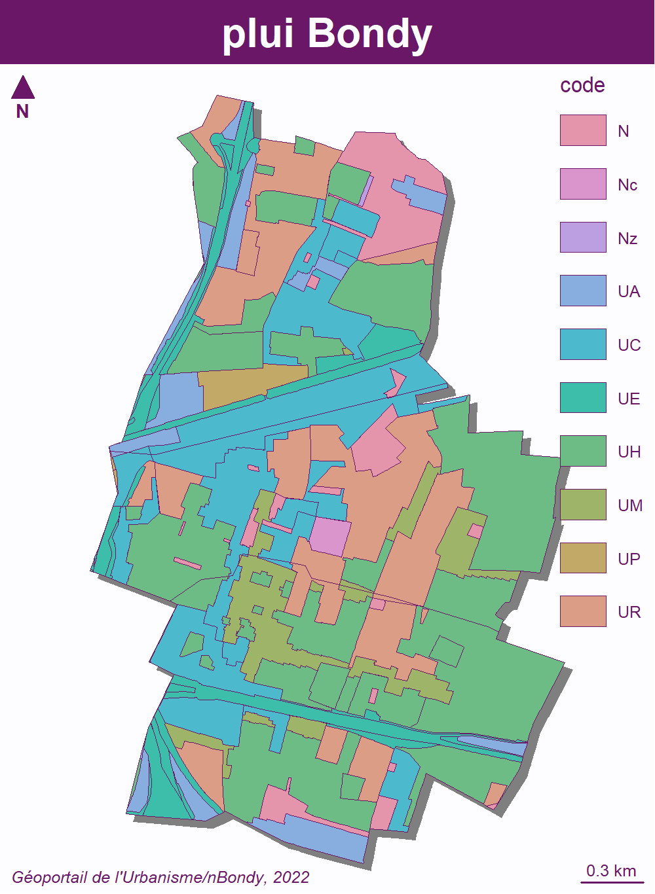

```{r setup, include=FALSE}
knitr::opts_chunk$set(echo = TRUE)
knitr::opts_chunk$set(cache = TRUE)
# Passer la valeur suivante à TRUE pour reproduire les extractions.
knitr::opts_chunk$set(eval = FALSE)
knitr::opts_chunk$set(warning = FALSE)
```


# Objet

Cartographie Plui, présentation


# Données

On reprend les données du geourbanisme et on colle les styles PLUi

données du 21/06/2021

https://www.geoportail-urbanisme.gouv.fr/map/#tile=1&lon=2.481895&lat=48.90601000000001&zoom=13&mlon=2.481895&mlat=48.906010


```{r, eval = T}
# pb lettre clé usb
usb <- "G:"
chemin1 <- "C:/Users/bmaranget/Documents"
chemin2 <- "G:"
chemin3 <- "C:/Users/tachasa/Documents/03_SIG/03_03_Data/"
chemin <- "Home/tachasa/00_DATA/"
```


Données


```{r, eval = T}
library(sf)
geo <- st_read(paste0(chemin3,"06_URBA/200057875_PLUi_20210629/Donnees_geographiques/200057875_ZONE_URBA_20210629.shp"))
bondy <- st_read (paste0(chemin3, "limites.gpkg"), "bondy")
plui <- st_intersection(geo, bondy)
```

extraction des codes

```{r}
plui$code <- substring(plui$LIBELLE,1,2)
```

carto

```{r}
library(mapsf)
mf_export(x = plui, filename = "../img/plui.png", 
          expandBB = c(0,0,0,0.3),
          width = 1000, res = 250)
  mf_init(bondy, theme = "candy")
  mf_shadow(plui, add = TRUE)
  mf_map(plui, add = TRUE)
  mf_map(
    plui,
    type = "typo",
    var = "code",
    add = TRUE
  )
  

   mf_layout(title = "plui Bondy",
            credits = "Géoportail de l'Urbanisme/nBondy, 2022")
dev.off()
```




Récupération du fichier .sld de l'urbanisme
On parse le fichier pour récupérer codes et couleurs
Les codes sont sur les lignes "ogc:literal"
suppression des caractères vides et de 

```{r}
style <- read.csv("../data/zone_urba.sld", fileEncoding = "UTF-8")
style
id <- grep("ogc:Litera|sld:Title|fill", style$X..xml.version.1.0.encoding.UTF.8..)
(texte <- style$X..xml.version.1.0.encoding.UTF.8.. [id])
code <- unique(gsub(" |<ogc:Literal>|</ogc:Literal>","",texte))
head(style,100)
id2 <- grep("fill|stroke",style$X..xml.version.1.0.encoding.UTF.8..)
test <- style$X..xml.version.1.0.encoding.UTF.8..[id2]
style$X..xml.version.1.0.encoding.UTF.8.. [61:76]
# faire une palette avec les couleurs pour voir.
id2 <- grep("#",style$X..xml.version.1.0.encoding.UTF.8..)
test <- style$X..xml.version.1.0.encoding.UTF.8.. [id2 [1]]
test2 <- (gsub(" ", "",test))
substring(test2,7,20)
extrCol <- substr(test2,28,35)
extraire <- function (chaine) {
  res <- gsub(" ","", chaine)
  res2 <- substring(res, 28,37)
}
ltest <- lapply(test, extraire) 
couleurs <- gsub("</s|e>|<", "",unlist(ltest))
col <- unique(couleurs)
barplot(seq(1,9), col = col, names = code,border = NA)

```


```{r}
(codeBondy <- unique(plui$code))

code
grep("UC", style$X..xml.version.1.0.encoding.UTF.8..)
```

Les codes CNIG ne correspondent pas au PLUi Bondy ?
En fait, dans les codes CNIG, il y a U, N, et AU au départ puis des subtilités 
UC (centralités), etc...


```{r}
library(mapsf)
mf_export(x = plui, filename = "../img/plui.png", 
          expandBB = c(0,0,0,0.3),
          width = 1000, res = 250)
  mf_init(bondy, theme = "candy")
  mf_shadow(plui, add = TRUE)
  mf_map(plui, add = TRUE)
  mf_map(
    plui,
    type = "typo",
    pal = col,
    var = "code",
    add = TRUE
  )
mf_layout(title = "plui Bondy",
            credits = "Géoportail de l'Urbanisme/nBondy, 2022")
dev.off()
```

# Identfification des couches diverses

Il s'agit de constituer un dictionnaire des éléments des couches du PLUi afin de 
pouvoir accéder à l'information plus vite.

exemple : où sont les périmètres ABF ...


TODO pourquoi ces noms ?


```{r}
rep <- paste0(chemin3, "06_URBA/200057875_PLUi_20210629/Donnees_geographiques")
liste <- list.files(rep, pattern = "shp")
liste
bondy <- st_read (paste0(chemin3, "limites.gpkg"), "bondy")
# on charge toutes les couches
l <- liste [1]
# initialisation
categorie <- NA
for (l in liste) { 
  fic <- paste0(rep, "/", l)
  tmp <- st_read(fic)
  inter <- st_intersection(tmp, bondy)
  # on extrait les libellés
  tmp <- unique(inter$LIBELLE)
  # on enlève du nom tous les caractères chiffres et l'extension
  nom <- gsub('[0-9]|_|shp|\\.','',l)
  categorieTmp <- data.frame(nom = nom, libelle=tmp)
  categorie <- rbind(categorie, categorieTmp)
  assign(nom, inter)
  } 
```

6 fichiers, on extrait tous les libellés


```{r}
write.csv(categorie, "../data/categorieLibellePlui.csv")
```


```{r}
