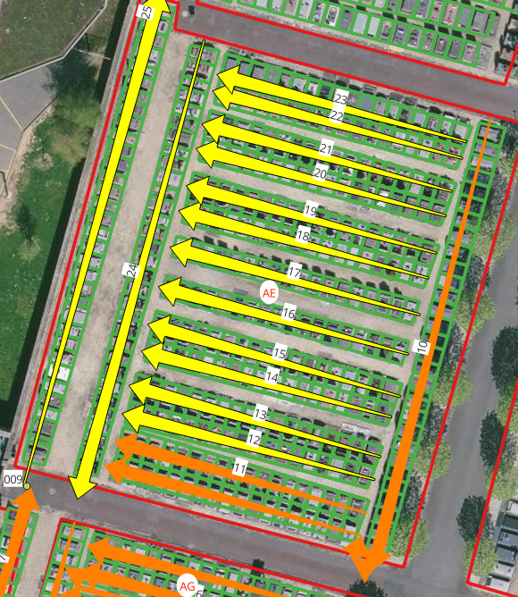

```{r setup, include=FALSE}
knitr::opts_chunk$set(echo = TRUE)
knitr::opts_chunk$set(cache = TRUE)
# Passer la valeur suivante à TRUE pour reproduire les extractions.
knitr::opts_chunk$set(eval = TRUE)
knitr::opts_chunk$set(warning = FALSE)
```


# Objet

identification tombes du cimetière

Sous Qgis, on crée les polygones des sépultures et un chemin qui permet de les numéroter.

on extrait les sommets du chemin afin de pouvoir récupérer les allées dont on garde le sens.

on intersecte le chemin et les sépultures afin de récupérer les pts sépultures.

puis on replace les sépultures sur les allées et on calcule la distance à partir de chaque point zéro de l'allée.


Remarque 1

Simplification : éviter la phase allée
on intersecte, on numérote tous les centroïdes et on supprime les centroides qui n'intersectent

le problème est que l'indexation n'est pas conservée (testé sous Qgis et R)


Remarque 2

Parfois le dessin s'avère complexe, donc on numérote les allées cf section AE
la numérotation suit bien l'ordre de création des chemins et correspond au fid.

Du coup, on traite section par section quelque soit le nombre d'allée.



```{r}
library(sf)
library(mapsf)
#library(rgdal)
```


# Chemin data et data

Tout est dans le projet R

```{r}
chemin <- st_read("../data/cimetiere.gpkg", "chemin")
requiem <- st_read("../data/cimetiere.gpkg", "requiem") # le dessin des sépultures
section <- st_read("../data/cimetiere.gpkg", "section")
requiem <- st_intersection(requiem, section)
write.csv2(table(requiem$sections), "../data/dessinSepSection.csv")
```

pb doublons


```{r, eval = FALSE}
# on ne cherche que les doublon géométriques
table(duplicated(requiem$geom))
requiem <- requiem [requiem$doublon == FALSE,]
st_write (requiem, "../data/cimetiere.gpkg", "requiem", delete_layer = T)
```

5047

# Prétraitement : du chemin au point de départ allée


## Autour du chemin

### Extraction des sommets sous R : recherche

st_reverse points devient ligne
st_node ajoute des noeuds aux intersections
... tout simplement st_cast


### Identification

```{r}
mf_map(chemin)
chemin$num <- rownames(chemin)
mf_label(chemin, var = "num")
```

### Lien section chemin

Permet de vérfier le nombre de chemins par section, Sans doute va-t-il falloir faire un traitement section par section.

```{r}
chemin <- st_intersection(chemin, section)
mf_label(section, var ="sections", col = "red", halo = T)
```


### choix du chemin 


```{r}
chemin <- chemin [chemin$sections == 'P',]
```

### point chemin

```{r}
# caster un chemin en pt permet de garder l'indexation à chaque vertex
ptChemin <- st_cast(chemin, "POINT")
ptChemin$num <- rownames(ptChemin)
```


```{r}
mf_init(chemin)
mf_map(requiem, add = T, col = "green")
mf_map(chemin, add = T)
mf_map(ptChemin, add = T)
mf_label(ptChemin, var ="num", col= "red", halo = T)
```


Chemins et points correspondent normalement, l'ordre des points chemin est conservé

Chaque chemin commence par un numéro sans point (propriété qui sera utilisée avec un grep)

## pt sépulture


### Création du point : intersection chemin - tombe + centroid

```{r}
ptSep <- st_centroid(st_intersection(requiem$geom, chemin))
ptSep <- st_as_sf(ptSep)
ptSep$num <- rownames(ptSep)
mf_init(chemin)
mf_map(requiem, add = T, col = "green")
mf_label(ptSep, var = "num",col = "blue", cex = 0.5)
```


Le ptSep (intersection chemin / sep) ne permet pas d'indenter.

Donc, on va calculer le pt origine pour chaque allée de sépulture et utiliser la distance.


## l'allée

###  repérage des lignes allée avec les points de départ

combien d'allées ? on compte de visu puis par le calcul.
cas AH = 14, calcul 15.5 donc 3 pts en trop
solution : on calcule les lg qui ne sont pas dans les sép.

### constitution des allees

faire un segment, il n'est valide que s'il intersecte et s'il n' y a un pt
dans le pt2

```{r}
lg <- NULL
segment <- NULL
faireSegment <- function(pt){
  segment <- st_cast(st_union(ptChemin$geom [pt], ptChemin$geom [pt+1]), "LINESTRING")
  segment <- st_as_sf(segment)
  # test sur validité segment
  if (
     st_is_valid(segment$x)==TRUE && !is.na(st_is_valid(segment$x))
     # pb st_is_valid peut renvoyer NA
  ){
    testInter  <- length(st_intersection(segment$x, requiem$geom)) > 1
    # une seule intersection n'est pas suffisante
   print(paste0("inter : ",testInter))
    if(testInter==TRUE){
      testGrep <- length (grep("\\.", ptChemin$num [pt+1])) == 1
    #print(paste0("grep :", testGrep))
      if (testGrep == TRUE){
      segment$num <- pt
      return(segment)
    }
  }
  }
}
```


```{r}
# pour éviter pb liste, on fait boucle
for (pt in 1:(length(ptChemin$num)-1)) {
    print(pt)
    #mf_map(chemin, col = "red")
    #mf_map(segment, add = T)
    lg <- rbind(lg,faireSegment(pt))
}
lg$num <- rownames(lg)
```


```{r, eval=FALSE}
# verif graphique
mf_init(lg)
mf_map(requiem, add = T, col = "green")
mf_map (lg, col = "red", lwd = 3, add = T)
mf_label(lg, var = "num", halo = T)
```


### Récupération de l'allée du point (st_within)

dans le cas où il y avait un chemin par allée, on recopie chemin et allee


```{r}
# bizarre les pts n'appartiennent pas à la lg
st_intersection(ptSep, lg)
st_touches(ptSep, lg)
st_contains(ptSep, lg)
# necessite d'y mettre une distance
accroch <- st_is_within_distance(ptSep, lg , 1)
# verif du chiffre des derniers ptSep
tail(unlist(accroch))
# verif du nombre
# verif toutes les sépultures liées à une allée
serie <- sapply(accroch, length)
# test doit être vide
test <- which(serie == 0)
# rajout champs de l'allee dans le ptSep
accroch <- unlist(accroch)
ptSep$allee <- accroch
# pb -1 pt Se
mf_init(ptChemin)
mf_map(requiem, add = T)
mf_map(lg, col = "red",add = T)
mf_label(ptSep, var ="allee")
```


# Mesurer la distance pt sepulture - pt  départ allée


## Vérifications

### verif nb de tombes par allée

Cela permet un contrôle rapide

```{r}
table(unlist(accroch))
```

### Verif que les points ne sont pas ordonnés

C'est quelque chose de si troublant que l'on refait la verif à chaque fois !

```{r}
tmp  <- unlist(accroch)
ptSep$num <- rownames(ptSep)
mf_init(chemin)
mf_map(requiem, add = T)
mf_label(ptSep, var = "num", col = "red", halo = T, cex= 0.5,overlap = T, add = T)
```


## Mesure de la distance entre le pt 0 de l'allée et le pt Sepulture


Il faut que les ptSep et les pt aient une variable commune

### variable pt

définition des ptLg de départ

```{r}
ptLg <- st_cast(lg, "POINT")
ptLg$num <- rownames(ptLg)
# on supprime les pts arrivées
str(ptLg)
ptLg <- ptLg [-grep("\\.",ptLg$num),]
# mettre en numérique
ptLg$num <- as.integer(ptLg$num)
# vérification graphique
mf_map(lg)
mf_map(ptLg, add =T)
mf_label(ptLg, var= "num", halo = T, add = T)
```

Donc, on a ptChemin, ptSep, ptLg

On prend les points lg et on mesure 1 à 1

```{r}
nb <- 1
# fonction pour classer les pts en fonction distance
mesurer <- function (nb){
  selSep <-  ptSep [ptSep$allee == nb,] 
  selLg <- ptLg [ptLg$num == nb,]
  mat <- st_distance(selLg, selSep )
  mat
  dist <- as.vector (mat)
  dist
  selSep$dist <- dist
  selSep <- selSep [order(selSep$dist),]
  selSep
  seq <- (1:length(selSep$dist))
  selSep$num  <- seq
  selSep
  selSep <- selSep
  return(selSep)
}
# boucle car la liste difficile à manipuler
res <- NULL
i <- 1
cpt <- 0
for (i in min(ptLg$num):max(ptLg$num)){
  print(paste0(i, " et ",cpt))
  tmp <- mesurer (i)
  # compteur pour ordre des tombes sur la section
  tmp$num2 <- tmp$num+cpt
  cpt <- max(tmp$num)+cpt
  res <- rbind(tmp, res)
}
# verif carto
mf_init(chemin)
mf_map(requiem, add = T)
mf_label(res, var = "num2", cex = 0.5)
st_write(res, "../data/cimetiere.gpkg", "ptSepultureID", delete_layer = F, append=T)
```

# Intégration dans le dessin des tombes


```{r}
res
jointureSpatiale <- st_within(res [,c("num2")], requiem, sparse = T)
lg <- unlist(jointureSpatiale)
res$lg <- lg
res <- st_drop_geometry(res)
requiem$lg <- rownames(requiem)
joint <- merge(requiem, res, by = "lg")
mf_init(chemin)
mf_map(requiem, add = T)
mf_map(joint, col="green", add = T)
mf_label(joint, var = "num2")
```


# Correspondance avec les identifiants réels

## Ensemble de la donnée

## Chargement

La liste des identifiants est dans  08/VOIRIE, l'extraction en .csv est dans ../data

Il s'agit de celle de novembre 2023


```{r}
realite <- read.csv2("../data/Extraction REQUIEM - Liste de Terrains le 23-9-2024.csv", na.strings = "", fileEncoding = 'WINDOWS-1252')
realite$Emplacement
# On sauvegarde la clé
realite$cle <- realite$Emplacement
```

4794

## La section

séparation nécessaire lettre / chiffre pour contrôle nb de tombes / section

```{r}
# fonction pour permettre de créer col section
eclater <- function(){
  div <- strsplit(realite$Emplacement, " ")
  realite$section <- sapply(div, "[",1)
  return(realite)
}
realite <- eclater()
tab <- table(realite$section)
tab
# une fois
remplacement1 <- names(tab) [tab == 1]
remplacement1
# pour vérifier avec le tableur
```

Il faudra rectifier à la main dans chaque extraction ?

On exporte et on corrige sous le tableur et on importe à nouveau


```{r}
write.csv(tab,"../data/tabNbSepulture.csv", row.names =  F)
# lecture du fichier modifié
modif <- read.csv("../data/tabNbSepultureModifie.csv")
# differecne avec realite
setdiff(remplacement1, modif$Var1)
# cas anormaux
remplacement2 <-  modif[(modif$remplacement.ID)!="",]
names(remplacement2) <- c("depart", "Nb", "arrivee")
# verif : uniqument un remplacement
table(remplacement2$Nb)
# controle 36 cas de remplacement
# on charge le premier realite
realite <- read.csv2("../data/Extraction REQUIEM - Liste de Terrains le 23-9-2024.csv", na.strings = "", fileEncoding = 'WINDOWS-1252')
# jointure
realite <- merge (realite, remplacement2, all.x = T, by.x = "Emplacement", by.y = "depart" )
# remplacement dans emplacement
realite$Emplacement [!is.na(realite$arrivee)] <- realite$arrivee [!is.na(realite$arrivee)]
```

Vérification en refaisant une fréquence


```{r}
# neautest
realite <- eclater()
table(realite$section)
```

On rajoute sur le modifié les anomalies. attention à voir avec Sébastien à bien séparer par un espace la section et le numéro.

correction erreur à la marge : 

pour AI, le l

```{r}
ind <- which(realite$section == "l")
realite[ind, c("section", "Emplacement")]
realite$Emplacement[ind]
```

En fait, le "l" se mettait en "L" à cause de l'autocorrection...


## Le numéro

Problème du numéro, pour pouvoir trier, il faut éclater le numéro et l'indice

Or pb de l'espace

```{r}
div <- strsplit(realite$Emplacement, " ")
#realite$section <- sapply(div, "[",1)
#num sera le numero
realite$num <- sapply(div, "[",2)
#num2 sera me complement
realite$num2 <- sapply(div, "[",3)
realite$num3 <- sapply(div, "[",4)
table(realite$num3)
table(realite$num)
table(realite$num2)
```

2 opérations : 

- extraire les 3 dernières lettres de num quand existe complément

- modifier bis / ter en 2/3/4 pour pouvoir incrémenter


```{r}
# repérage des bis et ter (pour permettre le tri numérique du num)
ind <- grep("bis|BIS|ter|TER", realite$num)
realite$num [ind]
# 94 cas
#extraction dans num2
realite$num2 [ind] <- substring(realite$num [ind], 3,5)
realite$num [ind] <- substring(realite$num [ind], 1,2)
realite$num
# conversion en entier
realite$numBon <- as.integer(realite$num)
realite [is.na(realite$numBon), c("numBon", "num")]
# on extrait pour en faire table d'équivalence
write.csv(realite [is.na(realite$numBon), c("numBon", "num")], "../data/mauvaisNum.csv")
#ind <- which(is.na(realiteAI$numBon ))
```

On rajoute au grep tous les soucis


```{r}
# correction anomalie par anomalie
realiteAI$numBon [ind [1]] <- 21
realiteAI$numBon [ind [2]] <- 24
realiteAI$num2 [ind [1]] <-  "quarto"
# il s'agit d'une sépulture 24/25
realiteAI$num2 [ind  [2]] <- "1"
#write.csv(realiteAI, "../data/realiteAI.csv")
table(realiteAI$num2)
# remplacement bis ter  quarto par 2 3 4 pout tri
realiteAI$num2 <- gsub("ter" , "3", realiteAI$num2)
realiteAI$num2 <- gsub("bis|BIS" , "2", realiteAI$num2)
realiteAI$num2 <- gsub("quarto" , "4", realiteAI$num2)
# cas des NA
ind <- which(is.na(realiteAI$num2))
realiteAI$num2 [ind]   <- "1"
# tri
realiteAI <- realiteAI [order(realiteAI$numBon, realiteAI$num2),]
write.csv(realiteAI, "../data/sectionAI.csv")
table(realiteAI$num2, useNA ="always")
```


## Remplacement par section


### Pb incrémentation 

eclater l'emplacement. num puis indice ou autre.

```{r}
choix <- 'AI'
# on procède à l'éclatement sur la parcelle

realiteAI <- realite [grep("AI", realite$section ),]
# premier terme
realiteAI$num


```


# Nb de sépulture par zone


```{r}
occurence <- table(requiem$sections)
occ <- as.data.frame(occurence)
names(occ) <- c("sections", "nb")
section <- merge(section, occ, by = "sections")
st_write(section,"../data/cimetiere.gpkg", "section", delete_layer =T)
```


# shape final

```{r, eval=F}
joint
joint <- joint [order(joint$alleeL, joint$num),]
joint$lg <- seq(1:39)
joint
joint$E_ID <- paste0("bondy@",joint$lg)
joint$ALLEE <- joint$alleeL
joint$DIVISION <- "AA"
joint$EMPLACEMEN <- joint$num
st_write(joint [, c("E_ID", "Text", "DIVISION", "SECTION", "ALLEE", "EMPLACEMEN")],"../data/bondy.shp")
```


# Simplification

Utilisation d'un graphe ?


