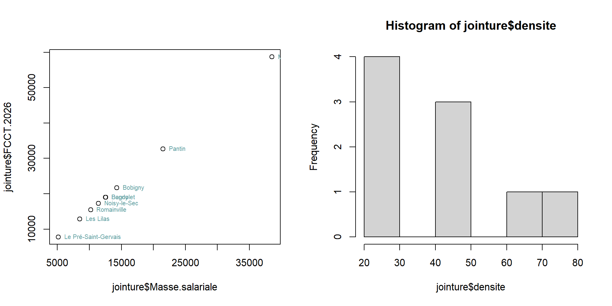
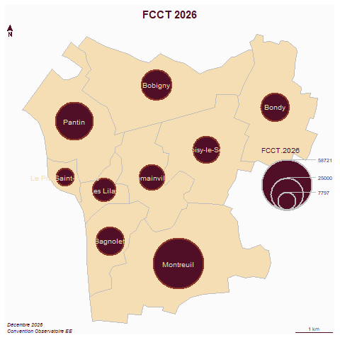

```{r setup, include=FALSE}
knitr::opts_chunk$set(echo = TRUE)
knitr::opts_chunk$set(cache = TRUE)
# Passer la valeur suivante à TRUE pour reproduire les extractions.
knitr::opts_chunk$set(eval = TRUE)
knitr::opts_chunk$set(warning = FALSE)
```


# Objet

Carto du tableau convention SIG


```{r}
library(sf)
library(mapsf)
```


# Data

copier / coller du tableau de la convention

## Des chiffres trop réguliers

```{r, eval = T}
data <- read.csv("../data/convention2026.csv", row.names = 1)
rownames(data)
# pb espace et chiffres
for (c in c(2:5)){
  data [,c] <- gsub(" ", "", data [,c])
data [,c] <- as.integer(data [, c])
}
pairs(data)
# bizarre...
```


Relation fonctionnement investissement

```{r}
plot(jointure$Fonctionnement, jointure$Investissement)
text(jointure$Fonctionnement, jointure$Investissement, 
     jointure$nom, 
     cex=0.6, pos=4, 
     col="cadetblue")
```


## L'EPT

```{r}
st_layers("../data/limitesSocle.gpkg")
commune <- st_read("../data/limitesSocle.gpkg", "communesEPT")
st_crs(commune) <- 2154
commune$nom
mf_map(commune)
mf_label(commune, var="nom")
```

# Jointure

Remplacement Noisy le Sec et Pré-Saint-Gervais 

```{r}
commune$nom
data$nom <- rownames(data)
data$nom
data$nom [7] <- commune$nom [3]
data$nom [4] <- commune$nom [7]
```


Jointure


```{r}
jointure <- merge(commune, data, by = "nom")
data$nom [!data$nom %in% jointure$nom]
jointure
```


# Carto

```{r}
hist(jointure$Masse.salariale)
hist(jointure$FCCT.2026)
bks <- c(0,15000,30000,40000)
plot(jointure$Masse.salariale, jointure$FCCT.2026)
text(jointure$Masse.salariale, jointure$FCCT.2026, 
     jointure$nom, 
     cex=0.6, pos=4, 
     col="cadetblue")
centre <- st_centroid(jointure)
jointure$densite <- jointure$Masse.salariale/jointure$surf_ha
jointure$densite
hist(jointure$densite)
```


```{r}
png("../img/convention2026.png", width = 2000, height = 1000, res = 200)
par(mfrow= c(1,2))
mf_map(jointure, col = "wheat", border = "grey")
mf_map(centre, type = "prop", inches = 0.5, var = "Masse.salariale", border = "violetred4", col = "violetred", lwd = 2)
mf_label(jointure, var = "nom", col = "yellow4", halo = F, cex = 0.8)
mf_layout("Masses salariales communes => EPT", "Décembre 2026\nConvention Observatoire EE")
# carte 2
bks <- c(0,35,55,85)
mf_map(jointure, breaks = bks, nbreaks = 3, var = "densite", type="choro",  border= NA)
mf_label(jointure, col="turquoise4", var = "nom")
mf_layout("masse salariale / espace communes => EPT", "Décembre 2026\nConvention Observatoire EE")
dev.off()
```




```{r}
png("../img/convention2026_2.png")
par(mfrow=c(1,1))
mf_map(jointure, col = "wheat", border = "grey")
mf_map(centre, type = "prop", inches = 0.5, var = "FCCT.2026", border = "tomato4", lwd = 2)
mf_label(jointure, var = "nom", col = "wheat", halo = F, cex = 0.8)
mf_layout("FCCT 2026", "Décembre 2026\nConvention Observatoire EE")
dev.off()
```



```{r}
jointure$FFCT_aire <- round(jointure$FCCT.2026/st_area(jointure$geom)*10000,0)
hist(jointure$FFCT_aire)
png("../img/convention2026_3.png")
par(mfrow=c(1,1))
mf_map(jointure, col = "wheat", border = "grey")
mf_map(jointure, type = "choro", breaks= c(0,50,90,120), var = "FFCT_aire", border = NA)
mf_label(jointure, var = "nom",  cex = 0.8)
mf_layout("FCCT 2026 / aire", "Décembre 2026\nConvention Observatoire EE")
dev.off()
```


