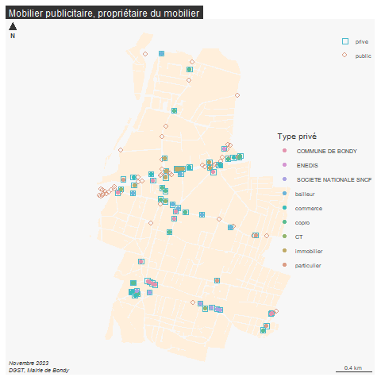

```{r setup, include=FALSE}
knitr::opts_chunk$set(echo = TRUE)
knitr::opts_chunk$set(cache = TRUE)
# Passer la valeur suivante à TRUE pour reproduire les extractions.
knitr::opts_chunk$set(eval = TRUE)
knitr::opts_chunk$set(warning = FALSE)
```


# Objet

Contexte : RLPI (cf compte rendu réunion 231114 DGST), changement de prestataire marché mobilier publicitaire => DSP

2 sources : GMCA (titulaire marché 2006) et application TLPE : toutes les enseignes y compris celles du domaine privé

Idée : croiser le cadastre et les points afin de déterminer les points du domaine PRI / PUB

Notion de domaine privé de la commune

# Données

```{r}
library(sf)
library(mapsf)
chemin <-  paste0(Sys.getenv('HOME'), "/03_SIG/03_03_Data/08_VOIRIE/")
```


```{r}
data <- st_read(paste0(chemin, "panneaux.gpkg"), "panneaux")
cadastre <- st_read("../data/cadastre.gpkg", "proprio")
st_layers("../data/cadastre.gpkg")
names(cadastre)
```

Utilisation de la couche proprio afin de recenser

# Intersection

```{r}
prive <- st_intersection(data, cadastre [, c("proprio")])
pub <- setdiff(data$geom,prive$geometry)
table(prive$prestataire)
ind <- as.integer(rownames(prive))
pub <- data [-ind,]
pub$domaine <- "public"
```

# concaténation

```{r}
names(prive)
prive <- prive [, c("proprio", "prestataire", "type", "num")]

prive$domaine <- "prive"
names(pub)
pub$proprio <- "public"
pub <- pub [, c("proprio", "prestataire", "type","num", "domaine")]
data <- rbind(prive, pub)
```

# codage proprio


```{r}
data$code <- NA
ind <- grep("COPRO", data$proprio)
data$code [ind] <- c("copro")
ind <- grep("^M ", data$proprio)
data$code [ind] <- c("particulier")
ind <- grep ("BONDY HABITAT|IMMOBILIERE 3F", data$proprio)
data$code [ind] <- c("bailleur")
ind <- grep ("GAMBETTA |CONFORAMA |MACLOU |DARTY|TAPIS|A ET G|CERTAS|DELANI", data$proprio)
data$code [ind] <- c("commerce")
ind <- grep (" SCI |FONCIER|TRELAMET|IMMO |SEQUANO|CRISTAL|193", data$proprio)
data$code [ind] <- c("immobilier")
ind <- grep ("DEPARTEMENT|REGION", data$proprio)
data$code [ind] <- c("CT")
data$code [is.na(data$code)] <- data$proprio [is.na(data$code)]
st_write(data, paste0(chemin, "panneaux.gpkg"), "interParcelleMobilier", delete_layer = T)
```


```{r}
png("../img/mobPub.png")
mf_map(cadastre, col = "antiquewhite1", border = NA)
#mf_map(data, add = T)
mf_symb(data, var = c("domaine"), alpha =1, add = T, border = NA, leg_title = "", cex = 1.2)
mf_typo(data [data$domaine == 'prive',], var = c("code"), add = T, border = NA, leg_title = "Type privé", leg_pos = "right")
mf_layout("Mobilier publicitaire, propriétaire du mobilier", credits = "Novembre 2023\nDGST, Mairie de Bondy")
dev.off()
table(data$code)
```


