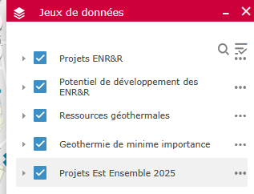
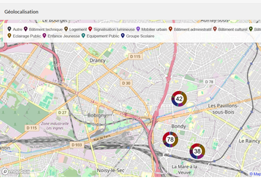
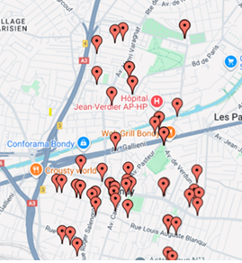
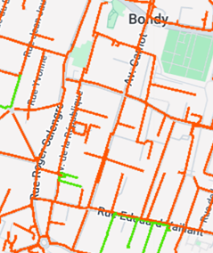
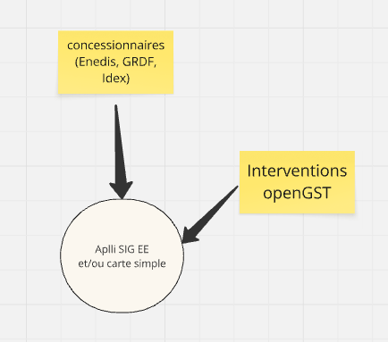

```{r setup, include=FALSE}
knitr::opts_chunk$set(echo = FALSE)
knitr::opts_chunk$set(cache = FALSE)
# Passer la valeur suivante à TRUE pour reproduire les extractions.
knitr::opts_chunk$set(eval = TRUE)
knitr::opts_chunk$set(warning = FALSE)
library(flexdashboard)
#library(shiny)
#library(jsonlite)
#library(maptools)
#library(ggplot2)
#library(tidyr)
library(dplyr)
#library(purrr)
library(leaflet)
#library(plotly)
library(sf)
library(mapsf)
library(mapview)
#library(htmltools)
```


Column {data-width=700}
-----------------------------------------------------------------------

### Interventions énergie sites municipaux


```{r, include=FALSE}
data <- st_read("../data/energie.gpkg", "secteur")
openGST <- st_read("../data/socle2025.gpkg", "batOpenGST")
ou <- names(table(data$Catégorie))
# couleurs rouge / bleu / vert
library(RColorBrewer)
paletteType <- (brewer.pal(4, "Set1"))
paletteType <- paletteType [1:2]
paletteOu <- rev(brewer.pal (14, "Set2"))
palQui <- colorFactor((paletteType), levels = data$Agent)
palOu <- colorFactor(rev(paletteOu), levels = data$Catégorie)
```


```{r}
# définition du texte quand on clique sur la parcelle
click <- paste0(
  openGST$Nom, "<br/>",
  openGST$Floor.surface, " m²"
)
legendCateg <- unique(data$Catégorie)


# carte
leaflet(options = leafletOptions(zoomControl = TRUE,
                                 minZoom = 13, maxZoom = 18)) %>%

  addProviderTiles("CartoDB.Positron", group = "Positron") %>%
  addTiles(urlTemplate = "https://mt1.google.com/vt/lyrs=s&x={x}&y={y}&z={z}", "© Google", group = "Satellite") %>% 
  setView(lng = 2.4893100, lat = 48.9018000, zoom = 15) %>% 
  addCircleMarkers(data=data, group = "Energie",  opacity = 1,radius = 15, color = ~palQui (Agent), fill = FALSE) %>% 
  addCircleMarkers(data= data ,group = "Energie", color = ~palOu (Catégorie), radius = 8, fillOpacity = 1) %>% 
  addCircleMarkers(data = openGST, popup = click,group = "OpenGST", radius = 5, fillOpacity = 1, color = "black") %>% 
    addLayersControl(baseGroups = c("Positron", "Satellite"),
      overlayGroups = c("Energie", "OpenGST"), options = layersControlOptions(collapsed = FALSE)) %>% 
    #overlayGroups = c("OpenGST"), options = layersControlOptions(collapsed = FALSE)) %>% 
  addLegend("topright", palQui, values = c("Brahim", "Nordine"),
            title = "Intervenant") %>% 
 addLegend("topright", palOu, values = legendCateg,
            title = "Type lieu Energie") 
```


Column {data-width=300 .tabset}
-----------------------------------------------------------------------


### Carte et graphiques


#### Un outil simple

Un simple fichier web qui permet une visu rapide

```{r, out.width="85%"}
tab <- table(data$Secteur,data$Agent)
knitr::kable(tab)
barplot(tab, col = (paletteType)[c(1,2)], border = NA, main = "Nb d'interventions", horiz = T)
```


#### SIG Est Ensemble, plus complexe


L'outil SIG Est Ensemble qui sera utilisé.


[Potentiel de développement des ENRR](https://sigterritorial.est-ensemble.fr/portal/apps/webappviewer/index.html?id=ffd89a40e61e4d7ba912674f53e8f0bd)


##### Observer


- l'adresse

- le filtre sur le type de bâti

- la source d'énergie de chauffage réelle


##### Un bon fond de plan ?





### Utiliser openGST

#### Profil 

[OpenGST](https://bondy.opengst.fr)


#### Catégories de bâtiments OpenGST


16 types de bâtiment dans OpenGST (233 bâtiments)

```{r}
tab <- table(openGST$Type)
knitr::kable(tab, col.names = c("Type", "Nb"))
```


#### Fichier énergie

14 types de bâtiment dans le fichier énergie (84 bâtiments)


```{r}
tab <- table(data$Catégorie)
knitr::kable(tab, col.names = c("Type", "Nb"))
```


#### Situer les PDL

Dans OpenGST ou sur les plans bâtiment ?


### Flux applicatifs

#### Quelles autres applications ?

Hors OpenGST, il existe des applis tiers, il est possible de récupérer les données
concernant Bondy

##### Enedis



##### Idex




##### GRDF




Techniquement c'est facile si les prestataires acceptent de transmettre leurs données.

#### En résumé





