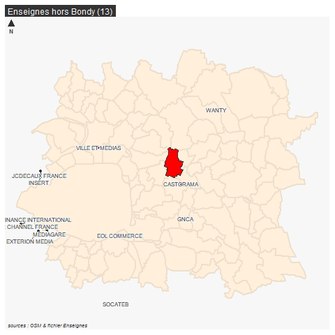

```{r setup, include=FALSE}
knitr::opts_chunk$set(echo = TRUE)
knitr::opts_chunk$set(cache = TRUE)
# Passer la valeur suivante à TRUE pour reproduire les extractions.
knitr::opts_chunk$set(eval = FALSE)
knitr::opts_chunk$set(warning = FALSE)
```


# Objet

Cartographie du fichier des enseignes de Karina Arslane, à partir de son export
Constitution du .gpkg

Compléments : fichier pmorale, distinction privé / public


# Librairies et répertoire

```{r}
library(sf)
library(mapsf)
chemin <-  paste0(Sys.getenv('HOME'), "/03_SIG/03_03_Data/")
```


# Données


```{r}
enseigne <- read.csv2("../data/enseigne.csv", dec =",",fileEncoding = "UTF-8")
#spatialisation du fichier
enseignesf <- st_as_sf(enseigne, coords = c("Lon", "Lat"), crs = 4326, agr = "constant")
enseigne2154 <- st_transform(enseignesf,  2154)
st_write(enseigne2154,"../data/enseigne.gpkg", "enseigne", fileEncoding = "UTF-8", delete_layer = T)
```


Nettoyage

Quelques points en dehors de Bondy


fond : limites admistratives IDF

```{r}
st_layers(paste0(chemin,"03_SOCLE/limites.gpkg"))
fond <- st_read(paste0(chemin,"03_SOCLE/limites.gpkg"), "autourBondy")
bondy <- st_read(paste0(chemin,"03_SOCLE/limites.gpkg"), "limites2154")
```


```{r}
enseigne <- st_read("../data/enseigne.gpkg", "enseigne")
horsBondy <- enseigne [enseigne$Ville != "BONDY",]
mf_map(horsBondy)
mf_label(horsBondy, var = "Ville")
table(horsBondy$Ville)
png("../img/enseigneHorsBondy.png")
mf_map(fond, border = "Antiquewhite2", lwd = 2, col = "Antiquewhite1")
mf_map(bondy, col = "red", add = T)
mf_map(horsBondy [horsBondy$Ville != "LA VALETTE DU VAR",], add = T)
#mf_label(horsBondy, var = "Ville", halo = T)
mf_label(horsBondy, var = "Nom", halo = T, overlap = F, lines = T )
mf_layout("Enseignes hors Bondy (13)", credits = "sources : OSM & fichier Enseignes", scale = F)
dev.off()
```





```{r}
enseigne <- st_read("../data/enseigne.gpkg", "enseigne")
enseigne <- enseigne [enseigne$Ville == "BONDY",]
png("../img/enseigneBondy.png")
mf_init(bondy)
mf_map(fond, border = "Antiquewhite2", lwd = 2, col = "Antiquewhite1", add = T)
mf_map(enseigne, add = T)
mf_layout("Enseignes à Bondy (98)", credits = "sources : OSM & fichier Enseignes", scale = F)
dev.off()
```


