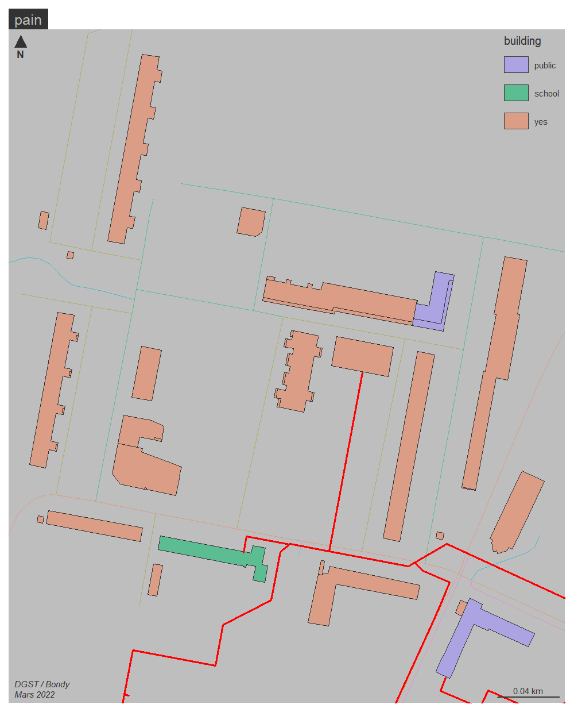
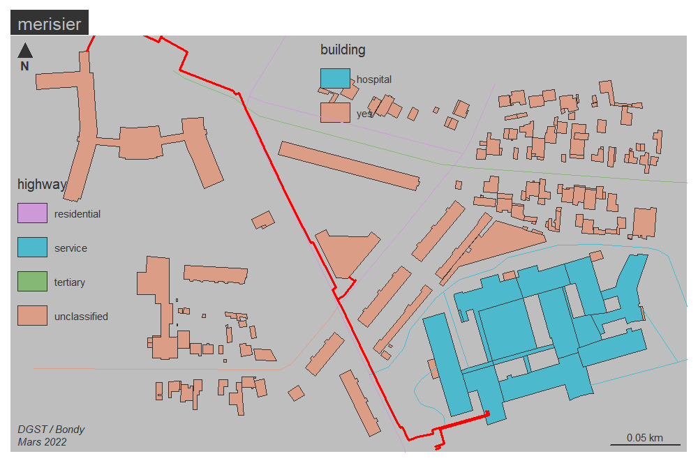

```{r setup, include=FALSE}
knitr::opts_chunk$set(echo = TRUE)
knitr::opts_chunk$set(cache = TRUE)
# Passer la valeur suivante à TRUE pour reproduire les extractions.
knitr::opts_chunk$set(eval = FALSE)
knitr::opts_chunk$set(warning = FALSE)
```


# Objet

données autour des EPT basé sur le tag local_authority


# Environnement


## Librairies


```{r}
library(sf)
library(mapsf)
```


## Chemins


```{r}

```


# Chargement données


```{r}
data <- st_read("../data/boundaryLocalAuthority.geojson")
table(data$local_authority.FR)
data <- data [data$local_authority.FR == 'EPT', c("name", "ref.FR.MGP")]
commune <- st_read("../data/admin_level8.geojson")
str(commune)
commune$dpt <- substring(commune$ref.INSEE,1,2)
commune <- commune [commune$dpt == "93", c("name", "dpt", "ref.INSEE")]
```


# Intersection spatiale


```{r}
inter <- st_intersection(commune, data)
ept <- inter [inter$ref.FR.MGP == "T8",]
ept$cle <- c(15, 3, 26, 8, 6,6,8, 10, 8)
```


# Cartographie

```{r}
mf_export(ept, width = 1000, filename = "../img/ept.png", theme = "default")
mf_theme(bg = "grey")
# centrage sur T8
mf_init(ept)
mf_map(data, col = "antiquewhite2", border = "antiquewhite3", lwd = 3, add = TRUE)
mf_shadow(ept, cex = 1, add = T)
mf_map(ept, type = "choro", var = "cle", leg_pos = "n",  border = "antiquewhite1",add = T)
mf_label(ept, var = "cle", halo = T)
mf_layout("Clé Est-Ensemble", credits = "DGST / Bondy\nMars 2022")
dev.off()
```


# Exploration fichier RCU


```{r}
data <- st_read("../data/RCU/BONDY-022022.shp")
mf_map(data, col = "red")

```

deux zones à examiner de plus près

- patrimoine 3 F côté rue fontaine
- carré odette pain

```{r}
merisier <- st_read("../data/batMerisierRCU.geojson")
merisier <- st_transform(merisier,2154)
pain <- st_read("../data/pain.geojson")
pain <- st_transform(pain, 2154)
```


```{r}
cartoOSM <- function (dataOSM, nom){
  bat <- dataOSM [!is.na(dataOSM$building),]
  rue <- dataOSM [!is.na(dataOSM$highway),]
  # on retient uniquement les lignes pour les rues (il y a des points)
  rue <- rue  [st_geometry_type(rue) == "LINESTRING",]
  mf_export(bat,width = 1000, res=150, filename = paste0("../img/", nom ,".png" ))
mf_map(bat, type = "typo", var =  "building")
mf_map(rue, type = "typo", var= "highway", add = T)
mf_map(data, add = T, col ="red", lwd = 2)
mf_layout(nom, "DGST / Bondy\nMars 2022")
dev.off()
}
cartoOSM(merisier, "merisier")
cartoOSM(pain, "pain")
```




