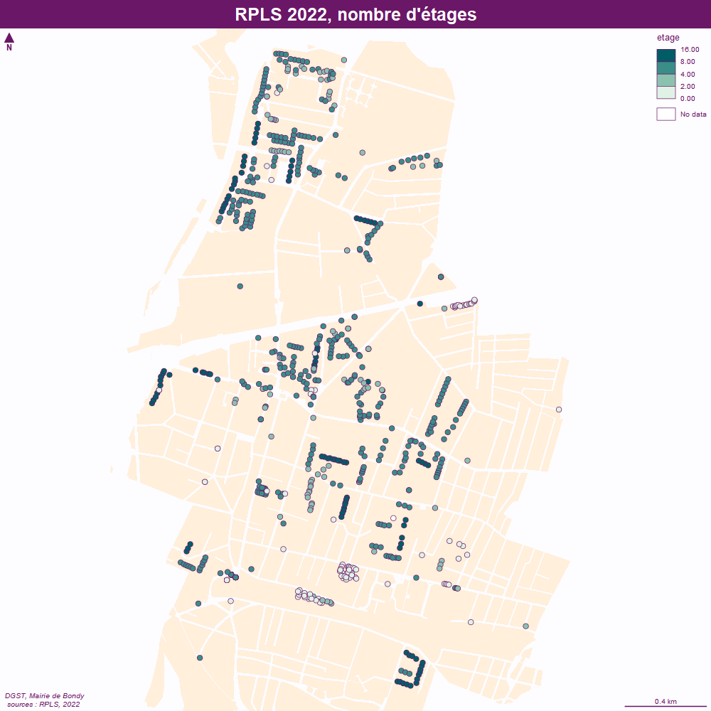

```{r setup, include=FALSE}
knitr::opts_chunk$set(echo = TRUE)
knitr::opts_chunk$set(cache = TRUE)
# Passer la valeur suivante à TRUE pour reproduire les extractions.
knitr::opts_chunk$set(eval = FALSE)
knitr::opts_chunk$set(warning = FALSE)
```


# Objet

exploitation du fichier opendata mv_immeubles_2022_03_09.csv, point immeuble fibre

récupération dans C:\Users\bmaranget\Documents\01_ARCHIVE\fibre\Fibre Bondy DSI des kmz
(Bondy V5.kmz)


```{r}
library(sf)
library(mapsf)
library(rgdal)
```


# Chemin data


```{r, eval = T}
# on reprend variable HOME en fonction PC
rep <- Sys.getenv("HOME")
chemin <- paste0(rep,"/01_ARCHIVE/02_fibre/01_DSI/01_plans/Bondy V5.kmz")
st_read(chemin)

data <- readOGR(chemin, "Filaire")

```


# Chargement des fichiers

Il y a un premier fichier en opendata, et l'autre comportant le nom des bailleurs.


```{r}
fibre <- read.csv2("../data/mv_immeubles_2022_03_09.csv", fileEncoding = 'UTF-8', stringsAsFactors = F,  header = T)
fibre <- fibre [fibre$CODEPOSTAL == 93140,]
str(RPLS)
```


```{r}
RPLSbailleurs <- read.csv2(paste0(chemin,"rpls2021_geolocalise_loi_depcom93010.csv"))
str(RPLSbailleurs)
tab <- table(RPLSbailleurs$RS)
hist(tab)
par(mar = c(15,4,4,4))
barplot(tab, las = 2)
# recodage : bcp de petits bailleurs
noms <- names(tab)[tab<200] 
noms
RPLSbailleurs$type <- ""
RPLSbailleurs$type [RPLSbailleurs$RS %in% noms] <- "Petits bailleurs < 200" 
noms <- names(tab)[tab>200] 
noms
RPLSbailleurs$type <- ifelse(RPLSbailleurs$type == "", RPLSbailleurs$RS, RPLSbailleurs$type)
table(RPLSbailleurs$type)
```


# Agrégation par immeuble


```{r}
RPLS <- RPLSbailleurs
RPLS$cle <- paste0(RPLS$NUMVOIE, RPLS$TYPVOIE, RPLS$NOMVOIE)
aggNbAppart <- aggregate(RPLS$cle, by = list(RPLS$cle), length)
```


# Etage le plus haut


```{r}
aggEtageMax <- aggregate(RPLS$ETAGE, by = list(RPLS$cle), max)
```


# jointure


```{r}
joint <- merge(aggNbAppart, aggEtageMax, by = "Group.1")
names(joint) <- c("cle", "appartement", "etage")
geo <- unique( RPLS [,c("cle", "PATRIMOINE",  "RS", "type" ,"X", "Y") ])
joint2 <- merge(joint, geo, by ="cle")
str(joint)
str(geo)
str(joint2)
#spatialisation
data <- st_as_sf(joint2, 
                 coords = c(x = "longitude", y = "latitude"), 
                 crs = 4326)
data <- st_transform(data, crs = 2154)
data <- st_as_sf(joint2, 
                 coords = c(x = "X", y = "Y"), 
                 crs = 2154)
data
plot(data)
# adresse hors bondy
limite <- st_read("../data/limitesSocle.gpkg", "bondy")
st_layers("../data/limitesSocle.gpkg")
dataBondy <-  st_intersection(data, limite)
setdiff(data$cle, dataBondy$cle)
dataBondy$etage <- as.numeric(dataBondy$etage)
table(dataBondy$etage, useNA = "always")
dataBondy$etage [is.na(dataBondy$etage )] <- c(1,4,4)
dataBondy
```

1 logement social au dessus de la poste, nx bâtiments avec nb étages différents...arrondis à 4

7 lgts sans étage pour Bondy

Enregistrement data

```{r}
str(dataBondy)
dataBondy <- dataBondy [, c(1:5)]
st_write(dataBondy, "../data/RPLS.gpkg", "rpls2021RS", delete_layer = T)
```


# Cartpgraphie


```{r}
mf_export(data, width = 1000, height = 1000, res = 100, filename = "../img/RPLS.png", expandBB = c(10,10,30,10))
mf_init(dataBondy)
mf_theme("candy")
fond()
#plot_tiles(osm)
#mf_map(cadastre, col = "antiquewhite1", border = NA, add = T)
mf_map(dataBondy,  type = "choro", var = "etage", breaks = c(0,2,4,8,16), add = T)

#mf_label(etik, var = "Group.1", overlap = TRUE, lines = TRUE, halo = T, pos = 2 , offset = 5 )
#• pb connecteru
#( data, pos = "right")
#par(mar = c(0,2,0,0))
#barplot(base$x, names.arg = base$proprio, cex.names = 0.8, las = 2, col = "lightblue3", border = NA)
#barplot(data$nb[data$nb > 5, drop = T], names.arg = data$proprietaire.x [data$nb > 5], las = 2, cex.names =  0.8,  col = "lightblue3", border = NA)
#mf_inset_off()
mf_layout(title = "RPLS 2019, nombre d'étages", 
          credits ="DGST, Mairie de Bondy\n sources : RPLS, 2019")

dev.off()
```





```{r}
mf_export(data, width = 1000, height = 1000, res = 100, filename = "../img/RPLSBailleurs.png", expandBB = c(10,10,40,10))
mf_init(dataBondy)
mf_theme("candy")
fond()
#plot_tiles(osm)
#mf_map(cadastre, col = "antiquewhite1", border = NA, add = T)
library("RColorBrewer")

mf_map(dataBondy,  type = "typo", var = "type", border = NA, cex = 1, add = T, pal = brewer.pal(n = 7, name = "Set2"))

#mf_label(etik, var = "Group.1", overlap = TRUE, lines = TRUE, halo = T, pos = 2 , offset = 5 )
#• pb connecteru
#( data, pos = "right")
#par(mar = c(0,2,0,0))
#barplot(base$x, names.arg = base$proprio, cex.names = 0.8, las = 2, col = "lightblue3", border = NA)
#barplot(data$nb[data$nb > 5, drop = T], names.arg = data$proprietaire.x [data$nb > 5], las = 2, cex.names =  0.8,  col = "lightblue3", border = NA)
#mf_inset_off()
mf_layout(title = "RPLS 2021, bailleurs", 
          credits ="DGST, Mairie de Bondy, déc. 2022\n sources : OSM & RPLS 2021")

dev.off()
```