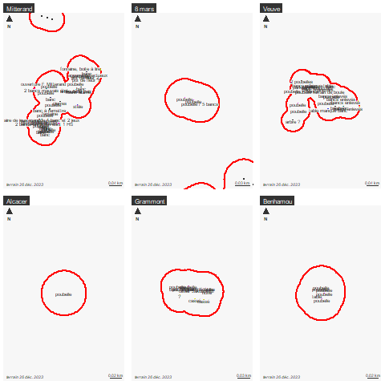

```{r setup, include=FALSE}
knitr::opts_chunk$set(echo = TRUE)
knitr::opts_chunk$set(cache = TRUE)
# Passer la valeur suivante à TRUE pour reproduire les extractions.
knitr::opts_chunk$set(eval = FALSE)
knitr::opts_chunk$set(warning = FALSE)
```


# Objet

saisie mobilier parcs et jardins (bancs et poubelles), faire correspondre aux photos.

81 wp et 43 photos


# Environnement


## Librairies


```{r , eval=TRUE}
#(dplyr)
#library(ggplot2)
library(leaflet)
library(leafpop)
#library(lubridate)
#library(purrr)
#library(readr)
library(sf)
library(mapsf)
#library(tibble)
#library(tidyr)
library(exiftoolr) # metadonnées photo
```


## Chemins


```{r}
chemin <-"C:/Users/bmaranget/Documents/03_SIG/03_03_Data/08_VOIRIE/mobilierUrbain/"
chPH <- "C:/Users/bmaranget/Documents/03_SIG/03_03_Data/05_PHOTOS/parc/"
```


## Pb projection


```{r}
# pb variable PROJ_LIB postgis
plib <- Sys.getenv("PROJ_LIB")
prj <- system.file("proj", package = "sf")[1]
Sys.setenv("PROJ_LIB" = prj)
Sys.getenv("PROJ_LIB")
# and perhaps set it back when done so that you can use Postgres
# Sys.setenv("PROJ_LIB" = plib)
# https://github.com/rspatial/terra/issues/1378
sf:::CPL_set_data_dir("/usr/local/share/proj")
rgdal::OSRS()
PROJSearchPaths() 
# réinstallation sf ? remove.packages(sf)
```


# Données


## Les waypoints

On récupère les waypoints (la 1e couche par défaut) uniquement

```{r}
st_layers("../data/mobParc.gpkg")
# la couche a été retravaillé sous QGIS
wp <- st_read("../data/mobParc.gpkg", "wp")
# suppression altitude
wp <- st_zm(wp,drop = T)
st_write(wp, "../data/mobParc.gpkg", "wp", append = F)
```


### Carto

```{r}
mf_init(wp)
mf_map(wp, add = T)
mf_label(wp, var ="cmt", overlap = F , halo = T, cex = 1)
mf_layout("Points GPS mobilier parcs", "recup 26 déc. 2023")
```


Identifier les zones par la densité des points


```{r}
zone <- st_union(st_buffer(wp, 40))
mf_map(zone)
mf_map(wp, add = T)
mf_layout("Récupération des zones par zone tampon", "recup 26 déc. 2023")
```

Eclatement zone et mise en forme


st_split n'existe plus sous sf mais non nécessaire puisque qu'on utilise CAST
et st_split sur modèle split (il faut un découpant)

```{r}
split <- st_cast(zone, "POLYGON")
split <- st_as_sf(split)
split$fid <- seq(1,6)
nom <- c("Mitterand", "8 mars", "Veuve", "Alcacer", "Grammont", "Benhamou")
split$nom <- nom
mf_map(split)
mf_label(split, var = "nom", halo = T)
st_write(split, "../data/mobParc.gpkg", "parcs", append = T)
```


```{r}
inter <- st_intersection(wp, split)
class(inter)
table(inter$nom)
```


Carto par zone


```{r}
png("../img/parcs.png")
par(mfrow = c(2,3))
for (n in nom){
  s <- inter [inter$nom == n,]
  # le zoom pour voir la frontière
  zoom <- st_buffer(st_centroid(s), 100)
  mf_init(zoom)
  mf_map(wp, add = T)
  mf_map(split, add = T, col = NA, border="red", lwd = 2)
  mf_label(s, var="cmt", halo = T)
  mf_layout(unique(s$nom), "terrain 26 déc. 2023")
}
dev.off()
```




## Photos


```{r}
chPH
photo <- list.files(path.expand(chPH), pattern = "*.JPG")
```


## Récup métadonnées photo

```{r}
lireMeta <- function(fic){
  exif_read(path.expand(paste0(chPH, fic)))
} 
photoMeta <- lireMeta(photo)
names(photoMeta)
photoMeta$FileModifyDate # c'est le modify date
photoMeta$FileAccessDate
photoMeta$FileCreateDate
photoMeta <- photoMeta [, c("FileModifyDate", "SourceFile")]
photoMeta
#install_exiftool()
write.csv(photoMeta,"../data/photoMeta.csv", fileEncoding = "UTF-8", row.names = F)
```

remarque : correspondance rownum et nom photo dans source photo


attention les métadonnées ont changé il faut reprendre celle du .csv

# Correspondance photo waypoints

Time zone pour les deux appareils automatique donc CET

Comme il s'agit d'heure/mn/s, il faut utiliser les formats POSIXct (calendar time)

L'appareil photo non réglé : différence de 1 h 03 mn

## Test sur une photo précise prise à 10 h 51 

Il pourrait ensuite suffire d'aligner les photos mais c'est plus sûr mais comme le nombre est différent.

```{r}
wp
# le joli pot de fleur
WPpotFleur <- wp$time [wp$name == "092"]
WPpotFleur
# 9 h 49
str(photoMeta$FileModifyDate)
# c'est du chr
WPpotFleur <-  WPpotFleur + 3720
class(WPpotFleur)
# c'est du posix en natif 
# rajout d'une heure (3600 secondes) + 2 mn
# l'appareil photo est en CET également (automatique)
# ms il faut préciser le format
photoMeta$FileModifyDateCET  <- as.POSIXct(photoMeta$FileModifyDate, format="%Y:%m:%d %H:%M:%S", tz = "CET")
class(photoMeta$FileModifyDateCET)
# on cherche la différence minimum avec la photo
ind <- (which.min(abs(difftime(WPpotFleur, photoMeta$FileModifyDateCET))))
ind
photoMeta [ind,]
# Il s'agit bien de la photo 8
```

Cela fonctionne pour une photo, on le fait pour toutes les photos


modif tps pour tous les points wp

```{r}
wp$time2 <- wp$time + 3720
# verif format
class(wp$time2)
```


```{r}
p <- photoMeta$FileModifyDateCET [1]
str(photoMeta)
photoMeta <- read.csv("../data/photoMeta.csv")
photoMeta$FileModifyDateCET  <- as.POSIXct(photoMeta$FileModifyDate, format="%Y:%m:%d %H:%M:%S", tz = "CET")
str(photoMeta)
# pour éviter d'utiliser deux fois la même photo, on va supprimer les
# photos au fur et à mesure
photoMetaBoucle <- photoMeta
wp$timePhoto <- NA
for (p in photoMeta$FileModifyDateCET){
  # c'est une heure
  # indice de ligne du vecteur de difference de tmps entre les deux prise
  print(abs(difftime(p,wp$time2)))
  tmp <- which.min(abs(difftime(p,wp$time2)))
  #matrice <- rbind(matrice, as.vector(tmp))
  print(tmp)
  # c'est à dire lg photo
  # on récupère l'heure de la photo ds la table des wp
  if (is.na (wp$timePhoto [tmp])){
    wp$timePhoto [tmp] <- p
  } else {
    # on rajoute un pt 
    tmp2 <- length (wp$timePhoto)+1
    wp <- rbind(wp , wp[tmp,])
    wp$timePhoto [tmp2] <- p
  }
  # pour éviter que la photo soit reprise, on supprime la photo
  photoMetaBoucle <- photoMetaBoucle [-tmp,]
}
length(wp$timePhoto[!is.na(wp$timePhoto)])
# il y a bien 43 photos
```


Jointure

```{r}
photoMeta$timePhoto <-  as.numeric(photoMeta$FileModifyDateCET)
photoMeta$timePhoto
joint <- merge(wp, photoMeta, all.x = T,by = "timePhoto")
# verif
table(joint$SourceFile, useNA = "always")
joint
```

Rajout d'un ID en fonction du pt

Il suffit d'ordonner l'export crée un fid


```{r}
joint <- joint [order(joint$time2),]
```


Enregistrement

```{r}
names(joint)
st_write(joint [, c("time2", "SourceFile", "name", "cmt")],"../data/mobParc.gpkg", "photo", append = F)
```


# Leaflet


Il s'agit maintenant de récupérer les photos et de projeter en leaflet


pour mémoire, les photos sont dans SourceFiles


Icone appareil photo

```{r}
curl::curl_download(url = "https://marionlouveaux.fr/blog/2020-10-24_gpx_tracks_and_leaflet_map/240px-Icone_appareil_photo.png",
                    destfile = "../img/240px-Icone_appareil_photo.png")
```

```{r, eval=TRUE}
cameraIcon <- iconList(makeIcon("../img/240px-Icone_appareil_photo.png", iconWidth = 30))
data <- st_read("../data/mobParc.gpkg", "2m")
data <- st_transform(data, crs = 4326)
leaflet() %>%
  addProviderTiles("OpenStreetMap.France") %>%
  addMarkers(data = data, label = ~name, group = "photos", icon = ~cameraIcon) %>%
  addPopupImages(data$chemin, group = "photos", width = 500) 
```

