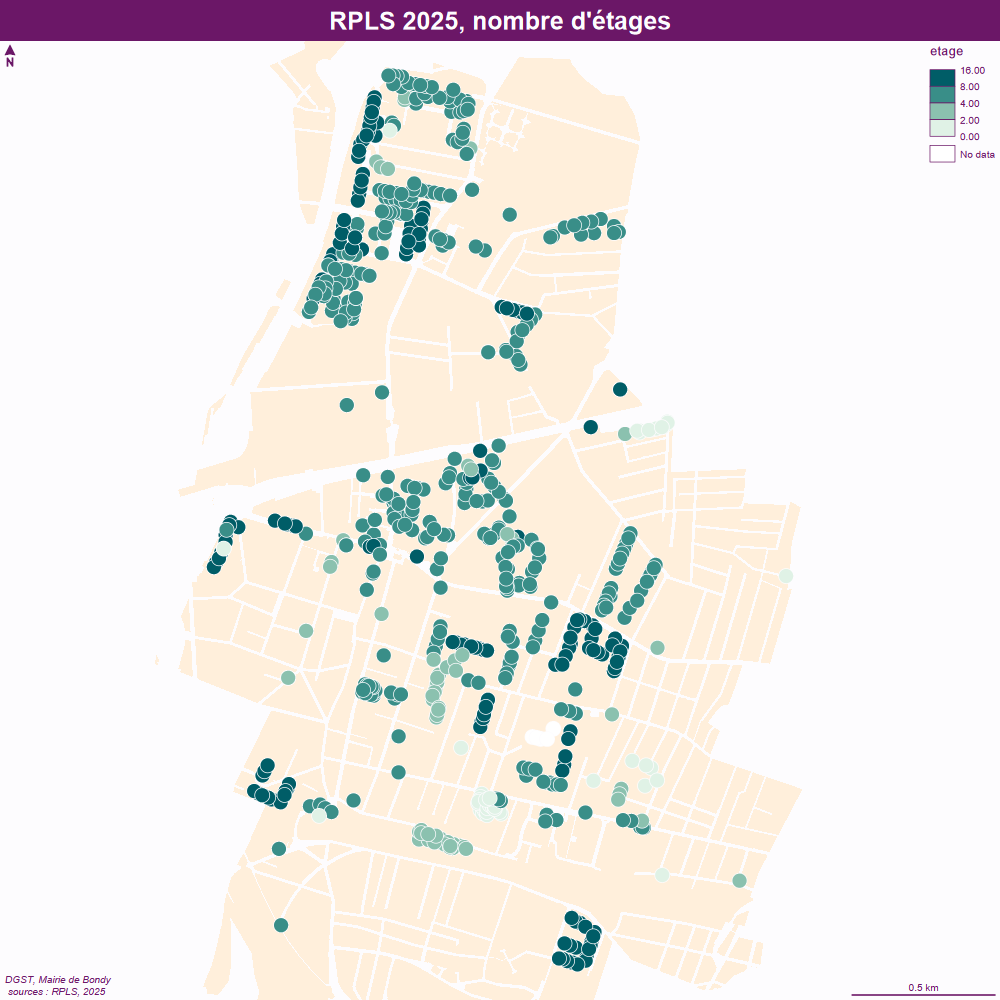

```{r setup, include=FALSE}
knitr::opts_chunk$set(echo = FALSE)
knitr::opts_chunk$set(cache = TRUE)
# Passer la valeur suivante à TRUE pour reproduire les extractions.
knitr::opts_chunk$set(eval = TRUE)
knitr::opts_chunk$set(warning = FALSE)
```


# Objet

La Direction de l'Habitat cherche à avoir quelques chiffres repères sur Bondy.

3 sources principales sont consultées :


- [ANCT Observatoire des territoires](https://www.observatoire-des-territoires.gouv.fr/outils/cartographie-interactive/#view=map76&c=indicator)

- INSEE enquête filosofi insee déclinée en fichier [Niveau de vie médian et taux de pauvreté par statut d'occupation du logement](https://catalogue-donnees.insee.fr/fr/catalogue/recherche/DS_FILOSOFI_LOG_TP_NIVVIE)

- [RPLS](https://www.data.gouv.fr/datasets/donnees-detaillees-au-logement-du-repertoire-des-logements-locatifs-des-bailleurs-sociaux-rpls) (producteur SDES *Service des données et études statistiques* sur data.gouv)


De façon complémentaire :

- [Insee démographie](https://www.insee.fr/fr/statistiques/3698339#consulter)

- [Drihl, Direction Régionalee et Interdépartementale de l'Hébergement et du Logement](https://data-drihl.developpement-durable.gouv.fr/#c=indicator&i=lls_rpls_caract.lls_plai&s=2025&view=map2)


- [Ma demande de logement social](https://www.demande-logement-social.gouv.fr/index)

```{r}
suppressPackageStartupMessages(library(sf))
library(mapsf)
chemin <- "Q:/GEOMATIQUE/habitat 2026/recherche data Mars/"
chemin2 <- "C:/Users/bmaranget/Documents/03_SIG/03_03_Data/10_HABITAT/"
```


# Population totale

## Evolution : chiffres insee


Il existe une tendance à la baisse depuis 2019 (de 55 000 à 50 000 environ).

```{r}
popInsee <- read.csv("../data/populationEvol.csv")
barplot(popInsee$nb, names.arg = popInsee$année, las = 2, col = "white", main = "Evolution population Bondy (1876 - 2023)", cex.names = 0.8)
popInsee <- popInsee [popInsee$année > 2016,]
barplot((popInsee$nb), names.arg = popInsee$année, las = 2, col = "white", main = "Evolution population Bondy à partir 2017", ylim = c(50000,55000))
knitr::kable(popInsee)
```


## Ril 2025

Le ril (Répertoire Immeuble Localisé) indique le nombre d'habitats, même en multipliant par 2, le chiffre obtenu est supérieur aux chiffres insee.


```{r}
ril <- st_read("../data/ril.gpkg", "ril2025", quiet=T)
knitr::kable(head(st_drop_geometry(ril)))
pop <- ril$nombre_logements*2
sum(pop, na.rm = T)
```


A appprondir, pourquoi l'estimation à partir du RIL donne plus d'habitants que le chiffre INSEE de 2023 ?


# Indicateurs sociaux globaux


## Seuil de pauvreté

```{r}
seuil <- read.csv2(paste0(chemin, "DS_FILOSOFI_LOG_TP_NIVVIE.csv"))
seuil <- seuil [seuil$GEO == 93010, c("Mesures.filosofi","Valeur")]
knitr::kable(seuil, row.names = F)
```


## Logements sociaux




Nb de logements sociaux


```{r}
rpls <- st_read("../data/RPLS.gpkg", "rpls2025", quiet = T)
sum(rpls$appartement)
knitr::kable(table(rpls$etage), col.names = c("Nb étages", "Nb immeubles"))
```

A noter, Marx Dormoy / ZAC de l'Ourcq / Sablière / allée Laffargue


# Typologie occupation logements

En pourcentage du nb de logement total


```{r}
typo <- read.csv2(paste0(chemin, "anct.csv"), skip = 2, dec = ".", na.strings =  "N/A - résultat non disponible")
typo <- typo [typo$Code == 93010,]
names(typo) <- c("code", "ville", "HLM", "RPLS 2023", "RP 2022", "Locataires 2022", "nb lgts 2022",  "vacants 2 ans +", "vacants", "proprio 2022", "APL", "neuf 2020 24")
typoPct <- round((typo [, c(3:6,8:12)]/ typo$`nb lgts 2022`)*100,0)
knitr::kable(typo  [,c("proprio 2022", "Locataires 2022", "HLM", "RPLS 2023", "RP 2022", "vacants", "vacants 2 ans +", "nb lgts 2022")], row.names = F)
knitr::kable(typoPct [,c("proprio 2022", "Locataires 2022", "HLM", "RPLS 2023", "RP 2022", "vacants", "vacants 2 ans +")], row.names = F)
```


# Disparités territoriales

Croisement de deux sources Insee Filosofi (tx pauvreté) et ANCT (rpls)

% de logement social / % de la population sous le seuil de pauvreté

Plus le chiffre est élevé, plus l'offre en logement social répond aux besoins de la taille de la population modeste.

```{r}
choix <- c(93006, 93063, 93061, 93010)
anct <- read.csv(paste0(chemin, "anctExport.csv"))
filo <- read.csv2(paste0(chemin, "DS_FILOSOFI_LOG_TP_NIVVIE.csv"))
```


```{r, eval=FALSE}
# vérif tt logement tx pauvreté anct
table(filo$Statut.d.occupation.du.logement)
table(filo$Mesures.filosofi)
```


```{r}
# filtre sur les communes
filo <- filo [filo$GEO %in% choix, c("Géographie","Valeur")]
rplsPct <- round((anct [2, c(2:5)] / anct [5,c(2:5)])*100,0)
```


```{r}
names(filo) <- c("ville", "tx Pauvreté")
anct <- data.frame(rpls = t(rplsPct), ville = rownames(t(rplsPct)))
names(anct) [1] <- "rpls"
filo$ville <-gsub("\\-", " ", filo$ville)
anct$ville <- gsub("\\.", " ", anct$ville)
jointure <- merge(filo, anct, by = "ville", all.x = T)
knitr::kable(jointure, row.names = F)
jointure$rapport  <- round(jointure$`tx Pauvreté` / jointure$rpls *100 ,0)
knitr::kable (jointure [, c("ville", "rapport")])

```


Cartographie


```{r}
#st_layers("../data/limitesSocle.gpkg")
ept <- st_read("../data/limitesSocle.gpkg", "communesEPT", quiet = T)
st_crs(ept) <- 2154
ept$ville <- gsub("\\-", " ", ept$nom)
joint <- merge(ept, jointure, by ="ville" )
mf_map(ept, col = "cornsilk2", border = NA)
mf_map(type = "choro", joint, var = "rapport", pal = "RedOr", add = T, leg_pos = "right", border = NA)
mf_label(joint, "ville", halo = T)
mf_layout("Rapport tx logement social sur tx pauvreté", "Insee 2022, Anct 2023\nAvril 2026\nMairie de Bondy")
```


# Traitement des demandes de logement social


## Nombre de demandes

```{r}
nbDemande <- read.csv(paste0(chemin, "nb demandes.csv"))
print(paste0(sum(nbDemande$attente), " demandes en attente sur Bondy") )
```


drihl


```{r}
drihl <- read.csv2(paste0(chemin, "drihl.csv"), skip = 2, dec = ".", na.strings =  c("N/A - secret statistique","N/A - résultat non disponible"))
drihl <- drihl [drihl$Code == 93010,]
print(paste0("Délai médian d'attribution 2024 : ", drihl$Délais.médian.d.attribution.2024))
```


% demandeurs en PLAI


## PLAI

Pas de donnée pour les dossiers en attente, dans le RPLS, la variable CUS = 11 indique le nombre de PLAI sur le parc social


```{r}
rpls2025 <- read.csv2(paste0(chemin2, "rpls2025.csv"), dec = ".", skip = 1)
table(rpls2025$CUS, useNA = "always")
rpls2025<- rpls2025 [!is.na(rpls2025$X),]
rpls2025 <- st_as_sf(rpls2025, coords = c("X", "Y"), crs = 2154)
rplsCUS <- rpls2025 [!is.na(rpls2025$CUS),]
mf_map(rpls2025)
mf_map(rplsCUS, type = "typo", var = "CUS", pch = 20, add = T)
mf_layout("RPLS 2025, pas de PLAI, manque de CUS", "RPLS 2025\nSDES")
```

CUS 10 = PLA d'intégration

CUS 13 = 13.PLUS

CUS 14 = PLS / PPLS / PLA CFF

CUS 16 = 16.PLI


Sur le site de la Drihl Ile de France, il existe des chiffres sur le financement initial.


```{r}

print(paste0("Nb de plai 2025 : ", drihl$Nombre.de.PLAI.2025))
```


## DALO

### Au département


```{r}
dalo <- read.csv2(paste0(chemin, "dalo.csv"), fileEncoding = "latin1")
dalo [dalo$dpt == "Seine St Denis",]
```

### Sur Bondy, la drihl


```{r}
print(paste0("Nb d'attributions DALO 2024 : ", drihl$Nombre.des.attributions.aux.ménages.Dalo.2024))
```


## Logement indigne (au dpt)


### Au dpt

```{r}
indigne <- read.csv2(paste0(chemin, "logement-indigne-indecent-france-entiere.csv"))
indigne <- indigne [indigne$Code.INSEE.département == '93',]
table(indigne$Libellé.du.type.d.action)
barplot(table(indigne$année.d.entrée.dans.l.observatoire), cex.names = 0.5, las = 2, col = "white",
        main = "Nb de logements indignes recensés par an en Seine St Denis")
```

Pas de donnée sur Bondy, quel est le cheminement des arrêtés de péril ?


### Copro aidées  (rnic)

```{r, eval=FALSE}
rnic <- read.csv("../data/gros/rnc-data-gouv-with-qpv.csv")
rnic <- rnic [rnic$commune == 93010,]
write.csv(rnic, "../data/rnic.csv")
```


```{r}
rnic <- read.csv("../data/rnic.csv") 
rnic <- st_as_sf(rnic, coords = c("long", "lat"), crs = 4326)
st_write(rnic, "../data/habitat.gpkg", "rnic", delete_layer = T)
pb <- rnic [rnic$copro_aidee == 'Oui', c("nom_d_usage_de_la_copropriete", "nombre_total_de_lots" )]
knitr::kable(st_drop_geometry(pb), row.names = F)
mf_map(rnic)
mf_map(pb, add = T, type = "prop", var = "nombre_total_de_lots", border = NA)
mf_label(pb, var = "nom_d_usage_de_la_copropriete", halo = T, overlap = F)
mf_layout("Copro aidées et nb de lots", "RNIC 2026")
```


