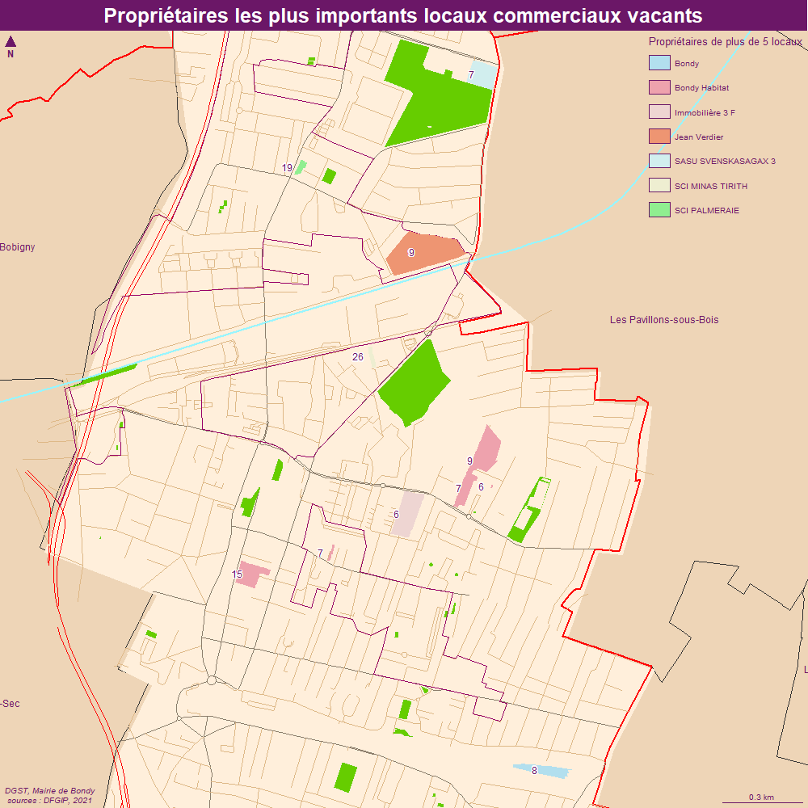
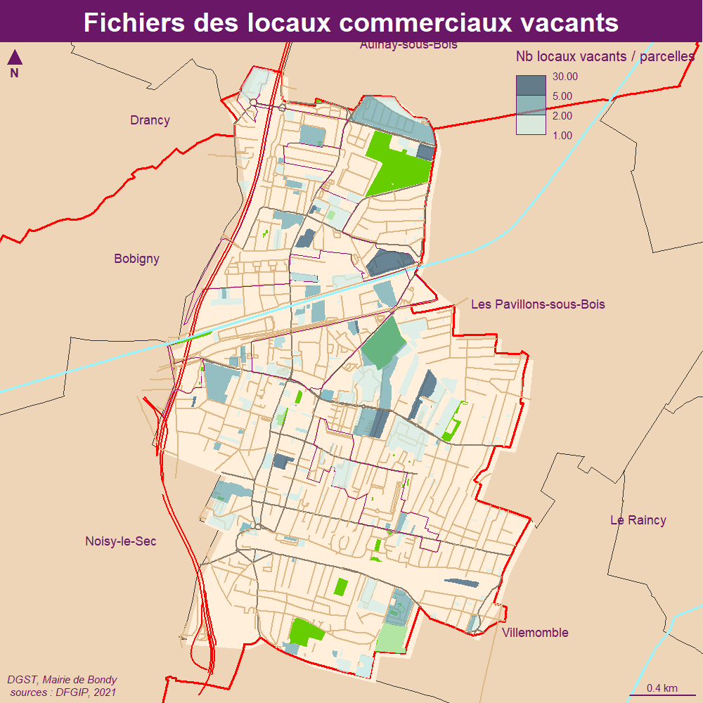
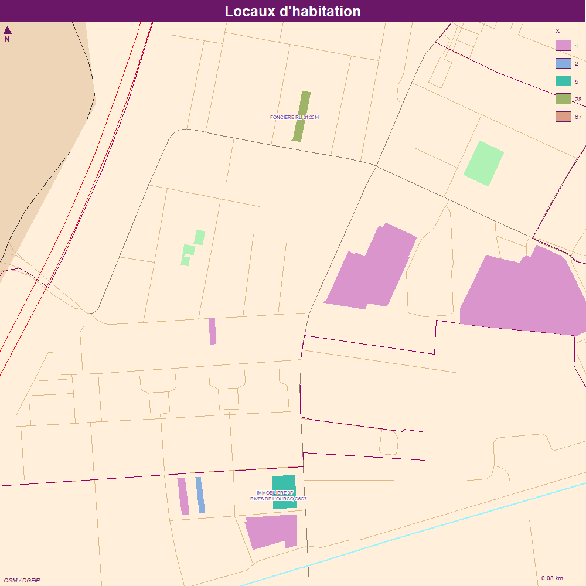
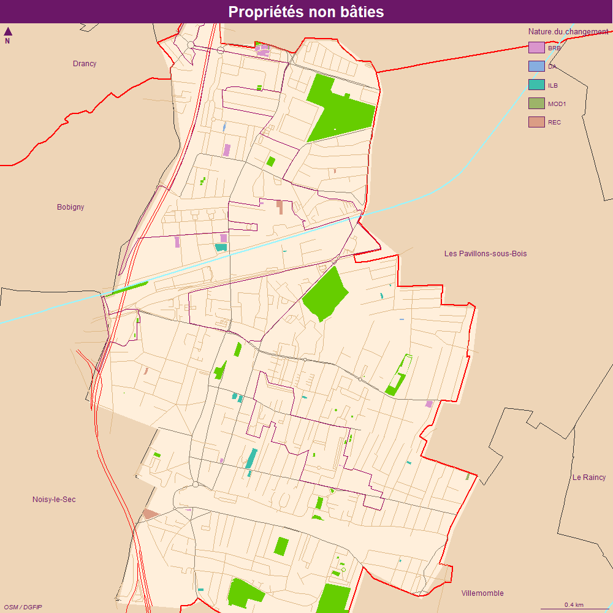

```{r setup, include=FALSE}
knitr::opts_chunk$set(echo = TRUE)
knitr::opts_chunk$set(cache = TRUE)
# Passer la valeur suivante à TRUE pour reproduire les extractions.
knitr::opts_chunk$set(eval = FALSE)
knitr::opts_chunk$set(warning = FALSE)
```


# Objet

3 fichiers récupérés

-	Fichier des locaux commerciaux vacants 2021         
-	Fichier des locaux d’habitation          
-	Liste des parcelles (non bâti)


```{r}
library(sf)
library(mapsf)
```


# Chemin data


```{r, eval = T}
# on reprend variable HOME en fonction PC
rep <- Sys.getenv("HOME")
chemin <- paste0(rep,"/03_SIG/03_03_Data/")
```

cadastre

```{r}
cadastre <- st_read("../data/cadastre.gpkg", "proprio")
```


# Chargement des fichiers

## Locaux commerciaux vacants


```{r}
LCV <- read.csv2("../data/LOCOMVAC21_930_21930010000019_C010_22104.CSV", stringsAsFactors = F, colClasses = "character" , header = F)
str(LCV)
# attention on a enlevé une colonne (la dernière, CODE SIE) qui était problèmatique pour la lectrue du fichier
LCV <- LCV [, c(9,10,20)]
names(LCV) <- c("section", "parcelle", "proprietaire")
LCV$code <- paste0(LCV$section, LCV$parcelle)
# il y a des doublons sur le code, plusieurs locaux à la même adresse
sansDoublons <- unique(LCV$code)
# 229 points
tab <- table(LCV$code)
# étude des sup. 5
gros <- names(tab [ tab > 5])
# i exemple, rue Gaston Deferre, num porte différent
LCV$proprietaire [LCV$code %in% gros]
agg <- aggregate(LCV [, "code"], by = list (LCV$code, LCV$proprietaire), length)

agg$code
cadastre$code
names(agg) <- c("code","proprietaire", "nb")
```


## Locaux d'habitation


```{r}
LH <- read.csv2("../data/LOC_HAB22_930_21930010000019_C010_22111.CSV", stringsAsFactors = F, colClasses = "character" , header = T, skip = 3, fileEncoding = "CP1252")
# pb dernière colonne vide
# encoding Latin 1 régle sans doute le pb
head(LH)
names(table(LH$Motif.mise.a.jour))
LH$Motif.mise.a.jour
# pas de typo possible
nb1 <- 2 - sapply(LH$Sect.,nchar)
nb2 <- 3 - sapply(LH$N..plan,nchar)
nb1zero <- ifelse(nb1 > 1, "0","")
nb1zero
nb2zero <- ifelse (nb2 == "", "", "0") 
nb2zero <- ifelse (nb2 == "3", "00", )
LH$code <- paste0(LH$Sect., nb1zero, nb2zero,LH$N..plan)
# exploration
str(agg)
cadastre$code <- gsub("^ ", "", cadastre$code)
barplot(agg$x)
agg [agg$x > 3,]
cadastre$code
LH$code
data <- merge(cadastre, LH, by = "code")
agg <- aggregate(data [, "code"], by = list (code = data$code, proprio = data$Propriétaire), length)
str(agg)
# 442 liens puis 74
mf_init(agg)
mf_map(cadastre, col = "antiquewhite1", border = NA, add = T)
table(agg$code.1)
mf_map(agg, var = "code.1", type =  "typo", border= NA, add = T)
mf_label(agg [agg$code.1 > 3,], var = "proprio")
mf_layout("fichiers fonciers : mouvements sur locaux d'habitation", credits = "DGFIP, 2022\nMairie de Bondy, sept 2023")
```


## Liste parcelles non baties

```{r}
PNB <- read.csv2("../data/NON_BAT22_930_21930010000019_C010_22111.CSV", stringsAsFactors = F, colClasses = "character" ,fileEncoding = "Latin1", header = T, skip = 2)
str(PNB)
# Pas un seul fichier qui donne les parcelles de la même façon !
PNB$code <- gsub(" ","", PNB$Identifiant.de.la.parcelle)
PNB$code
agg <- aggregate(PNB [, "code"], by = list (code = PNB$code, proprio = PNB$Nom.du.propriétaire), length)
# agrégation 106 sur 105
table(PNB$Nature.du.changement)
# Il semble intéressant de cartographier la nature des 
# changements. donc on renomme PNB en agg pour faire la jointrue
agg <- PNB
```

Concernant la nature des changements, une recherche rapide sur internet n'a pas permis de trouver à quoi correspondait le code.

## Cadastre


L'identifiant est la parcelle


```{r}
cadastre <- st_read(paste0(chemin,"03_SOCLE/cadastre.sqlite"), "parcelle_info")
cadastre$code
str(cadastre)
```


# Traitements

## Jointure


```{r}
# pb d'espace
cadastre$code <- gsub(" ", "", cadastre$code)
agg$code <- gsub(" ", "", agg$code)
cadastre$code
agg$code
data <- merge (agg, cadastre, by = ("code"))
# 134 sur 267 .... pb !
# 114 sur 115 pour le LH
# 73 sir 106
class(data)
data <- st_as_sf(data)
str(data)
hist(data$x)
st_write(data, "../data/habitat.gpkg", "PNB", delete_layer = T)
```


Etude des problèmes


```{r}
# différence code entre agg et cadastre
diff <- setdiff(agg$code, cadastre$code)
# on cherche le motif dans cadastre
ind <- grep( diff [1] ,cadastre$code )
ind <- grep( "^E0" ,cadastre$code )
cadastre$code [ind]
write.csv(diff, "../data/diff.csv")
```

Uniquement 8 pb. petite vérif sur Arcopole. Efffectivement pb parcelles inconnue. il faut que je revoie ma version cadastre.


Pour les propriétés non bâties, il manque 32 parcelles sur 106, un petit tiers.

```{r}
32/106
```


# Cartographie


## Fond OSM ?

```{r}
library(maptiles)
osm <- get_tiles(data, zoom = 15, crop = T)
library(leaflet)
```

Le fond OSM ne correspond vraiment pas.
On reprend le fond créé.


## LCV


### Etiquettes

```{r}
data <- st_read("../data/habitat.gpkg", "LCV")
etik <- data [ data$nb > 5,]
# on agrège
etikAgg <- aggregate(etik, by = list(etik$proprietaire.x), mean)
etikAgg$Group.1 [1:4] <- c("Bondy", "Jean Verdier", "Bondy Habitat", "Immobilière 3 F")
```

```{r}
plot(etik$geom)
mf_map(etikAgg, add = T)
etikBH <- st_union (etikAgg [3,])
# mise en place des connecteurs
mf_label(etikAgg, var = "Group.1", lines = TRUE, overlap = FALSE)
mf_map(etikPoly, add = T, col = "red")
```

Il faut travailler les parcelles jointes pour pouvoir afficher les connecteurs
... mais cela ne marche pas.

```{r}
etikBH <- etikAgg [3,]
etikPoly <- st_cast(etikBH, "POLYGON")
mf_map(etikBH)
mf_label(etikPoly, var = "Group.1", lines = TRUE, overlap = TRUE)
mf_label(etikBH, var = "Group.1", lines = TRUE, overlap = FALSE)
mf_label(etikBH, var = "Group.1", lines = TRUE, overlap = TRUE)
mf_label(etikBH, var = "Group.1", lines = TRUE, overlap = FALSE, pos = 2, offset = 15)
etikPoly
```
### Propriétaires les plus importants


Histo des proprio les plus importants pour combler absence d'étiquettes

```{r}
str(base)
base <- aggregate(etik [,"nb", drop = TRUE], by = list(proprio = etik$proprietaire.x), sum)
base <- base [order(base$x, decreasing = T),]
base$proprio <- c("Bondy Habitat", "SCI Minas Tirith", "SCI Palmeraie", "Jean Verdier", "Bondy", "Sasu", "Immobilière 3F")
png("../img/LCVgros.png")
par(mar = c(8,4,4,4))
barplot(base$x, names.arg = base$proprio, cex.names = 0.8, las = 2, col = "lightblue3", border = NA, main = "Propriétaires de logements vacants")
dev.off()
```

pour l'inset il faut garder le data ?

```{r}
barplot(data$nb[data$nb > 5, drop = T], names.arg = data$proprietaire.x [data$nb > 5], las = 2)
```



```{r}
mf_export(data, width = 1000, height = 1000, res = 150, filename = "../img/LCV.png", expandBB = c(10,10,30,10))
mf_init(data)
mf_theme("candy")
fond()
#plot_tiles(osm)
#mf_map(cadastre, col = "antiquewhite1", border = NA, add = T)
mf_map(data, type = "choro", pal = "Teal", nbreaks = 3, breaks = c(1,2,5,30),var = "nb", border = NA, add = T, alpha = 0.7, leg_title = "Nb locaux vacants / parcelles")
#mf_label(etik, var = "Group.1", overlap = TRUE, lines = TRUE, halo = T, pos = 2 , offset = 5 )
#• pb connecteru
#( data, pos = "right")
#par(mar = c(0,2,0,0))
#barplot(base$x, names.arg = base$proprio, cex.names = 0.8, las = 2, col = "lightblue3", border = NA)
#barplot(data$nb[data$nb > 5, drop = T], names.arg = data$proprietaire.x [data$nb > 5], las = 2, cex.names =  0.8,  col = "lightblue3", border = NA)
#mf_inset_off()
mf_layout(title = "Fichiers des locaux commerciaux vacants", 
          credits ="DGST, Mairie de Bondy\n sources : DFGIP, 2021")

dev.off()
```




### Cartographie par propriétaires


```{r}
mf_export(data, width = 1000, height = 1000, res = 100, filename = "../img/LCVgros.png", expandBB = c(10,10,30,10))
mf_init(etikAgg)
mf_theme("candy")
fond()
#plot_tiles(osm)
#mf_map(cadastre, col = "antiquewhite1", border = NA, add = T)
palette <- c("lightblue2", "lightpink2", "mistyrose2", "lightsalmon2", "lightcyan2", "lightyellow2", "palegreen2")
mf_map(etikAgg, type = "typo", var = "Group.1",  leg_title = "Propriétaires de plus de 5 locaux", pal = palette, border = NA, add = T)
mf_label(etik, var = "nb", halo = T, pos=2)
#mf_label(etik, var = "Group.1", overlap = TRUE, lines = TRUE, halo = T, pos = 2 , offset = 5 )
#• pb connecteru
#( data, pos = "right")
#par(mar = c(0,2,0,0))
#barplot(base$x, names.arg = base$proprio, cex.names = 0.8, las = 2, col = "lightblue3", border = NA)
#barplot(data$nb[data$nb > 5, drop = T], names.arg = data$proprietaire.x [data$nb > 5], las = 2, cex.names =  0.8,  col = "lightblue3", border = NA)
#mf_inset_off()
mf_layout(title = "Propriétaires les plus importants locaux commerciaux vacants", 
          credits ="DGST, Mairie de Bondy\n sources : DFGIP, 2021")

dev.off()
etikAgg
base
data
```


## Carto LH

### Etiquettes

```{r}
etik <- data [ data$x > 3,]
etik
```

### zoom

on zoome sur le nord

```{r}
pt <- data [data$x > 4,]
zone <- st_buffer(st_centroid(pt), 100)
```


```{r}
mf_export(data, width = 1000, height = 1000, res = 100, filename = "../img/LH.png", expandBB = c(10,10,30,10))
mf_init(zone, theme = "candy")
fond()
mf_map(data, type = "typo", "x", add = T, border = NA)
mf_label(etik, "proprio", overlap = F, lines = T, halo = T, cex = 0.5)
mf_layout(title = "Locaux d'habitation", credits = "OSM / DGFIP" )
dev.off()
```

Attention, pour les 67 et 28 il s'agit de la même parcelle...




## Carto PNB

```{r}
mf_export(data, width = 1000, height = 1000, res = 100, filename = "../img/PNB.png", expandBB = c(10,10,30,10))
mf_init(data, theme = "candy")
fond()
mf_map(data, type = "typo", "Nature.du.changement", add = T, border = NA)
mf_layout(title = "Propriétés non bâties", credits = "OSM / DGFIP" )
dev.off()
```

