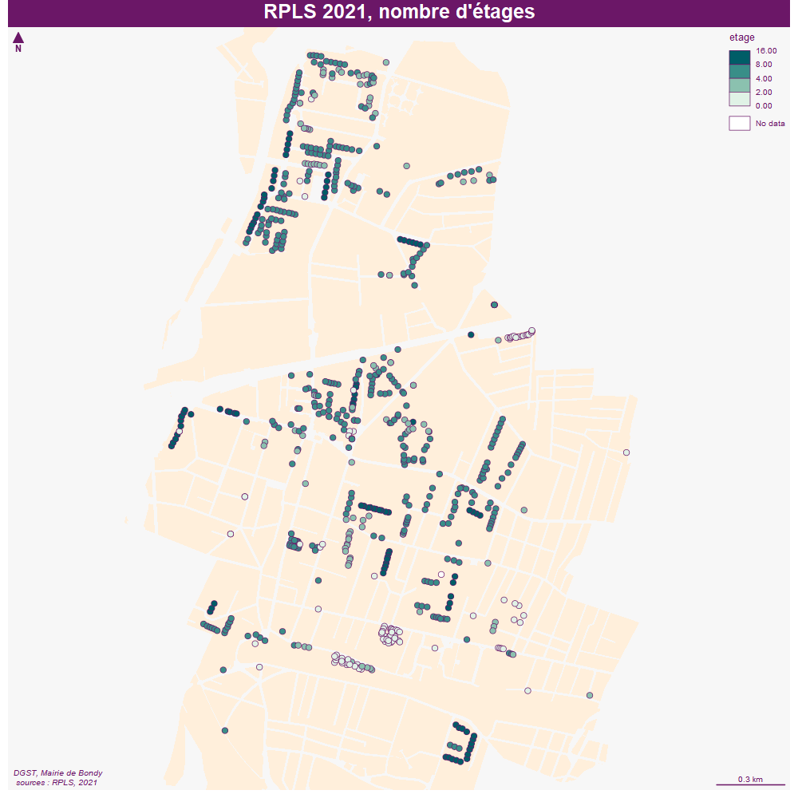
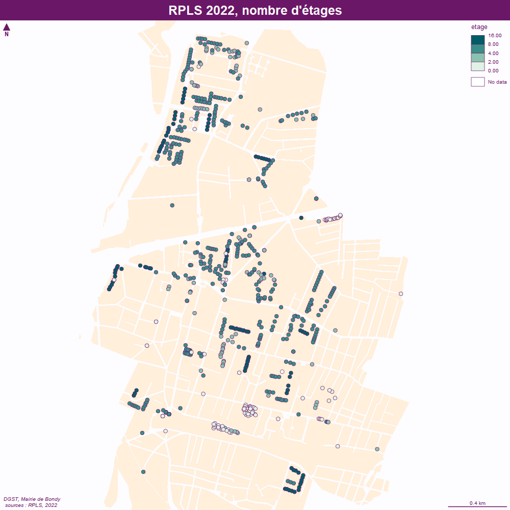
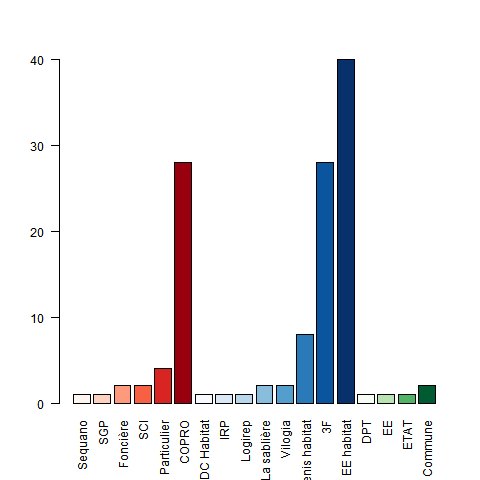

```{r setup, include=FALSE}
knitr::opts_chunk$set(echo = TRUE)
knitr::opts_chunk$set(cache = TRUE)
# Passer la valeur suivante à TRUE pour reproduire les extractions.
knitr::opts_chunk$set(eval = FALSE)
knitr::opts_chunk$set(warning = FALSE)
```


# Objet

exploitation du fichier RPLs détaillé récupéré auprès de L'équipe RPLS
SDES/SDSLC/BSOLL
Commissariat Général au Développement Durable

	RPLS-MOA - CGDD/SDES/SDSLC/BSOLL emis par TAILLEUR Delphine - CGDD/SDES/SDSLC/BSOLL <rpls-moa.bsoll.sdslc.sdes.cgdd@developpement-durable.gouv.fr> 
	
	en août 2022


carto bailleurs et parcellaires pour Zem en août 2023

analyse du rpls 2023


```{r}
library(sf)
library(mapsf)
```


# Chemin data


```{r, eval = T}
# on reprend variable HOME en fonction PC
rep <- Sys.getenv("HOME")
chemin <- paste0(rep,"/03_SIG/03_03_Data/10_HABITAT/")
```


# Chargement des fichiers

Il y a un premier fichier en opendata, et l'autre comportant le nom des bailleurs.


```{r}
RPLS <- read.csv2(paste0(chemin,"RPLS2019_detail_IDF_DEP_93.csv"), 
                  #fileEncoding = 'UTF-8', 
                  stringsAsFactors = F,  header = T)
RPLS <- RPLS [RPLS$CODEPOSTAL == 93140,]
str(RPLS)
```

9390 pts


Pour 2023 (=données 2022), un seul fichier de 3 G°


```{r}
rpls2022 <- read.csv2("C:/Users/bmaranget/Downloads/RPLS-Donnees-detaillees-au-1er-janvier-2022.2022-01(1).csv")
str(rpls2022)
rpls2022Bondy <- rpls2022 [rpls2022$Code.Postal == '93140',]
write.csv(rpls2022Bondy, "../data/rpls2022.csv")
```

9605 pts


2023

```{r}
rpls2023 <- read.csv2(paste0(chemin, "rpls_2023_OD_GEOLOC_DiDo.csv"), skip = 3)
rpls2023 <- rpls2023 [rpls2023$CODEPOSTAL == 93140,]
```

9625 pts


Puisqu'il s'agit de traiter pl fichiers, on va tout mettre en fonctions ?

```{r}
fic <- rpls2023
names(fic)
head(fic)
# vérifcation pour le nb d'étages et le nb de voies
verif <- function(fic) {
  ind <- grep("NOMVOIE",names(fic))
  # on suppose que le nom voie sera tjrs en 2e position
  ind <- names(fic)[ind]
  tab <- table(fic[,ind], useNA = "always")
  ind <- grep("ETAGE", names(fic), ignore.case = T)
  tab1<- table(fic[,ind], useNA = "always")
  return(list(tab,tab1))
}
res <- verif(fic)
res
# nb de voie
par(mar = c(0,12,0,2))
barplot(res [[1]], las = 2, horiz = T, cex.names = 0.3, main = "nb lgts sociaux par rue")
df <- as.data.frame(res [[1]])
summary(df)
df <- df [df$Freq > 50,]
barplot(df$Freq, las = 2, horiz = T, names = df$Var1, main = "nb lgts sociaux par rue > 50", cex.names = 0.5)
agg <- function(fic){
  ind <- grep("ETAGE", names(fic), ignore.case = T)
    # cellules vides et RC à zéro
fic [, ind] <-  gsub("00|RC", "0", fic [,ind])
# traitement des cellules vides
ind2 <- which(fic [,ind]=="")
fic [ind2, ind] <- "0"
fic [,ind] <- as.integer(fic[,ind])
# creation de la clé num et nom voie
cle <- grep("nomvoie", names(fic), ignore.case = T)
fic$cle <- sapply(rbind(fic [, cle]), paste0)
head(fic$cle)
# agg etage
aggEtageMax <- aggregate(fic [, ind], by = list(fic$cle), max)
aggNbAppart <- aggregate(fic$cle, by = list(fic$cle), length)
# jointure
joint <- merge(aggNbAppart, aggEtageMax, by = "Group.1")
names(joint) <- c("cle", "appartement", "etage")
geo <- unique( fic [,c("cle",   "CONSTRUCT" ,"X", "Y") ])
joint2 <- merge(joint, geo, by ="cle")
#data <- st_transform(data, crs = 2154)
data <- st_as_sf(joint2, 
                 coords = c(x = "Coordonnée.X", y = "Coordonnée.Y"), 
                 crs = 2154)
return(data)
}
rpls <- agg(rpls2023)
st_write(rpls2022, "../data/RPLS.gpkg", "rpls2022", delete_layer = T)
```


```{r}
RPLSbailleurs <- read.csv2(paste0(chemin,"rpls2021_geolocalise_loi_depcom93010.csv")
                           , fileEncoding = "latin1"
                           #, fileEncoding = "UTF-8"
                           )
#encodage latin1 attention.
tab <- table(RPLSbailleurs$NOMVOIE, useNA = "always")
names(tab)
# au niveau des étages, verif. 
tab <- table(RPLSbailleurs$ETAGE)
barplot(tab, las =2, main = "nb d'appartements par étage")
# 9649 pts, il vaut mieux travailler sans l'encodage car nb  voies diffèreent
# meme nb de voies, 
# nb d'appartements par étage.
str(RPLSbailleurs)
tab <- table(RPLSbailleurs$RS, useNA = "always")
# l'encodage n'a pas fonctionné, on le fait à la main.
RPLSbailleurs$RS <- gsub("é", "é", RPLSbailleurs$RS)
RPLSbailleurs$RS <- gsub("è", "è", RPLSbailleurs$RS)
RPLSbailleurs$RS <- gsub("Ã\u008e", "I", RPLSbailleurs$RS)
par(mar = c(15,4,4,4))
barplot(tab, las = 2)
# recodage : bcp de petits bailleurs
noms <- names(tab)[tab<200] 
noms
RPLSbailleurs$type <- ""
RPLSbailleurs$type [RPLSbailleurs$RS %in% noms] <- "Petits bailleurs < 200" 
noms <- names(tab)[tab>200] 
noms
RPLSbailleurs$type <- ifelse(RPLSbailleurs$type == "", RPLSbailleurs$RS, RPLSbailleurs$type)
tab <- sort(table(RPLSbailleurs$type))
barplot((tab), names.arg = names((tab)) , las = 2)
# On enlève OPH Bondy pour voir répartition autres bailleurs
tab <- tab [-7]
```


# Agrégation par immeuble


```{r}
RPLS <- RPLSbailleurs
table(RPLS$type)
# cle sur l'adresse
RPLS$cle <- paste0(RPLS$NUMVOIE, RPLS$TYPVOIE, RPLS$NOMVOIE)
aggNbAppart <- aggregate(RPLS$cle, by = list(RPLS$cle), length)
```


# Etage le plus haut


```{r}
aggEtageMax <- aggregate(RPLS$ETAGE, by = list(RPLS$cle), max)
table(aggEtageMax$x)
```

un seul appt au 15e ?

attention le champs n'est pas numérique !


```{r}
str(RPLS$ETAGE)
tab <- table(RPLS$ETAGE)
tab
names(tab)
# cellules vides et RC à zéro
RPLS$ETAGE <- gsub("00|RC", "0", RPLS$ETAGE)
table(etage)
# traitement des cellules vides
ind <- which(etage=="")
RPLS$ETAGE [ind] <- "0"
RPLS$ETAGE <- as.integer(RPLS$ETAGE)
```


```{r}
aggEtageMax <- aggregate(RPLS$ETAGE, by = list(RPLS$cle), max)
table(aggEtageMax$x)
```


# jointure


```{r}
joint <- merge(aggNbAppart, aggEtageMax, by = "Group.1")
names(joint) <- c("cle", "appartement", "etage")
geo <- unique( RPLS [,c("cle", "PATRIMOINE",  "RS", "type" ,"X", "Y") ])
joint2 <- merge(joint, geo, by ="cle")
# joint2, joint une différence de 9
str(joint)
str(geo)
str(joint2)
#spatialisation
joint2
# si long lat
data <- st_as_sf(joint2, 
                 coords = c(x = "latitude", y = "longitude"), 
                 crs = 2154)
#data <- st_transform(data, crs = 2154)
data <- st_as_sf(joint2, 
                 coords = c(x = "X", y = "Y"), 
                 crs = 2154)
data$etage
plot(data$etage)
tab <- table(data$etage, useNA = "always")
```

1 logement social au dessus de la poste, nx bâtiments avec nb étages différents...arrondis à 4

7 lgts sans étage pour Bondy


Enregistrement data

```{r}
str(data)
data <- data [, c(1:6)]
st_write(data, "../data/RPLS.gpkg", "rpls2021RS", delete_layer = T)
```


# Cartographie


```{r}
st_layers("../data/RPLS.gpkg")
rpls <- st_read("../data/RPLS.gpkg", "rpls2022")
```

## Nombre d'étages

```{r}
st_layers("../data/cadastre.gpkg")
cadastre <- st_read("../data/cadastre.gpkg", "proprio")
mf_export(rpls, width = 1000, height = 1000, res = 100, filename = "../img/RPLS2022.png", expandBB = c(10,10,30,10))
mf_init(rpls)
mf_theme("candy")
mf_map(cadastre, col = "antiquewhite1", border = NA, add = T)
#plot_tiles(osm)
#mf_map(cadastre, col = "antiquewhite1", border = NA, add = T)
mf_map(rpls,  type = "choro", var = "etage", breaks = c(0,2,4,8,16), add = T)

#mf_label(etik, var = "Group.1", overlap = TRUE, lines = TRUE, halo = T, pos = 2 , offset = 5 )
#• pb connecteru
#( data, pos = "right")
#par(mar = c(0,2,0,0))
#barplot(base$x, names.arg = base$proprio, cex.names = 0.8, las = 2, col = "lightblue3", border = NA)
#barplot(data$nb[data$nb > 5, drop = T], names.arg = data$proprietaire.x [data$nb > 5], las = 2, cex.names =  0.8,  col = "lightblue3", border = NA)
#mf_inset_off()
mf_layout(title = "RPLS 2022, nombre d'étages", 
          credits ="DGST, Mairie de Bondy\n sources : RPLS, 2022")

dev.off()
```





Pas beaucoup de différence 2021 2022 sf ZAC Ourcq

## carte bailleurs

```{r}

mf_export(data, width = 1000, height = 1000, res = 100, filename = "../img/RPLSBailleurs.png", expandBB = c(10,10,40,10))
mf_init(rpls)
mf_theme("candy")
#fond()
#plot_tiles(osm)
mf_map(cadastre, col = "antiquewhite1", border = NA, add = T)
library("RColorBrewer")

mf_map(rpls,  type = "typo", var = "type", border = NA, cex = 1, add = T, pal = brewer.pal(n = 7, name = "Set2"))

#mf_label(etik, var = "Group.1", overlap = TRUE, lines = TRUE, halo = T, pos = 2 , offset = 5 )
#• pb connecteru
#( data, pos = "right")
#par(mar = c(0,2,0,0))
#barplot(base$x, names.arg = base$proprio, cex.names = 0.8, las = 2, col = "lightblue3", border = NA)
#barplot(data$nb[data$nb > 5, drop = T], names.arg = data$proprietaire.x [data$nb > 5], las = 2, cex.names =  0.8,  col = "lightblue3", border = NA)
#mf_inset_off()
mf_layout(title = "RPLS 2021, bailleurs", 
          credits ="DGST, Mairie de Bondy, août 2023\n sources : cadastre & RPLS 2021")

dev.off()
```


```{r}
table(data$type)
```


Vérifier cité sud.


# Croisement parcellaire


2 solutions : 


- st_intersects et on récupère le champs nb d'intersection

- st_intersection et on récupère la géométrie polygone


attention, la version du cadastre doit comporter un code pour chaque parcelle


```{r}
table(cadastre$code == "")
```


```{r}
i <- st_intersects(cadastre, rpls, sparse = T)
j <- sapply(i, length)
table(j)
# 6954 parcelles à enlever
cadastre$inter <- j
tmp <- cadastre [cadastre$inter != 0,] 
# verif champs vide
table(tmp$code==0)
```

126 parcelles à cartographier

```{r}
mf_map(cadastre, col="antiquewhite1", border = "wheat")
mf_map(tmp, type = "typo", var="proprio", border = NA ,leg_pos = no, add = T)
mf_layout("Propriétaires parcelles", credits = "Cadastre 2021, RPLS 2022\nMairie de Bondy, sept 2023")
```


J'ai la bonne géométrie
mais il manque l'info du rpls... donc jointure également en enlevant le pt du RPLS

Du coup la carte sera catégorisée sur le nom des propriétaires.

```{r}
tab <- table(tmp$proprio)
names(tab)
#recodage COPRO / PARTICULIER
ind <- grep("COPRO", tmp$proprio)
tmp$proprio2 [ind] <-  "COPRO"
ind <- grep("M |MME ", tmp$proprio)
tmp$proprio2 [ind] <-  "Particulier"
# extraction pour recodage
write.csv(unique(tmp [,c("proprio", "proprio2"), drop = T]), "../data/proprio.csv")
# jointure attributaire pour recodage
ref <- read.csv("../data/proprioModifie.csv")
cadastreRPLS <- merge(tmp [, c("proprio", "code")], ref, by = "proprio" ) 
```


autre solution à ne pas jouer

```{r}
inter <- st_intersection(cadastre, dataBondy)
inter <- inter [, c("proprio", "code", "RS", "type"),drop =T]

# pb NA
class(tmp)
tmp$code
tmp <- tmp [!is.na(tmp$code),]
plot(tmp)
#jointure
joint <- merge(cadastre [, c("code")],tmp, by= "code")
```


pb couleurs


un choix simple consiste à ne colorier que les parcelles et à faire un point noir.


```{r}
tab <- table(cadastreRPLS$proprio2)
# ordonner la donnée en fonction de son importance
tab <- sort(tab)
tab
# on va créer une palette bailleurs sociaux / commune ETAT / autres
write.csv(tab, "../data/proprioLeg.csv")
# suppr col 1 + rajout col type
couleur <- read.csv("../data/proprioLegModifie.csv")
couleur <- couleur [order(couleur$type),]
names(couleur) <- c("proprio2", "nb", "type")
couleur
# jointure pour clé de tri

```

6 rouges / 8 bleues / 4 gris

https://www.datanovia.com/en/fr/blog/comment-concevoir-une-belle-palette-de-couleurs-dans-r/

```{r}
library(RColorBrewer)
col2 <- colorRampPalette(brewer.pal(8, "Blues"))(8)
col1 <- colorRampPalette(brewer.pal(6, "Reds"))(6)
col3 <- colorRampPalette(brewer.pal(4, "Greens"))(4)
palette <- c(col1, col2, col3)
palette
# test couleur
png("../img/couleurProprioCadastre.png")
barplot(couleur$nb, col = palette, names.arg = couleur$proprio2, las = 2)
dev.off()
couleur$ordre <- seq(1:18)
cadastreRPLS <- merge(cadastreRPLS, couleur, by = "proprio2")
cadastreRPLS <- cadastreRPLS [order(cadastreRPLS$proprio2),]
head(cadastreRPLS)
```




```{r}
mf_export(rpls, width = 3000, height = 3000, res = 300, filename = "../img/RPLSBailleursParcelle.png", expandBB = c(10,10,60,10))
mf_init(rpls)
mf_theme("candy")
#plot_tiles(osm)
mf_map(cadastre, col = "ivory2", border = NA, add = T)
mf_map(cadastreRPLS,  type = "typo", var = "ordre", border = NA, cex = 1, add = T, pal = palette, leg_pos= NA)
mf_map(rpls, type = "prop", inches = 0.1,col = NA,var = "appartement"  , add = T)

#mf_label(etik, var = "Group.1", overlap = TRUE, lines = TRUE, halo = T, pos = 2 , offset = 5 )
#• pb connecteru
#( data, pos = "right")
#par(mar = c(0,2,0,0))
#barplot(base$x, names.arg = base$proprio, cex.names = 0.8, las = 2, col = "lightblue3", border = NA)
#barplot(data$nb[data$nb > 5, drop = T], names.arg = data$proprietaire.x [data$nb > 5], las = 2, cex.names =  0.8,  col = "lightblue3", border = NA)
#mf_inset_off()
mf_legend(type="typo", val=couleur$proprio2, pal = palette, border = NA, title = "Type de propriétaires", pos = "right", cex = 0.8)
mf_layout(title = "RPLS 2022, bailleurs", 
          credits ="DGST, Mairie de Bondy, août 2023\n sources : cadastre & RPLS 2022")

dev.off()
```


Problème au Nord et au sud, ouverture sous Qgis


```{r}
st_write(cadastreRPLS, "../data/rpls.gpkg", "bailleurParcelle2022", delete_layer = T)
```


# Modifications sur quelques points RPLS

Quelques points sont non cadastrés, on les déplace dans QGIS et on reproduit le traitement d'intersection


On peut aussi les lister en comparant les pts dans cadastre avec tous les pts


```{r}
inter <- st_intersection(rpls, cadastreRPLS)
inter
# 640  = 714 - 126
mf_theme("candy")
mf_map(rpls, col = "red")
mf_map(inter, col = "green", add = T)
mf_layout("rpls et intersection cadastre", "Mairie de Bondy\nRPLS 2022 et cadastre 2022")
diff <- setdiff(rpls$cle,  inter$cle)
rplsHorsCadastre <- rpls [rpls$cle %in% diff,]
```


```{r}
png("../img/rplsHorsParcelle.png", res = 200, width = 1200, height = 1200)
mf_theme("candy")
mf_init(rplsHorsCadastre)
mf_map(cadastre, col = "antiquewhite1", border = NA,add = T)
mf_map(rplsHorsCadastre, type = "prop", var = "appartement", col = NA)
mf_label(rplsHorsCadastre, var = "appartement", overlap = F, halo = T, cex = 0.5)
mf_layout("Logements sociaux hors parcelle", credits  = "Mairie de Bondy\nRPLS 2022 et cadastre 2022")
dev.off()
```


on fait un buffer pour intégrer les pts dans 1 parcelle

```{r}
tampon <- st_buffer(rplsHorsCadastre,4)
inter <- st_intersection(tampon, cadastre)
hors <- setdiff(tampon$cle, inter$cle)
# on ne garde que les premières intersections
ind <- grep("\\.",rownames(inter))
inter <- inter [-ind,]
mf_map(rpls [rpls$cle %in% hors,])
hors
```

Effectivement les 2 adresses restantes étaient problématiques dans la BAN

On rajoute donc les parcelles


```{r}
inter$code
cadastre$code
interParcelle <- merge(cadastre,inter [, c("cle", "appartement", "etage",      "Nom.du.Programme", "Année.de.construction", "proprio", "code"), drop = T ], by= "code")
mf_map(interParcelle)
mf_map(cadastreRPLS, add = T)
str(interParcelle)
str(cadastreRPLS)
interParcelle <- interParcelle [,c("code",   "proprio.x")]
cadastreRPLS <- cadastreRPLS [,c("code",   "proprio")]
names(interParcelle)[2] <- "proprio"
data <- rbind(interParcelle, cadastreRPLS)
```

Il faut récupérer le proprio2 et le type.

```{r}
joint <- merge(data,ref, by= "proprio")
joint2 <- merge(joint, couleur, by="proprio2")
```

on perd 198 -174 = 24 obs

```{r}
diff <- setdiff(data$proprio, joint$proprio)
write.csv(diff,"../data/diff.csv")
diff <- data.frame("proprio" = diff)
#recodage COPRO / PARTICULIER
ind <- grep("COPRO", diff$proprio)
diff$proprio2 [ind] <-  "COPRO"
ind <- grep("M |MME ", diff$proprio)
diff$proprio2 [ind] <-  "Particulier"
diff$proprio2 
diff$proprio2 [1] <- "SEQUENS"
diff$proprio2 [9] <- "SNC"
diff$proprio2 [10] <- "Batigere"
diff
# extraction pour recodage
write.csv(unique(tmp [,c("proprio", "proprio2"), drop = T]), "../data/proprio.csv")
# jointure attributaire pour recodage
ref <- read.csv("../data/proprioModifie.csv")
ref <- ref [,-1]
ref <- rbind(ref, diff)
write.csv(ref, "../data/ref.csv")
cadastreRPLS <- merge(tmp [, c("proprio", "code")], ref, by = "proprio" ) 
ref2 <- read.csv("../data/proprioLegModifie.csv")
ref2 <- rbind(ref2, c("SEQUENS", 1, "bailleur"), 
              c("Batigere", 1 , "bailleur"),
              c("SNC", 1 , "bailleur"))

```

