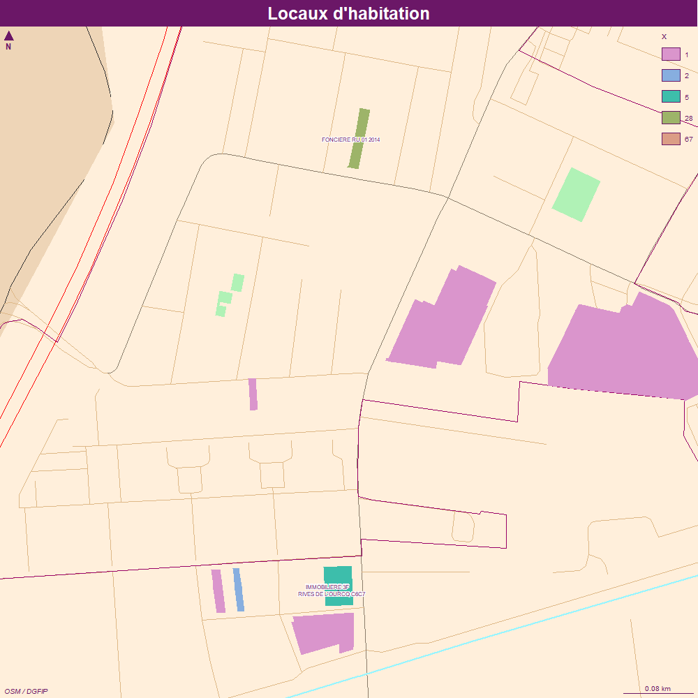
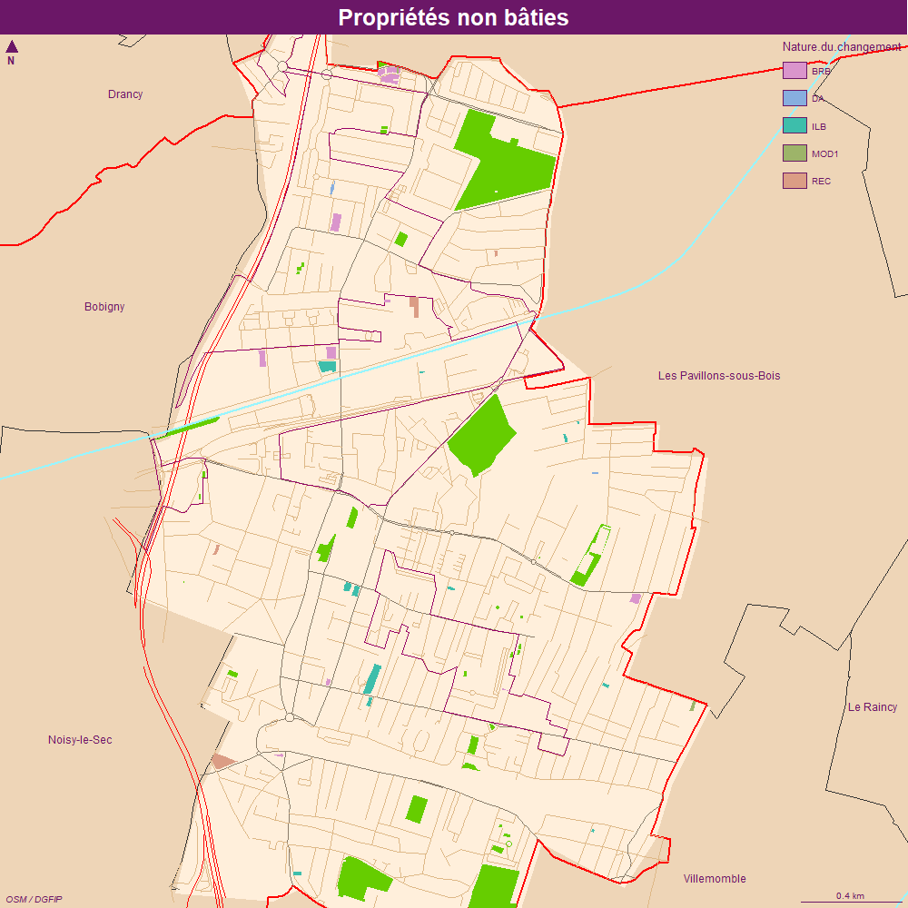

```{r setup, include=FALSE}
knitr::opts_chunk$set(echo = TRUE)
knitr::opts_chunk$set(cache = TRUE)
# Passer la valeur suivante à TRUE pour reproduire les extractions.
knitr::opts_chunk$set(eval = FALSE)
knitr::opts_chunk$set(warning = FALSE)
```


# Objet

3 fichiers récupérés

-	Fichier des locaux commerciaux vacants 2021         
-	Fichier des locaux d’habitation          
-	Liste des parcelles (non bâti)


```{r}
library(sf)
library(mapsf)
```


# Chemin data


```{r, eval = T}
# on reprend variable HOME en fonction PC
rep <- Sys.getenv("HOME")
chemin <- paste0(rep,"/03_SIG/03_03_Data/")
```


# Chargement des fichiers


```{r}
RPLS <- read.csv2("../data/RPLS2019_detail_IDF_DEP_93.csv", fileEncoding = 'UTF-8', stringsAsFactors = F,  header = T)
RPLS <- RPLS [RPLS$CODEPOSTAL == 93140,]
str(RPLS)
```


# Agrégation par immeuble


```{r}
RPLS$cle <- paste0(RPLS$NUMVOIE, RPLS$TYPVOIE, RPLS$NOMVOIE)
aggNbAppart <- aggregate(RPLS$cle, by = list(RPLS$cle), length)
RPLS
```


# Etage le plus haut


```{r}
aggEtageMax <- aggregate(RPLS$ETAGE, by = list(RPLS$cle), max)
```


# jointure


```{r}
joint <- merge(aggNbAppart, aggEtageMax, by = "Group.1")
names(joint) <- c("cle", "appartement", "etage")
geo <- unique( RPLS [,c("cle", "PATRIMOINE", "latitude", "longitude") ])
joint2 <- merge(joint, geo, by ="cle")
str(joint)
str(geo)
str(joint2)
#spatialisation
data <- st_as_sf(joint2, 
                 coords = c(x = as.numeric(joint2$latitude), y = as.numeric(joint2$longitude)), 
                 crs = 2154)
```


# Cartpgraphie


```{r}
mf_export(data, width = 1000, height = 1000, res = 100, filename = "../img/LCVgros.png", expandBB = c(10,10,30,10))
mf_init(etikAgg)
mf_theme("candy")
fond()
#plot_tiles(osm)
#mf_map(cadastre, col = "antiquewhite1", border = NA, add = T)
palette <- c("lightblue2", "lightpink2", "mistyrose2", "lightsalmon2", "lightcyan2", "lightyellow2", "palegreen2")
mf_map(etikAgg, type = "typo", var = "Group.1",  leg_title = "Propriétaires de plus de 5 locaux", pal = palette, border = NA, add = T)
mf_label(etik, var = "nb", halo = T, pos=2)
#mf_label(etik, var = "Group.1", overlap = TRUE, lines = TRUE, halo = T, pos = 2 , offset = 5 )
#• pb connecteru
#( data, pos = "right")
#par(mar = c(0,2,0,0))
#barplot(base$x, names.arg = base$proprio, cex.names = 0.8, las = 2, col = "lightblue3", border = NA)
#barplot(data$nb[data$nb > 5, drop = T], names.arg = data$proprietaire.x [data$nb > 5], las = 2, cex.names =  0.8,  col = "lightblue3", border = NA)
#mf_inset_off()
mf_layout(title = "Propriétaires les plus importants locaux commerciaux vacants", 
          credits ="DGST, Mairie de Bondy\n sources : DFGIP, 2021")

dev.off()
etikAgg
base
data
```


## Carto LH

### Etiquettes

```{r}
etik <- data [ data$x > 3,]
etik
```

### zoom

on zoome sur le nord

```{r}
pt <- data [data$x > 4,]
zone <- st_buffer(st_centroid(pt), 100)
```


```{r}
mf_export(data, width = 1000, height = 1000, res = 100, filename = "../img/LH.png", expandBB = c(10,10,30,10))
mf_init(zone, theme = "candy")
fond()
mf_map(data, type = "typo", "x", add = T, border = NA)
mf_label(etik, "proprio", overlap = F, lines = T, halo = T, cex = 0.5)
mf_layout(title = "Locaux d'habitation", credits = "OSM / DGFIP" )
dev.off()
```

Attention, pour les 67 et 28 il s'agit de la même parcelle...




## Carto PNB

```{r}
mf_export(data, width = 1000, height = 1000, res = 100, filename = "../img/PNB.png", expandBB = c(10,10,30,10))
mf_init(data, theme = "candy")
fond()
mf_map(data, type = "typo", "Nature.du.changement", add = T, border = NA)
mf_layout(title = "Propriétés non bâties", credits = "OSM / DGFIP" )
dev.off()
```

