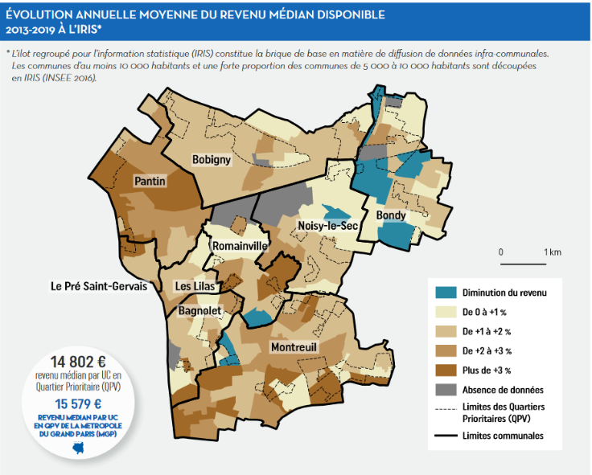
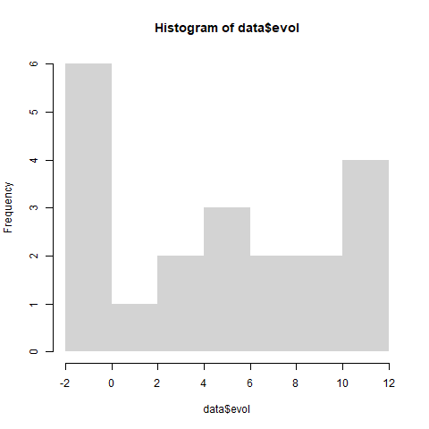
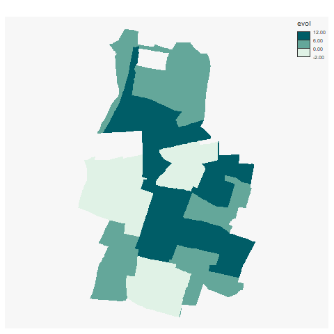
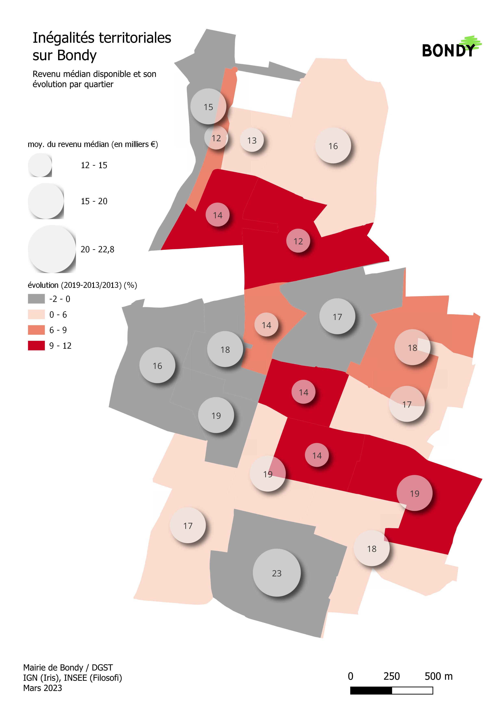

```{r setup, include=FALSE}
knitr::opts_chunk$set(echo = TRUE)
knitr::opts_chunk$set(cache = TRUE)
# Passer la valeur suivante à TRUE pour reproduire les extractions.
knitr::opts_chunk$set(eval = FALSE)
knitr::opts_chunk$set(warning = FALSE)
```


# Objet

Est Ensemble a publié dans ses chiffres clés une carte utilisant le revenu médian disponible.





Quelques remarques :

- situation de Bondy par rapport aux autres communes

- pas de % pour le négatif

- quel calcul ? Je n'obtiens pas les mêmes résultats au niveau des %

# Librairies


```{r}
library(sf)
library(mapsf)
```


# données

```{r}
st_layers("../data/iris.gpkg")
iris <- st_read("../data/iris.gpkg", "iris2022")
filo2013 <- read.csv2("../data/FILO2013.csv")
filo2019 <- read.csv2("../data/FILO2019.csv")
str(iris)
str(filo2013)
```

# traitement


```{r}
joint <- merge(iris, filo2013, by.x= "CODE_IRIS",by.y = "IRIS" )
joint2 <- merge(joint, filo2019,  by.x= "CODE_IRIS",by.y = "IRIS"  )
# filtre
data <- joint2 [, c("NOM_IRIS", "DISP_MED13", "DISP_MED19")]

# calcul
data$evol <-  ((data$DISP_MED19 - data$DISP_MED13) / data$DISP_MED13)*100
data$evol <- round(data$evol,0)
```

# carto


```{r}
knitr::kable(data)
png("../img/graphFilo.jpg")
hist(data$evol, border = NA)
dev.off()
png("../img/irisFilo.jpg")
mf_map(data, type = "choro", breaks = c(-2,0,6,12), var = "evol", border = NA)
dev.off()
```





En plus joli sous QGIS




```{r}

```


