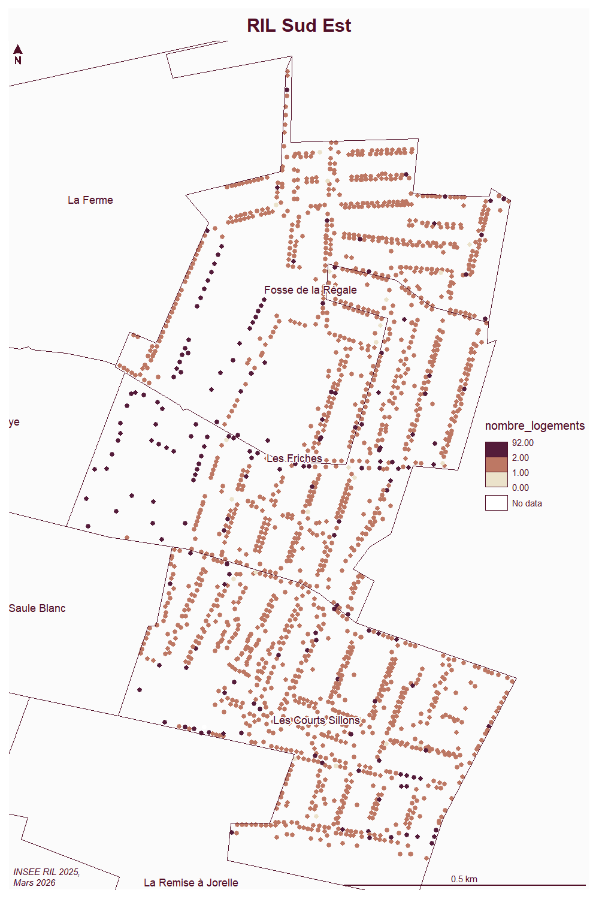

```{r setup, include=FALSE}
knitr::opts_chunk$set(echo = TRUE)
knitr::opts_chunk$set(cache = TRUE)
# Passer la valeur suivante à TRUE pour reproduire les extractions.
knitr::opts_chunk$set(eval = FALSE)
knitr::opts_chunk$set(warning = FALSE)
```


# Objet

Pb baisse population.


donc on superpose 2017 et 2022

\bat agrégation iris à bat fonction hauteur et surface au sol fait par EE (Valentin Guichard) - refus car pas d'utilité d'utiliser un calcul d'agrégation pour voir une différence

\ril Utilisation du ril pour voir si progression


```{r}
53353-50595
```

perte de 2758 hbts selon l'insee


```{r}
library(sf)
library(mapsf)
```


# Données et jointure

```{r}
iris2017 <- st_read("../data/demographie/2017/CONTOURS-IRIS.shp")
iris2017 <- iris2017 [iris2017$INSEE_COM == 93010,]
iris2022 <- st_read("../data/demographie/2024/CONTOURS-IRIS.shp")
iris2022 <- iris2022 [iris2022$INSEE_COM == 93010,]
```

```{r}
mf_map(iris2017, col = "wheat")
mf_map(iris2022, col = NA, border = "red", add = T)
mf_layout("Iris évolutions contours 2017 - 2022", "insee\nmars 2026")
```

```{r}
pop2017 <- read.csv2("../data/demographie/2017/base-ic-evol-struct-pop-2017.CSV", dec = ".")
pop2017 <- pop2017 [pop2017$COM == 93010,]
pop2017$IRIS <- substring(pop2017$IRIS, 6,10)
pop2022 <-read.csv2("../data/demographie/2024//base-ic-evol-struct-pop-2022.CSV", dec=".")
pop2022 <- pop2022 [pop2022$COM == 93010,]
pop2022$IRIS <- substring(pop2022$IRIS, 6,10)
```

```{r}
iris2017 <- merge(iris2017, pop2017, by = "IRIS")
iris2022 <- merge(iris2022, pop2022, by = "IRIS")
iris2017$NOM_IRIS
iris2022$NOM_IRIS
```


```{r}
iris <- iris2017
iris <- merge(iris, pop2022, by = "IRIS")
```


```{r}
iris$EVOL <- iris$P22_POP - iris$P17_POP
hist(iris$EVOL)
iris$EVOL <- round(iris$EVOL, 0)
```


```{r}
bks <- c(-800,-400,0,+400,+600)
mf_map(iris, "EVOL", type= "choro", nbreaks = 4, pal = ("Teal"), breaks = bks, border=NA)
mf_label(iris, var = "EVOL", cex = 0.5, halo=T)
mf_layout("Evolution pop par iris 2017 - 2022", "Insee\nMars 2026")
```


```{r}
st_write(iris [,c("EVOL", "P22_POP", "P17_POP")], "../data/iris.gpkg", "pop_2017_2022")
```

# Utilisation du RIL

On se concentre vers les zones pavillonnaires du sud est

Reprise des contours iris


```{r}
irisContour <- st_read("../data/demographie/2024/CONTOURS-IRIS.shp")
irisContour <- irisContour [irisContour$INSEE_COM == 93010,]
st_write(irisContour,"../data/iris.gpkg", "contour", delete_layer = T)
```


```{r}
ril <- st_read("../data/ril.gpkg", "ril2025")
iris <- st_read("../data/iris.gpkg", "pop_2017_2022")
interIRIS <- st_intersection(iris, (irisContour))
interIRIS <- st_collection_extract(interIRIS, "POLYGON")
st_crs(interIRIS)
st_crs(ril)
interIRIS <- st_transform(interIRIS, 2154)
mf_map(interIRIS)
mf_map(ril, add = T )
inter <- st_intersection(ril, interIRIS)
inter$IRIS
sel <- inter [inter$IRIS %in% c("0305","0401","0405"),]
```


```{r}
png("../img/ril_sud_est.png", width = 1000, height = 1500, res = 150)
mf_map(type = "choro", sel, var = "nombre_logements", border = NA, pch = 16, cex = 0.7, leg_pos = "right")
mf_map (irisContour, add = T, col = NA)
mf_label(irisContour, "NOM_IRIS", halo = T)
mf_layout("RIL Sud Est", "INSEE RIL 2025,\nMars 2026")
dev.off()
```


Agrégation pour comparer avec chiffres 2021

```{r}
table(is.na(sel$nombre_logements))
sel <- na.omit(sel)
agg <- aggregate (sel [, c("nombre_logements"), drop=T], by = list(sel$NOM_IRIS), sum)
agg$nb <- agg$x * 3
names(agg) <- c("NOM_IRIS", "LGTS", "ril_2025")
autresIRIS <- interIRIS [interIRIS$IRIS %in% c("0305","0401","0405"),]
autresIRIS <- st_drop_geometry(autresIRIS)
autresIRIS <- autresIRIS [!duplicated(autresIRIS$IRIS),]
jointure <- merge(autresIRIS, agg, by = "NOM_IRIS")
```


```{r}
export <- jointure [,c(1,3,4,12)]
knitr::kable(export)
export$evol17_22 <- export$P22_POP-export$P17_POP
export$evol22_25 <- export$ril_2025-export$P22_POP
cbind(export[,1],round(export [,c(5:6)]))

```


```{r}
mf_map(sel, type = "typo", var = "NOM_IRIS")
table(sel$NOM_IRIS)
table(sel$nombre_logements)
sel$taille <- cut (sel$nombre_logements, breaks = c(0,3,22,92))
tab <- table(sel$taille, sel$NOM_IRIS)
barplot(tab, col = c("wheat", "cadetblue1", "red"), main = "Répartition taille logements par IRIS Sud Est", cex.names = 0.8,
        legend.text = T)
```


```{r}
png("../img/ril_sud_est_TAILLE.png", width = 1000, height = 1500, res = 150)
mf_map(type = "typo", sel, var = "taille", border = NA, pch = 16, cex = 0.7, leg_pos = "right")
mf_map (irisContour, add = T, col = NA)
mf_label(irisContour, "NOM_IRIS", halo = T)
mf_layout("RIL Sud Est", "INSEE RIL 2025,\nMars 2026")
dev.off()
```

Enregistrement


```{r}
st_write(sel, "../data/ril.gpkg", "sud_est")
```

Iris + gémétrie


```{r}
jointure <- merge(iris2022 [,"NOM_IRIS"], export, by = "NOM_IRIS")
st_write(jointure [, c("NOM_IRIS","evol17_22","evol22_25")], "../data/iris.gpkg", "evolution")
```


```{r}
export
```


Essai d'ACP


```{r}
base <- jointure [,c(1,3,4,11)]
t <- t((tab))
NOM_IRIS <- rownames(t)
petit <- t [,1]
moyen <- t [,2]
grand <- t [,3]
base2 <- data.frame(NOM_IRIS, petit, moyen, grand)
m <- merge(base,base2, by = "NOM_IRIS" )
rownames(m) <- m$NOM_IRIS
m <- m [,-1]
```


```{r}
round(cor(m),1)
res <- prcomp(m, scale=T)
biplot(res)
```

Correlation entre nb logements RIL et nb de grands logements
opposition entre petits et moyens
Cours sillons cohérent sur les 17 et 22
3 profils différents : Fosse hors classe, Friches plutôt moyen / grand, sillons sur cohérence 17 22 et petit
