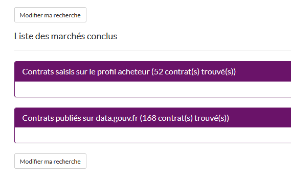

```{r setup, include=FALSE}
knitr::opts_chunk$set(echo = TRUE)
knitr::opts_chunk$set(cache = TRUE)
# Passer la valeur suivante à TRUE pour reproduire les extractions.
knitr::opts_chunk$set(eval = FALSE)
knitr::opts_chunk$set(warning = FALSE)
```


# Objet

Lectures des données json du portail Maximilien


2022
https://www.data.gouv.fr/fr/datasets/r/4de18e82-c4c3-4e5a-bb17-239d7ac18571

sur data.gouv, avec DECP (données essentielles de la commande publique), on obtient les fichiers également
mais pas pour 2020

# Téléchargement du fichier

```{r}
library(jsonlite)
download.file( "https://www.data.gouv.fr/fr/datasets/r/cc6a1e6d-3ef1-4b48-b2d4-7776fc2f5ee4", '../data/marcheMaximilien2020.json')

liste <- fromJSON("../data/marcheMaximilien2020.json", flatten = T)
download.file("https://www.data.gouv.fr/fr/datasets/r/59ba0edb-cf94-4bf1-a546-61f561553917", "../data/marcheDataGouv2020.json")
listeG <- fromJSON("../data/marcheDataGouv2020.json", flatten = T)
# attention liste imbriquée marchés et contrat de concession
names(liste$marches)
names(liste [[1]])
marche <- do.call(rbind, liste [[1]][1])
concession <- do.call(rbind, liste [[1]][2])
```

do.call(function, list)


renommage des rownames

```{r}
row.names(marche) <- substring(row.names(marche), 8,99)
```


# Sélection ville

21930010000019

```{r}
names(marche)
head(marche)
ind <- grep("21930010000019",marche$acheteur.id)
table(marche$acheteur.id [ind])
```

52 marchés sur le profil acheteur



```{r}
names(concession)
ind <- grep("2193001",concession$autoriteConcedante.id)

```

```{r}
#### url endpoint ####
endpoint<-"https://public.opendatasoft.com/api/records/1.0/search/?dataset=sirene"
 
###paramètres###
code_NAF<-"5610A"
Dept<-55
### on utilise le paramètre rows = -1 pour récupérer toutes les lignes
nb_lignes<-"&rows=-1"
 
url_restMeuse<-paste0(endpoint,nb_lignes,"&refine.apet700=",code_NAF,"&refine.depet=",Dept)
```

```{r}
library(httr2)
req <- request("")
```


