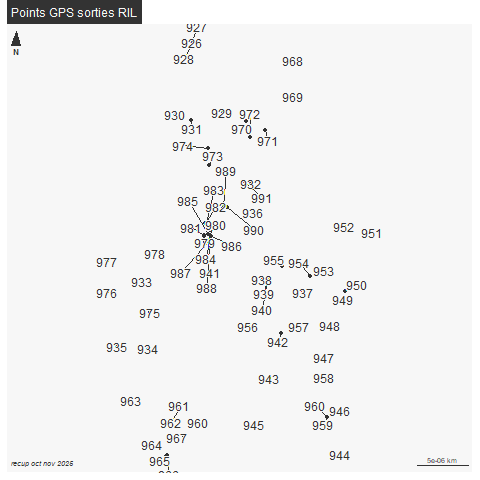

```{r setup, include=FALSE}
knitr::opts_chunk$set(echo = TRUE)
knitr::opts_chunk$set(cache = TRUE)
# Passer la valeur suivante à TRUE pour reproduire les extractions.
knitr::opts_chunk$set(eval = FALSE)
knitr::opts_chunk$set(warning = FALSE)
```


# Objet

Mise en place lien pt GPS et photo dans le RIL

A noter : pb nb photos et nb de points, plusieurs photos pour 1 seul pt. Eliminer 
toutes les photos de BAL


Un article : https://marionlouveaux.fr/fr/blog/gpx-tracks-and-leaflet-interactive-map/#go-to-folding-div permet de faire avec R et Leaflet...


L'objet de ce script est de créer un outil reproductible quelque soit l'objet, plutôt dédié au RIL

Les points GPS sont enregistrés dans le ril
les photos dans photos/ril

# Environnement


## Librairies


```{r , eval=TRUE}
library(mapview)
library(dplyr)
#library(ggplot2)
library(leaflet)
library(leafpop)
#library(lubridate)
#library(purrr)
#library(readr)
library(sf)
library(mapsf)
#library(tibble)
library(ggplot2)
library(leaflet)
library(leafpop)
library(lubridate)
library(purrr)
library(readr)
library(sf)
library(mapsf)
library(tibble)
library(tidyr)
library(exiftoolr) # metadonnées photo
library(magick)
```


## Chemins


```{r}
chemin <-"C:/Users/bmaranget/Documents/03_SIG/03_03_Data/11_RIL/"
cheminSocle <- "C:/Users/bmaranget/Documents/03_SIG/03_03_Data/03_SOCLE/"
cheminPhoto <- "C:/Users/bmaranget/Documents/03_SIG/03_03_Data/05_PHOTOS/ril/rorcal2025/octobre/"
cheminPhoto <- "D:/TELETRAVAIL/2024_04_18/ril/"
cheminGPX <- "C:/Users/bmaranget/Documents/03_SIG/03_03_Data/04_GPX/"
```


# Données


## Concaténation des .gpx

On récupère les waypoints (la 1e couche par défaut) uniquement

```{r}
fic <- list.files(cheminGPX, "OCT-25.gpx|NOV-25.gpx")
trace <- NULL
for (f in fic) {
  tmp <- st_read(paste0(cheminGPX,f), "waypoints")
  trace <- rbind(tmp, trace)
}
# enlever l'altitude
trace <- st_zm (trace, drop = T)
st_write(trace,"../data/ril2025.gpkg", "rilNov2025Trace", delete_layer=T)
```


Première carto

```{r}
trace 
png("../img/ptRIL2025.png")
mf_init(trace)
#fond()
mf_map(trace, add = T)
mf_label(trace, var ="name", overlap = F , halo = T, cex = 1)
mf_layout("Points GPS sorties RIL", "recup oct nov 2025")
dev.off()
```




concaténation de tous les waypoints dans le ril2024.gpkg       

```{r}
st_layers("../data/ril2025.gpkg")
trace <- st_read("../data/ril2025.gpkg", "rilNov2025Trace")
```

67

Verif date et heure au cas échéant

```{r}
class(trace$time)
```

https://demandred.gitbooks.io/introduction-a-r-pour-les-chatons/content/les-structures-de-donnees-avancees/les-dates-en-r.html


format POSIXct, données issues du GPS.

Cette seconde classe permet de représenter les dates également, mais en tennant compte cette fois de l'heure précise (heures et minutes) du jour en question. Pour créer une date ainsi, il faut utiliser la fonction asPOSIXct() . Cette fonction comporte trois arguments principaux :

    Le premier argument qui contient la chaine de la date
    Un second argument format qui contient le format de cette chaine
    Un argument tz qui indique le fuseau horraire de la date.


# Photos


```{r}
photo <- list.files(path.expand(cheminPhoto), pattern = "*.jpg|*.JPG")
```

60 photos (le répertoire est spécifique à chaque campagne RIL)


## Récup métadonnées photo

```{r}
lireMeta <- function(fic){
  exif_read(path.expand(paste0(cheminPhoto, fic)))
} 
test <- lireMeta(photo)
test$FileCreateDate
test$FileModifyDate
test$FileAccessDate
test$SourceFile
#install_exiftool()
```


mais date sur le modify date. il faut sauvegarder nom photo et modify date


# Photo avec GPS intégré


```{r}
photoMeta <- test [, c("FileModifyDate", "SourceFile", "GPSLatitude", "GPSLongitude")]
table(test$Make)
# si c'est fait avec le huawei, je récupère les coords GPS...
# Mais GENERAL IMAGING CO.
test$GPSLatitude [test$Make != 'HUAWEI']
# spatialisation
photoMetasf <- st_as_sf(photoMeta, coords = c("GPSLongitude", "GPSLatitude"), crs=4326)
photoMetasf <- st_transform(photoMetasf, 2154)
mf_init(photoMetasf)
fond()
mf_map(photoMetasf, add=T)
# tri si anomalie sur le lieu 
summary(photoMeta$GPSLongitude)
photoMeta [min(photoMeta$GPSLongitude),]
st_write(photoMetasf, "../data/ril2024.gpkg", "photoMetaAvril", append = F)
```


# Jointure trace et photo


au cas photo faite avec appareil photo
Malheureusement la date création photo n'est pas valable

Autre essai : appareil photo


```{r}
grep("ude", names(test))
grep("GPS", names(test))
names(test)
names(test) [grep("GPS", names(test))]
test [,"GPSVersionID"]
```

pas de long lat, ni de GPS grrrr

mais date sur le modify date.


# Règlages heure GPX et appareil photo

```{r}
photoMeta <- test
photoMeta <- photoMeta [, c("FileName", "SourceFile", "FileModifyDate")]
table(substring(photoMeta$FileModifyDate,1,10))
```

4 jours de campagne terrain


## Réduction taille photo

On stocke dans rep photo du projet / on en profite pour renommer selon le thème (ril / fo)

```{r}
i <- 1
for (i in  c(1:length(photoMeta$FileModifyDate))){
  nom <- photoMeta$FileName [i]
  img <- image_read(photoMeta$SourceFile [i], density = NULL, depth = NULL, strip = FALSE)
  img2 <- image_scale(img, geometry = "200")
  image_write(img2, path = paste0("../photo/ril_", nom), format = NULL, quality = NULL,
              depth = NULL, density = NULL, comment = NULL, flatten = FALSE)
  photoMeta$nom [i] <- paste0("../photo/ril_", nom)
}
```

Jour et herue

```{r}
photoMeta$jour <- as.POSIXct(photoMeta$FileModifyDate, format="%Y:%m:%d" )
photoMeta$heure  <- as.POSIXct(photoMeta$FileModifyDate, format="%Y:%m:%d %H:%M:%S", tz = "CET")
photoMeta$nom
```


calcul différence entre les 2 dates


On recherche la photo d'un lieu connu / et on couple avec le point

pt 954 et IMG_1179.JPG


```{r}
photo1 <- photoMeta [photoMeta$FileName == "IMG_1179.JPG",]
pt1 <- trace [trace$name == "954",]
```

5 rue des ormes

```{r}
mapview(trace)
```


```{r}
dif <- photo1$heure - pt1$time 
class(photo1$heure)
class(pt1$time)
dif
```

54.05 mn diff entre le gps et l'appareil photo. Attention, 27*60 pourles calculs 

```{r}
dif <- 54.05*60
photo1$heure == pt1$time + dif
photo1$heure
pt1$time + dif
photoMeta$heureAjustee <- photoMeta$heure - ( dif )
class(photoMeta$heureAjustee)
photoMeta [, c("heure", "heureAjustee")]
```

On cherche la différence minimum entre l'heure ajustée et l'heure du wp

test sur la photo 1

```{r}
ind <- (which.min(abs(difftime(photoMeta$heureAjustee [1], trace$time))))
trace [ind,]
photoMeta$heureAjustee [1]
```


```{r}
p <- photoMeta$heureAjustee
# pour éviter d'utiliser deux fois la même photo, on va supprimer les
# photos au fur et à mesure
photoMetaBoucle <- photoMeta
trace$timePhoto <- NA
for (p in photoMeta$heureAjustee){
  # c'est une heure
  # indice de ligne du vecteur de difference de tmps entre les deux prise
  print(abs(difftime(p,trace$time)))
  tmp <- which.min(abs(difftime(p,trace$time)))
  print(tmp)
  # c'est à dire lg photo
  # on récupère l'heure de la photo ds la table des wp
  # cas de pl photos sur un meme pt
  if (is.na (trace$timePhoto [tmp])){
    trace$timePhoto [tmp] <- p
  } else {
    # on rajoute un pt 
    tmp2 <- length (trace$timePhoto)+1
    trace <- rbind(trace , trace[tmp,])
    trace$timePhoto [tmp2] <- p
  }
  # pour éviter que la photo soit reprise, on supprime la photo
  photoMetaBoucle <- photoMetaBoucle [-tmp,]
}
length(trace$timePhoto[!is.na(trace$timePhoto)])
# il y a bien60 photos

```


Jointure


```{r}
joint <- merge(trace [, c("time", "name", "timePhoto")], photoMeta, by.x = "timePhoto", by.y="heureAjustee")
names(joint)
# enregistrement
st_write(joint [, c("timePhoto", "time", "name", "FileName", "nom")], "../data/ril2025.gpkg", "jointure", delete_layer = T) 
mapview(joint)
```


Verif leaflet


# Leaflet


Il s'agit maintenant de récupérer les photos et de projeter en leaflet


pour mémoire, les photos sont dans file_names

```{r}
data <- st_read("../data/ril2025.gpkg", "jointure")
data
```


```{r, eval=TRUE}

data <- st_transform(data, crs = 4326)
data$name <- rownames(data)
leaflet() %>%
  addProviderTiles("OpenStreetMap.France") %>%
  addMarkers(data = data, label = ~name, group = "photos") %>%
  addPopupImages(data$nom, group = "photos", width = 200) 
```


On superpose avec la couche ril


```{r}
ril <- st_read("../data/ril2025.gpkg", "octobre")
ril <- st_transform (ril, 4326)
leaflet() %>%
  addProviderTiles("OpenStreetMap.France") %>%
  addMarkers(data = data, label = ~name, group = "photos") %>%
  addPopupImages(data$nom, group = "photos", width = 200) %>% 
  addCircleMarkers(data = ril, label = ~libelle)
```


# Récup adresse photo

ril a l'adresse
data a le chemin photo

```{r}
mf_map(st_buffer(ril,30))
mf_map(data, add = T)
inter <- st_intersection(st_buffer(ril,30), data )
inter <- inter [, c("numero","repetition","type_voie","libelle","nombre_logements","nom.1","FileName")]
```


```{r}
mapview(data)
```

# Récuperer les photos sans points

# Archivage des données


Pour afficher les photos dans l'atlas Qgis, on utilise la fonction overlaynearest

entre la couche cible photos et le champs photo qui indique le chemin de la photo

il existe de nombreuses couches photos

L'idée est de concaténer afin de récupérer toutes les photos dans un seul fichier photo.gpkg (qui ne contient que des liens pour mémoire)

