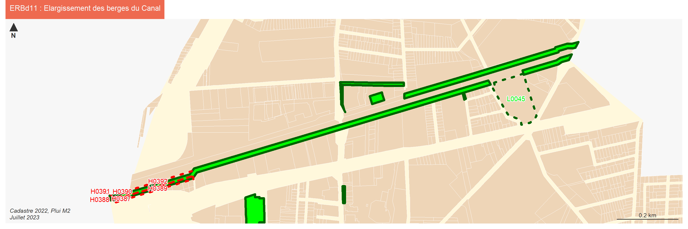
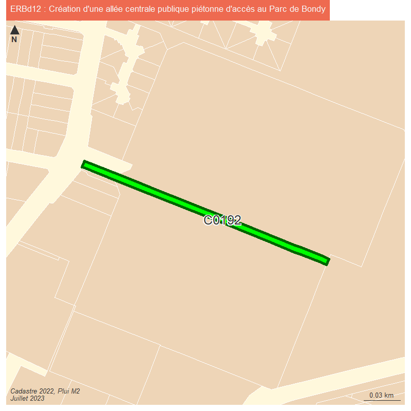
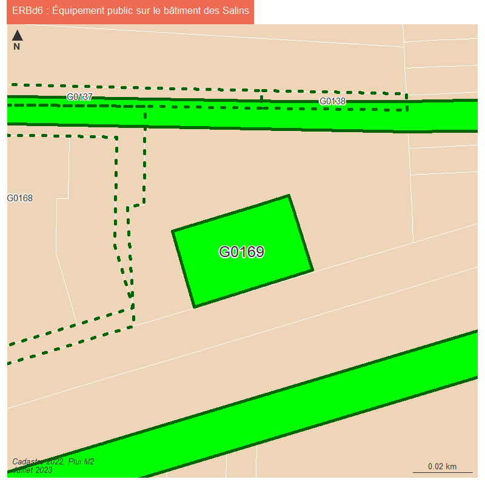
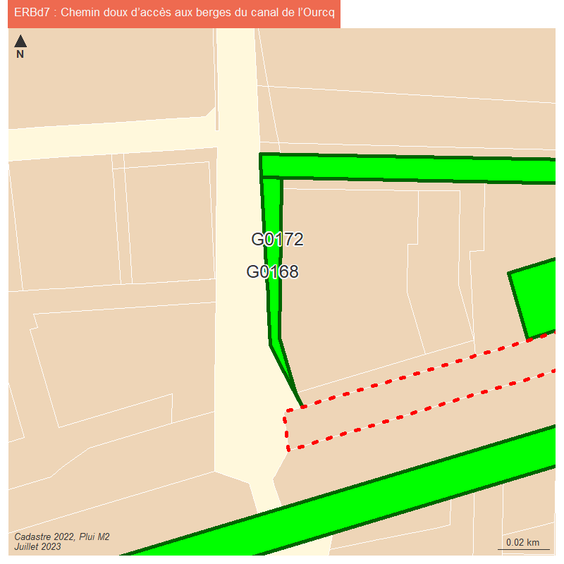
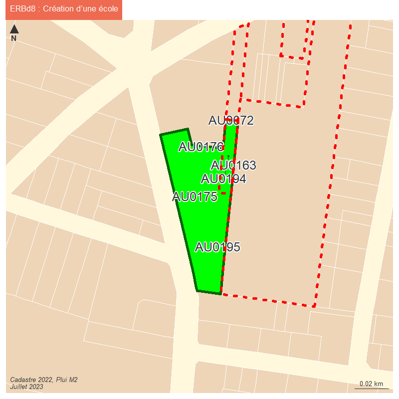
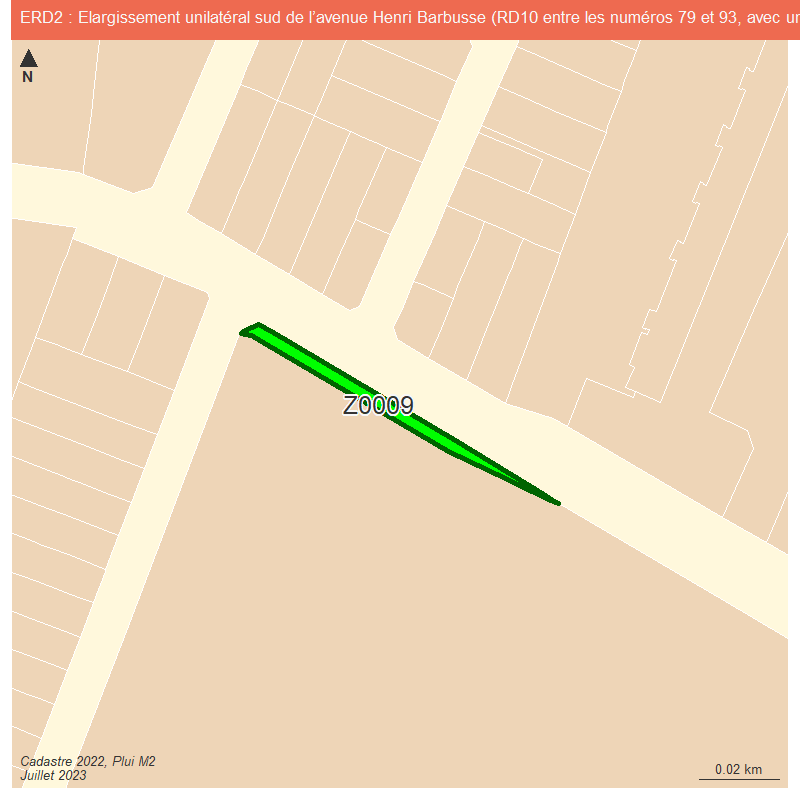

```{r setup, include=FALSE}
knitr::opts_chunk$set(echo = TRUE)
knitr::opts_chunk$set(cache = TRUE)
# Passer la valeur suivante à TRUE pour reproduire les extractions.
knitr::opts_chunk$set(eval = FALSE)
knitr::opts_chunk$set(warning = FALSE)
```


# Objet

Production cartes de verif pour M2

```{r}
library(sf)
library(mapsf)
```


```{r}
#bondy <- st_read("../data/limitesSocle.gpkg", "bondy", quiet=F)
# plutôt limites
st_layers("../data/limitesSocle.gpkg")
st_layers ("../data/cadastre.gpkg")
cadastre <- st_read("../data/cadastre.gpkg", "parcelle_info")
bondy <- st_read("C:/Users/bmaranget/Documents/03_SIG/03_03_Data/03_SOCLE/cadastre2022.sqlite", "geo_commune")
bondy2 <- st_read("../data/limitesSocle.gpkg", "bondy")
bondy3 <- st_read("../data/limitesSocle.gpkg", "admin_express_IGN")
```

```{r}
couleurs <- hcl.colors(3, "Dark3")
png("../img/limitesBondy.png", width = 800, height = 800, res = 150)
mf_map(bondy, col = NA, lwd = 10, border = couleurs [1])
mf_map(bondy2, col = NA,lwd = 4, border = couleurs [2], add = T)
mf_map(bondy3, col= NA, lwd = 2, border = couleurs [3], add = T)
mf_legend(type="typo", title = "source", val = c("cadastre", "OSM ?", "IGN EXPRESS"), pal = hcl.colors(3, "Dark3"), border = NA)
mf_layout("Limites de Bondy", credits = "Août 2023")
dev.off()
```

Conclusion c'est les limites cadastre les plus précises... pb est et sud est


```{r}
st_write(bondy, "../data/cadastre.gpkg", "commune", delete_layer = T)
# suppression des espaces dans code
cadastre$code <- gsub(" ", "", cadastre$code)
st_write(cadastre, "../data/cadastre.gpkg", "parcelle_info", delete_layer = T)
```


# Données

## enregistrement en .gpkg


```{r}
chemin <- "C:/Users/bmaranget/Documents"
chemin2 <- "G:"
chemin <- "Home/tachasa/00_DATA/"
fic <- "C:/Users/bmaranget/Documents/03_SIG/03_03_Data/06_URBA/M2/200057875_PLUi_20230627/Donnees_geographiques/"
```

```{r}
nom <- list.files(fic, ".shp")
nomF <- c("info_lin", "info_surf", "pres_lin" , "pres_pct", "pres_surf", "zone")
i <- 1
df <- NULL
for (i in 1:6){
  tmp <- st_read(paste0(fic, nom [i]))
  inter <- st_intersection(tmp, bondy)
  assign(nomF [i], inter)
  lib <- unique(inter [,1, drop = T])
  origine <- nomF [i]
  dfTmp <- data.frame(lib,origine)
  df <- rbind(dfTmp, df)
  st_write(inter, "../data/pluiM2.gpkg", nomF [i], delete_layer = T)
}
write.csv(df, "../data/libPLUiM2.csv", fileEncoding = "UTF-8")
```


# ZONAGES

2 listes, celle d'operis et l'extraction mairie.
24 <> 33 sans doute effet de bord on vérifie

on refait la manip avec la limite communale cadastre, horreur ! 24 <> 34 !


```{r}
operis <- read.csv("../data/libPLUiM2_zonageOperis.csv", header = F)
mairie <- df [df$origine == 'zone',]
diff <- setdiff(operis$V1, mairie$lib)
# pas de libellé en plus dans operis
diff <- setdiff(mairie$lib, operis$V1)
# 9 puis 10 zones en plus !
diff <- zone [zone$LIBELLE %in% diff,]
diff$aire <- drop_units(round(st_area(diff),0))
library(units)
diff <- diff [diff$aire > 0,]
diff <- diff [order(diff$aire),]
# on exclue les valeurs nulles... plus que 12
st_layers("../data/pluiM2.gpkg")
zone <- st_read("../data/pluiM2.gpkg", "zone")
```


```{r}
mf_export(x = bondy, filename = paste0("../img/pbZonage.png"), 
          expandBB = c(0,0,0,0.3),
          width = 1400, height = 1400,res = 200)
par(mfrow = c(3,4))
i <-1
for (i in (1:length(diff$LIBELLE))) {
  mf_init(diff [i,])
  mf_map(bondy, col = NA, border = "antiquewhite2", add = T)
 mf_map(cadastre, col = "wheat", border =NA,add = T)
mf_map(diff [i,], col = "red", border = NA, add = T)
mf_label(diff [i,],"LIBELONG", cex = 0.5)
mf_layout(paste0(diff$LIBELLE [i], " ", round(st_area(diff [i,]),0), " m2"), credits = "")
}
dev.off()
```

...effet de bord donc !

## INFO_SURF

TA, ER


```{r, eval = F}
st_layers("../data/pluiM2.gpkg")
ta <- info_surf [info_surf$LIBELLE == 'Taxe d\'amenagement',]
er <- st_read("../data/pluiM2.gpkg", "ER")
#17 er sans légende
erOK <- read.csv("../data/er.csv", fileEncoding = "UTF-8")
er <- merge(er, erOK, by = "TXT" )
er [,c("LIBELLE.x", "LIBELLE.y")]
er$LIBELLE <- er$LIBELLE.y
str(er)
st_write(er [, c("TXT", "LIBELLE")],  "../data/pluiM2.gpkg", "ER", delete_layer = T)
```


Intersections ER parcelles : vérification (pb bretelle A3)

```{r}
er <- st_read("../data/pluiM2.gpkg", "ER")
inter <- st_intersection(cadastre [, "code"], er)
mf_map(inter)
inter$surface <- round(st_area(inter),0)
# agregation pour avoir tableau récapitulatif
aggregate(inter$code, by = list(inter$LIBELLE, inter$TXT), length)
liste <- unique (inter$TXT)
df <- NULL
i <- 1
for (i in (1:length(liste))){
  tmpCode <- inter$code [inter$TXT == liste [i]]
  tmpCode <- toString(tmpCode)
  lg <- data.frame(liste [i], tmpCode)
  df <- rbind(lg, df)  
}
df
write.csv(df, "../data/df.csv", fileEncoding = "UTF-8")
```

Une comparaison avec le tableau des ER amène à de nombreux pb notamment de parcelles manquantes et en plus

parcelles manquantes dans le tableau liées à l'intersection

parcelles en trop dans le tableau alors qu'elles existent au niveau de l'intersection


```{r}
manquant <- read.csv("../data/erreursER_parcellesManquantes.csv", fileEncoding = "UTF-8")
trop <- read.csv("../data/erreursER_parcellesEnTrop.csv", fileEncoding = "UTF-8")
jointureManquant <- merge(manquant, cadastre, by.y = "code", by.x = "parcelles.manquantes") 
setdiff(manquant$parcelles.manquantes,jointureManquant$parcelles.manquantes )
# manquent G0167 C0199 H0377 H0376 => pb division parcellaire ? ou parcelles supprimées ?
jointureTrop <- merge(trop, cadastre, by.y = "code", by.x = "en.trop") 
setdiff(trop$en.trop,jointureTrop$en.trop )
jointureTrop <- st_as_sf(jointureTrop)
jointureManquant <- st_as_sf(jointureManquant)
```


## Espaces paysagers

pres_surf Espace paysager...
pres_pct Alignement d'arbres...
pres_lin arbre remarquable


```{r}
recherche <- grep("Espace paysager", pres_surf$LIBELLE)
recherche <- unique(pres_surf$LIBELLE[recherche])
data <- pres_surf [pres_surf$LIBELLE %in% recherche,]
st_write(data, "../data/pluiM2.gpkg", "esp_paysager")
recherche <- grep("Alignement", pres_lin$LIBELLE)
recherche <- unique(pres_lin$LIBELLE[recherche])
data <- pres_lin [pres_lin$LIBELLE %in% recherche,]
st_write(data, "../data/pluiM2.gpkg", "lin_paysager")
```

# DPU

```{r}
dpu <- info_surf [info_surf$LIBELLE %in% c("Droit de preemption urbain", 
"Droit de preemption urbain renforce"),]
st_write(dpu, "../data/pluiM2.gpkg", "dpu", delete_layer = T)
```


# Cartographie

ta

```{r}
mf_export(x = bondy, filename = paste0("../img/ta.png"), 
          expandBB = c(0,0,0,0.3),
          width = 1000, res = 200)
  mf_init(bondy, theme = "candy")
  mf_shadow(bondy, add = TRUE)
  mf_map(bondy, add = TRUE)
  mf_typo(
    ta,
    pal = c("orange", "yellow"),
    border = NA,
    var = "TXT",
    leg_pos = "topright",
    leg_title = "Montant (%)",
    add = TRUE
  )

mf_layout(title = "Taxe d'aménagement M2 juillet 2022",
            credits = "Plui M2\nBondy,  juillet 2023")
dev.off()
```


dpu

```{r}
mf_export(x = bondy, filename = paste0("../img/dpu.png"), 
          expandBB = c(0,0,0,0.3),
          width = 1000, res = 200)
  mf_init(bondy, theme = "candy")
  mf_shadow(bondy, add = TRUE)
  mf_map(bondy, add = TRUE)
  mf_typo(
    dpu,
    pal = c("orange", "yellow"),
    border = NA,
    var = "LIBELLE",
    leg_pos = "topright",
    leg_title = "type DPU",
    add = TRUE
  )
mf_layout(title = "DPU M2 juillet 2022",
            credits = "Plui M2\nBondy,  juillet 2023")
dev.off()
```


INFO_SURF / ER


```{r}
library(mapsf)
mf_export(x = bondy, filename = "../img/er.png", 
          expandBB = c(0,0,0,0.3),
          width = 1000, res = 200)
  mf_init(bondy, theme = "candy")
  mf_shadow(bondy, add = TRUE)
  mf_map(bondy, add = TRUE)
  mf_map(
    er,
    col = "green",
    type = "base",
    border = NA,
    add = T
  )
  mf_label(er, var="TXT", overlap = F, lines = T,  cex =0.6, bg = "white", halo = T)
  

mf_layout(title = "Emplacements réservés M2 juillet 2022",
            credits = "Plui M2\nBondy,  juillet 2023")
dev.off()
```


```{r}
# carto pour chaque emplacement réservé avec affichage en titre de l'emplacement, fond de carte cadastre.
nb <- length(er$LIBELLE)
i <- 1
for (i in 1:nb){
  mf_export(x = er$geom [i], filename = paste0("../img/er",er$TXT [i]," .png"), 
          width = 800, height = 800, res = 125)
  mf_init(st_buffer(er$geom [i],50), expandBB = rep(0,4))
  mf_map(bondy, col = "cornsilk", add = T, border = NA)
  #mf_shadow(bondy, add = TRUE)
  mf_map(cadastre, col = "bisque2", border = "white", add = T)
  mf_map(
    er,
    col = "green",
    type = "base",
    border = "darkgreen",
    lwd = 4,
    add = T
  )
 #mf_map(inter, col = "brown2", border = "chocolate4", add = T)
 sel <- inter [inter$LIBELLE == er$LIBELLE [i],]
 selManquant <- jointureManquant [jointureManquant$er == er$TXT [i],]
 selTrop <- jointureTrop [jointureTrop$emplacement.réservés == er$TXT [i],]
 mf_label(sel, var = "code", cex= 1.2,overlap = F, halo = T)
 mf_map(selTrop, col = NA, border = "red", lty = 3, lwd = 4, leg_pos = "topright", add = T)
 mf_map(selManquant, col = NA, border = "darkgreen", lty = 3, lwd = 4, leg_pos = "right", add = T)
 ifelse (length(selManquant$parcelles.manquantes) > 0,
           mf_label(selManquant, var = "parcelles.manquantes", overlap = F, halo = T),0) 
 
  #mf_label(cadastre, var = "code", overlap = F, cex = 0.6)
  mf_layout(credits = "Cadastre 2022, Plui M2\nJuillet 2023" )
  mf_title(txt = paste0(er$TXT [i], " : ",  er$LIBELLE [i]), pos = "left", bg ="coral2", cex = 0.8, line = 2)
  dev.off()
}
```

ERBd11

On change le format pour voir quelque chose

```{r}
canal <- st_union(er [3:5,])
class(canal)
fichiers <- paste0("")
toString(fichiers)
i <- 3
mf_export(x = er$geom [i], filename = paste0("../img/er",er$TXT [i]," .png"), 
          width = 3000, height = 1000, res = 250)
  mf_init(st_buffer(canal,50), expandBB = rep(0,4))
  mf_map(bondy, col = "cornsilk", add = T, border = NA)
  #mf_shadow(bondy, add = TRUE)
  mf_map(cadastre, col = "bisque2", border = "white", add = T)
  mf_map(
    er,
    col = "green",
    type = "base",
    border = "darkgreen",
    lwd = 4,
    add = T
  )
 #mf_map(inter, col = "brown2", border = "chocolate4", add = T)
 sel <- inter [inter$LIBELLE == er$LIBELLE [i],]
 selManquant <- jointureManquant [jointureManquant$er == er$TXT [i],]
 selTrop <- jointureTrop [jointureTrop$emplacement.réservés == er$TXT [i],]
 #mf_label(sel, var = "code", overlap = F, halo = T)
 mf_map(selTrop, col = NA, border = "red", lty = 3, lwd = 4,  add = T)
 mf_map(selManquant, col = NA, border = "darkgreen", lty = 3, lwd = 4,  add = T)

 mf_label(selManquant, col = "green", halo = T,var = "parcelles.manquantes", overlap = F)
 mf_label(selTrop, var = "en.trop", col= "red", halo= T,overlap= F)

  #mf_label(cadastre, var = "code", overlap = F, cex = 0.6)
  mf_layout(credits = "Cadastre 2022, Plui M2\nJuillet 2023" )
  mf_title(txt = paste0(er$TXT [i], " : ",  er$LIBELLE [i]), pos = "left", bg ="coral2", cex = 0.8, line = 2)
  dev.off()

```




              


zone archéologique

attention l'intersection prend les parcelles mitoyennes.
utilisation du whithin sparse avec un which pour les num de lignes fonctionne bien

```{r}
archeo <- info_surf [info_surf$LIBELLE == 'Site archeologique',]
dedans <- as.vector(st_within(cadastre, archeo, sparse = F))
dedans <- which(dedans ==TRUE)
dedans <- cadastre [dedans,]
cadZa <- cadastre [dedans, ]

bondy <- st_read("../data/limitesSocle.gpkg", "bondy", quiet=F)
mf_export(x = bondy, filename = "../img/archeo.png", 
          expandBB = c(0,0,0,0.0),
          width = 1000, height = 1000 ,res = 150)
  mf_init(archeo, theme = "candy")
  mf_shadow(bondy, add = TRUE)
  mf_map(bondy, add = TRUE)
  mf_map(cadastre, col = "cornsilk", border = "wheat", add = T)
  mf_map(
    archeo,
    col = NA,
    type = "base",
    border = "green",
    lwd = 3,
    add = T
  )

mf_label(cadZa,, var = "code", halo = T, cex = 0.5, overlap = F)  
mf_layout(title = archeo$LIBELLE,
            credits = "Plui M2\nBondy,  juillet 2023")
dev.off()
```


RCU

```{r}
rcu <- info_surf [substring(info_surf$LIBELLE, 1,4) == "Zone", ]
dedans <- as.vector(st_within(cadastre, rcu, sparse = F))
dedans <- which(dedans ==TRUE)
dedans <- cadastre [dedans,]
cadZa <- cadastre [dedans, ]
mf_export(x = rcu, filename = "../img/rcu.png", 
          expandBB = c(0,0,0,0.0),
          width = 1000, height = 1000 ,res = 150)
  mf_init(rcu, theme = "candy")
  mf_shadow(bondy, add = TRUE)
  mf_map(bondy, add = TRUE)
  mf_map(cadastre, col = "cornsilk", border = "wheat", add = T)
  mf_map(
    rcu,
    col = NA,
    type = "base",
    border = "green",
    lwd = 3,
    add = T
  )

mf_label(cadZa,, var = "code", halo = T, cex = 0.5, overlap = F)  
mf_layout(title = rcu$LIBELLE,
            credits = "Plui M2\nBondy,  juillet 2023")
dev.off()
```


PPCOA (ancien sursis à statuerr)


```{r}
ppcoa <- info_surf [substring(info_surf$LIBELLE, 1,5) == "PPCOA", ]
mf_export(x = rcu, filename = "../img/ppcoa.png", 
          expandBB = c(0,0,0,0.0),
          width = 1000, height = 1000 ,res = 150)
  mf_init(ppcoa, theme = "candy")
  mf_shadow(bondy, add = TRUE)
  mf_map(bondy, add = TRUE)
  mf_map(cadastre, col = "cornsilk", border = "wheat", add = T)
  mf_map(
    ppcoa,
    var = "LIBELLE",
    col = NA,
    type = "typo",
    border = "green",
    lwd = 3,
    add = T
  )

mf_layout(title = "PPCOA",
            credits = "Plui M2\nBondy,  juillet 2023")
dev.off()


# verif
ppcoa <- ppcoa [3,]
ppcoa
dedans <- as.vector(st_within(cadastre, ppcoa, sparse = F))
dedans <- which(dedans ==TRUE)
dedans <- cadastre [dedans,]
cadZa <- cadastre [dedans, ]
```


pb AJ12


```{r}
AJ12 <- cadastre [cadastre$code == "AJ0012",]
AJ12 <- cadastre [3774,]
ppcoa
mf_init(st_buffer(AJ12, 30))
mf_map(cadastre, col = "cornsilk", border = "wheat", add = T)
mf_map(ppcoa,  border = "green",  col = NA,  lwd = 5,add = TRUE)
mf_label(AJ12, var = "code", cex = 1.5)
mf_layout("PPCOA et parcelle AJ12 : inclusion", credits = "Bondy / DGST\nPLUi M2, juillet 2023")
```


pb I41

```{r}
I41   <- cadastre [cadastre$code == " I0041",]
grep("I0041", cadastre$code)
I41 <- cadastre [1233,]
lineaire <- pres_lin [substring(pres_lin$LIBELLE, 10, 14) == "actif", ]
arbre <- pres_lin [substring(pres_lin$LIBELLE, 14, 19)== "arbres",]
mf_init(st_buffer(I41, 10))
mf_map(cadastre, col = "cornsilk", border = "wheat", add = T)
mf_map(lineaire,  col = "red",    lwd = 5,add = TRUE)
mf_map(arbre, col = "green", lty = 2, lwd = 5, add = T)
mf_label(I41, var = "code", cex = 1.5)
mf_layout("linéaire actif à créer et parcelle I41 : demande de continuation", credits = "Bondy / DGST\nPLUi M2, juillet 2023")
```


PPR

```{r}
ppr <- info_surf [substring(info_surf$LIBELLE, 1,3) == "PPR", ]
mf_init(AG0162)
mf_map(AG0162)
  mf_map(cadastre, col = "cornsilk", border = "wheat", add = T)
  mf_map(ppr, border = "green",  color = NA, lwd = 3,add = T)
# verif
dedans <- as.vector(st_within(cadastre, ppr, sparse = F))
dedans <- which(dedans ==TRUE)
AG0162 <- cadastre [3303,]

```


Voisinage de bureau


```{r}
bureau <- pres_surf [substring(pres_surf$LIBELLE, 1,3) == "Per", ]
mff_init(bureau)
  mf_map(cadastre, col = "cornsilk", border = "wheat", add = T)
  mf_map(bureau, border = "green",  col = NA, lwd = 3,add = T)
```


# ICPE BASIAS BAZOL

Dans Operis, un recensement de :


```{r}
operis <- read.csv("../data/icpeBasiasBazolOperis.csv")
table(operis$Source.de.la.donnée)
table(operis$type)
```
89 au total
2 BASOL / 65 BAZIAS / 22 ICPE


Au départ 19 ICPE (Installations classées pour la protection de l'environnement (ICPE) soumises à autorisation ou à enregistrement (en fonctionnement ou en cessation d'activité))

On les télécharge sur géorisque

La consigne d'Operis est de les replacer correctement. Poser une question par rapport à ces différentes sources.


Sur le géoportail93, on a BRGM / BASOL et BASIAS

Sur infoterre (brgm), on a BASOL => georisque et BASIAS (anciens sites industriels) 2 sites uniquement

Suite à lecture du géoportail généalogie, on a plus de données dans le BASIAS retravaillé du géoportail93 (59)


On privilégie les ICPE par respect pour la consigne.


# ICPE


## Géorisques

```{r}
icpe <- st_read("../data/InstallationsClassees_France.shp")
icpe <- icpe [ icpe$cd_insee == '93010',]
# 19 obs
mf_map(icpe)
mf_label(icpe, "nom_ets", halo=T, overlap=F)
write.csv(icpe, "../data/icpeGeorisque.csv", fileEncoding = "UTF-8")
```

Pb géocodage, donc on enregistre et on géocode à nouveau

- modif par rapport à CERTAS (2 adresses)
- et une adresse -5 chemin latéral
- 34 étienne Dolet

```{r}
data <- read.csv("../data/icpe.geocoded.csv")
data <- st_as_sf(data, coords = c("longitude", "latitude"), crs = 4326)
icpe <- st_transform(data, 2154)
inter <- st_intersection(cadastre, icpe)
```

Uniquement 7 intersections...
On étudie les 12 autres graphiquement avant de se repérer par rapport aux adresses parcelles.

```{r}
diff <- setdiff(icpe$nom_ets, inter$nom_ets)
  mf_export(x = bondy, filename = "../img/icpe.png", 
          expandBB = c(0,0,0,0.0),
          width = 2500, height = 1800 ,res = 200)
  par(mfrow=c(3,4))
  i <- 1
for (i in 1:length(diff)){
  pt <- icpe [icpe$nom_ets == diff[i],]
  mf_init(st_buffer(pt,10))
  mf_map(cadastre, col = "antiquewhite1",add = T)
  mf_map(pt, pch = 17, col = "red",add = T)
  mf_map(st_buffer(pt, 5), add = T, lty = 3,  col = NA,border = "aquamarine3")
  parcelle <- st_intersection(st_buffer(pt, 5), cadastre)
  ifelse(length(parcelle$nom_ets > 0),
  mf_label(parcelle, "code", halo = T, col = "aquamarine3"), "0")
  mf_layout(paste0(pt$nom_ets, " : ", pt$adresse),  credits = "")
  mf_annotation(parcelle [1,], parcelle$adresse.1 [1], cex = 0.5, pos = "topright" )
}
dev.off()

```


pb i = 8 et 9

```{r}
mf_export(x = bondy, filename = "../img/icpeCERTAS.png", 
          expandBB = c(0,0,0,0.0),
          width = 800, height = 400 , res = 100)
i <- grep("CERTAS", icpe$nom_ets)
 pt <- icpe [i,]
  mf_init(st_buffer(pt,70))
  mf_map(cadastre, col = "antiquewhite1",add = T)
  mf_map(pt, pch = 17, col = "red",add = T)
  mf_map(st_buffer(pt, 15), add = T, lty = 3,  col = NA,border = "aquamarine3")
  parcelle <- st_intersection(st_buffer(pt, 13.5), cadastre)
  parcelle$loc <- paste0(parcelle$code, "\n",parcelle$adresse.1)
  mf_label(parcelle, "loc", halo = T, cex = 0.8,col = "aquamarine3", pos = 4,overlap = F)
  mf_label(pt, "adresse", col = "red", pos = 2)
  mf_layout("CERTAS : 2 adresses",  credits = "")
dev.off()
```

## Géoportail 93

Le géocodage est-il meilleur ?

```{r}
basiasGeoportail <- st_read("../data/2023-08-08_basias___anciens_sites_industriels_et_activites_de_service___brgm_.geojson")
basolGeoportail <- st_read("../data/2023-08-08_sites_et_sols_pollues__ou_potentiellement_pollues__en_seine_saint_denis.geojson")
```


Je n'ai pas les ICPE...


```{r}
data <- data [, c("adresse", "code", "proprietaire", "adresse.1", "nom_ets")]
# étudier correspondance proprio cadastre et nom_ets
write.csv(data, "../data/intersectionICPECadastre.csv", fileEncoding = "UTF-8")
st_write(data, "../data/pluiM2.gpkg", "icpe", delete_layer = T)
```


```{r}

```


```{r}
icpe <- st_read("../data/pluiM2.gpkg", "icpe")
data <- st_intersection(cadastre, icpe)
data <-  data [, c("code", "adresse", "adresse.1", "nom_ets")]
data
write.csv(data, "../data/icpe.csv", fileEncoding = "UTF-8")

mf_map(data)
mf_label(data, "nom_ets", halo=T, overlap=F)
```


