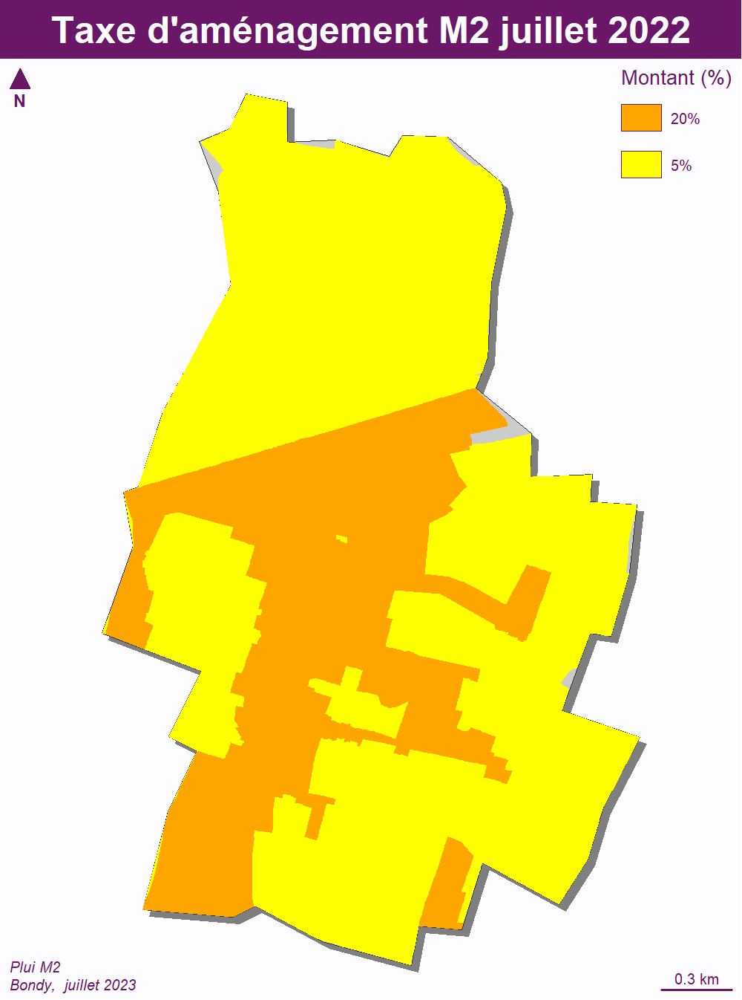

```{r setup, include=FALSE}
knitr::opts_chunk$set(echo = TRUE)
knitr::opts_chunk$set(cache = TRUE)
# Passer la valeur suivante à TRUE pour reproduire les extractions.
knitr::opts_chunk$set(eval = FALSE)
knitr::opts_chunk$set(warning = FALSE)
```


# Objet

Production cartes de verif pour M2


# Données

## filtrage des données


```{r}
chemin <- "C:/Users/bmaranget/Documents"
chemin2 <- "G:"
chemin <- "Home/tachasa/00_DATA/"
fic <- "C:/Users/bmaranget/Documents/03_SIG/03_03_Data/06_URBA/200057875_PLUi_20230627/Donnees_geographiques/"
```

```{r}
nom <- list.files(fic, ".shp")
bondy <- st_read("../data/limitesSocle.gpkg", "bondy")
nomF <- c("info_lin", "info_surf", "pres_lin" , "pres_pct", "pres_surf", "zone")
i <- 1
df <- NULL
for (i in 1:6){
  tmp <- st_read(paste0(fic, nom [i]))
  inter <- st_intersection(tmp, bondy)
  assign(nomF [i], inter)
  lib <- unique(inter [,1, drop = T])
  origine <- nomF [i]
  dfTmp <- data.frame(lib,origine)
  df <- rbind(dfTmp, df)
  st_write(inter, "../data/pluiM2.gpkg", nomF [i], delete_layer = T)
}
write.csv(df, "../data/libPLUiM2.csv", fileEncoding = "UTF-8")
```


INFO_SURF

TA, ER


```{r, eval = T}
library(sf)
st_layers("../data/pluiM2.gpkg")
ta <- info_surf [info_surf$LIBELLE == 'Taxe d\'amenagement',]
er <- st_read("../data/pluiM2.gpkg", "ER")
#17 er sans légende
```


# Cartographie


```{r}
library(mapsf)
bondy <- st_read("../data/limitesSocle.gpkg", "bondy", quiet=F)


mf_export(x = bondy, filename = paste0("../img/ta.png"), 
          expandBB = c(0,0,0,0.3),
          width = 1000, res = 200)
  mf_init(bondy, theme = "candy")
  mf_shadow(bondy, add = TRUE)
  mf_map(bondy, add = TRUE)
  mf_typo(
    ta,
    pal = c("orange", "yellow"),
    border = NA,
    var = "TXT",
    leg_pos = "topright",
    leg_title = "Montant (%)",
    add = TRUE
  )

mf_layout(title = "Taxe d'aménagement M2 juillet 2022",
            credits = "Plui M2\nBondy,  juillet 2023")
dev.off()
```




INFO_SURF / ER


```{r}
library(mapsf)
bondy <- st_read("../data/limitesSocle.gpkg", "bondy", quiet=F)
mf_export(x = bondy, filename = "../img/er.png", 
          expandBB = c(0,0,0,0.3),
          width = 1000, res = 200)
  mf_init(bondy, theme = "candy")
  mf_shadow(bondy, add = TRUE)
  mf_map(bondy, add = TRUE)
  mf_map(
    er,
    col = "green",
    type = "base",
    border = NA,
    add = T
  )
  mf_label(er, var="TXT", overlap = F, lines = T,  cex =0.6, bg = "white", halo = T)
  

mf_layout(title = "Emplacements réservés M2 juillet 2022",
            credits = "Plui M2\nBondy,  juillet 2023")
dev.off()

# carto pour chaque emplacement réservé avec affichage en titre de l'emplacement, fond de carte cadastre.
st_layers ("../data/cadastre.gpkg")
cadastre <- st_read("../data/cadastre.gpkg", "parcelle_info")
nb <- length(er$LIBELLE)
for (i in 1:nb){
  mf_export(x = er$geom [i], filename = paste0("../img/er",er$TXT [i]," .png"), 
          width = 800, height = 800, res = 100)
  mf_init(st_buffer(er$geom [i],50), expandBB = rep(0,4))
  mf_map(bondy, col = "cornsilk", add = T, border = NA)
  #mf_shadow(bondy, add = TRUE)
  mf_map(cadastre, col = "bisque2", border = "white", add = T)
  mf_map(
    er,
    col = NA,
    type = "base",
    border = "green",
    lwd = 2,
    add = T
  )
 
  #mf_label(cadastre, var = "code", overlap = F, cex = 0.6)
  er$LIBELLE <- gsub("\n",  " ",er$LIBELLE,)
  mf_layout(credits = "Cadastre 2022, Plui M2\nJuillet 2023")
  mf_title(txt = paste0(er$TXT [i], " : ",  er$LIBELLE [i]), pos = "left", bg ="darkorchid", cex = 0.8, line = 2)
  dev.off()
    }
```


zone archéologique

attention l'intersection prend les parcelles mitoyennes.
utilisation du whithin sparse avec un which pour les num de lignes fonctionne bien

```{r}


archeo <- info_surf [info_surf$LIBELLE == 'Site archeologique',]
dedans <- as.vector(st_within(cadastre, archeo, sparse = F))
dedans <- which(dedans ==TRUE)
dedans <- cadastre [dedans,]
cadZa <- cadastre [dedans, ]

bondy <- st_read("../data/limitesSocle.gpkg", "bondy", quiet=F)
mf_export(x = bondy, filename = "../img/archeo.png", 
          expandBB = c(0,0,0,0.0),
          width = 1000, height = 1000 ,res = 150)
  mf_init(archeo, theme = "candy")
  mf_shadow(bondy, add = TRUE)
  mf_map(bondy, add = TRUE)
  mf_map(cadastre, col = "cornsilk", border = "wheat", add = T)
  mf_map(
    archeo,
    col = NA,
    type = "base",
    border = "green",
    lwd = 3,
    add = T
  )

mf_label(cadZa,, var = "code", halo = T, cex = 0.5, overlap = F)  
mf_layout(title = archeo$LIBELLE,
            credits = "Plui M2\nBondy,  juillet 2023")
dev.off()
```


RCU

```{r}
rcu <- info_surf [substring(info_surf$LIBELLE, 1,4) == "Zone", ]
dedans <- as.vector(st_within(cadastre, rcu, sparse = F))
dedans <- which(dedans ==TRUE)
dedans <- cadastre [dedans,]
cadZa <- cadastre [dedans, ]
mf_export(x = rcu, filename = "../img/rcu.png", 
          expandBB = c(0,0,0,0.0),
          width = 1000, height = 1000 ,res = 150)
  mf_init(rcu, theme = "candy")
  mf_shadow(bondy, add = TRUE)
  mf_map(bondy, add = TRUE)
  mf_map(cadastre, col = "cornsilk", border = "wheat", add = T)
  mf_map(
    rcu,
    col = NA,
    type = "base",
    border = "green",
    lwd = 3,
    add = T
  )

mf_label(cadZa,, var = "code", halo = T, cex = 0.5, overlap = F)  
mf_layout(title = rcu$LIBELLE,
            credits = "Plui M2\nBondy,  juillet 2023")
dev.off()
```


PPCOA (ancien sursis à statuerr)


```{r}
ppcoa <- info_surf [substring(info_surf$LIBELLE, 1,5) == "PPCOA", ]
mf_export(x = rcu, filename = "../img/ppcoa.png", 
          expandBB = c(0,0,0,0.0),
          width = 1000, height = 1000 ,res = 150)
  mf_init(ppcoa, theme = "candy")
  mf_shadow(bondy, add = TRUE)
  mf_map(bondy, add = TRUE)
  mf_map(cadastre, col = "cornsilk", border = "wheat", add = T)
  mf_map(
    ppcoa,
    var = "LIBELLE",
    col = NA,
    type = "typo",
    border = "green",
    lwd = 3,
    add = T
  )

mf_layout(title = "PPCOA",
            credits = "Plui M2\nBondy,  juillet 2023")
dev.off()


# verif
ppcoa <- ppcoa [3,]
ppcoa
dedans <- as.vector(st_within(cadastre, ppcoa, sparse = F))
dedans <- which(dedans ==TRUE)
dedans <- cadastre [dedans,]
cadZa <- cadastre [dedans, ]
```


pb AJ12


```{r}
AJ12 <- cadastre [cadastre$code == "AJ0012",]
AJ12 <- cadastre [3774,]
ppcoa
mf_init(st_buffer(AJ12, 30))
mf_map(cadastre, col = "cornsilk", border = "wheat", add = T)
mf_map(ppcoa,  border = "green",  col = NA,  lwd = 5,add = TRUE)
mf_label(AJ12, var = "code", cex = 1.5)
mf_layout("PPCOA et parcelle AJ12 : inclusion", credits = "Bondy / DGST\nPLUi M2, juillet 2023")
```


pb I41

```{r}
I41   <- cadastre [cadastre$code == " I0041",]
grep("I0041", cadastre$code)
I41 <- cadastre [1233,]
lineaire <- pres_lin [substring(pres_lin$LIBELLE, 10, 14) == "actif", ]
arbre <- pres_lin [substring(pres_lin$LIBELLE, 14, 19)== "arbres",]
mf_init(st_buffer(I41, 10))
mf_map(cadastre, col = "cornsilk", border = "wheat", add = T)
mf_map(lineaire,  col = "red",    lwd = 5,add = TRUE)
mf_map(arbre, col = "green", lty = 2, lwd = 5, add = T)
mf_label(I41, var = "code", cex = 1.5)
mf_layout("linéaire actif à créer et parcelle I41 : demande de continuation", credits = "Bondy / DGST\nPLUi M2, juillet 2023")
```


PPR

```{r}
ppr <- info_surf [substring(info_surf$LIBELLE, 1,3) == "PPR", ]
mf_init(AG0162)
mf_map(AG0162)
  mf_map(cadastre, col = "cornsilk", border = "wheat", add = T)
  mf_map(ppr, border = "green",  color = NA, lwd = 3,add = T)
# verif
dedans <- as.vector(st_within(cadastre, ppr, sparse = F))
dedans <- which(dedans ==TRUE)
AG0162 <- cadastre [3303,]

```


IVoisinage de bureau


```{r}
bureau <- pres_surf [substring(pres_surf$LIBELLE, 1,3) == "Per", ]
mff_init(bureau)
  mf_map(cadastre, col = "cornsilk", border = "wheat", add = T)
  mf_map(bureau, border = "green",  col = NA, lwd = 3,add = T)
```


