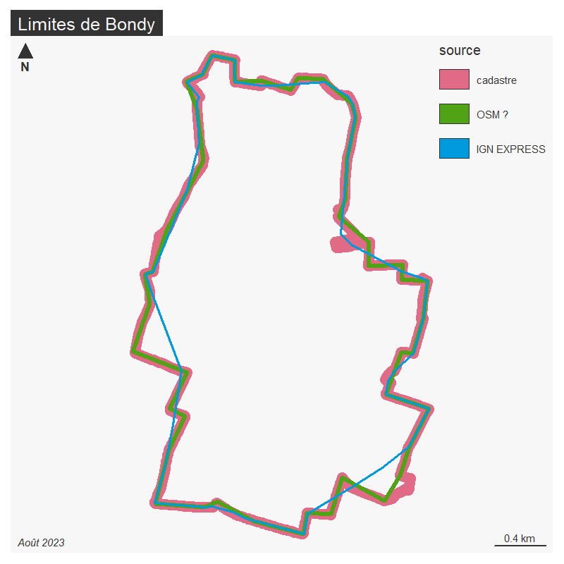

```{r setup, include=FALSE}
knitr::opts_chunk$set(echo = TRUE)
knitr::opts_chunk$set(cache = TRUE)
# Passer la valeur suivante à TRUE pour reproduire les extractions.
knitr::opts_chunk$set(eval = FALSE)
knitr::opts_chunk$set(warning = FALSE)
```


# Objet

Dans le cadre de la maj Operis, on regarde la liste ICPE.
Operis, jugeant la liste difficile à géolocaliser ne le fait pas.

```{r}
library(sf)
library(mapsf)
```


Les couches de bases se trouvent dans trois .gpkg, limitesSocle, cadastre, et plui

le cadastre est issu des couches de sqlite cadastre2024

```{r}
#bondy <- st_read("../data/limitesSocle.gpkg", "bondy", quiet=F)
# plutôt limites
cadastre <- st_read("../data/cadastre2024.gpkg", "parcelle_info")
bondy <- st_read("../data/cadastre.gpkg", "commune")
```


# Problèmes limites cadastrales

les limites de la commune sont différentes seleon la source.
Notamment à l'est et au sud est

```{r}
canal <- st_read("../data/fond.gpkg", "hydrographie_surfacique_idf")
bondy <- st_read("C:/Users/bmaranget/Documents/03_SIG/03_03_Data/03_SOCLE/cadastre2024.sqlite", "geo_commune")
```


On a vu en 2023 que ce sontles limites cadastre les plus précises... on vérifie juste pour 2024 pour les limites sont les mêmes.





```{r}
st_layers("../data/cadastre.gpkg")
bondy2023 <- st_read( "../data/cadastre.gpkg", "commune")
mf_map(bondy, col= "darkorchid2")
mf_map(bondy2023, add = T, col = NA, border="chartreuse1", lwd = 4)
mf_layout("Limites cadastre identiques 2023 2024", "cadastre 2023 2024")
# suppression des espaces dans code
cadastre$code <- gsub(" ", "", cadastre$code)
st_write(cadastre, "../data/cadastre2024.gpkg", "parcelle_info", delete_layer = T)
```

Zoom sur sud est


```{r}
# on identifie les parcelles concernées
#mf_init(cadastre [cadastre$code %in% c('L0129', 'E0093', 'E0104', 'E0057', 'E0092'),])
# mieux en prenant des parcelles haut et bas
png("../img/angleAigu.png")
mf_init(cadastre [cadastre$code %in% c('E0092', 'E0049', 'L0050'),])
mf_map(bondy2023, add = T, col = "gold", border = NA)
mf_map(cadastre, add = T, col = "wheat", border = "coral")
mf_map(canal, add = T, col = "cadetblue1", border=NA)
mf_label(cadastre, "code", col="coral2", cex = 0.5)
mf_layout("Frontière Est Bondy : angle aigu", "cadastre 2024")
dev.off()
```


# ICPE BASIAS BAZOL

On a plusieurs sources operis, georisque/infoterre et le géoportail93

Dans Operis, un recensement de :


```{r}
operis <- read.csv("../data/icpeOperis.csv")
table(operis$Source.de.la.donnée)
table(operis$type)
icpeOperis <- operis [operis$type == 'ICPE',]
icpeOperis$clé
```
89 au total
2 BASOL / 65 BAZIAS / 22 ICPE

On a rajouté une colonne source, clé, et type afin de pouvoir mieux manipuler
la donnée.


Sur géorisque, au départ 19 ICPE (Installations classées pour la protection de l'environnement (ICPE) soumises à autorisation ou à enregistrement (en fonctionnement ou en cessation d'activité))

La consigne d'Operis est de les replacer correctement. Poser une question par rapport à ces différentes sources.


Sur le géoportail93, on a BRGM (brgm) / BASOL et BASIAS

Sur infoterre (brgm), on a BASOL => georisque et BASIAS (anciens sites industriels) 2 sites uniquement

Suite à lecture du géoportail généalogie, on a plus de données dans le BASIAS retravaillé du géoportail93 (59)

Pas d'ICPE sur le géoportail ?

On privilégie les ICPE par respect pour la consigne.22 pour Operis. 19 pour géorisque. et pe des ICPE dans la BASIAS du géoportail ?


# ICPE

En 2023, on a déplacé les ICPE sous Qgis

On vérifie

Il y a 23 icpe dans le fichier, on édite la plaque où apparait l'ICPE, son adresse, le code parcelle 
et l'adresse correspondante.


```{r}
icpe2023 <-st_read("../data/pluiM2.gpkg", "icpeModifie")
 mf_export(x = bondy, filename = "../img/icpe2023.png", 
          expandBB = c(0,0,0,0.0),
          width = 2500, height = 1800 ,res = 200)
  par(mfrow=c(5,5))
  i <- 1
for (i in 1:length(icpe2023$geom)){
  pt <- icpe2023 [i,]
  mf_init(st_buffer(pt,10))
  mf_map(cadastre, col = "antiquewhite1",add = T)
  mf_map(pt, pch = 17, col = "red",add = T)
  mf_map(st_buffer(pt, 5), add = T, lty = 3,  col = NA,border = "aquamarine3")
  parcelle <- st_intersection(st_buffer(pt, 5), cadastre)
  ifelse(length(parcelle$nom_ets > 0),
  mf_label(parcelle, "code", halo = T, col = "aquamarine3"), "0")
  mf_layout(paste0(pt$nom_ets, " : ", pt$adresse),  credits = "")
  mf_annotation(parcelle [1,], parcelle$adresse.1 [1], cex = 0.5, pos = "topright" )
}
dev.off()
```


Attention, hésitations sur :
- STPS déchet ?
- SAS PROTEC pb particulier pas p morale
- masques de france : aller vérifier l'adressage
- cemex bétons et equiom même parcelle ?
- buznaganiaru et didi ? même parcelle 35 et 37 rue de Varsovie

Pour les ICPE 2024, on récupère la maj 7/10/2024

https://www.georisques.gouv.fr/risques/installations/donnees?page=1&region=11&departement=93&commune=93010

et on géocode

```{r}
data <- read.csv2("../data/icpe2024.geocoded.csv")
# ok il y en a 22
data <- st_as_sf(data, coords = c("longitude", "latitude"), crs = 4326)
icpe2024 <- st_transform(data, 2154)
st_write(icpe2024, "../data/pluiM2Juillet.gpkg", "icpe2024")
```


```{r}
# pb espaces en 2023
icpe2023$nom_ets <- gsub("(^\\s+|\\s+$|(?<=\\s)\\s)","",icpe2023$nom_ets, perl=T)
icpe2024$Nom.établissement <- gsub("(^\\s+|\\s+$|(?<=\\s)\\s)","",icpe2024$Nom.établissement, perl=T)

# trouver tts les valeurs de 2023 qui n'apparaissent pas en 2024 et inversement
noms2023 <- setdiff(icpe2023$nom_ets, icpe2024$Nom.établissement)
noms2024 <- setdiff(icpe2024$Nom.établissement, icpe2023$nom_ets)
noms2023
noms2024
icpe2024$Nom.établissement
```

toujours même pb localisation

STPS déchet : on ne sait pas, sur recherche SIRET, on ne trouve que Siège social Livry Gargan

Méthode : on recopie ICPE modifié 2023 et on corrige avec ICPE2024 le cas échéant


- élimination STPS Déchet, on garde RFM (existe toujours sur le terrain)

- vérif localisation CERTAS sur photo aérienne (garage)

- SNB ok

- 2A TRADING devient France Emballage International


