```{r setup, include=FALSE}
knitr::opts_chunk$set(echo = TRUE)
knitr::opts_chunk$set(cache = TRUE)
# Passer la valeur suivante à TRUE pour reproduire les extractions.
knitr::opts_chunk$set(eval = FALSE)
knitr::opts_chunk$set(warning = FALSE)
```


# Objet

Production cartes de verif pour M3

```{r}
library(sf)
library(mapsf)
library(mapview)
```


Les couches de bases se trouvent dans trois .gpkg, limitesSocle, cadastre, et plui

le cadastre est issu des couches de sqlite cadastre2024

```{r}
#bondy <- st_read("../data/limitesSocle.gpkg", "bondy", quiet=F)
# plutôt limites
st_layers("../data/limitesSocle.gpkg")
st_layers ("../data/cadastre2024.gpkg")
st_layers("../data/pluiM3.gpkg")
cadastre <- st_read("../data/cadastre2024.gpkg", "parcelle_info")
bondy <- st_read("../data/cadastre2024.gpkg", "bondy")
```


# A faire une seule fois

## Limite communale cadastre


```{r}
bondy <- st_read("C:/Users/bmaranget/Documents/03_SIG/03_03_Data/03_SOCLE/cadastre2024/cadastre2024.sqlite", "geo_commune")
st_write(bondy, "../data/cadastre2024.gpkg", "bondy", delete_layer = T)
```

## Code sans espace


```{r}
cadastre$code
# suppression des espaces dans code
cadastre$code <- gsub(" ", "", cadastre$code)
st_write(cadastre, "../data/cadastre.gpkg", "parcelle_info", delete_layer = T)
```


# Données

## enregistrement en .gpkg


```{r}
info_surf <- st_read("../data/pluiM3.gpkg", "200057875_INFO_SURF_20250624.shp")
prescriptionSurf <- st_read("../data/pluiM3.gpkg", "200057875_PRESCRIPTION_SURF_20250624.shp")
```


```{r}
# premier envoi
fic <- "C:/Users/bmaranget/Documents/03_SIG/03_03_Data/06_URBA/M3/EEversionBrouillon.gpkg"
# envoi pour transmission operis
nom <- list.files("C:/Users/bmaranget/Documents/03_SIG/03_03_Data/06_URBA/M3/VF/", ".shp")
# ouverture des 7 shapes
nom
n <- nom [4]
theme <- NULL
for (n in nom){
  tmp <- st_read(paste0("C:/Users/bmaranget/Documents/03_SIG/03_03_Data/06_URBA/M3/", n))
  inter <- st_intersection(tmp, bondy)
  # reprise des themes
  TMPtheme <- inter [,1, drop = T]
  TMPcouche <- n
  TMPdfTheme <- data.frame(TMPcouche,TMPtheme)
  theme <- rbind(theme, TMPdfTheme)
  # pb duplication noms colonnes (on retire les colonnes dupliquées)
  ind <- which(duplicated(tolower(names(inter))))
  print(length(ind))
  #inter2 <- ifelse(length(ind) == 1,inter [,-ind], inter)
  if (length(ind) == 0){
    st_write(inter, "../data/pluiM3.gpkg", n, delete_layer  = T)
  } else {
    print(names(inter)[ind])
    inter <- inter [,-ind]
    st_write(inter, "../data/pluiM3.gpkg", n, delete_layer  = T)
  }
}
st_layers(("../data/pluiM3.gpkg"))
# pour le brouillon
fic <- "06_URBA/pluiM3bondy4.gpkg"
# les thèmes
theme <- unique(theme)
write.csv(theme,"../data/libelleM3.csv", fileEncoding = "UTF-8", row.names = F)
```

```{r}
st_layers(fic)
nom <- st_layers(fic [[1]])
nom <- nom$name
# exclusion PAPAG
nom
nom <- nom[-5]
n <-  nom [6]
df <- NULL
for (n in nom){
  print(n)
  nomCouche <- paste0("2023_",n)
  tmp <- st_read(fic, n)
  tmp <- st_make_valid(tmp)
  # pb projection differentes
  tmp <- st_transform(tmp, 2154)
  inter <- st_intersection(tmp, bondy)
  #inter <- st_cast(inter, "POLYGON")
  assign(n, inter)
  #lib <- unique(inter [,1, drop = T])
  #origine <- nomF [i]
  #dfTmp <- data.frame(lib,origine)
  #df <- rbind(dfTmp, df)
  # suppression des doublons de colonne
  ind <- which(duplicated(tolower(names(inter))))
  inter <- inter [,-ind]
  st_write(inter, "../data/pluiM3bondy4.gpkg", n, delete_layer = T)
}
```


# Cartographie

## INFO_SURF

```{r}
info_surf <- st_read("../data/pluiM3.gpkg", "200057875_INFO_SURF_20250624.shp")
```


### TA

```{r}
ta <- st_read("../data/pluiM3.gpkg", "200057875_INFO_SURF_20250624.shp")
ta <- ta [ta$LIBELLE == "Taxe d'amenagement",]
mf_export(x = bondy, filename = paste0("../img/ta2025.png"), 
          expandBB = c(0,0,0,0.3),
          width = 1000, res = 200)
  mf_init(bondy, theme = "candy")
  mf_shadow(bondy, add = TRUE)
  mf_map(bondy, add = TRUE)
  mf_typo(
    ta,
    pal = c("orange", "yellow"),
    border = NA,
    var = "TXT",
    leg_pos = "topright",
    leg_title = "Montant (%)",
    add = TRUE
  )

mf_layout(title = "Taxe d'aménagement M3 juillet 2025",
            credits = "Plui M2\nBondy,  juillet 2025")
dev.off()
```


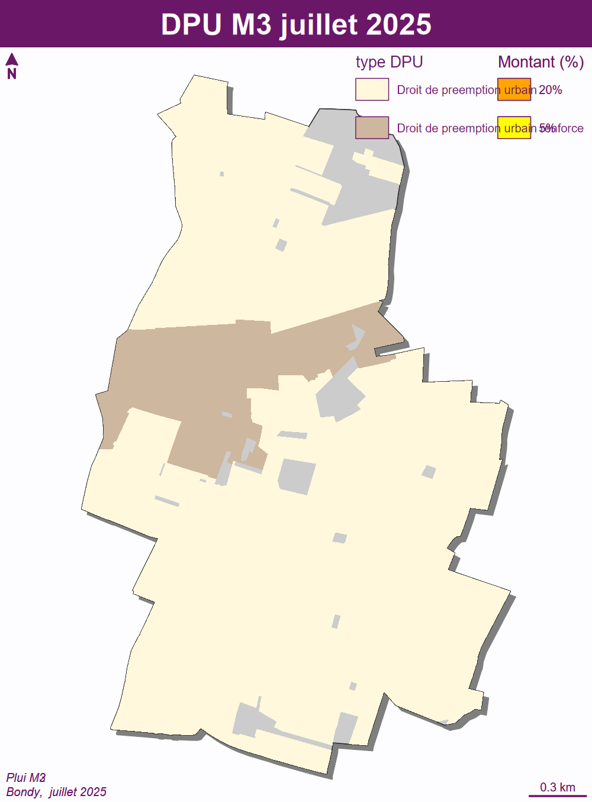

### DPU


```{r}
dpu <- info_surf [grep( "^Droit", info_surf$LIBELLE),]
mf_export(x = bondy, filename = paste0("../img/dpu_2025.png"), 
          expandBB = c(0,0,0,0.3),
          width = 1000, res = 200)
  mf_init(bondy, theme = "candy")
  mf_shadow(bondy, add = TRUE)
  mf_map(bondy, add = TRUE)
  mf_typo(
    dpu,
    pal = c( "cornsilk", "bisque3"),
    border = NA,
    var = "LIBELLE",
    leg_pos = "topright",
    leg_title = "type DPU",
    add = TRUE
  )
mf_layout(title = "DPU M3 juillet 2025",
            credits = "Plui M3\nBondy,  juillet 2025")
dev.off()
```

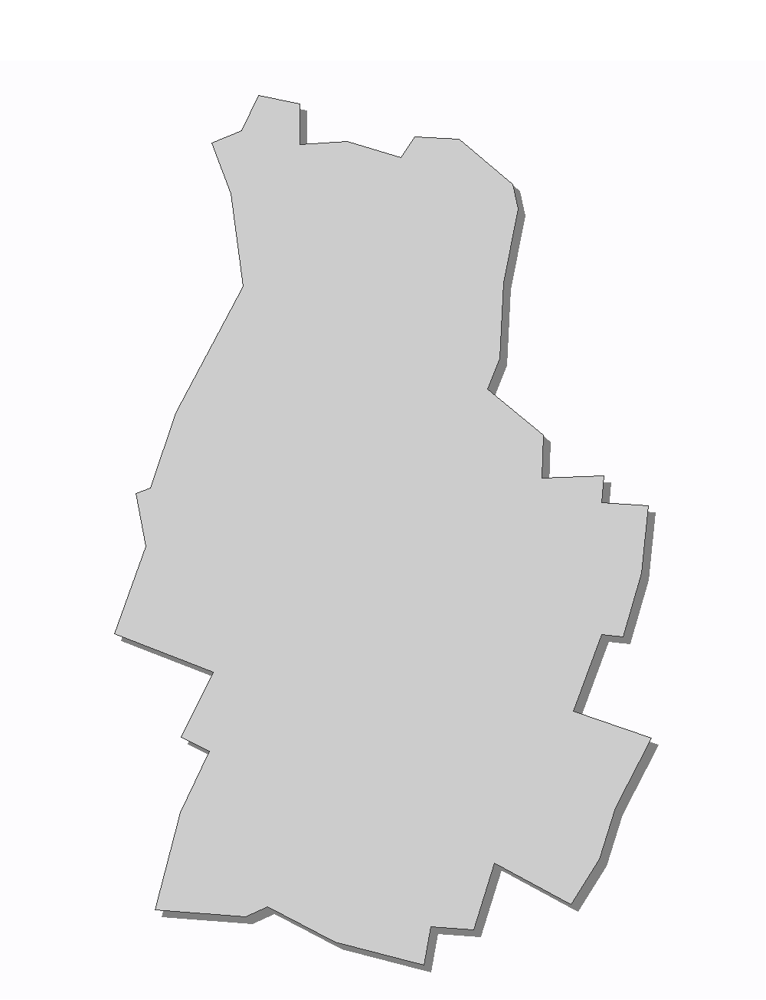
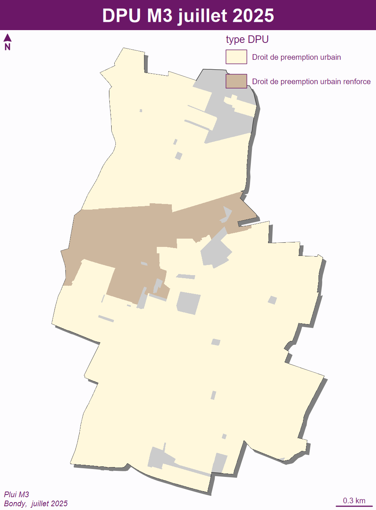


### Zone archéologique

attention l'intersection prend les parcelles mitoyennes.
utilisation du whithin sparse avec un which pour les num de lignes fonctionne bien

```{r}
archeo <- st_read("../data/pluiM3.gpkg", "200057875_INFO_SURF_20250624.shp")
archeo <- archeo  [archeo$LIBELLE == 'Site archeologique',]
dedans <- as.vector(st_within(cadastre, archeo, sparse = F))
dedans <- which(dedans ==TRUE)
dedans <- cadastre [dedans,]
cadZa <- cadastre [dedans, ]

mf_export(x = bondy, filename = "../img/archeo_2025.png", 
          expandBB = c(0,0,0,0.0),
          width = 1000, height = 1000 ,res = 150)
  mf_init(archeo, theme = "candy")
  mf_shadow(bondy, add = TRUE)
  mf_map(bondy, add = TRUE)
  mf_map(cadastre, col = "cornsilk", border = "wheat", add = T)
  mf_map(
    archeo,
    col = NA,
    type = "base",
    border = "green",
    lwd = 3,
    add = T
  )

mf_label(cadZa,, var = "code", halo = T, cex = 0.5, overlap = F)  
mf_layout(title = archeo$LIBELLE,
            credits = "Plui M3\nBondy,  juillet 2025")
dev.off()
```


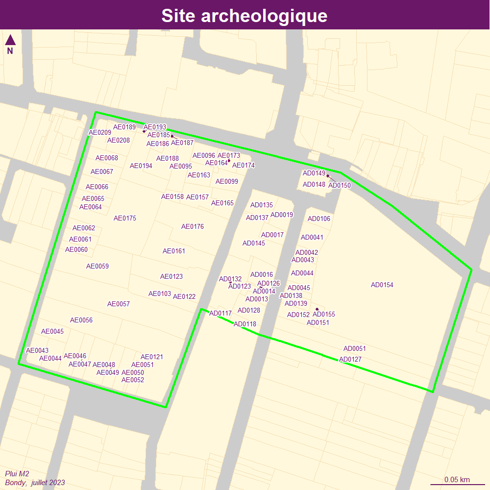


RCU

```{r}
rcu <- info_surf [substring(info_surf$LIBELLE, 1,4) == "Zone", ]
dedans <- as.vector(st_within(cadastre, rcu, sparse = F))
dedans <- which(dedans ==TRUE)
dedans <- cadastre [dedans,]
cadZa <- cadastre [dedans, ]
mf_export(x = rcu, filename = "../img/rcu.png", 
          expandBB = c(0,0,0,0.0),
          width = 1000, height = 1000 ,res = 150)
  mf_init(rcu, theme = "candy")
  mf_shadow(bondy, add = TRUE)
  mf_map(bondy, add = TRUE)
  mf_map(cadastre, col = "cornsilk", border = "wheat", add = T)
  mf_map(
    rcu,
    col = NA,
    type = "base",
    border = "green",
    lwd = 3,
    add = T
  )

mf_label(cadZa,, var = "code", halo = T, cex = 0.5, overlap = F)  
mf_layout(title = rcu$LIBELLE,
            credits = "Plui M2\nBondy,  juillet 2023")
dev.off()
```


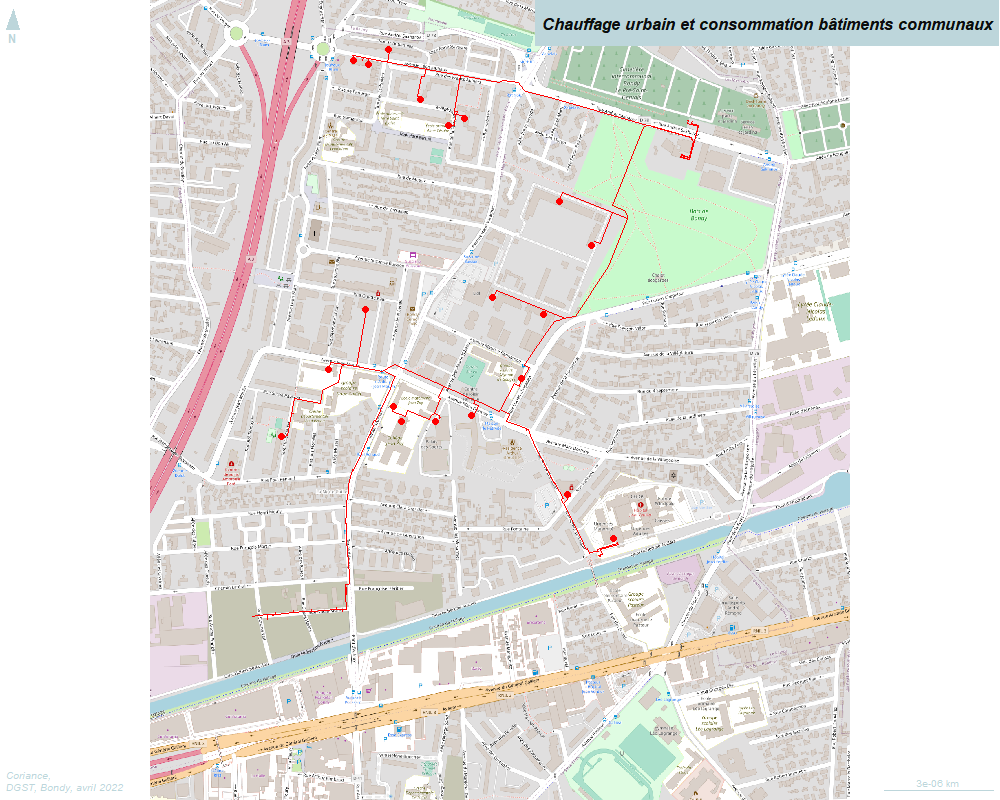

PPCOA (ancien sursis à statuerr)


```{r}

ppcoa <- info_surf [substring(info_surf$LIBELLE, 1,5) == "PPCOA", ]
mf_export(x = ppcoa, filename = "../img/ppcoa_2025.png", 
          expandBB = c(0,0,0,0.0),
          width = 1000, height = 1000 ,res = 150)
  mf_init(ppcoa, theme = "candy")
  mf_shadow(bondy, add = TRUE)
  mf_map(bondy, add = TRUE)
  mf_map(cadastre, col = "cornsilk", border = "wheat", add = T)
  mf_map(
    ppcoa,
    var = "LIBELLE",
    col = NA,
    type = "typo",
    border = "green",
    lwd = 3,
    add = T
  )

mf_layout(title = "PPCOA",
            credits = "Plui M3\nBondy,  juin 2025")
dev.off()
```


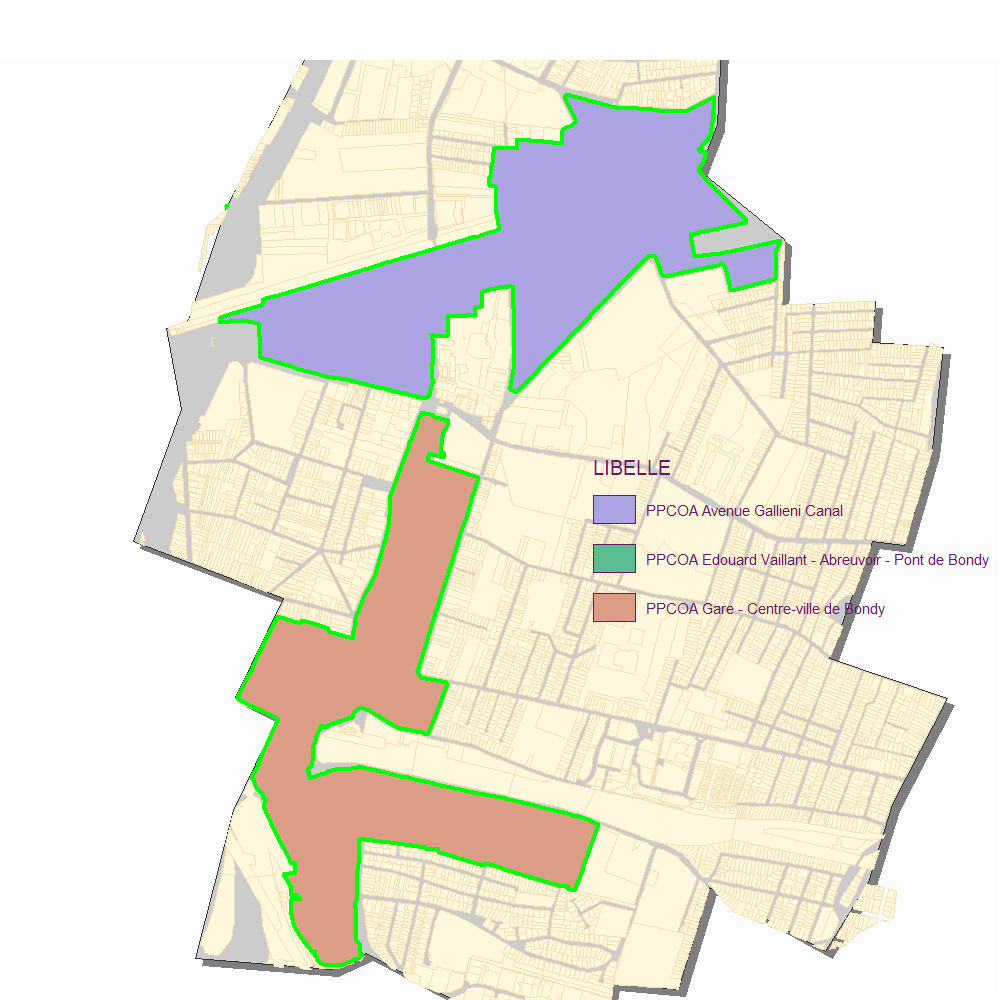
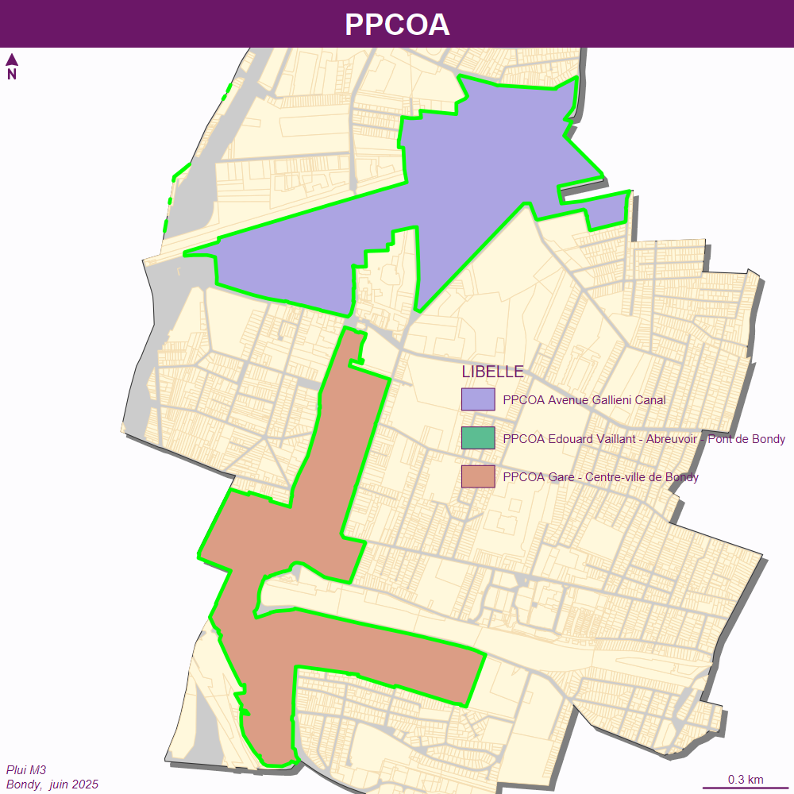

```{r}
# verif
ppcoa <- ppcoa [3,]
ppcoa
dedans <- as.vector(st_within(cadastre, ppcoa, sparse = F))
dedans <- which(dedans ==TRUE)
dedans <- cadastre [dedans,]
cadZa <- cadastre [dedans, ]
```


pb AJ12


```{r}
AJ12 <- cadastre [cadastre$code == "AJ0012",]
AJ12 <- cadastre [3774,]
ppcoa
mf_init(st_buffer(AJ12, 30))
mf_map(cadastre, col = "cornsilk", border = "wheat", add = T)
mf_map(ppcoa,  border = "green",  col = NA,  lwd = 5,add = TRUE)
mf_label(AJ12, var = "code", cex = 1.5)
mf_layout("PPCOA et parcelle AJ12 : inclusion", credits = "Bondy / DGST\nPLUi M2, juillet 2023")
```


pb I41

```{r}
I41   <- cadastre [cadastre$code == " I0041",]
grep("I0041", cadastre$code)
I41 <- cadastre [1233,]
lineaire <- pres_lin [substring(pres_lin$LIBELLE, 10, 14) == "actif", ]
arbre <- pres_lin [substring(pres_lin$LIBELLE, 14, 19)== "arbres",]
mf_init(st_buffer(I41, 10))
mf_map(cadastre, col = "cornsilk", border = "wheat", add = T)
mf_map(lineaire,  col = "red",    lwd = 5,add = TRUE)
mf_map(arbre, col = "green", lty = 2, lwd = 5, add = T)
mf_label(I41, var = "code", cex = 1.5)
mf_layout("linéaire actif à créer et parcelle I41 : demande de continuation", credits = "Bondy / DGST\nPLUi M2, juillet 2023")
```


PPR

```{r}
ppr <- info_surf [substring(info_surf$LIBELLE, 1,3) == "PPR", ]
mf_init(AG0162)
mf_map(AG0162)
  mf_map(cadastre, col = "cornsilk", border = "wheat", add = T)
  mf_map(ppr, border = "green",  color = NA, lwd = 3,add = T)
# verif
dedans <- as.vector(st_within(cadastre, ppr, sparse = F))
dedans <- which(dedans ==TRUE)
AG0162 <- cadastre [3303,]

```


### ZAC

```{r}
zac <- info_surf[ind, ]
ind <- grep("^ZAC", info_surf$LIBELLE)
mf_map(zac)
```


```{r}
mf_export(x = zac, filename = "../img/zac_2025.png", 
          expandBB = c(0,0,0,0.0),
          width = 1000, height = 1000 ,res = 150)
  mf_init(zac, theme = "candy")
  mf_shadow(bondy, add = TRUE)
  mf_map(bondy, add = TRUE)
  mf_map(cadastre, col = "cornsilk", border = "wheat", add = T)
  mf_map(
    zac,
    var = "LIBELLE",
    col = NA,
    type = "typo",
    border = "green",
    lwd = 3,
    add = T
  )

mf_layout(title = "ZAC",
            credits = "Plui M3\nBondy,  juin 2025")
dev.off()
```


## Prescriptions surfaciques


### ER


Les emplacements réservés par rapport à Operis, type de l'emplacement (cf tableau)

```{r}
er <- prescriptionSurf  [prescriptionSurf$LIBELLE == "Emplacement reserve (pour voie ou ouvrages publics, equipements et installations d’interet general, espaces verts)",]
erTXT <- read.csv("../data/er.csv", fileEncoding = "UTF-8")
# pour avoir le libellé récupération tableau M2
joint <- merge(er, erTXT, by = "TXT", all.x = T)
mapview(joint [, c("TXT", "LIBELLE.y")])
mf_export(x = bondy, filename = "../img/er2025.png", 
          expandBB = c(0,0,0,0.3),
          width = 1000, res = 200)
  mf_init(bondy, theme = "candy")
  mf_shadow(bondy, add = TRUE)
  mf_map(bondy, add = TRUE)
  mf_map(
    er,
    col = "green",
    type = "base",
    border = NA,
    add = T
  )
  mf_label(joint, var="TXT", overlap = F, lines = T,  cex =0.6, bg = "white", halo = T)
  

mf_layout(title = "Emplacements réservés M3 2025",
            credits = "Plui M3\nBondy,  juillet 2025")
dev.off()
```


```{r}
er <- joint
# carto pour chaque emplacement réservé avec affichage en titre de l'emplacement, fond de carte cadastre.
nb <- length(er$LIBELLE.x)
# 19 2025
i <- 1
for (i in 1:nb){
  print (i)
  mf_export(x = er$geom [i], filename = paste0("../img/er",er$TXT.x [i],"_2025 .png"), 
          width = 800, height = 800, res = 125)
  mf_init(st_buffer(er$geometry [i],50), expandBB = rep(0,4))
  mf_map(bondy, col = "cornsilk", add = T, border = NA)
  #mf_shadow(bondy, add = TRUE)
  mf_map(cadastre, col = "bisque2", border = "white", add = T)
  mf_map(
    er,
    col = "green",
    type = "base",
    border = "darkgreen",
    lwd = 4,
    add = T
  )
  sel <- er [i,]
  #mf_label(sel, var = "TXT", halo = T, cex = 1.2, col = "darkgreen",pos = 4, offset = 5, lines = T)
  inter <- st_intersection(cadastre, sel)
  mf_label(inter, var = "code", col = "red", halo = T, overlap = F )
  mf_layout(credits = "Cadastre 2024, Plui M2\nJuillet 2025" )
  mf_title(txt = paste0(er$TXT [i], " : ",  er$LIBELLE.y [i]), pos = "left", bg ="coral2", cex = 0.8, line = 2)
  dev.off()
}
```


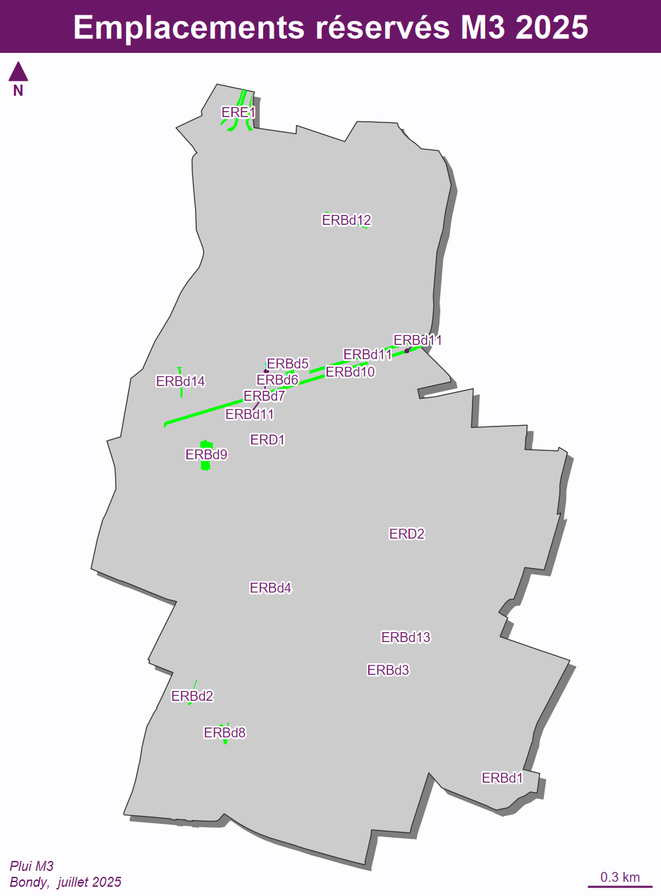
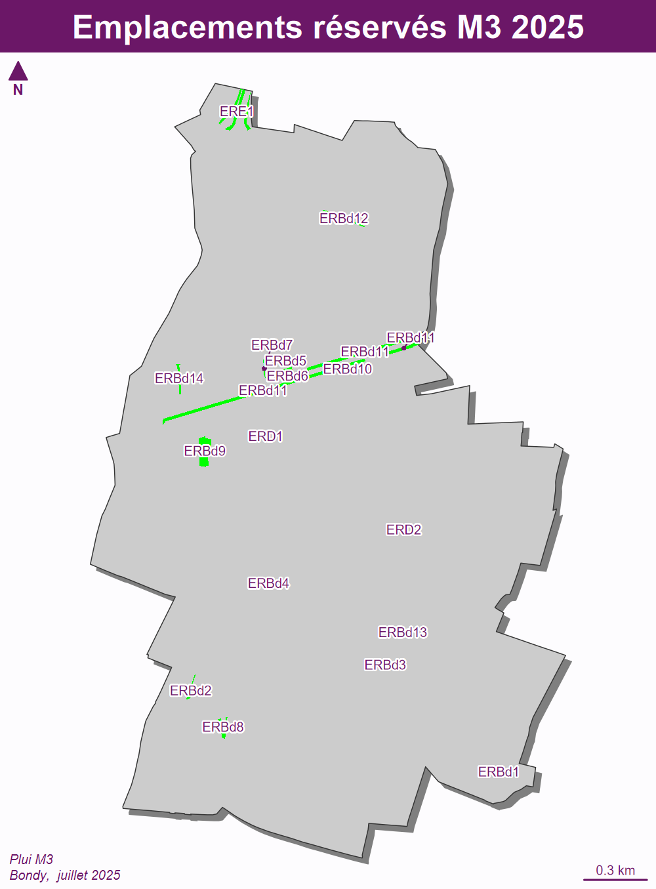

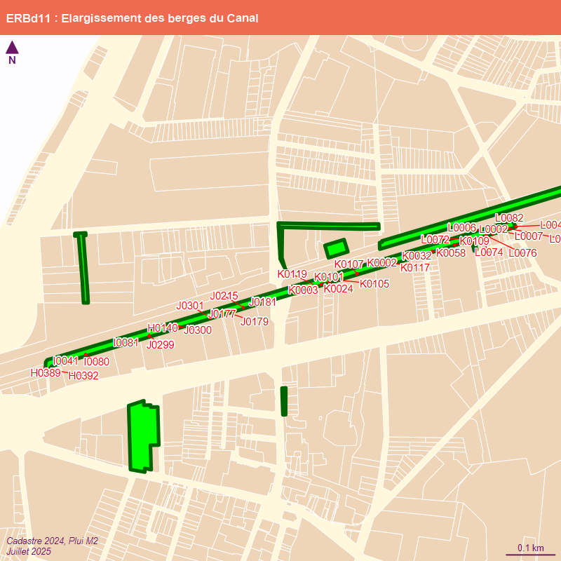


 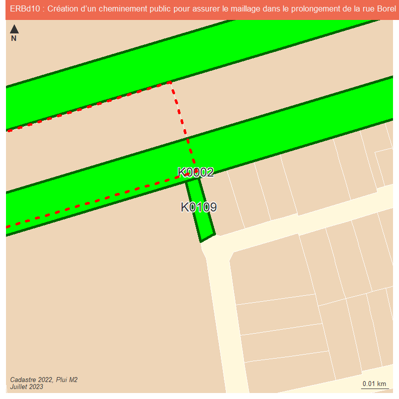   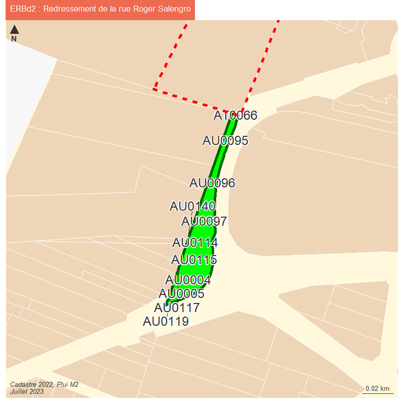  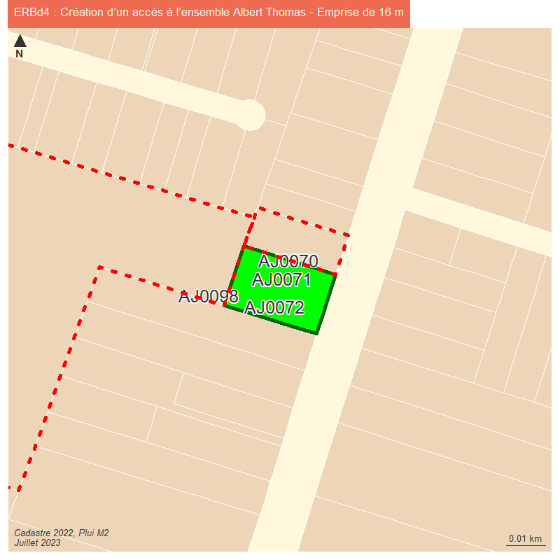 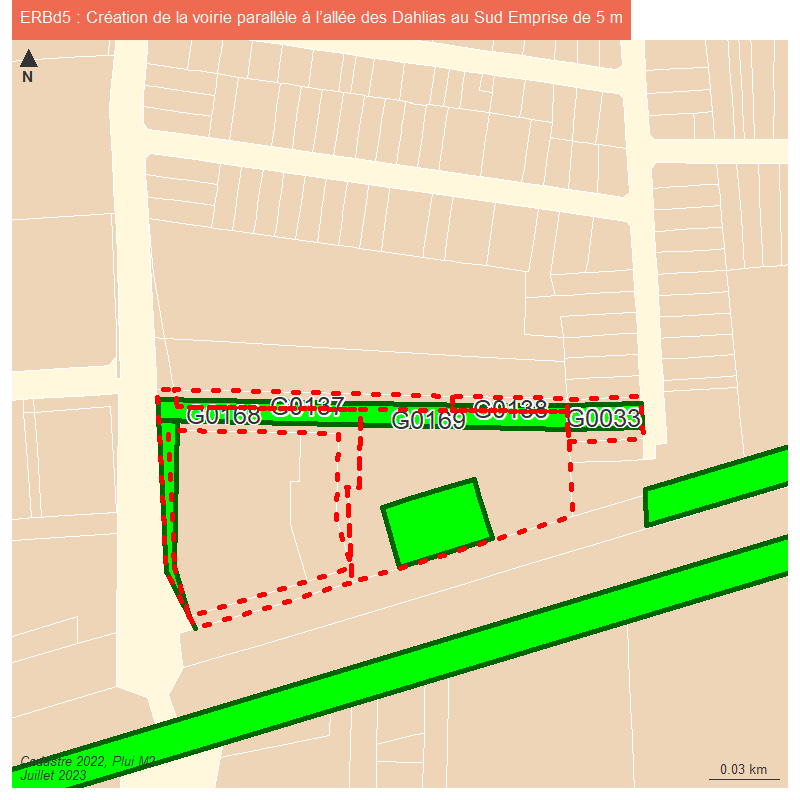    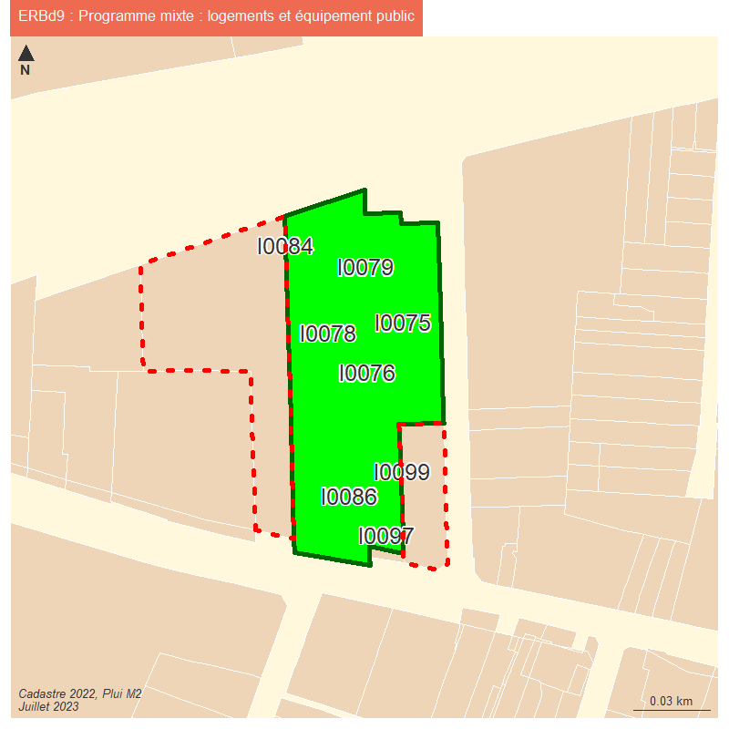 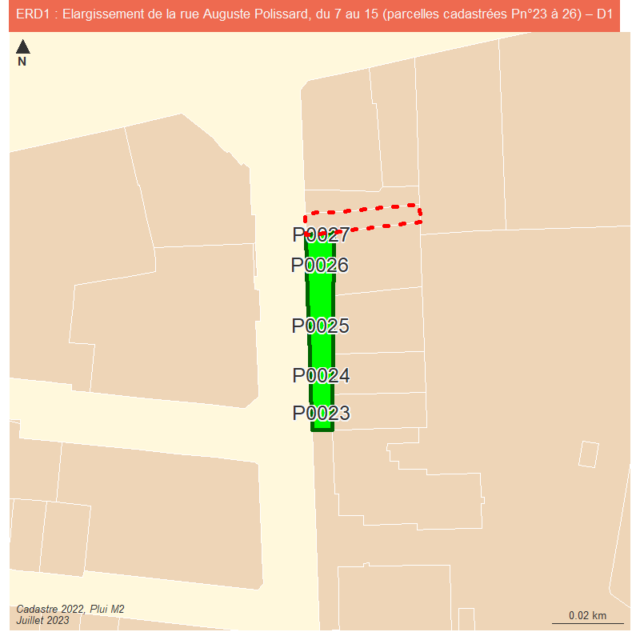  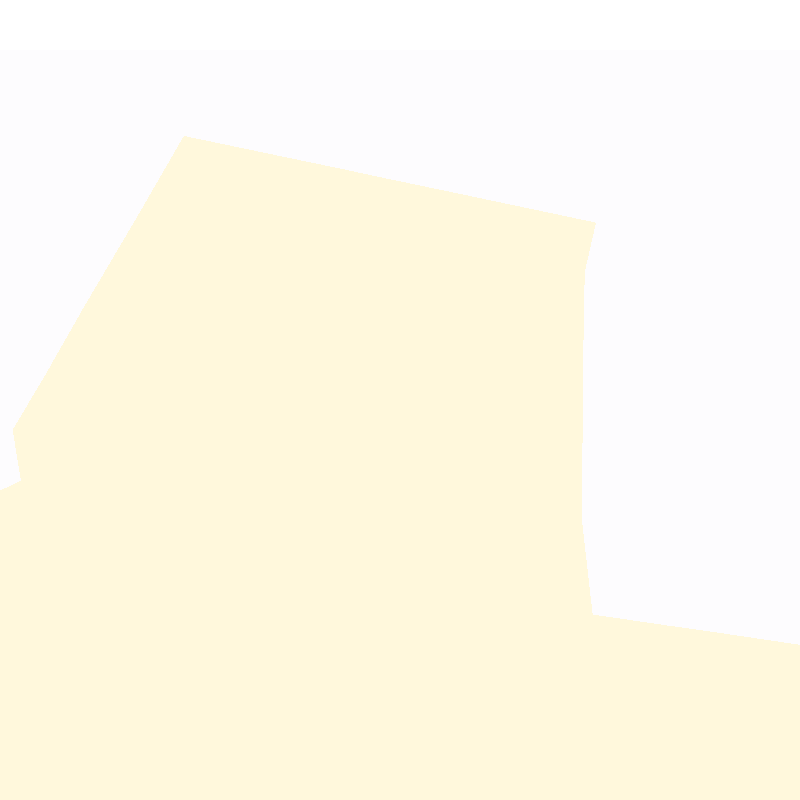

```{r}
st_write(er, "../data/pluiM3.gpkg", "er", delete_layer = T)
```


# ICPE BASIAS BAZOL

On a plusieurs sources operis, georisque/infoterre et le géoportail93

Dans Operis, un recensement de :


```{r}
operis <- read.csv("../data/icpeOperis.csv")
table(operis$Source.de.la.donnée)
table(operis$type)
icpeOperis <- operis [operis$type == 'ICPE',]
icpeOperis$clé
```
89 au total
2 BASOL / 65 BAZIAS / 22 ICPE

On a rajouté une colonne source, clé, et type afin de pouvoir mieux manipuler
la donnée.


Sur géorisque, au départ 19 ICPE (Installations classées pour la protection de l'environnement (ICPE) soumises à autorisation ou à enregistrement (en fonctionnement ou en cessation d'activité))

La consigne d'Operis est de les replacer correctement. Poser une question par rapport à ces différentes sources.


Sur le géoportail93, on a BRGM (brgm) / BASOL et BASIAS

Sur infoterre (brgm), on a BASOL => georisque et BASIAS (anciens sites industriels) 2 sites uniquement

Suite à lecture du géoportail généalogie, on a plus de données dans le BASIAS retravaillé du géoportail93 (59)

Pas d'ICPE sur le géoportail ?

On privilégie les ICPE par respect pour la consigne.22 pour Operis. 19 pour géorisque. et pe des ICPE dans la BASIAS du géoportail ?


# ICPE


## Géorisques : pb géocadage

```{r}
icpe <- st_read("../data/InstallationsClassees_France.shp")
icpe <- icpe [ icpe$cd_insee == '93010',]
# 19 obs
mf_map(icpe)
mf_label(icpe, "nom_ets", halo=T, overlap=F)
write.csv(icpe, "../data/icpeGeorisque.csv", fileEncoding = "UTF-8")
```

Pb géocodage, donc on enregistre et on géocode à nouveau

- modif par rapport à CERTAS (2 adresses)
- et une adresse -5 chemin latéral
- 34 étienne Dolet

```{r}
data <- read.csv("../data/icpe.nomgeocoded.csv")
plus <- read.csv("../data/icpeOperisComplement.geocoded.csv")
# ok il y en a 19
data <- st_as_sf(data, coords = c("longitude", "latitude"), crs = 4326)
icpeGeo <- st_transform(data, 2154)
str(icpeGeo)
data <- st_as_sf(plus, coords = c("longitude", "latitude"), crs = 4326)
comp <- st_transform(data,2154)
comp <- comp [,c("nom_ets", "adresse")]
icpeGeo <- icpeGeo [, c("nom_ets", "adresse")]
icpeGeo
comp
icpe <- rbind(icpeGeo, comp)
```

## Comparaison operis - georisque

il y a 3 éléments en plus

```{r}
op <- gsub(" ", "", icpeOperis$clé)
geo <- gsub(" ", "", icpeGeo$nom_ets)
sort(icpeGeo$nom_ets)
sort(icpeOperis$clé)
setdiff(op,geo)
```

Donc BIONAZ CEMEX BETON et EQUIOM BETON sont en plus.

On repart du fichier géocodé de géorisque, auquel on rajoute ces 3 éléments.


```{r}
inter <- st_intersection(cadastre, icpe)
```

Uniquement 10 intersections...
On étudie les 12 autres graphiquement avant de se repérer par rapport aux adresses parcelles.

```{r}
diff <- setdiff(icpe$nom_ets, inter$nom_ets)
  mf_export(x = bondy, filename = "../img/icpe.png", 
          expandBB = c(0,0,0,0.0),
          width = 2500, height = 1800 ,res = 200)
  par(mfrow=c(3,4))
  i <- 1
for (i in 1:length(diff)){
  pt <- icpe [icpe$nom_ets == diff[i],]
  mf_init(st_buffer(pt,10))
  mf_map(cadastre, col = "antiquewhite1",add = T)
  mf_map(pt, pch = 17, col = "red",add = T)
  mf_map(st_buffer(pt, 5), add = T, lty = 3,  col = NA,border = "aquamarine3")
  parcelle <- st_intersection(st_buffer(pt, 5), cadastre)
  ifelse(length(parcelle$nom_ets > 0),
  mf_label(parcelle, "code", halo = T, col = "aquamarine3"), "0")
  mf_layout(paste0(pt$nom_ets, " : ", pt$adresse),  credits = "")
  mf_annotation(parcelle [1,], parcelle$adresse.1 [1], cex = 0.5, pos = "topright" )
}
dev.off()

```

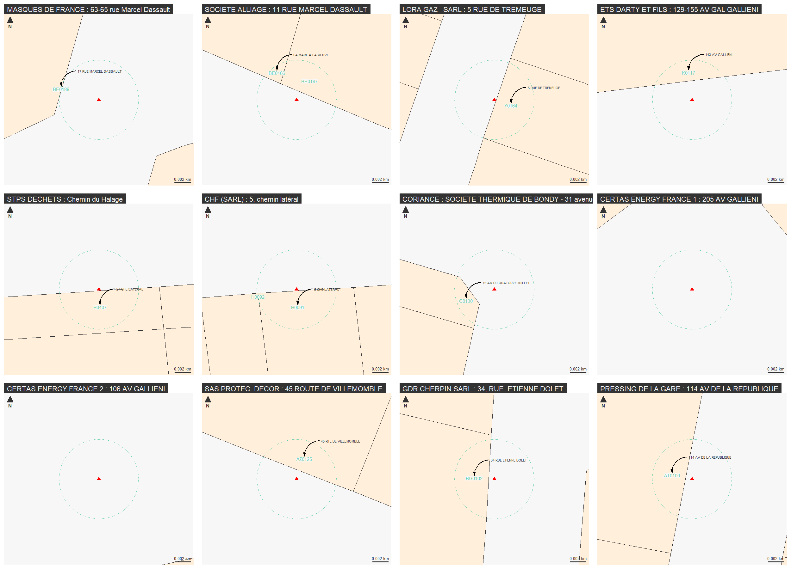
pb i = 8 et 9

```{r}
mf_export(x = bondy, filename = "../img/icpeCERTAS.png", 
          expandBB = c(0,0,0,0.0),
          width = 800, height = 400 , res = 100)
i <- grep("CERTAS", icpe$nom_ets)
 pt <- icpe [i,]
  mf_init(st_buffer(pt,70))
  mf_map(cadastre, col = "antiquewhite1",add = T)
  mf_map(pt, pch = 17, col = "red",add = T)
  mf_map(st_buffer(pt, 15), add = T, lty = 3,  col = NA,border = "aquamarine3")
  parcelle <- st_intersection(st_buffer(pt, 13.5), cadastre)
  parcelle$loc <- paste0(parcelle$code, "\n",parcelle$adresse.1)
  mf_label(parcelle, "loc", halo = T, cex = 0.8,col = "aquamarine3", pos = 4,overlap = F)
  mf_label(pt, "adresse", col = "red", pos = 2)
  mf_layout("CERTAS : 2 adresses",  credits = "")
dev.off()
```

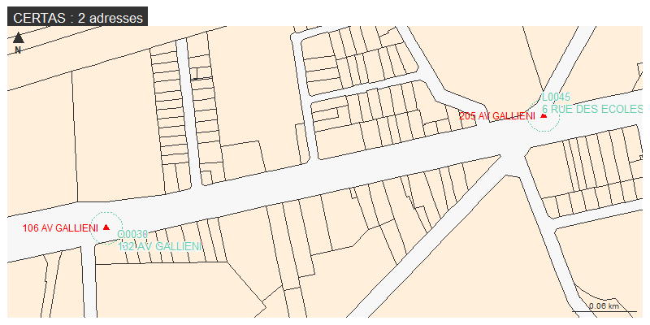

Sous Qgis, on déplace les points sur la parcelle.

```{r}
st_write(icpe, "../data/pluiM2.gpkg", "icpe", delete_layer = T)
icpe <-st_read("../data/pluiM2.gpkg", "icpeModifie")
```

Attention, hésitations sur :
- STPS déchet ?
- SAS PROTEC pb particulier pas p morale
- masques de france : aller vérifier l'adressage
- cemex bétons et equiom même parcelle ?
- buznaganiaru et didi ? même parcelle 35 et 37 rue de Varsovie


## Géoportail 93

Le géocodage est-il meilleur ?

```{r}
basiasGeoportail <- st_read("../data/2023-08-08_basias___anciens_sites_industriels_et_activites_de_service___brgm_.geojson")
basolGeoportail <- st_read("../data/2023-08-08_sites_et_sols_pollues__ou_potentiellement_pollues__en_seine_saint_denis.geojson")
```

On retrouve les 2 BASOL mais pas les ICPE.

Je n'ai pas les ICPE...


```{r}
data <- data [, c("adresse", "code", "proprietaire", "adresse.1", "nom_ets")]
# étudier correspondance proprio cadastre et nom_ets
write.csv(data, "../data/intersectionICPECadastre.csv", fileEncoding = "UTF-8")
st_write(data, "../data/pluiM2.gpkg", "icpe", delete_layer = T)
```


```{r}

```


```{r}
icpe <- st_read("../data/pluiM2.gpkg", "icpe")
data <- st_intersection(cadastre, icpe)
data <-  data [, c("code", "adresse", "adresse.1", "nom_ets")]
data
write.csv(data, "../data/icpe.csv", fileEncoding = "UTF-8")

mf_map(data)
mf_label(data, "nom_ets", halo=T, overlap=F)
```


# Renaturation

## Arbres

```{r}
data <- st_read("D:/03_SIG/03_03_Data/15_PARCS ET JARDINS/campagneArbre.gpkg", "arbreProtege")
plui <- st_read("../data/pluiM3.gpkg", "200057875_PRESCRIPTION_PCT_20250624.shp")
M2 <- st_read("../data/pluiM2.gpkg", "pres_pct")
st_layers("../data/pluiM2.gpkg")
```


19 arbres sélectionnés, 25 points.


1 représente la fontaine.

les autres points, les anciens arbres (5)

```{r}
plui$LIBELLE
names(plui)
head(plui)
mapview(plui  [25,])
```


```{r}
mapview(M2)
```


```{r}
mf_map(plui)
plui$id <- rownames(plui)
mf_label(plui, "id", overlap = F, cex = 1, halo = T, pos = 4)
mapview(plui [, "id"])
data$id <- rownames(data)
data$id <- as.integer(data$id)+5
mf_map(data, add = T, col = "red")
mf_label(data, "id", pos = 1, col = "red" , cex = 1.5, overlap = F)
```


```{r}
write.csv(data  [, c("id", "type", "lieu"), drop = T], "../data/arbreProtege.csv", fileEncoding = "UTF-8") 
```


