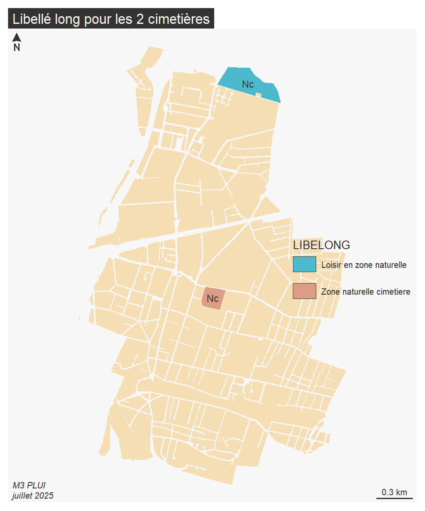
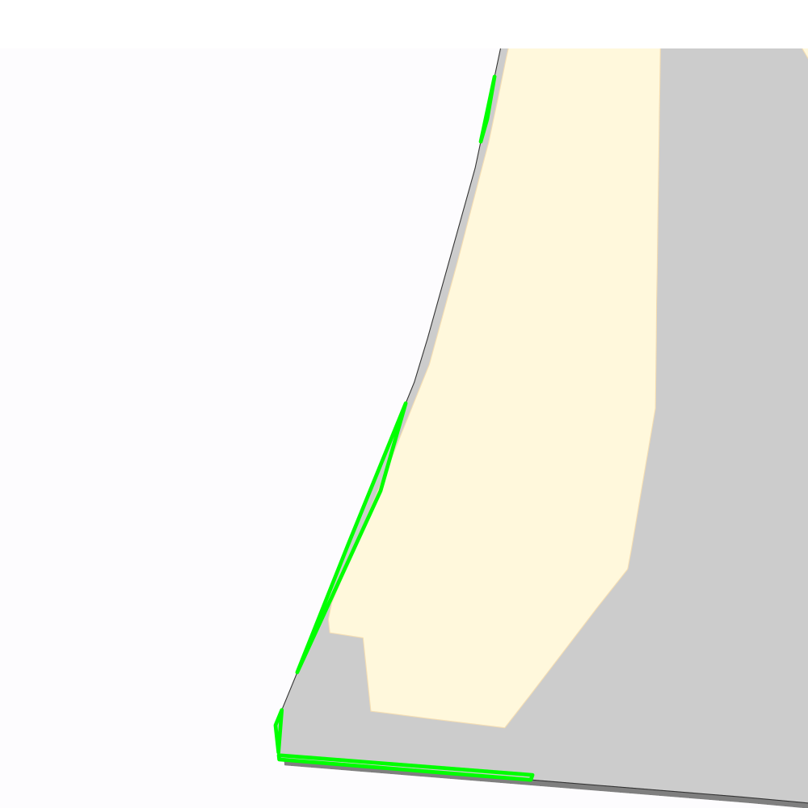
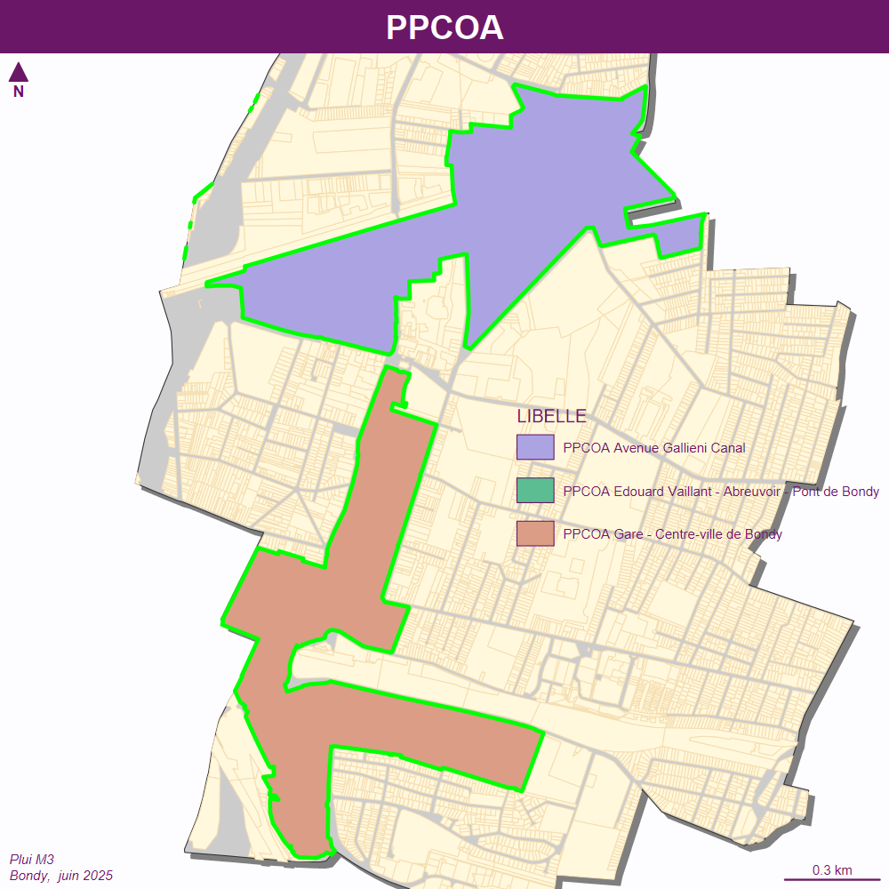
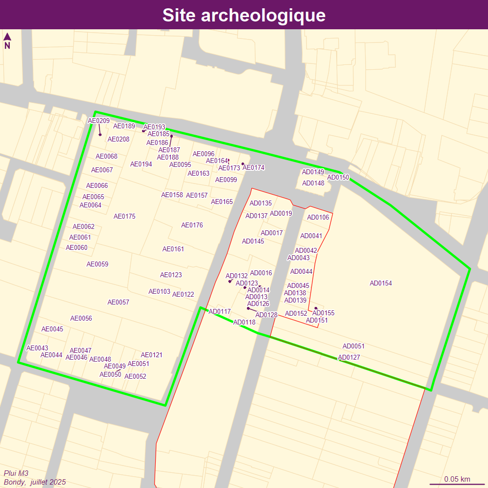

```{r setup, include=FALSE}
knitr::opts_chunk$set(echo = TRUE)
knitr::opts_chunk$set(cache = TRUE)
# Passer la valeur suivante à TRUE pour reproduire les extractions.
knitr::opts_chunk$set(eval = TRUE)
knitr::opts_chunk$set(warning = FALSE)
```


# Objet

Points pb sur 2025

Pour l'étude complète voir pluiM3.Rmd


```{r}
library(sf)
library(mapsf)
library(mapview)
```


```{r}
st_layers("../data/pluiM3.gpkg")
cadastre <- st_read("../data/cadastre2024.gpkg", "parcelle_info")
bondy <- st_read("../data/cadastre2024.gpkg", "bondy")
```


# Zonage : anomalie des espaces de loisirs et zone de cimetière

```{r}
zone <- st_read("../data/pluiM3.gpkg", "M3_ZONE_URBA")
```


```{r}
png("../img/M3_NC.png", width = 1000, height = 1200, res = 200)
mf_map(cadastre, col="wheat", border = NA)
mf_map(type = "typo", zone [zone$code == 'Nc',], border= NA, var = "LIBELONG", add = T, leg_pos = "right")
mf_label(zone [zone$LIBELLE == 'Nc',], var = "LIBELLE")
mf_layout("Libellé long pour les 2 cimetières", credits = "M3 PLUI\njuillet 2025")
dev.off()
```




# INFO_SURF

```{r}
info_surf <-  st_read("../data/pluiM3.gpkg", "M3_INFO_SURF")
table(info_surf$geo_commune)
table(info_surf$LIBELLE)
```


Tout appartient bien à Bondy ?

## Problème découpage

### RCU

```{r, eval=FALSE}
rcu <- info_surf [substring(info_surf$LIBELLE, 1,4) == "Zone", ]
dedans <- as.vector(st_within(cadastre, rcu, sparse = F))
dedans <- which(dedans ==TRUE)
# En 2025 pas de parcelle cadastrale
dedans <- cadastre [dedans,]
cadZa <- cadastre [dedans, ]
mf_export(x = rcu, filename = "../img/rcu2025.png", 
          expandBB = c(0,0,0,0.0),
          width = 1000, height = 1000 ,res = 150)
  mf_init(rcu, theme = "candy")
  mf_shadow(bondy, add = TRUE)
  mf_map(bondy, add = TRUE)
  mf_map(cadastre, col = "cornsilk", border = "wheat", add = T)
  mf_map(
    rcu,
    col = NA,
    type = "base",
    border = "green",
    lwd = 3,
    add = T
  )

mf_label(cadZa,, var = "code", halo = T, cex = 0.5, overlap = F)  
mf_layout(title = rcu$LIBELLE,
            credits = "Plui M2\nBondy,  juillet 2025")
dev.off()
```




### PPR = pb découpage 2

```{r}
ppr <- info_surf [substring(info_surf$LIBELLE, 1,3) == "PPR", ]
mf_init(ppr)
  mf_map(cadastre, col = "cornsilk", border = "wheat", add = T)
  mf_map(ppr, border = "green",  color = NA, lwd = 3,add = T)
# verif
dedans <- as.vector(st_within(cadastre, ppr, sparse = F))
dedans <- which(dedans ==TRUE)
# pas de parcelle cadastrale
```

Même pb avec la zac, conclusion tout info_surf sans parcelle cadastrale invalide même si inclue le territoire dans l'attribut ?


## PPCOA (ancien sursis à statuer)

A quel endroit dans le fichier operis "périmètres" ou "servitudes" ?


```{r}

ppcoa <- info_surf [substring(info_surf$LIBELLE, 1,5) == "PPCOA", ]
mf_export(x = ppcoa, filename = "../img/ppcoa_2025.png", 
          expandBB = c(0,0,0,0.0),
          width = 1000, height = 1000 ,res = 150)
  mf_init(ppcoa, theme = "candy")
  mf_shadow(bondy, add = TRUE)
  mf_map(bondy, add = TRUE)
  mf_map(cadastre, col = "cornsilk", border = "wheat", add = T)
  mf_map(
    ppcoa,
    var = "LIBELLE",
    col = NA,
    type = "typo",
    border = "green",
    lwd = 3,
    add = T
  )

mf_layout(title = "PPCOA",
            credits = "Plui M3\nBondy,  juin 2025")
dev.off()
```




## Archéologie

2 questions :

- différence périmètre de saisie et ZPPA zone de présomption de prescription

- PPCOA n'englobe pas l'église ?




# PRESCRIPTION_LINEAIRE = les sentes


## Linéaire actif I 41

pb I41 déja relevé sur le M2 et corrigé ?

```{r}
pres_lin <- st_read("../data/pluiM3.gpkg", "M3_PRESCRIPTION_LIN")
```


```{r}
I41   <- cadastre [cadastre$code == " I0041",]
# TODO pourquoi grep nécessaire ?
grep("I0041", cadastre$code)
I41 <- cadastre [1251,]
lineaire <- pres_lin [substring(pres_lin$LIBELLE, 10, 14) == "actif", ]
arbre <- pres_lin [substring(pres_lin$LIBELLE, 14, 19)== "arbres",]
mf_init(st_buffer(I41, 10))
mf_map(cadastre, col = "cornsilk", border = "wheat", add = T)
mf_map(lineaire,  col = "red",    lwd = 5,add = TRUE)
mf_map(arbre, col = "green", lty = 2, lwd = 5, add = T)
mf_label(I41, var = "code", cex = 1.5)
mf_layout("linéaire actif à créer et parcelle I41 : demande de continuation", credits = "Bondy / DGST\nPLUi M3, juillet 2025")
```


## Sentes


Modification du fichier

```{r}
mf_map(bondy)
mf_map(cadastre, col = "cornsilk", border = "wheat", add = T)
sente <- st_read("../data/pluiM3.gpkg", "M3_prescription_lin_sente")
mf_map(sente, col = "green", add = T, lwd = 4)
mf_label(sente, var = "TXT")
mf_layout(title = "Sentes",
            credits = "Plui M3\nBondy,  juillet 2025")
```


#