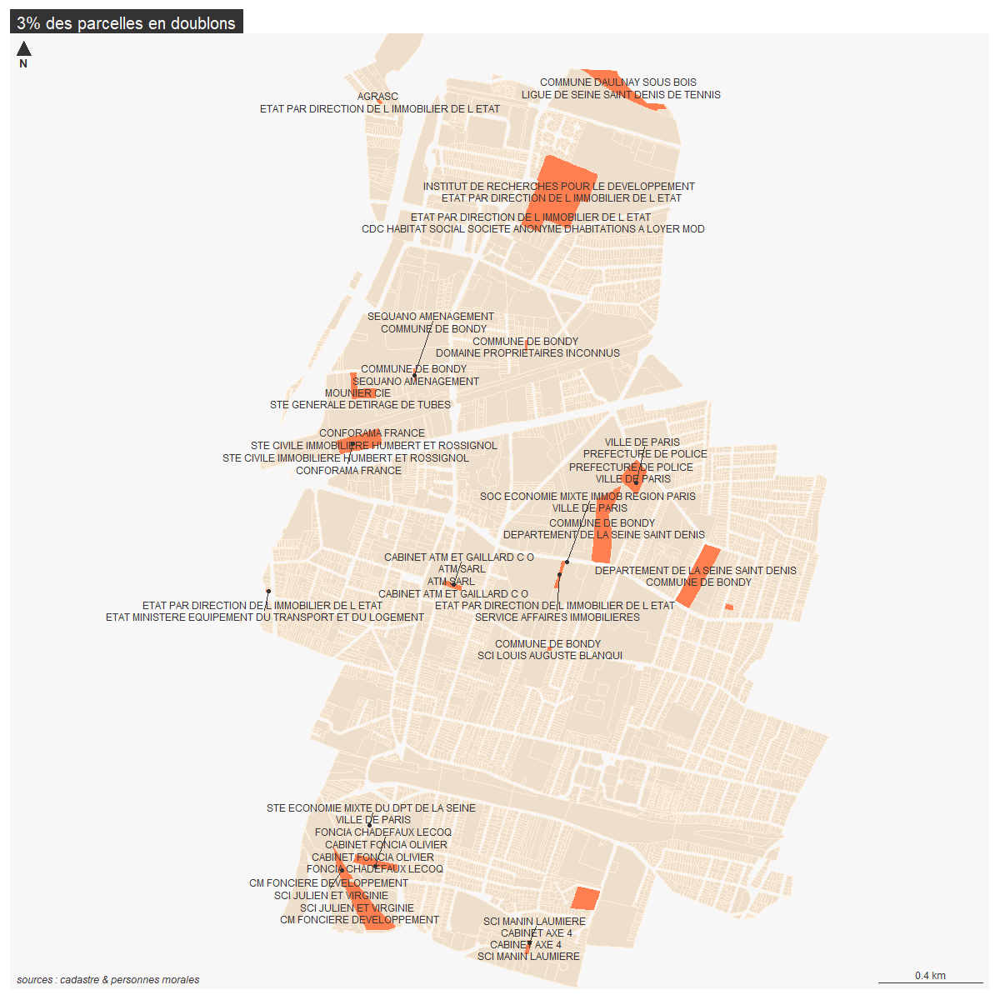

```{r setup, include=FALSE}
knitr::opts_chunk$set(echo = TRUE)
knitr::opts_chunk$set(cache = TRUE)
# Passer la valeur suivante à TRUE pour reproduire les extractions.
knitr::opts_chunk$set(eval = TRUE)
knitr::opts_chunk$set(warning = FALSE)
```


# Objet

https://www.data.gouv.fr/fr/datasets/fichiers-des-locaux-et-des-parcelles-des-personnes-morales/


version 2022 : fichier des locaux (situation 2022).zip


```{r}
library(sf)
library(mapsf)
```


# Chemin data


```{r}
chemin <-  paste0(Sys.getenv('HOME'), "/03_SIG/03_03_Data/")
#chemin <- "G:/Mon Drive/05_DATA/"
```


# Données


```{r}
#02_URBA pour le drive 06 pour pc mairie
data <- read.csv2(paste0(chemin,"06_URBA/personne morale opendata/PM_22_NB_930.txt"), fileEncoding = "latin3")
data <- data [ data$Nom.Commune..Champ.géographique.== "BONDY",    ]
str(data)
st_layers("../data/cadastre.gpkg") 
cadastre <- st_read("../data/cadastre.gpkg", "parcelle_info")
str(cadastre)
```


espaces avt le code dans cadastre

```{r}
cadastre$code <- gsub(" ", "", cadastre$code)
```

# Jointure


## Code parcelle

Préparation jointure : le code est sur 5 caractères

On rajoute des zéros en fonction.

```{r}
# calcul du nb de caractères
# ajout de zéros A0008 
nb <- nchar(data$N..plan..Références.cadastrales.)
data$nb2 <- ifelse(nb == 3, '0', ifelse(nb==2, '00', '000'))
data$code <- paste0(data$Section..Références.cadastrales.,  data$nb2, data$N..plan..Références.cadastrales.)
tab <- table(data$code)
tab2 <- tab [tab > 1]
doublons <- names(tab2)
#data [data$code %in% doublons,]
```


Première jointure et carto

```{r}
jointure <- merge (cadastre, data, by = "code")
mf_map(cadastre)
mf_map(jointure, col = "red",add = T)
mf_layout("première exploration Personne morale opendata", "source : cadastre 2022 & personne morale 2022")
```

pas mal 1396 éléments sur 1400...

## Exploration des données

### code de droit

L fonctionnaire logé...

```{r}
str(jointure)
barplot(table(jointure$Code.droit..Propriétaire.s..parcelle.))
mf_map(jointure, type = "typo", var = "Code.droit..Propriétaire.s..parcelle.", border = NA)
```

G gérant, P propriétaire, S syndic coproprio Z gestionnaire d'un bien de l'Etat


### forme juridique


bailleurs sociaux peuvent être privés (SA HLM == code 5646) et publics 

TODO

```{r}

```


## Problème des doublons de propriétaires

Certaines parcelles ont plusieurs proprio. On garde les doublons sur les noms parcelles / noms proprio.

### Recherche et dénombrement

```{r}
names(data)
data <- data [, c("code", "Groupe.personne..Propriétaire.s..parcelle.", "Forme.juridique..Propriétaire.s..parcelle.", "Forme.juridique.abrégée..Propriétaire.s..parcelle."  ,  "Dénomination..Propriétaire.s..parcelle." )]
res <- data  [!duplicated (data),]
head(res)
```


```{r}
nb <- length(res$code) - length(unique(res$code))
nb / length(res$code)
```

Il s'agit de 3 % de la donnée

```{r}
tab <- table(res$code)
noms <- names(tab [tab > 1])
knitr::kable(res [res$code %in% noms,])
doublons <- res [res$code %in% noms, ]
```

Pour ces 3 % traitement à faire ?

On cartographie pour voir pb


Affichage des noms par parcelles


```{r}
jointure <- merge (cadastre, doublons, by = "code")
table(jointure$code)
# la table a des 79 doublons de 2 uniquement ordonnées et un de 3. donc on 
# -soustrait le triplet
# - décale le propriétaire d'un cran et on concatène.
jointure <- jointure [ jointure$code != "BD0117",]
proprio1 <- jointure$Dénomination..Propriétaire.s..parcelle.
proprio2 <- proprio1 [-1]
jointure$etik <- paste0(proprio1, " \n ", proprio2)
# sélections des impairs uniquement
impairs <- seq( from = 1, to = 77, by = 2)
res <- jointure [impairs,]
# pour les etiquettes, on agrège et on extrait les centroides.
agg <- aggregate(res [, "code"], by = list(res$etik), "length")
agg <- st_centroid(agg)
knitr::kable(agg$Group.1)
```


### Cartographie

```{r}
jointure <- merge (cadastre, doublons, by = "code")
png("../img/etik.png", width = 1200, height = 1200, res = 120)
mf_init(jointure)
mf_map(cadastre, col = "antiquewhite2", border = "antiquewhite1", add = T)
mf_map(jointure, add = T, col = "coral", border = NA)
mf_label(agg, var = "Group.1", overlap = F, halo = F, cex = 0.6 )
mf_layout("3% des parcelles en doublons", "sources : cadastre & personnes morales")
dev.off()
```



## Jointure

```{r}
jointure <- merge (cadastre, data, by = "code")
table(jointure$Forme.juridique.abrégée..Propriétaire.s..parcelle, jointure$Groupe.personne..Propriétaire.s..parcelle.)
mf_map(jointure, type = "typo", var = "Forme.juridique.abrégée..Propriétaire.s..parcelle.")
mf_layout("Personnes morales", "sources : cadastre & personnes morales")
```


Recodage 

```{r}
str(data)
write.csv(unique(jointure [,c("Forme.juridique.abrégée..Propriétaire.s..parcelle."), drop = T]), "../data/pmorale.csv", fileEncoding = "UTF-8")
recodage <- read.csv2("../data/pmoraleRecode.csv", fileEncoding = "UTF-8")
data <- merge(jointure, recodage, by.x = "Forme.juridique.abrégée..Propriétaire.s..parcelle.", by.y = "code")
```


Enregistrement de données


```{r}
st_write(data, "../data/cadastre.gpkg", "pmoraleOpendata2022", fileEncoding = T, delete_layer = T)
```


Agrégation des données


```{r}
str(data)
proprio <- unique(data$Dénomination..Propriétaire.s..parcelle.)
agg <- aggregate(data [,"Dénomination..Propriétaire.s..parcelle."], list(data$Dénomination..Propriétaire.s..parcelle., data$recodage, data$codeComplet), length )
agg
names(agg)[1:4] <- c("proprio", "public/prive", "statut", "nb parcelles")
st_write(agg, "../data/cadastre.gpkg", "pmoraleOpendata2022Agg", fileEncoding = T, delete_layer = T)
```


Affichage des plus gros propriétaires

```{r}
agg$aire <- st_area(agg)/10000
library(units)
agg$aire <- drop_units(agg$aire)
agg [order (agg$aire, decreasing = T),]
```


```{r}
plot(agg$aire, agg$`nb parcelles` , xlim = c(0,17), ylim = c(0,80),
     main = "Relation surface et nb parcelles")
etik <- agg [agg$aire > 2 & agg$`nb parcelles` > 5,]
text(etik$aire, etik$`nb parcelles`, labels = etik$proprio, cex =0.5, pos = 1)
model <- lm(agg$`nb parcelles`~agg$aire, agg)
abline(model, col = "red", lwd = 2)


plot(agg$aire, agg$`nb parcelles` , xlim = c(0,1), ylim = c(0,10),
     main = "Relation surface et nb parcelles (inf. à 1 ha)")
etik <- agg [agg$aire < 1 & agg$`nb parcelles` < 10,]
text(etik$aire, etik$`nb parcelles`, labels = etik$proprio, cex =0.5, pos = 1)
model <- lm(agg$`nb parcelles`~agg$aire, agg)
abline(model, col = "red", lwd = 2)


```

remarque : nb parcelles pas variable continue...

```{r}
mf_init(data)
mf_map(cadastre, col = "antiquewhite2", border = "antiquewhite1", add = T)
mf_map(data, type = "typo", var = "recodage", border = NA, add = T)
mf_layout("Personnes morales", "sources : cadastre 2022 & personnes morales 2022")
knitr::kable(recodage [order(recodage$recodage), c("code", "recodage", "codeComplet")])
```


