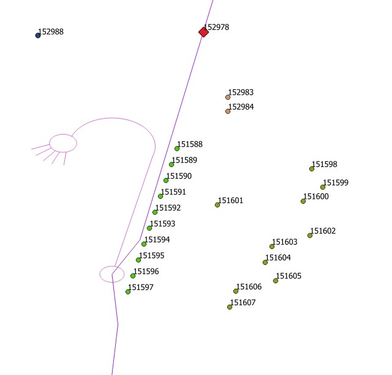

```{r setup, include=FALSE}
knitr::opts_chunk$set(echo = TRUE)
knitr::opts_chunk$set(cache = TRUE)
# Passer la valeur suivante à TRUE pour reproduire les extractions.
knitr::opts_chunk$set(eval = FALSE)
knitr::opts_chunk$set(warning = FALSE)
```


# Objet

Récupérer les données éclairage public

En février 2023, nouvelle récupération. Cette fois ci sans doute plus proche de ce que l'on veut.

Exploration des fichiers


# Import 2021

Avec R on n'est pas parvenu à lire le dxf. on l'a ouvert avec Qgis et passer en .gpkg


```{r}
library(sf)
library(mapsf)
library(units)
```




Il y a quelque chose de très cohérent autour des candélabres.
Des points type étiquettes et des valeurs. Les fid sont distants de 10
Les types étiquettes sont sur le calque Blocs éclairage avec attribut et les textes sur calque 0.


```{r}
chemin <- "D:/03_SIG/03_03_Data/14_CANALISATIONS/"
epEntites <- st_read(paste0(chemin,"/ep.gpkg"), "entites" ,quiet = T)
epPoint <- st_read(paste0(chemin,"/ep.gpkg"), "point" ,quiet = T)
epLigne <- st_read(paste0(chemin,"/ep.gpkg"), "lignes" ,quiet = T)
```

Echantillon sur zone MLK / Blanqui

```{r}
zone <- st_read("../data/prir.gpkg", "limite")
epPointSel <- st_intersection(epPoint, zone)
write_sf(epPointSel, "../data/prir.gpkg", "epPoint", delete_layer = T)
epEntiteSel <- st_intersection(epEntites, zone)
write_sf(epEntiteSel, "../data/prir.gpkg", "epEntites", delete_layer = T)
# pas d'armoire electrique dans la zone
epLigneSel <- st_intersection(epLigne, zone)
write_sf(epLigneSel, "../data/prir.gpkg", "epLigne", delete_layer = T)
```

```{r}
plot(epLigneSel)
plot(epPointSel$geom)
```


```{r}
str(epEntites)
str(epLigne)
table(epEntites$Layer)
table(epLigne$Layer)
table(epPoint$Layer)
```

# Import 2023


```{r}
armoire <- read.csv2("D:/09_TELETRAVAIL/Ville de Bondy_EcP_Armoire.csv", fileEncoding = "CP1252")
candelabre <-  read.csv2("D:/09_TELETRAVAIL/Ville de Bondy_EcP_Candélabre.csv", fileEncoding = "CP1252")
slt <- read.csv2("D:/09_TELETRAVAIL/Ville de Bondy_SLT.csv", fileEncoding = "CP1252")
armoireTxt <- read.csv("D:/09_TELETRAVAIL/detailArmoire.csv", fileEncoding = "UTF-8")
candelabreTxt <- read.csv("D:/09_TELETRAVAIL/detailCandelabre.csv", fileEncoding = "UTF-8")
```

Le nb d'élément est différent... attention sur les jointures.

Les coordonnées sont en Lambert étendu.mais elles existent pour les candelabre en 2154

Clés identifiés :
- jointure candelabre / NOM_CANDELABRE et candelabresf / NUMERO

# Spatialisation


```{r}
candelabresf <- st_as_sf(candelabreTxt, coords = c("COORD.X", "COORD.Y"), crs = 4326)
st_write(candelabresf, "../data/ep.gpkg", "candelabreFev2023", delete_layer = T)
table(candelabresf$NUMERO)
table(candelabre$NOM_CANDELABRE)
```


Pas de jointure via le nom. le nom des fichiers ne correspondeent pas. 

Examen de ep point calque 0, peut-on récupérer les noms des candelabres avec un buffer ?


```{r}
#recup pt calque0 416 M => 35 M
data <- epPoint [epPoint$Layer == '0',]
# longueur du text
data$long <- sapply(data$Text, nchar)
table(data$long)
data <- data [data$long %in% seq(5,9),]
# 13 500
# filtre uniquement commençant par 2 chiffres
ind <- grep("^[0-9]{2}",data$Text)
data <- data [ind,]
#1133
st_write(data, "../data/ep.gpkg", "candelabre2021", delete_layer = T)
table(data$Text)
```

