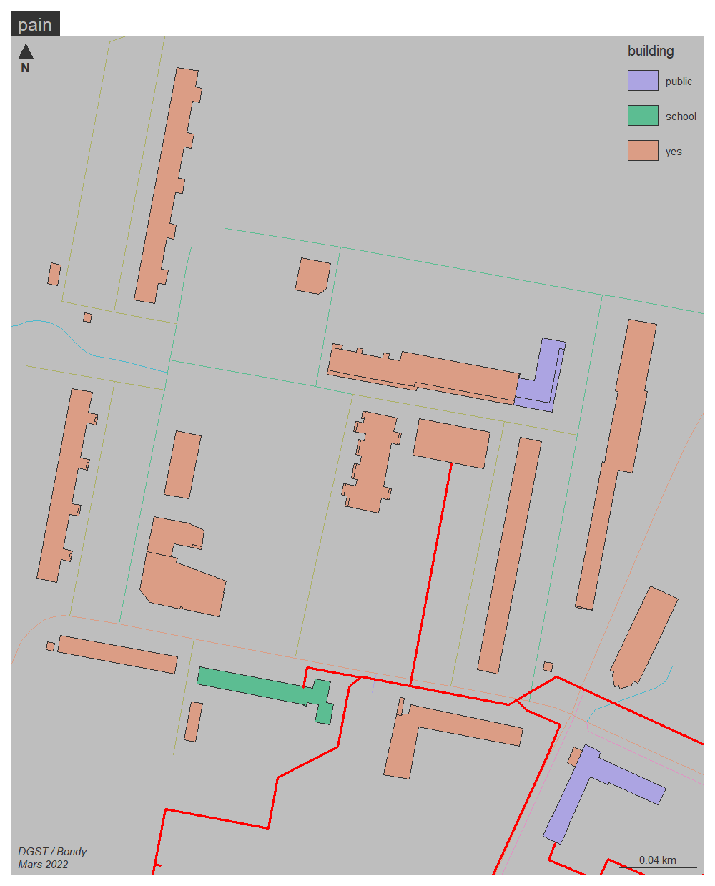
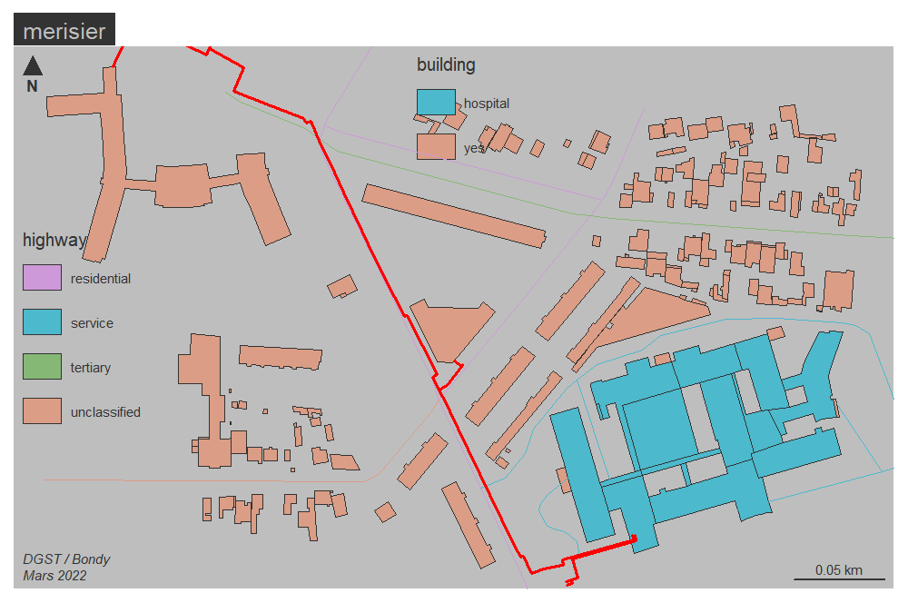

```{r setup, include=FALSE}
knitr::opts_chunk$set(echo = TRUE)
knitr::opts_chunk$set(cache = TRUE)
# Passer la valeur suivante à TRUE pour reproduire les extractions.
knitr::opts_chunk$set(eval = FALSE)
knitr::opts_chunk$set(warning = FALSE)
```


# Objet

données autour du RCU

# Environnement


## Librairies


```{r}
library(sf)
library(mapsf)
```


# Récupération donnée itherm


```{r}
ch <- Sys.getenv("HOME")
chemin <- paste0(ch, "/03_SIG/03_03_Data/08_VOIRIE/RCU/")
chemin2 <- paste0(ch, "/03_SIG/03_03_Data/03_SOCLE/")
# on dézippe le .kmz
rcuComplement <- st_read(paste0(chemin, "doc.kml"))
fic <- paste0(chemin, "doc.kml")
concatenerCouchesGeom <- function (fic){
  couches <- st_layers(fic)
  couches
  fin <- length(couches$name)
tmp <- NULL
data <- NULL
i <- 1
for (i in 1:fin){
  tmp <- st_read(fic, couches$name [i])
  tmp <- st_transform(tmp, 2154)
  # ajout champs
  tmp$Description <- couches$name [i]
  data <- rbind(data, tmp)
} 

# un seul gpkg et les géométries se trient toutes seules

}

st_write(data,"../data/rcu.gpkg", "itherm", delete_layer = T)

table(data$Description)
table(data$Name)
```


Structure du fichier

```{r}
str(data)
mf_map(data, type =  "typo", "Description", lwd = 3)
#mf_label(data, "Name", cex = 0.5)
mf_layout("RCU", "Itherm Conseil")
```


On zoome pour voir les étiquettes

```{r}
data [data$Name == "00-01",]
mf_init(st_buffer(data$geom [data$Name =="101"],300))
mf_map(data, type =  "typo", "Description", lwd = 3, add =T)
mf_label(data, "Name", cex = 0.7)
mf_layout("Taxinomie RCU", "Itherm Conseil")
```


longueur du réseau

```{r}
sum(st_length(data$geom))
ind <- grep("existants", names(tab))
ancien <- data [data$Description %in% names(tab)[ind],]
nouveau <- data [!(data$Description %in% names(tab)[ind]),]
tab <- table(data$Description)
sum(st_length(ancien))
sum(st_length(nouveau))
```


# Création de la zone tampon


```{r}
data <- st_read("../data/rcu.gpkg", "itherm")
tampon <- st_buffer(data,10)

st_layers(paste0(chemin2, "batiment.gpkg"))
bat <- st_read(paste0(chemin2, "batiment.gpkg"), "BDTOPO")
mf_map(bat)
mf_map(tampon, add = T, col = "red")
poi <- st_read(paste0(chemin2, "batiment.gpkg"), "poi3")
batPoi <- st_intersection(bat, poi)
st_write(batPoi, "../data/bat.gpkg", "batpoi", delete_layer = T)
st_write(bat, "../data/bat.gpkg", "BDTOPO", delete_layer = T)
```


Tuiles OSM

```{r}
data <- st_read("../data/RCU/BONDY-022022.shp")
data <- st_transform(data, 4326)
sousStation <- st_read("../data/RCU/STB SST.kml")

library(maptiles)
osm <- get_tiles(sousStation)
```


# Exploration fichier RCU

Les fichiers sont écupérés auprès du prestataire (Coriance, DAIDJ Lila <Lila.DAIDJ@groupe-coriance.fr>)


```{r}
data <- st_read("../data/RCU/BONDY-022022.shp")
plot_tiles(osm)
mf_map(data, col = "red", lwd = 2,add = T)
sousStation <- st_read("../data/STB SST.kml")
sousStation <- st_transform(sousStation, crs = 2154)
sousStation$num <- c(0,0,9,0,0,7,0,5,0,15,0,0,0,0,7,0,0,0,0,0)
sousStation
focus <- sousStation [10,]
focus <- st_read("../data/map.osm")
osm <- get_tiles(focus, crop = TRUE, zoom = 18)
plot_tiles(osm)
```


Quelques données de consommation sur la ville


```{r}
conso <- read.csv2("../data/RCU/consommation.csv")
names(conso) [1] <- "num"
sousStation [sousStation$num !=0,]
sousStation
conso <- merge (sousStation, conso, by = "num") 
```


Cartographie générale

```{r}
mf_export(data,filename = "../img/rcu.png", theme = "iceberg", width = 1000, height = 800, res = 200)
plot_tiles(osm)
mf_map(data, col = "red", add = T)
mf_map(sousStation, pch = 19, col = "red", add = T)
#mf_map(conso, type = "prop", col = "wheat", border = NA, var = "consommation", leg_title =   "consommation\nmars 2021\n(en MWh)", leg_pos = "right")
#f_label(sousStation, var = "Name", halo = T, overlap = F)
mf_layout(title = "Chauffage urbain et consommation bâtiments communaux", credits = "Coriance,\nDGST, Bondy, avril 2022")
dev.off()
```

Problème autour de la tuile et du zoom

```{r}
st_write(data, "../data/rcu.gpkg", "reseau")
st_write(sousStation, "../data/rcu.gpkg", "sousStation")
st_write(conso, "../data/rcu.gpkg", "conso")
```


deux zones à examiner de plus près

- patrimoine 3 F côté rue fontaine
- carré odette pain

On a fait un export de tout OSM sur cette zone à l'aide de JOSM

```{r}
merisier <- st_read("../data/batMerisierRCU.geojson")
merisier <- st_transform(merisier,2154)
pain <- st_read("../data/pain.geojson")
pain <- st_transform(pain, 2154)
```


```{r}
cartoOSM <- function (dataOSM, nom){
  bat <- dataOSM [!is.na(dataOSM$building),]
  rue <- dataOSM [!is.na(dataOSM$highway),]
  # on retient uniquement les lignes pour les rues (il y a des points)
  rue <- rue  [st_geometry_type(rue) == "LINESTRING",]
  mf_export(bat,width = 1000, res=150, filename = paste0("../img/", nom ,".png" ))
mf_map(bat, type = "typo", var =  "building")
mf_map(rue, type = "typo", var= "highway", add = T)
mf_map(data, add = T, col ="red", lwd = 2)
mf_map(sousStation, add = T, col = "red", pch = 19)
mf_layout(nom, "DGST / Bondy\nMars 2022")
dev.off()
}
cartoOSM(merisier, "merisier")
cartoOSM(pain, "pain")
```




