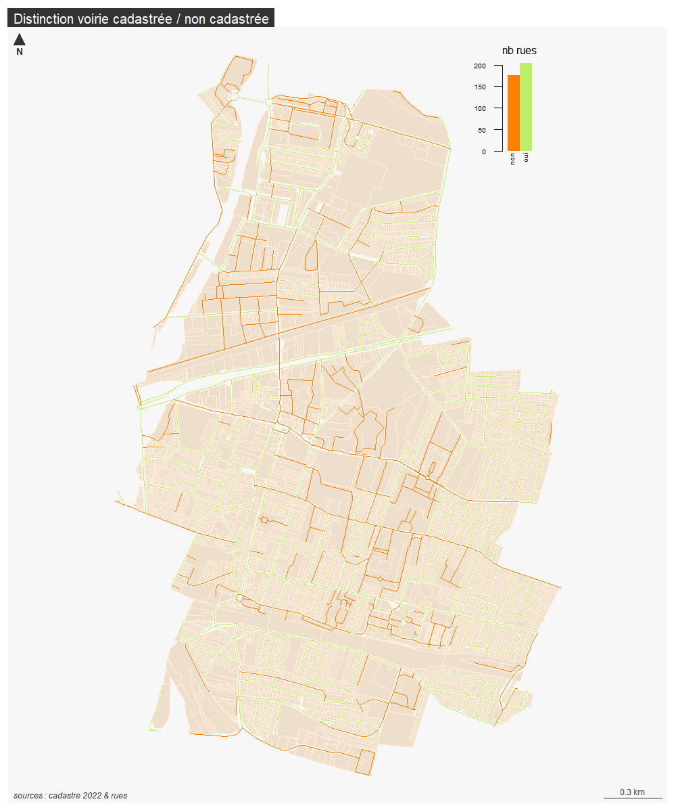

```{r setup, include=FALSE}
knitr::opts_chunk$set(echo = TRUE)
knitr::opts_chunk$set(cache = TRUE)
# Passer la valeur suivante à TRUE pour reproduire les extractions.
knitr::opts_chunk$set(eval = TRUE)
knitr::opts_chunk$set(warning = FALSE)
```


# Objet

Désormais le linéaire voirie fixé en délib est  :

socle / rue / rue2023

L'intersection entre cadastre et rue permet de déterminer les rues non cadastrés.

De plus, les rues dans les parcelles détenues par les personnes morales vont également être distinguées.

```{r}
library(sf)
library(mapsf)
```


# Chemin data


```{r, eval = T}
chemin <-  paste0(Sys.getenv('HOME'), "/03_SIG/03_03_Data/")
chemin <- "G:/Mon Drive/05_DATA/"
```


# Données


```{r}
#02_URBA pour le drive 06 pour pc mairie
rue <- st_read(paste0(chemin,"03_SOCLE/rue.gpkg"), "rue2023")
st_layers("../data/cadastre.gpkg") 
cadastre <- st_read("../data/cadastre.gpkg", "parcelleAdresse")
pmorale <- st_read("../data/cadastre.gpkg", "pmoraleOpendata")
```


# Traitement


```{r}
inter <- st_intersection(rue, cadastre)
interMat <- st_intersects (rue, cadastre)
length(interMat [[6]])
# les lignes vides marquent les rues non cadastrées.
rue$inter <- sapply(interMat, length)
table(rue$inter)
# longueur rue non cadastré
rueNonCadastre <- rue [rue$inter == 0,]
sum(st_length(rueNonCadastre))
```

53 km de voirie non cadastrée.

```{r}
rueCadastre <- rue [rue$inter != 0,]
sum(st_length(rueCadastre))
```

40 km de voirie cadastrée


```{r}
table(rue$inter)
rue$cadastre <- ifelse(rue$inter > 0, "non", "oui") 
tab  <- aggregate(st_length(rue), by = list(rue$cadastre), sum)
st_write(rue, paste0(chemin, "03_sOCLE/rue.gpkg"), "rueCadastre", delete_layer = T)
```


Reprise de l'attribut

```{r}
rue <- st_read(paste0(chemin,"03_SOCLE/rue.gpkg"), "rueCadastre")
str(rue)
# éclatement terme et nom rue

```


# Cartographie

```{r}
png("../img/inter.png", width = 1000, height = 1200, res = 120)
mf_init(rue)
mf_map(cadastre, col = "antiquewhite2", border = "antiquewhite1", add = T)
mf_map(rue, type = "typo" , var = "cadastre", pal = c("darkorange1", "darkolivegreen2"), leg_pos = NA, add = T)
mf_inset_on(fig = c(0.75, 0.95, 0.84, .99))
# draw the histogram
par(mar = c(0, 0, 1.7, 0))
barplot(table(rue$cadastre), col = c("darkorange1", "darkolivegreen2"), border = NA,
  axes = F, names.arg = "",
  xlab = "", ylab = "", main = "", space=0, width = 0.1, xlim = c(0,1)
)
axis(
  side = 1, las = 2, tick = FALSE, line = -.9,
  cex.axis = .5, labels = c("non", "oui"), at = c(0.03,0.14)
)
axis(
  side = 2, las = 2, tick = T, 
  cex.axis = .5
)

title("nb rues",
  cex.main = .8,
  font.main = 1, adj = 0
)
# close the inset
mf_inset_off()
# Add map layout
mf_layout("Distinction voirie cadastrée / non cadastrée", "sources : cadastre 2022 & rues")
dev.off()
```



## Jointure

```{r}
jointure <- merge (cadastre, data, by = "code")
table(jointure$Forme.juridique.abrégée..Propriétaire.s..parcelle, jointure$Groupe.personne..Propriétaire.s..parcelle.)
mf_map(jointure, type = "typo", var = "Forme.juridique.abrégée..Propriétaire.s..parcelle.")
mf_layout("Personnes morales", "sources : cadastre & personnes morales")
```


Recodage 

```{r}
write.csv(unique(jointure [,c("Forme.juridique.abrégée..Propriétaire.s..parcelle."), drop = T]), "../data/pmorale.csv", fileEncoding = "UTF-8")
recodage <- read.csv("../data/pmoraleRecode.csv", fileEncoding = "UTF-8")
data <- merge(jointure, recodage, by.x = "Forme.juridique.abrégée..Propriétaire.s..parcelle.", by.y = "code")
mf_init(data)
mf_map(cadastre, col = "antiquewhite2", border = "antiquewhite1", add = T)
mf_map(data, type = "typo", var = "recodage", border = NA, add = T)
mf_layout("Personnes morales", "sources : cadastre & personnes morales")
```


Enregistrement de données


```{r}
st_write(data, "../data/cadastre.gpkg", "pmoraleOpendata", fileEncoding = T, delete_layer = T)
```


