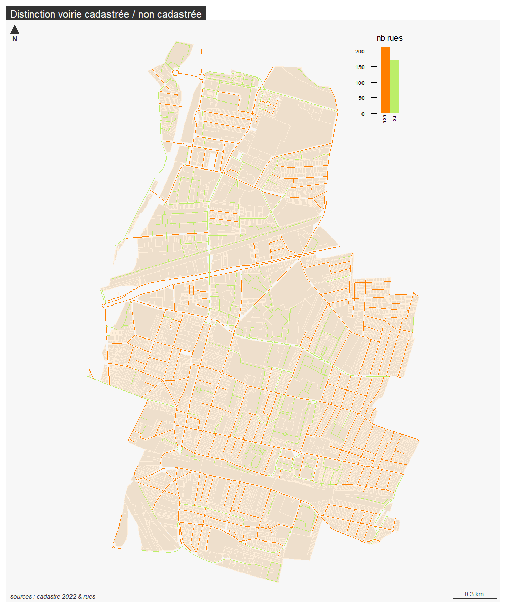

```{r setup, include=FALSE}
knitr::opts_chunk$set(echo = TRUE)
knitr::opts_chunk$set(cache = TRUE)
# Passer la valeur suivante à TRUE pour reproduire les extractions.
knitr::opts_chunk$set(eval = TRUE)
knitr::opts_chunk$set(warning = FALSE)
```


# Objet

Désormais le linéaire voirie fixé en délib est  :

socle / rue / rue2023

L'intersection entre cadastre et rue permet de déterminer les rues non cadastrés.

De plus, les rues dans les parcelles détenues par les personnes morales vont également être distinguées.

```{r}
library(sf)
library(mapsf)
```


# Chemin data


```{r, eval = T}
chemin <-  paste0(Sys.getenv('HOME'), "/03_SIG/03_03_Data/")
chemin <- "G:/Mon Drive/05_DATA/"
```


# Données

plusieurs fichiers rue car pb enregistrement gpkg dans qgis

la bonne couche pour les rues sera toujours rue.gpkg rueCadastre

la couche de départ peut être rue2023, rue2023c, rue cadastre

le travail est effectué dans R et dans Qgis : difficulté d'un traitement reproductible,

Dans Qgis, le tracé des rues est retouché pour qu'elle soient non cadastrées (notamment les rues longues)

on finit par repartir de la couche finale rue.gpkg rueCadastre

```{r}
#02_URBA pour le drive 06 pour pc mairie
rue <- st_read(paste0(chemin,"03_SOCLE/rue.gpkg"), "rueCadastre")
st_layers("../data/cadastre.gpkg") 
cadastre <- st_read("../data/cadastre.gpkg", "parcelleAdresse")
pmorale <- st_read("../data/cadastre.gpkg", "pmoraleOpendata")
```


# Traitement

Intersection rue et cadastre pour récupérer les rues non cadastrées
On récupère en fait le nb d'intersection que l'on rend booléen

```{r}
inter <- st_intersection(rue, cadastre)
interMat <- st_intersects (rue, cadastre)
length(interMat [[6]])
# les lignes vides marquent les rues non cadastrées.
rue$inter <- sapply(interMat, length)
table(rue$inter)
# longueur rue non cadastré
rueNonCadastre <- rue [rue$inter == 0,]
sum(st_length(rueNonCadastre))
# on met à jour le champs longueur également
rue$Longueur <- st_length(rue)
```

57 km de voirie non cadastrée.

```{r}
rueCadastre <- rue [rue$inter != 0,]
sum(st_length(rueCadastre))
```

36 km de voirie cadastrée


```{r}
table(rue$inter)
rue$cadastre <- ifelse(rue$inter == 0, "non", "oui") 
tab  <- aggregate(st_length(rue), by = list(rue$cadastre), sum)
st_write(rue, paste0(chemin, "03_sOCLE/rue.gpkg"), "rueCadastre", delete_layer = T)
```


Reprise de l'attribut

```{r}
rue <- st_read(paste0(chemin,"03_SOCLE/rue.gpkg"), "rueCadastre")
str(rue)
# éclatement terme et nom rue

```


Rectification à la main pour les rues cadastrées ou non

```{r}
rue <- st_read(paste0(chemin,"03_SOCLE/rue2023.gpkg"))
# Ecrasement du fichier d'origine
st_write(rue, paste0(chemin, "03_sOCLE/rue.gpkg"), "rueCadastre", delete_layer = T)
```

Diff usage et logique (cadastré ou non)


Récup de l'usage à partir de la delib de 2019 (sous Qgis)
On essaie ensuite de trouver les incohérences : rues d'usage privées non cadastrées

```{r}
rue <- st_read(paste0(chemin,"03_SOCLE/rue.gpkg"), "rueCadastre")
rue$incoherence [rue$cadastre == "non"& rue$usage == "privé"] <- "incohérence"
table(rue$incoherence)
sort(rue$NOM_1_G [rue$incoherence == "incohérence"])
st_write(rue, paste0(chemin, "03_sOCLE/rue.gpkg"), "rueCadastre", delete_layer = T)
```

export liste


```{r}
str(rue)
write.csv(rue [ , c("NATURE", "NOM","Longueur", "NOMnumero", "cadastre", "usage", "incoherence"), drop = TRUE], "../data/ruePriveNonCadastre.csv",  fileEncoding = "UTF-8")
```


# Cartographie


rue cadastrée / non cadastrée

```{r}
png("../img/inter.png", width = 1000, height = 1200, res = 120)
mf_init(rue)
mf_map(cadastre, col = "antiquewhite2", border = "antiquewhite1", add = T)
mf_map(rue, type = "typo" , var = "cadastre", pal = c("darkorange1", "darkolivegreen2"), leg_pos = NA, add = T)
mf_inset_on(fig = c(0.75, 0.95, 0.84, .99))
# draw the histogram
par(mar = c(0, 0, 1.7, 0))
barplot(table(rue$cadastre), col = c("darkorange1", "darkolivegreen2"), border = NA,
  axes = F, names.arg = "",
  xlab = "", ylab = "", main = "", space=0, width = 0.1, xlim = c(0,1)
)
axis(
  side = 1, las = 2, tick = FALSE, line = -.9,
  cex.axis = .5, labels = c("non", "oui"), at = c(0.03,0.14)
)
axis(
  side = 2, las = 2, tick = T, 
  cex.axis = .5
)

title("nb rues",
  cex.main = .8,
  font.main = 1, adj = 0
)
# close the inset
mf_inset_off()
# Add map layout
mf_layout("Distinction voirie cadastrée / non cadastrée", "sources : cadastre 2022 & rues")
dev.off()
```



rue incohérente


```{r}
png("../img/incoherence.png", width = 1000, height = 1200, res = 120)
mf_init(rue [rue$incoherence == "incohérence",])
mf_map(cadastre, col = "antiquewhite2", border = "antiquewhite1", add = T)
mf_map(rue , type = "typo" , var = "incoherence", pal = c("darkorange1", "darkolivegreen2"), leg_pos = NA, add = T)
mf_label(rue [rue$incoherence == "incohérence",], var = "NOM")
# Add map layout
mf_layout("Voirie non cadastrée et pourtant privée", "sources : cadastre 2022 & rues")
dev.off()
```

