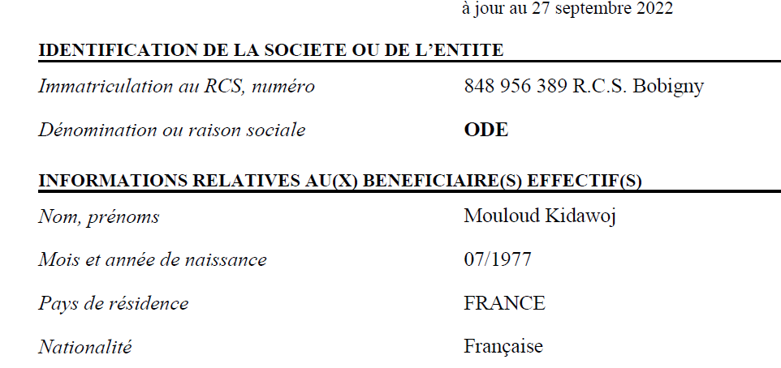
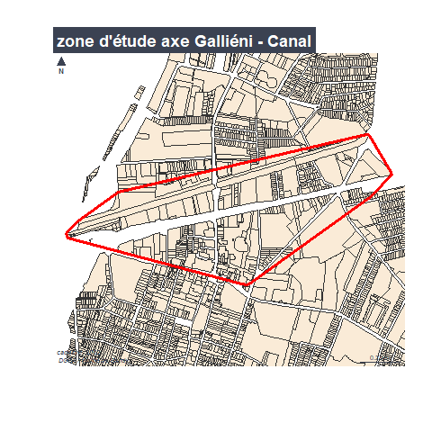

```{r setup, include=FALSE}
knitr::opts_chunk$set(echo = TRUE)
knitr::opts_chunk$set(cache = TRUE)
# Passer la valeur suivante à TRUE pour reproduire les extractions.
knitr::opts_chunk$set(eval = FALSE)
knitr::opts_chunk$set(warning = FALSE)
```


# Objet

L. Pascolini demande sur une zone donnée (axe Galliéni) de trouver les infos concernant
les entreprises.

Sur infogreffe.fr, le nom du bénéficiaire apparaît mais pas dans les tableaux opendata


Visiblement accès payant pour l'avoir par lot.

Reste les autres infos du SIRET.
Il est possible de faire des cartes thématiques catégoriques.

Version du cadastre de juillet 2022
fichier logiciel Enseigne (donner le nom), export septembre 2022

```{r}
library(sf)
library(mapsf)
```


# Chemin data


```{r, eval = T}
chemin <-  paste0(Sys.getenv('HOME'), "/03_SIG/03_03_Data/")
chemin <- "G:/Mon Drive/05_DATA"
```


## Sélection des parcelles qui touchent le canal  et l'avenue Galliéni


Parcelles qui touchent celles de la ville de Paris et avec Gallieni dans le nom


```{r}
str(cadastre)
ind <- grep("GALLIENI", cadastre$adresse)
paris <- grep("VILLE DE PARIS", cadastre$proprietaire)
plot(cadastre$geom  [paris])
parcelleParis <- cadastre [paris,]
parcelleParis [,c("adresse", "nom")]
```
On supprime les parcelles non mitoyennes

```{r}
union <- st_union(parcelleParis)
plot(union)
union_cast <- st_as_sf(st_cast(union, "POLYGON"))
library(units)
union_cast$aire <- drop_units(st_area(union_cast))
plot(union_cast [union_cast$aire > 25000,])
union_cast$aire <- st_area(union_cast)
canal <- st_convex_hull(st_union(union_cast [union_cast$aire > 25000,]))
plot(canal)
inter <- st_intersection(cadastre, canal)
plot(inter$geom, add = T)
plot(cadastre$geom[ind], col = "red", add = T)
```


Il nous manque des parcelles, on fait une enveloppe de l'existant pour intersecter


```{r}
gallieni <- st_as_sf(cadastre$geom [ind])
zone <- st_union(gallieni, canal)
plot(zone)
# on force en polygone, puis on unie encore pour avoir la fusion. enfin l'enveloppe.
test <-  st_cast(zone, "POLYGON")
test2 <-  st_union(test)
zone <- st_convex_hull(test2)
st_write(zone, "../data/etude.gpkg", "zone", delete_layer = T)
inter <- st_intersection(cadastre, zone)
png("../img/zone.png")
mf_init(inter)
mf_map(inter)
mf_map(cadastre, col = "antiquewhite", add = T)
mf_map(zone, col = NA, border = "red", lwd = 3, add = T)
mf_layout("zone d'étude axe Galliéni - Canal", credits = "cadastre, 2022 \n DGST / Mairie de Bondy")
dev.off()
```




## Données


```{r}
str(inter)
inter
str(proprio)
proprio [,c("nom", "dsiren", "categorie")]
jointure <- merge(inter, proprio, by = "nom", all.x = T)
table(jointure$categorie)
jointure <- jointure [, c("code", "contenance", "adresse", "nom", "dsiren", "categorie")]
inter$nom <- gsub('^\\s+|\\s+$', '',inter$nom)
st_write(jointure, "../data/etude.gpkg", "cadastre2022Extrait", delete_layer = T)
write.csv2(jointure [, c("code", "contenance", "adresse", "nom", "categorie", "dsiren"), drop = T], "../data/zoneParcelles.csv", fileEncoding = "UTF-8")
# recherche de la notion de gérant
```

carto sur les entreprises

On peut isoler les SCI

```{r}
data <- st_read("../data/etude.gpkg", "cadastre2022Extrait")
str(data$categorie)
data$categorie [grep("SCI", data$nom)] <- "SCI" 
table(data$categorie)
data$categorie [grep("M |MME", data$nom)] <- "Particuliers" 
data$categorie [data$categorie == "7"] <- "Copropriétaires"
```


```{r}
agg <-  aggregate(data, by = list(data$categorie), length)
mf_init(agg)
mf_map(cadastre, border = "antiquewhite2", add = T)
mf_map(jointure, type = "typo", var = "nom", border= NA, add = T)
table(agg$Group.1)
agg <- agg [, c("Group.1")]
names(agg) [1] <- "categorie"
```


décodage personne morale

```{r}
nom <- c("p.morale non remarquable", "région", "dpt", "commune", "Etat", "Bailleurs sociaux", "SCI", "Particuliers", "Copro")
categorie <- c("0", "2", "3", "4", "5", "9","SCI", "Particuliers", "Copro")
df <- data.frame(nom, categorie)
jointure <- merge(agg, df, by = "categorie", all.y = T)
jointure
```


```{r}
cadastre <- st_read(paste0(chemin,"/01_SOCLE/cadastre/cadastre2022.sqlite"), "parcelle_info")
enseigne <- read.csv("../data/enseigne.csv")
numParcelle <- strsplit(enseigne$Parcelle, "\n")
numParcelle
nbCar <- nchar(enseigne$Parcelle [1])
supprimerCar <- function(str) {substring(str, nbCar - 4, nbCar)}
numParcelle <- lapply(numParcelle, supprimerCar)
# on récupère uniquement 1e parcelle
enseigne$code <- sapply(numParcelle, "[",1)
enseigne [is.na(enseigne$code), c("Parcelle", "Enseigne")]
# 2 enseignes sans parcelle 60 et 164 av Gallieni, on les récupère dans le cadastre
ind <- grep("^164 AV GALLIENI",cadastre$adresse)
enseigne$code [43] <- cadastre$code [ind]
# le 60 n'existe pas. 3 rue Gâtine adresse internet.
ind <- grep ("^3 RUE GATINE", cadastre$adresse)
cadastre [ind,]
ind <- grep ("^70 AV GALLIENI", cadastre$adresse)
enseigne$code [42] <- cadastre$code [ind]
``` 


éternel pb des espaces en début et fin

```{r}
cadastre$code <- gsub("^\\s+|\\s+$", "", cadastre$code)
enseigne$code <- gsub("^\\s+|\\s+$", "", enseigne$code)
```


```{r}
jointure <- merge(cadastre, enseigne, by = "code")
jointure <- jointure [, c("code", "proprietaire", "Enseigne", "Activité")]
jointure
st_write (jointure, "../data/etude.gpkg", "enseigne")
```


