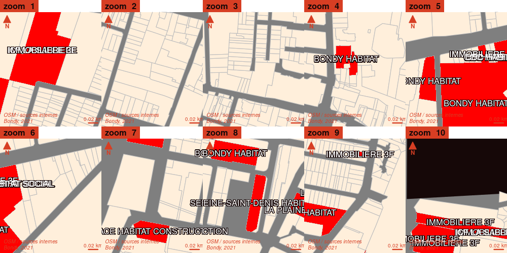

```{r setup, include=FALSE}
knitr::opts_chunk$set(echo = TRUE)
knitr::opts_chunk$set(cache = TRUE)
# Passer la valeur suivante à TRUE pour reproduire les extractions.
knitr::opts_chunk$set(eval = TRUE)
knitr::opts_chunk$set(warning = FALSE)
```


# Objet

Carto de l'habitat social à partir de l'inventaire logement social.
Le cadastre (données majic 3 - 2021) permet de compléter les données.


# Environnement

## Chemins

```{r}
if (Sys.getenv('HOME') == "/home/tachasa") {
  chemin <- paste0(Sys.getenv('HOME'), "/00_DATA/")
} else {
  chemin <- "G:/03_SIG/03_Data/"
}
```

## Librairies

```{r}
library(sf)
library(mapsf)
```


# Préparation données

Toutes les couches sont enregistrées dans logement.gpkg

## Fond de carte

### Classiques

Limites de Bondy, rues principales, cadastre en geojson (Etalab)

https://cadastre.data.gouv.fr/data/etalab-cadastre/2021-10-01/geojson/communes/93/93010/

```{r}
bondy <- st_read(paste0(chemin,"limites.gpkg"), "bondy", quiet=F)
bondy <- st_union(bondy)
st_write(bondy,paste0(chemin,"logement.gpkg"), "bondy", delete_layer = T)
ogrListLayers(paste0(chemin, "bondy.gpkg"))
rue <-  st_read( paste0(chemin,"bondy.gpkg"), "rue", quiet = TRUE)
st_write(rue,paste0(chemin,"logement.gpkg"), "rue", delete_layer = T)
cadastre <- st_read(paste0(chemin,"cadastre-93010-parcelles.json"))
cadastre <- st_transform(cadastre, 2154)
cadastre <- st_read()
st_write(cadastre,paste0(chemin,"logement.gpkg"), "parcelles", delete_layer = T)
```


```{r}
rue <- st_read(paste0(chemin, "01_OSM/rue.geojson"))
sort(table(rue$highway))
rue <- rue [rue$highway %in% c('motorway','primary', 'primary_link', 'secondary', 'secondary_link', 'tertiary'),]
rue <- rue [,"highway", drop = F]
rue <- st_transform(rue, 2154)
mf_map(bondy)
mf_typo(rue, var = "highway", border = NA,add = T, pal = c("red", "orange", "orange", "orange", "orange", "white"), lwd = 1.5, leg_pos = "n")
st_write(rue, paste0(chemin, "logement.gpkg"), "rue", delete_layer = T)
```


### Pru

Qpv, limites PRU (à dessiner)

```{r}
qpv <- st_read(paste0(chemin, "limites.gpkg"), "qpv1")
qpv <- st_intersection(bondy, qpv)
st_write(qpv,paste0(chemin,"logement.gpkg"), "qpv", delete_layer = T)
```


### Couches OSM

couches OSM susceptibles d'être complétées :

- Parcs et jardins (leisure = park)

- Batiments publics (building = public)

```{r}
jardin <- st_read(paste0(chemin,"park.geojson"))
bat <- st_read(paste0(chemin, "building.geojson"))
jardin <- st_transform(jardin, 2154)
# pb jardin multipolkygone, on fusionne
jardin <- st_union(jardin)
bat <- st_transform(bat, 2154)
st_write(jardin, paste0(chemin, "logement.gpkg"), "jardin", delete_layer = T)
st_write(bat, paste0(chemin, "logement.gpkg"), "bat", delete_layer = T)
```


### Elements du fond de carte

#### Chargement des couches

```{r}
library(rgdal)
#readOGR(paste0(chemin, "logement.gpkg"))
couche <- ogrListLayers(paste0(chemin, "logement.gpkg"))
for (i in 1:length(couche)){
    objet <- st_read(paste0(chemin, "logement.gpkg"), couche [i])
    assign(couche [i], objet)
    }
```


#### Carto


```{r}
mf_init(bondy, theme = "candy")
mf_shadow(bondy, add = TRUE)
fond <- function(){
  mf_map(bondy, add = T)
mf_map(qpv, col = "antiquewhite4", border = NA, add = T)
mf_typo(rue, var = "highway", border = NA,add = T, pal = c("red", "orange", "orange", "orange", "orange", "white"), lwd = 1.5, leg_pos = "n")
mf_map(jardin, col = "chartreuse3", border = NA,add = T)
mf_map(bat, col = "antiquewhite1", border = NA,add = T)
}
fond()
mf_layout(title = "Fond de carte" )
```


### Inventaire habitat social

Fichier d'adresse en jointure sur la couche de dessin du cadastre en opendata

## Récupération du géocodage

```{r}
data <- read.csv(paste0(chemin, "logement.geocoded.csv"))
str(data)
data <- st_as_sf(data, coords =c("longitude", "latitude"), crs = 4326)
data <- st_transform(data, 2154)
st_write(data, paste0( chemin,"logement.gpkg"), "habitat", delete_layer = T )
```


## Zones denses

On note les zones denses pour pouvoir zoomer et étudier ces zones en priorité.

```{r}
# création d'une grille et du nb de points par carreau
grille <- st_make_grid(bondy, cellsize = c(200,200))
res <- st_intersects(grille, data)
densite <- sapply(res, length)
barplot(table(densite), main = "Nb d'adresses par carreau 200*200", sub = "(152 adresses au total)", xlab = "Nb d'adresses", ylab = "Occurences")
grilleDensite <- st_as_sf(data.frame(grille, densite))
# On choisit de prndre uniquement les carreaux avec 5 adresses, cela fait 10 zones à zoomer
grilleDensiteForte <- grilleDensite [grilleDensite$densite > 4,]
st_write(grilleDensiteForte, paste0(chemin, "logement.gpkg"), "zoom", delete_layer = T)
```

### Cartographie rapide

```{r}
zoom <- st_read(paste0(chemin, "logement.gpkg"), "zoom")
mf_init(zoom, theme = "candy")
mf_shadow(bondy, add = TRUE)
mf_map(bondy, add = T)
mf_choro(grilleDensiteForte, var = "densite", border = NA,
         leg_title = "nb d'adresses", add = T)
mf_map(data$geometry, add = T)
mf_layout(title = "152 lignes géocodées de l'inventaire social et 10 zones denses" , credits = "inventaire logements sociaux, Bondy, 2021")
```

## Jointure

Jointure sur parcelle pour récupérer surface plutôt que point.
Problème des multiparcelles ?

ou jointure sur bâtiment ?


```{r}
jointureSpatiale <- st_intersection(data, cadastre)
pt <- data$geometry
plot(pt)
```


On récupère la géométrie des parcelles

```{r}
dataSansGeom <- jointureSpatiale [, c("id", "organisme","Type.de.logement","nb.logements"),drop = T]
data <- merge(dataSansGeom, cadastre [, c("id")], by = "id")
data <- st_as_sf(data)
```


Eviter duplication de parcelle / et de nom ?

```{r}
unik <- unique(data$id)
# 53 parcelles uniques
data <- data [data$id %in% unik,]
```


### Zoom : points hors parcelles

```{r}
mf_export(x = bondy, filename = "../img/zoom.png", 
          expandBB = c(0,0,0,0.55),
          width = 1000, height = 500, res = 150)
par(mfrow = c(2,5))
for (i in 1:length(zoom$densite))
{
  mf_init(zoom$geom[i], theme = "barcelona")
  mf_shadow(bondy, add = TRUE)
  mf_map(cadastre, col = "antiquewhite1", border = "grey", add = TRUE)
  mf_map(
    data,
    type = "base",
    border = NA,
    col = "red",
    add = TRUE
  )
  data$organisme [4]  <- "PRIVE"
  mf_label(data, var = "organisme", col ="white", overlap = T, halo = T, cex = 1)
   mf_layout(title = paste("zoom ",i), credits = paste0("OSM / sources internes\n", "Bondy, 2021"))
}
dev.off()
```




Problème : les points sont hors des parcelles.

### Idée : le tampon

On crée un tampon autour des points


```{r}
dataBuffer <- st_buffer(data, 2)
# le tampon de 2 m permet de récupérer autant de géométrie que d'adresses au départ
jointureSpatiale <- st_intersection(cadastre, dataBuffer)
#On récupère la géométrie des parcelles
dataSansGeom <- jointureSpatiale [, c("id", "organisme","Type.de.logement","nb.logements"),drop = T]
data <- merge(dataSansGeom, cadastre [, c("id")], by = "id")
data <- st_as_sf(data)
```


```{r}
mf_export(x = bondy, filename = "../img/zoomBuffer.png", 
          expandBB = c(0,0,0,0.55),
          width = 1000, height = 500, res = 150)
par(mfrow = c(2,5))
for (i in 1:length(zoom$densite))
{
  mf_init(zoom$geom[[i]], theme = "barcelona")
  mf_shadow(bondy, add = TRUE)
  mf_map(cadastre, col = "antiquewhite1", border = "grey", add = TRUE)
  mf_map(
    rue,
    type = "base",
    col = "white",
    lwd = 2,
    add = TRUE
  )
 mf_map(
    jointureSpatiale,
    type = "base",
    border = NA,
    col = "red",
    add = TRUE
  )
   mf_layout(title = paste("zoom ",i), credits = paste0("OSM / sources internes\n", "Bondy, 2021"))
}
dev.off()
```


### Finalisation du fichier


Rectification bailleurs


```{r}
sort(names(table(data$organisme)))
data$organisme [data$organisme == 'BATIGEREEN IDF'] <- 'BATIGERE EN IDF'
data$organisme [data$organisme == 'CDC HABIT AT SOCIAL'] <- 'CDC HABITAT SOCIAL'
st_write(data,  paste0(chemin,"logement.gpkg"), "jointure", delete_layer = T)
```


## Autre donnée disponible : cadastre


Récupération des couches cadastre via QGIS, notamment la couche parcelle_info dont
le champs *proprietaire" contient de nombreuses informations par rapport aux propriétaires.

```{r}
cadastre <- st_read(paste0(chemin,"/cadastre.sqlite"), "parcelle_info")
liste <- strsplit(cadastre$proprietaire, " - ")
cadastre$proprio_nom <- sapply(liste, '[',2)
tab <- table(cadastre$proprio_nom) 
tab <- tab [tab > 10]
grosProprio <- names(tab)
cartoGrosProprio <- cadastre [cadastre$proprio_nom %in% grosProprio,]
surface <- aggregate(st_area(cartoGrosProprio$geom)/10000, by = list(cartoGrosProprio$proprio_nom), sum)
data <- aggregate(cartoGrosProprio$geom, by = list(cartoGrosProprio$proprio_nom), st_union)
data <- st_as_sf(data)
names(data) [1] <- "Propriétaires"
```


# Explorations donnée hors cartographie

## Histogramme des bailleurs dans l'inventaire des logements sociaux


```{r}
logement <- st_read(paste0(chemin,"logement.gpkg"), "jointure")
tab <- table(logement$organisme)
hist(tab, main = "Nb d'adresses par bailleur", xlab = "Nb d'adresses", ylab = "Occurence")
bailleurs <- names(tab) [-1]
sort(bailleurs)
# construciton du motif pour les chercher dans le cadastre
motif <-  NULL
for (i in 1:length(bailleurs)){
  tmp <- paste0("\'",
               bailleurs [i],
               "\'",
               "|")
  motif <- paste0(motif, tmp)
}
logementSocial <- cadastre [cadastre$proprietaire %in% bailleurs,]
lg <- grep (motif, cadastre$proprietaire)
cadastre [lg,]
```

On récupère les bailleurs dans les logements sociaux


# Cartographie


## Nombre de logements par bailleurs


```{r}
mf_export(x = bondy, filename = "../img/pru.png", 
          expandBB = c(0,0,0,0.3),
          width = 1000, res = 250)
  #mf_init(bondy, theme = "candy")
  mf_shadow(bondy, add = TRUE)
fond()
  mf_map(
    logement,
    type = "choro",
    border = NA,
    var = "nb.logements",
    leg_pos = "right",
    add = TRUE
  )

#  mf_label(data, var = "organisme", overlap = F, halo = T, cex = 0.5)
  
 # start the inset
mf_inset_on( fig = c(0.75, .95, 0.84, .99))
# draw the histogram
bks <- mf_get_breaks(x = logement$nb.logements, nbreaks = 5, breaks = "quantile") 
pal <- hcl.colors(n = 5, palette = "Dark Mint", rev = TRUE)
mf_theme("candy")
fg <-mf_theme()$fg
par(mar = c(0,0,0.8,0))
hist(logement$nb.logements, breaks = bks, col = pal, border = fg, axes = F, labels = "", 
     xlab="logements", ylab = "", main ="")
axis(side = 1, at = bks, las = 2, tick = FALSE, line = -.9, 
  cex.axis = .7, col.axis = fg)
title("Nb logements", cex.main = .5, col.main = fg, 
      font.main = 1, adj = 0)
# close the inset
mf_inset_off()
   mf_layout(title = "Habitat social",
            credits = paste0("OSM / Inventaire parcs logements sociaux\n", "Bondy, 2021"))
dev.off()
```


## Carte des bailleurs

```{r}
library(mapsf)
mf_export(x = bondy, filename = "../img/pruOrganisme.png", 
          expandBB = c(0,0,0,0.55),
          width = 1000, res = 150)
  #mf_init(bondy, theme = "candy")
  mf_shadow(bondy, add = TRUE)
  fond()
  mf_typo(
    logement,
    border = NA,
    var = "organisme",
    cex = 0.5,
    add = TRUE
  )

  
   mf_layout(title = "Habitat social : organisme",
            credits = paste0("OSM / Inventaire parcs logements sociaux\n", "Bondy, 2021"))
dev.off()


```


## Gros propriétaires cadastre

```{r}
data$surface <- st_area(data$geometry)/10000
library(mapsf)
mf_export(x = bondy, filename = "../img/grosProprioCadastre.png", 
          expandBB = c(0,0,0,0.2),
          width = 2100,  height = 2970, res = 400)
  #mf_init(bondy, theme = "candy")
  mf_shadow(bondy, add = TRUE)
  fond()
  mf_map(
    data,
    type = "typo",
    val_order = data$Propriétaires[ order(data$surface)],
    pal = hcl.colors(n = 14, palette = "Dark Mint", rev = TRUE),
    border = NA,
    var = "Propriétaires",
    leg_pos = "n",
   
    add = TRUE
  )

#  mf_label(data, var = "organisme", overlap = F, halo = T, cex = 0.5)
  
 # start the inset
mf_inset_on( fig = c(0.75, .95, 0.84, .99))
# draw the histogram
bks <- mf_get_breaks(x = st_area(data)/10000, nbreaks = 5, breaks = "quantile") 
pal <- hcl.colors(n = 14, palette = "Dark Mint", rev = TRUE)
mf_theme("candy")
fg <-mf_theme()$fg
par(mar = c(0,0,0.8,0))


barplot(sort(data$surface), names.arg = data$Propriétaires[ order(data$surface)], las = 2, ylab = "surface (hac)", col = pal, cex.names = 0.4, axes = F)
axis(side = 4, at = c(1,50), las = 2, tick = FALSE, line = -.9, 
  cex.axis = .7, col.axis = fg)

title("Surface (ha) / propriétaire", cex.main = .5, col.main = fg, 
      font.main = 1, adj = 0)


# close the inset
mf_inset_off()
   mf_layout(title = "Propriétaires, plus de 10 parcelles",
            credits = paste0("OSM / Cadastre, 2021\n", "Bondy, 2021"))
dev.off()
```


