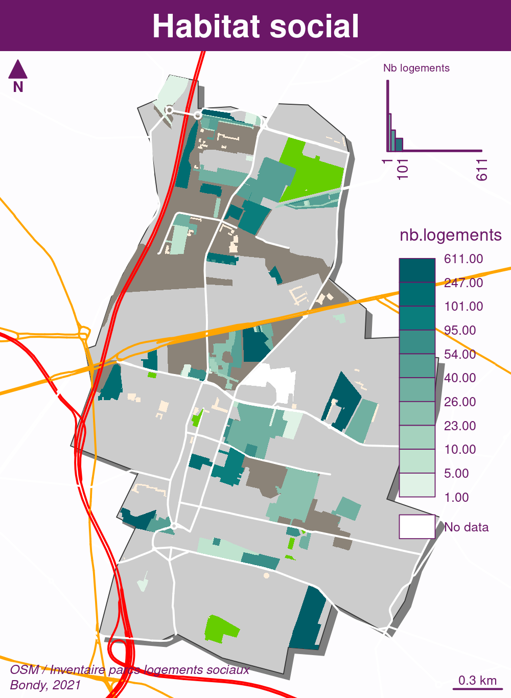

```{r setup, include=FALSE}
knitr::opts_chunk$set(echo = TRUE)
knitr::opts_chunk$set(cache = TRUE)
# Passer la valeur suivante à TRUE pour reproduire les extractions.
knitr::opts_chunk$set(eval = FALSE)
knitr::opts_chunk$set(warning = FALSE)
```


# Objet

Carto de l'habitat social à partir de l'inventaire logement social.
Le cadastre (données majic 3 - 2021) permet de compléter les données.


Les données sont dans logement.gpkg, la partie *préparation* permet de les constituer.
Les chunks ne se rejouent donc pas.


Le fond de carte est issue de fond de carte.

TODO package fond


Le géocodage ne permet pas d'avoir des repères précis.

Il faut croiser avec le cadastre, et le document papier *répertoire du patrimoine HLM* (2018)

La question est la récupération des unités ; cités, voire bâtiment en fonction de l'unité
de l'inventaire.

On mettra le nom de la cité, puis une indication de bâtiment.

On récupère également la base nationale du batiment (avril 2022), également la base de données
des architectes permet de se répérer et d'avoir quelques précisions sur les bâtiments (bâtiment le plus haut de Bondy)


La démarche adoptée est la suivante :

- géocodage
- buffer pour intégration des points aux parcelles
- bâtiments dans les parcelles
- comparaison entre bailleurs parcelles et bailleurs inventaire social.


# Environnement

## Chemins

```{r, eval=TRUE}
if (Sys.getenv('HOME') == "/home/tachasa") {
  chemin <- paste0(Sys.getenv('HOME'), "/00_DATA/")
} else {
  chemin <-  paste0(Sys.getenv('HOME'), "/03_SIG/03_03_Data/")
}
```

## Librairies

```{r, eval=TRUE}
library(sf)
library(mapsf)
```


# Inventaire habitat social via le géocodage

Fichier d'adresse en jointure sur la couche de dessin du cadastre en opendata

## Récupération du géocodage

Deux tentatives de géocodage en fonction du numéro de rue

```{r}
data <- read.csv( "../data/logement.geocoded.geocoded.csv", encoding = "UTF-8")
data <- st_as_sf(data, coords =c("longitude", "latitude"), crs = 4326)
data <- st_transform(data, 2154)
st_write(data, paste0( chemin,"logement.gpkg"), "habitat2", delete_layer = T )
```


152 adresses au premier tour, 151 au second...

couches habitat et habiat2


```{r}
habitat <- st_read(paste0(chemin, "logement.gpkg"), "habitat", quiet = T)
habitat2 <- st_read(paste0(chemin, "logement.gpkg"), "habitat2", quiet = T)
mf_export(x = bondy, width = 500, filename = "../img/geocodage.png")
mf_init(data, theme = "candy")
mf_shadow(bondy, add = TRUE)
fond()
map_habitat <- function(data1, data2){
  mf_map(data1, pch = 19, col = "red", add = T)
mf_map(data2, pch = 19,col = "green", add = T)

mf_legend_s(pt_cex = c(1,1), pt_pch = c(21,21), val = c("1er essai", "2e essai"), pal = c("red", "green"), title = "")
}
map_habitat(habitat, habitat2)
mf_layout(title = "Géocodage : 2 essais", credits = "Inventaire logement social")
dev.off()
```


## Carte des plus gros logements (> 100)

```{r}
habitatGros <- habitat [habitat$nb.logements > 100,]
habitatGros2 <- habitat2 [habitat2$nb.logements > 100,]
mf_export(x = bondy, width = 500, filename = "../img/geocodageGros.png")
mf_init(data, theme = "candy")
mf_shadow(bondy, add = TRUE)
fond()
map_habitat(habitatGros, habitatGros2)
mf_label(habitatGros, var = "nb.logements", 
         col = "red", halo = T, lines = T, pos = 1, offset = 0.2)
mf_layout(title = "Géocodage : 2 essais (> 100 logements)", credits = "Inventaire logement social\nBondy, janvier 2022")
dev.off()
```


zoom sur zone dense 

```{r}
pt <- habitat [habitat$Nom.de.voie == "SUZANNE BUISSON",]
tampon <- st_buffer(pt,100)
mf_export(x = tampon, width = 500, filename = "../img/geocodageDense.png")
mf_init(tampon, theme = "candy")
mf_shadow(bondy, add = TRUE)
fond()
mf_map(parcelles, col = "antiquewhite2", border = NA,add = TRUE)
mf_map(batCadastre, col = "antiquewhite3", border = NA, add = T)
mf_map(qpv, col = NA, border = "#990066", lwd = 1, add = T)
map_habitat(habitatGros, habitatGros2)
mf_label(habitatGros, var = "nb.logements", 
         col = "red", halo = T, lines = T, pos = 1, offset = 0.2)
mf_label(habitatGros2, var = "nb.logements", 
         col = "green", halo = T, bg = "black",lines = T, pos = 3, offset = 0.4)
mf_layout(title = "Géocodage : différenece relative entre 2 essais (> 100 logements, zone dense)", credits = "Inventaire logement social\nBondy, janvier 2022")
dev.off()
```


### Zones denses

On note les zones denses pour pouvoir zoomer et étudier ces zones en priorité.
Les zones denses sont celles où il y a le plus d'adresses.

```{r}
# création d'une grille et du nb de points par carreau
grille <- st_make_grid(bondy, cellsize = c(200,200))
# récupération des données de l'habitat
res <- st_intersects(grille, habitat)
# calcul de la densité par carreau (nb de points par carreaux)
densite <- sapply(res, length)
barplot(table(densite), main = "Nb d'adresses par carreau 200*200", sub = "(152 adresses au total)", xlab = "Nb d'adresses", ylab = "Occurences")
grilleDensite <- st_as_sf(data.frame(grille, densite))
# On choisit de prndre uniquement les carreaux avec 5 adresses, cela fait 10 zones à zoomer
grilleDensiteForte <- grilleDensite [grilleDensite$densite > 4,]
st_write(grilleDensiteForte, paste0(chemin, "logement.gpkg"), "zoom", delete_layer = T)
```

### Cartographie rapide

```{r}
zoom <- st_read(paste0(chemin, "logement.gpkg"), "zoom")
adresse <- st_read(paste0(chemin, "logement.gpkg"), "habitat")
adresse
zoom$densite
mf_export(bondy, width = 600, file = "../img/zoom.png")
mf_init(zoom, theme = "candy")
mf_shadow(bondy, add = TRUE)
mf_map(bondy, add = T)
mf_choro(zoom, var = "densite", border = NA,
         leg_title = "nb d'adresses", add = T)
mf_map(adresse, add = T)
zoom$id <- rownames(zoom)
mf_label(zoom, var = "id", halo = TRUE)
mf_layout(title = "152 lignes géocodées de l'inventaire social et 10 zones denses" , credits = "inventaire logements sociaux, Bondy, 2021")
dev.off()
```


### Utiliser les points pour les étiquettes

Essai sur les zones denses

Les organismes

```{r}
zoom$geom [[1]]
mf_init(zoom$geom [[1]])
mf_map(zoom, add = TRUE)
mf_shadow(zoom, add = T)
mf_typo(habitat, var = "organisme", add = TRUE, leg_pos = 'n')
mf_label(habitat, var = "organisme")

```

Le nombre de logements


```{r}
# essai de décalage avec st_jitter ?
data <- st_intersection(adresse,zoom)
data <- st_jitter(data [data$id == 1,], 30)
plot(data$geom)
mf_init(zoom$geom [[1]])
fond()
mf_label(data, var ="nb.logements", cex = 1.8, halo = 1)
mf_inset_on(bondy, pos = "topright")
mf_map(zoom, bg = "black")
mf_map(zoom$geom [[1]], add = T, color = "black", border = "antiquewhite")
mf_inset_off()
mf_layout("Nb de logements dans zone dense", credits = "inventaire LS")
str(data)
```


# Jointures : adresse, parcelles, bâtiments

Jointure sur parcelle pour récupérer surface plutôt que point.
Problème des multiparcelles ?

ou jointure sur bâtiment ?

Egalement problème des multi-étiquette

on récupère habitat2
pour le cadastre


```{r}
bat <- st_read(paste0(chemin, "logement.gpkg"), "batCadastre")
parcelle <- st_read("../data/habitat.gpkg","cadastreParcelle")
```

Le buffer est-il nécessaire ?

petite illustration graphique sur la zone dense de Buisson

```{r, eval=FALSE}
parcelleB <- st_buffer(parcelle, 3)
# on centre  sur une zone dense (buisson)
par(mfrow = c(1,2))
plot(tampon$geom, border = NA)
plot(parcelle, col = NA, border = "blue",add = T)
plot(habitat, pch = 19, col= "red",add = T)
title("réel")
plot(tampon$geom, border = NA)
plot(parcelleB, add = T)
plot(habitat, pch = 19, col= "red",add = T)
title("buffer")
```


On voit qu'il y a un risque de chevauchement. Donc le buffer doit être très petit (3 m)


Combien de points hors parcelles sur l'ensemble de Bondy


```{r}
dedans <- st_within(habitat, parcelle)
# 65 poinst dedans sur 152
sum(sapply(dedans, length))
dedansB <- st_within(habitat, st_buffer(parcelle, 3))
sum(sapply(dedansB, length))
# un buffer de 3 m permet de récupérer des pts.
```


Traitement du widthin pour 1 cas


```{r, eval=FALSE}
inter <- st_within(habitat, parcelle)
# vérification du st_within. il donne la lg de parcelle
i <- unlist(inter[4])
h <- habitat [4,]
p <- parcelle [i,]
```

traitement du widthin pour tous les cas

```{r}
i <- unlist(dedansB)
length(dedansB[[5]])
length(dedansB[[6]])
# supprime les empty
as.data.frame(dedansB)
# on repère les longueurs nulles et les remplace par des NA
reperer <- function(element) {ifelse(length(element)== 0, NA, element)}
test <- lapply(dedansB, reperer)
head(test)
ind <- unlist(test)
parSel <- parcelle [ind,]
```

cas Buisson

```{r}
plot(tampon$geom, col = NA, border = NA)
plot(parSel, add = T)
plot(habitat, pch = 19, col = "red", add = T)
```


## bâtiments


```{r}
batD <- st_within(bat, parSel)
test <- lapply(batD, reperer)
ind <- unlist(test)
table(is.na(ind))
batSel <- bat [ind,]
```

13M batiments. 249 sélectionnés.


 
```{r}
plot(tampon$geom, col = NA, border = NA)
plot(parcelle, col = NA, add = T)
plot(parSel, add = T)
plot(batSel, add =T, col = "green")
plot(habitat, pch = 19, col = "red", add = T)
```

Pas terrible le test, il y a un problème.
st_within à revoir...


```{r, eval=FALSE}
plot(p$geom)
plot(h, add = T, col ="red")
plot(inter, add = TRUE, col = "green")
```


```{r, eval=FALSE}
# 65 pt seulement ?
pt <- data$geometry
plot(parcelles$geom)
plot(pt [1], col ="red",add = T)
plot(jointureSpatiale$geometry, col= "green",add = T)
# pourquoi le pt 1 n'intersecte pas ?
plot(pt[1])
plot(parcelles, col = "blue", add = T)
# pourquoi le pt 1 ne se superpose pas
```


On récupère la géométrie des parcelles

```{r}
dataSansGeom <- jointureSpatiale [, c("id", "organisme","Type.de.logement","nb.logements"),drop = T]
data <- merge(dataSansGeom, parcelles [, c("id")], by = "id")
data <- st_as_sf(data)
```


On a plusieurs fois les mêmes parcelles


## Etiquettes : les bailleurs

A terme, il va falloir récupérer les bailleurs

Eviter duplication de parcelle / et de nom ?

```{r}
unik <- unique(data$id)
# 53 parcelles uniques 
data <- data [data$id %in% unik,]
```


65 parcelles

Fusionner les parcelles avec le même bailleur


### Zoom : points hors parcelles

```{r}
mf_export(x = bondy, filename = "../img/zoom.png", 
          expandBB = c(0,0,0,0.55),
          width = 1000, height = 500, res = 150)
par(mfrow = c(2,5))
i <- 1
for (i in 1:length(zoom$densite))
{
  mf_init(zoom$geom[i], theme = "barcelona")
  mf_shadow(bondy, add = TRUE)
  mf_map(cadastre, col = "antiquewhite1", border = "grey", add = TRUE)
  mf_map(
    data,
    type = "base",
    border = NA,
    col = "red",
    add = TRUE
  )
  mf_label(data, var = "organisme", col ="white", overlap = T, halo = T, cex = 1)
   mf_layout(title = paste("zoom ",i), credits = paste0("OSM / sources internes\n", "Bondy, 2021"))
}
dev.off()
```


Problème : les points sont hors des parcelles.

### Idée : le tampon

On crée un tampon autour des points


```{r}
dataBuffer <- st_buffer(data, 2)
# le tampon de 2 m permet de récupérer autant de géométrie que d'adresses au départ
jointureSpatiale <- st_intersection(cadastre, dataBuffer)
#On récupère la géométrie des parcelles
dataSansGeom <- jointureSpatiale [, c("id", "organisme","Type.de.logement","nb.logements"),drop = T]
data <- merge(dataSansGeom, cadastre [, c("id")], by = "id")
data <- st_as_sf(data)
```


```{r}
mf_export(x = bondy, filename = "../img/zoomBuffer.png", 
          expandBB = c(0,0,0,0.55),
          width = 1000, height = 500, res = 150)
par(mfrow = c(2,5))
i <- 1
for (i in 1:length(zoom$densite))
{
  # on fusionne les géométries avec meme organisme
  mf_init(zoom$geom[[i]], theme = "barcelona")
  mf_shadow(bondy, add = TRUE)
  mf_map(cadastre, col = "antiquewhite1", border = "grey", add = TRUE)
  mf_map(
    rue,
    type = "base",
    col = "white",
    lwd = 2,
    add = TRUE
  )
 mf_map(
    jointureSpatiale,
    type = "base",
    border = NA,
    col = "red",
    add = TRUE
  )
 inter <- st_intersection(jointureSpatiale, zoom$geom[i])
plot(zoom$geom [2])
plot(jointureSpatiale$geometry, add = T) 
agg <- aggregate(inter, by = list(inter$organisme), length)
mf_typo(
  agg,
  var = "Group.1",
  add = T
) 
mf_label(agg, var = "Group.1", col ="white", overlap = F, halo = T, cex = 1)
   mf_layout(title = paste("zoom ",i), credits = paste0("OSM / sources internes\n", "Bondy, 2021"))
}
dev.off()
```


### Finalisation du fichier


Rectification bailleurs


```{r}
sort(names(table(data$organisme)))
data$organisme [data$organisme == 'BATIGEREEN IDF'] <- 'BATIGERE EN IDF'
data$organisme [data$organisme == 'CDC HABIT AT SOCIAL'] <- 'CDC HABITAT SOCIAL'
st_write(data,  paste0(chemin,"logement.gpkg"), "jointure", delete_layer = T)
```


## Autre donnée disponible : cadastre edigeo


Récupération des couches cadastre via QGIS, notamment la couche parcelle_info dont
le champs *proprietaire" contient de nombreuses informations par rapport aux propriétaires.
On sauvegarde le cadastre.


```{r}
cadastre <- st_read(paste0(chemin,"03_SOCLE/cadastre.sqlite"), "parcelle_info")
liste <- strsplit(cadastre$proprietaire, " - ")
cadastre$proprio_nom <- sapply(liste, '[',2)
st_write(cadastre,"../data/habitat.gpkg", "cadastreParcelle", delete_layer = T)
tab <- table(cadastre$proprio_nom) 
tab <- tab [tab > 10]
grosProprio <- names(tab)
cartoGrosProprio <- cadastre [cadastre$proprio_nom %in% grosProprio,]
surface <- aggregate(st_area(cartoGrosProprio$geom)/10000, by = list(cartoGrosProprio$proprio_nom), sum)
data <- aggregate(cartoGrosProprio$geom, by = list(cartoGrosProprio$proprio_nom), st_union)
data <- st_as_sf(data)
names(data) [1] <- "Propriétaires"
```


# Explorations donnée hors cartographie

## Histogramme des bailleurs dans l'inventaire des logements sociaux


```{r}
logement <- st_read(paste0(chemin,"logement.gpkg"), "jointure")
tab <- table(logement$organisme)
hist(tab, main = "Nb d'adresses par bailleur", xlab = "Nb d'adresses", ylab = "Occurence")
bailleurs <- names(tab) [-1]
sort(bailleurs)
write.csv(bailleurs, "../data/bailleurs.csv", fileEncoding = "UTF-8")
# construciton du motif pour les chercher dans le cadastre
motif <-  NULL
for (i in 1:length(bailleurs)){
  tmp <- paste0("\'",
               bailleurs [i],
               "\'",
               "|")
  motif <- paste0(motif, tmp)
}
logementSocial <- cadastre [cadastre$proprietaire %in% bailleurs,]
lg <- grep (motif, cadastre$proprietaire)
cadastre [lg,]
# Aucun bailleur n'est propriétaire ?
```


Le nom des proprios n'est pas le même entre le cadastre et l'inventaire.

```{r}
tab <- table(cadastre$proprio_nom)
tab [tab > 10]
```


Correspondance bailleurs - cadastre.


```{r}
bondyHabitat <- cadastre [grep ("BONDY HABITAT", cadastre$proprio_nom),]
plot(bondyHabitat$geom)
```


On récupère les bailleurs dans les logements sociaux


# Cartographie


## Nombre de logements par bailleurs


```{r}
mf_export(x = bondy, filename = "../img/pru.png", 
          expandBB = c(0,0,0,0.3),
          width = 1000, res = 250)
  mf_init(bondy, theme = "candy")
  mf_shadow(bondy, add = TRUE)
fond()
  mf_map(
    logement,
    type = "choro",
    border = NA,
    var = "nb.logements",
    leg_pos = "right",
    add = TRUE
  )

#  mf_label(data, var = "organisme", overlap = F, halo = T, cex = 0.5)
  
 # start the inset
mf_inset_on( fig = c(0.75, .95, 0.84, .99))
# draw the histogram
bks <- mf_get_breaks(x = logement$nb.logements, nbreaks = 5, breaks = "quantile") 
pal <- hcl.colors(n = 5, palette = "Dark Mint", rev = TRUE)
mf_theme("candy")
fg <-mf_theme()$fg
par(mar = c(0,0,0.8,0))
hist(logement$nb.logements, breaks = bks, col = pal, border = fg, axes = F, labels = "", 
     xlab="logements", ylab = "", main ="")
axis(side = 1, at = bks, las = 2, tick = FALSE, line = -.9, 
  cex.axis = .7, col.axis = fg)
title("Nb logements", cex.main = .5, col.main = fg, 
      font.main = 1, adj = 0)
# close the inset
mf_inset_off()
   mf_layout(title = "Habitat social",
            credits = paste0("OSM / Inventaire parcs logements sociaux\n", "Bondy, 2021"))
dev.off()
```



## Carte des bailleurs

```{r}
library(mapsf)
mf_export(x = bondy, filename = "../img/pruOrganisme.png", 
          expandBB = c(0,0,0,0.55),
          width = 1000, res = 150)
mf_init(bondy, theme = "candy")
  mf_shadow(bondy, add = TRUE)
  fond()
  mf_typo(
    logement,
    border = NA,
    var = "organisme",
    cex = 0.5,
    add = TRUE
  )

  
   mf_layout(title = "Habitat social : organisme",
            credits = paste0("OSM / Inventaire parcs logements sociaux\n", "Bondy, 2021"))
dev.off()


```


## Gros propriétaires cadastre


Fusionner les parcelles par propriétaire.

```{r}

```


```{r}
cadastre$surface <- st_area(cadastre$geom)/10000
library(mapsf)
mf_export(x = bondy, filename = "../img/grosProprioCadastre.png", 
          expandBB = c(0,0,0,0.2),
          width = 2100,  height = 2970, res = 400)
  mf_init(bondy, theme = "candy")
  mf_shadow(bondy, add = TRUE)
  fond()
  mf_map(
    cadastre,
    type = "typo",
    val_order = cadastre$proprio_nom[ order(cadastre$surface)],
    pal = hcl.colors(n = 14, palette = "Dark Mint", rev = TRUE),
    border = NA,
    var = "proprio_nom",
    leg_pos = "n",
   
    add = TRUE
  )

#  mf_label(data, var = "organisme", overlap = F, halo = T, cex = 0.5)
  
 # start the inset
mf_inset_on( fig = c(0.75, .95, 0.84, .99))
# draw the histogram
bks <- mf_get_breaks(x = st_area(data)/10000, nbreaks = 5, breaks = "quantile") 
pal <- hcl.colors(n = 14, palette = "Dark Mint", rev = TRUE)
mf_theme("candy")
fg <-mf_theme()$fg
par(mar = c(0,0,0.8,0))


barplot(sort(data$surface), names.arg = data$Propriétaires[ order(data$surface)], las = 2, ylab = "surface (hac)", col = pal, cex.names = 0.4, axes = F)
axis(side = 4, at = c(1,50), las = 2, tick = FALSE, line = -.9, 
  cex.axis = .7, col.axis = fg)

title("Surface (ha) / propriétaire", cex.main = .5, col.main = fg, 
      font.main = 1, adj = 0)


# close the inset
mf_inset_off()
   mf_layout(title = "Propriétaires, plus de 10 parcelles",
            credits = paste0("OSM / Cadastre, 2021\n", "Bondy, 2021"))
dev.off()
```


